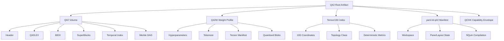
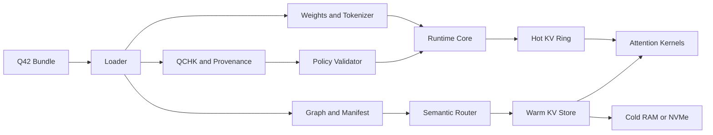
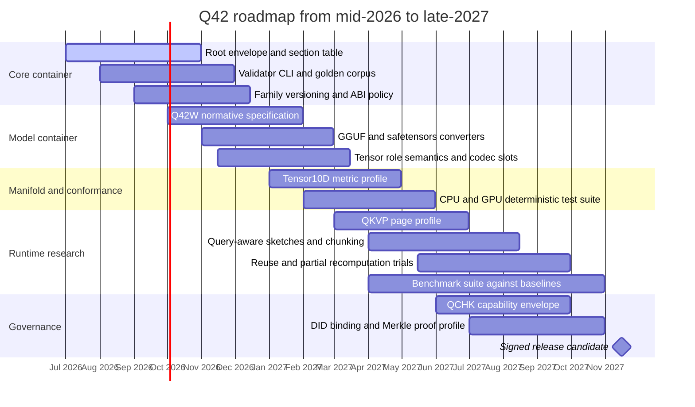

# Advancing Q42 as a Multi-Domain Artifact Family and Execution Container

## Executive summary

Q42 in QualiaDB v0.0.22 is best understood not as a narrow inference sidecar, but as an emerging **artifact family** that spans a canonical `.q42` graph/data volume, a `Q42W` model-weight container, a `Tensor10D` manifold layer, declarative `yaml-ld-q42` manifests, and NQuin-derived scaffold records. That broader ambition is consistent both with the repository excerpts already surfaced in this conversation and with the design objective in the uploaded notes, which describe a q42-based inference engine meant to support 10D/5D manifold and mathematical capabilities while differing structurally from traditional GGUF-style pipelines. fileciteturn3file0L26-L67 fileciteturn6file0L3-L64 fileciteturn7file0L3-L37 fileciteturn4file0L15-L39 fileciteturn8file0L11-L29 fileciteturn0file0 fileciteturn0file1

The strongest immediate opportunity is to make Q42 more **explicitly sectioned, normative, and testable**. Today, the surfaced materials describe a structured Q42 volume and a sibling `Q42W` header family, but they do not yet amount to a fully explicit family-wide ABI with one root envelope, one canonical section table, version-negotiation rules, endianness policy, conformance vectors, and model/runtime profile boundaries. That leaves room for ambiguity precisely where long-lived, multi-domain containers need the most discipline. fileciteturn6file0L3-L64 fileciteturn7file0L15-L27 fileciteturn3file0L113-L132

A second major opportunity is to define Q42 as a **two-plane system**: a data plane for tensors, blocks, pages, tokenizers, and manifests; and a control plane for NQuin, manifold coordinates, provenance, policy, temporal indexing, capability envelopes, and runtime scheduling hints. That separation preserves the value of Q42’s semantic and governance ambitions without conflating them with the byte-level requirements of inference kernels. The existing repo excerpts already point in this direction: the internal draft defines block-addressable superblocks and optional temporal/Merkle sections; `Q42W` stores hyperparameters, tokenizer data, and page-aligned tensor blobs; Tensor10D standardises a 10-dimensional tensor representation and topology-selective distances; and yaml-ld-q42 compiles workspace state into NQuin records. fileciteturn3file0L26-L67 fileciteturn7file0L3-L37 fileciteturn4file0L15-L39 fileciteturn4file0L168-L219 fileciteturn8file0L11-L29

A third opportunity is to connect that container architecture to current state of the art in long-context inference. PagedAttention and vLLM showed that block-based KV management can reduce fragmentation and raise throughput; LMCache extended KV reuse and movement across GPU, CPU, storage, and network layers; KIVI and KVQuant showed that KV compression can substantially reduce memory while preserving quality; Quest introduced query-aware page selection using min/max key summaries; ChunkKV elevated semantically coherent chunk retention; CacheBlend showed that partial recomputation can reuse non-prefix cached context; and FlashAttention’s IO-aware tiling demonstrated that layout and data movement are first-order design concerns, not afterthoughts. These lines of work strongly support a Q42 roadmap that treats semantic headers, manifold coordinates, and policy metadata as **routing and orchestration primitives around tensors**, rather than as substitutes for tensors themselves. citeturn7academia0turn22academia1turn11academia0turn9academia0turn11academia1turn11academia2turn11academia3turn13academia0turn12academia0turn12academia1

The practical recommendation is therefore to advance Q42 along five parallel tracks over the next 12–18 months: define a family root envelope and section table; publish a normative `Q42W` specification with stable tensor-role semantics and quant codec slots; add a formal runtime/KV-page profile for semantic paging and cache reuse; harden provenance, temporal index, Merkle-DAG, DID, and QCHK capability envelopes; and build a conformance and benchmark suite that compares Q42 against GGUF, safetensors, llama.cpp, vLLM, LMCache, KIVI, KVQuant, and FlashAttention-class kernels under measurable workloads. fileciteturn6file0L3-L64 fileciteturn7file0L90-L138 fileciteturn3file0L54-L67 citeturn7academia0turn22academia1turn11academia0turn9academia0turn13academia0

## Current Q42 design in the surfaced v0.0.22 materials

The most mature part of the surfaced design is the **canonical `.q42` volume**. The internal draft describes Q42 as a hierarchically indexed, block-oriented format with independently addressable **40,960-byte SuperBlocks**, index lookup before decompression, and block-local compression. The same draft describes a v3 layout with a 256-byte header, embedded Q42LEX and BIDX blobs, a block directory, concatenated compressed SuperBlock payloads, and optional temporal and Merkle-DAG sections. In code, `q42_volume.rs` reinforces that this is not just a conceptual sketch: it defines `Q42\0` magic, versioned volume headers, block directory entries, temporal index fields, a Merkle root, assertion timestamp, and DAG offsets. fileciteturn3file0L26-L67 fileciteturn6file0L3-L64

The **Q42W weight-container path** is also significant. The surfaced `q42_weight.rs` commentary describes a GGUF-to-`.q42` LLM-weight compiler as a sibling of the semantic Q42 graph format, with independent `Q42W` magic and weight tensors stored as opaque, page-aligned, contiguous quantised blobs. It also states that v3 adds a tokenizer section so that a `.q42` artifact can become a self-contained execution container with weights, hyperparameters, and tokenizer state, rather than relying on a GGUF sidecar. The same file defines a header and tensor-entry structures, including role constants and offsets that imply a serious move toward a standalone model-container profile. fileciteturn7file0L3-L37 fileciteturn7file0L15-L27 fileciteturn7file0L90-L138

The **Tensor10D standard** adds a distinct mathematical layer. The surfaced standard defines a fixed-size, zero-heap friendly `Tensor10D` representation with ten coordinates `[q, v, w, x, y, z, t, α, μ, σ]`, and it makes the choice of distance metric depend on the topology class encoded in `v`, including Euclidean, cyclic/toroidal, hyperbolic, and boundary-clique modes. It also states that conforming CPU and GPU paths should return identical hit sets under the standard’s metric rules. That is stronger than a generic embedding API: it is an attempt to standardise semantic/topological search behaviour across hardware paths. fileciteturn4file0L15-L39 fileciteturn4file0L168-L219

The **yaml-ld-q42 layer** makes Q42 clearly multi-domain. The surfaced standard describes yaml-ld-q42 as a declarative manifest format for Webizen workspaces, pages, panes, and layout/state, with compilation into NQuin-backed records. That suggests Q42 is intended to carry not only tensors and graph data but also application/workspace semantics. The same excerpts show that NQuin is not merely a storage convenience; it is part of the control and identity scaffolding that binds layouts, records, and higher-level semantics together. fileciteturn8file0L11-L29 fileciteturn8file0L57-L66

Finally, the surfaced materials show that the standards family already knows it has a broader perimeter. The internal draft explicitly distinguishes `.q42`, legacy split forms, QCHK, and `did:q42` scope boundaries. That is a strong sign that Q42 is best governed as an artifact family with multiple interoperable profiles rather than a single monolithic file type. fileciteturn3file0L113-L132



## Q42 compared with GGUF and safetensors

GGUF and safetensors each solve a narrower problem than Q42 appears to target. The public GGUF format descriptions emphasise a little-endian binary container with one header, metadata key-values, tensor descriptors, and aligned tensor data; they also routinely carry model attributes and tokenizer information needed by runtimes such as llama.cpp. Safetensors, by contrast, is a deliberately constrained tensor-serialisation format: an unsigned little-endian 64-bit header length, a UTF-8 JSON header, and a contiguous byte buffer of tensor data, designed for safe loading and lazy access rather than rich runtime semantics. Q42, as surfaced in the repo excerpts, is trying to unify tensor payloads, graph volumes, topological indices, provenance, manifests, and execution hints in one family. citeturn15search1turn18search0 fileciteturn3file0L26-L67 fileciteturn7file0L3-L37 fileciteturn8file0L11-L29

| Dimension | Q42 | GGUF | safetensors |
|---|---|---|---|
| Storage layout | Block-oriented family with volume header, block directory, compressed SuperBlocks, and optional temporal/Merkle sections; Q42W adds page-aligned tensor blobs. fileciteturn3file0L26-L67 fileciteturn7file0L3-L27 | Single binary file with header, metadata KV block, tensor info block, and tensor data block. citeturn15search1 | 8-byte little-endian header length, JSON header, then tensor byte buffer. citeturn18search0 |
| Metadata | Rich and multi-profile: Q42LEX, BIDX, tensor roles, manifests, topology, provenance, optional policy/capability layers. fileciteturn3file0L54-L67 fileciteturn7file0L90-L138 fileciteturn8file0L11-L29 | Rich model metadata and tokenizer-related metadata, but still model-centric. citeturn15search1 | Minimal tensor metadata, focused on dtype, shape, and offsets. citeturn18search0 |
| Tokenizer embedding | Explicit tokenizer section in surfaced Q42W commentary. fileciteturn7file0L33-L37 | Commonly included via metadata/tokens. citeturn15search1 | Not a first-class standard feature of the format itself. citeturn18search0 |
| Quantisation | Intended as a first-class execution concern in Q42W; page-aligned quantised blobs are already part of the surfaced design. fileciteturn7file0L3-L10 | Core design focus, widely used for quantised edge/runtime models. citeturn15search1 | Format is agnostic to quantisation strategy beyond dtype representation. citeturn18search0 |
| Runtime hints | Potentially rich: topology classes, manifests, NQuin scaffolds, future capability envelopes. fileciteturn4file0L168-L219 fileciteturn8file0L11-L29 | Some runtime-relevant metadata, but not a full control-plane standard. citeturn15search1 | Essentially none beyond tensor descriptors. citeturn18search0 |
| Provenance and temporal state | Optional temporal index and Merkle-DAG sections are already surfaced in Q42. fileciteturn3file0L54-L67 fileciteturn6file0L27-L64 | Not central in the public format description. citeturn15search1 | Not central in the public format description. citeturn18search0 |
| Indexing | Q42LEX, BIDX, NQuin compilation, Tensor10D manifold indexing. fileciteturn3file0L54-L67 fileciteturn4file0L15-L39 | Tensor-oriented; no parallel graph/index family. citeturn15search1 | Tensor-oriented only. citeturn18search0 |
| Manifest layer | yaml-ld-q42 explicitly covers workspace/app manifests. fileciteturn8file0L11-L29 | None as a standard layer. citeturn15search1 | None as a standard layer. citeturn18search0 |
| Governance hooks | Draft scope includes QCHK and `did:q42` boundaries, implying future governance/identity. fileciteturn3file0L113-L132 | Public GGUF descriptions do not centre governance or capability envelopes. citeturn15search1 | Public safetensors descriptions do not centre governance or capability envelopes. citeturn18search0 |
| ABI and endianness | Partially specified in surfaced code, but not yet clearly unified family-wide. fileciteturn6file0L3-L64 fileciteturn7file0L15-L27 | Explicit little-endian byte-level structure in public descriptions. citeturn15search1 | Header length is explicitly little-endian; format is intentionally simple. citeturn18search0 |
| Integrity | Merkle root and related fields appear in surfaced Q42 volume code. fileciteturn6file0L27-L64 | No cryptographic integrity layer is emphasised in the public format description. citeturn15search1 | Safety is about deserialisation/model loading rather than built-in provenance DAGs. citeturn18search0 |
| Tooling | Early and specialised; strong conceptual range, but comparatively young ecosystem. fileciteturn3file0L26-L67 | Mature, with broad runtime/tooling support around llama.cpp and ggml. citeturn15search1turn9search5 | Broad Hugging Face adoption and strong research/community uptake. citeturn17search0turn17academia3 |

The strategic implication is not that Q42 should copy GGUF or safetensors. It is that Q42 should **learn from their discipline**. GGUF shows how much value comes from a simple, explicit binary contract for weights and metadata. Safetensors shows how far a narrow but safe and easy-to-parse contract can travel in an ecosystem. Q42 can be more ambitious than both, but only if it becomes equally crisp about profiles, ABI rules, and conformance boundaries. citeturn15search1turn18search0 fileciteturn3file0L113-L132

## Gaps, risks, and ambiguous areas

The first gap is a **family-wide ABI contract**. The surfaced materials show one volume header family and one `Q42W` weight-header family, but not yet a single root envelope that makes mixed-profile artifacts unambiguous. That creates friction around section discovery, forward compatibility, parser negotiation, and bundle composition. This is an inference from the presence of separate structures rather than a contradiction in the repo, but it is a materially important one. fileciteturn6file0L3-L64 fileciteturn7file0L15-L27

The second gap is **versioning and endianness policy**. The surfaced code clearly uses magic/versioned structures, and GGUF provides a good example of being explicit about little-endian layout, but the surfaced Q42 excerpts do not yet show one family-wide statement covering endianness, alignment, padding, reserved fields, incompatible upgrades, and extension negotiation across every profile. For a multi-domain container, that omission would become expensive quickly. fileciteturn6file0L3-L64 citeturn15search1

The third gap is **tensor-role semantics**. `Q42W` already appears to define tensor-entry structures and role constants, which is promising, but the surfaced materials do not yet expose a fully standardised, cross-architecture role taxonomy that would let tools reason portably about embeddings, attention projections, MoE experts, recurrent states, KV-only payloads, or auxiliary topological indices. Without that, sectioned tooling will remain brittle. fileciteturn7file0L90-L138

The fourth gap is the **mathematical contract of the manifold layer**. Tensor10D is strikingly concrete about representation and topology-selective metrics, but the surfaced material still leaves open several crucial questions if Tensor10D is to become foundational infrastructure: how vectors are projected into the 10D scheme, whether projection is lossy or reversible, how coordinate uncertainty propagates, what error bounds apply to quantised coordinates, and when metric equivalence is sufficient to claim semantic equivalence. Those are not cosmetic details; they decide whether Tensor10D is a container index, a retrieval manifold, or a computational substrate. fileciteturn4file0L15-L39 fileciteturn4file0L168-L219

The fifth gap is **deterministic CPU/GPU conformance**. The Tensor10D standard reportedly requires identical hit sets across CPU and GPU metric implementations, which is an unusually strong promise. To make that credible, Q42 needs fixed rounding rules, transcendental approximations, tolerance budgets, canonical test vectors, and deterministic sorting/tie-break rules. Otherwise “same hit sets” will collapse under hardware variation. fileciteturn4file0L168-L219

The sixth gap is **governance and policy operationalisation**. The internal draft already sketches QCHK and `did:q42` boundaries, but the surfaced materials do not yet show a normative capability envelope, key-rotation model, consent/provenance claims schema, or verification pipeline that a runtime can enforce. In other words, the repo shows a perimeter for governance, but not yet a fully executable contract. fileciteturn3file0L113-L132

The seventh gap is **provenance and temporal/Merkle semantics**. The Q42 draft and code expose optional temporal indices and Merkle-DAG fields, which is valuable, but not enough by itself. For provenance to be portable and auditable, the family needs stable hashing policy, canonical serialisation order, update rules, inclusion proofs, garbage-collection rules, and conflict semantics for partial rewrites. Without those, Merkle fields risk becoming decorative rather than authoritative. fileciteturn3file0L54-L67 fileciteturn6file0L27-L64

The eighth gap concerns **runtime ambition versus hot-path realism**. The uploaded design notes and supporting research point toward semantic paging, symbolic lattices, manifold routing, and bus-aware offload as key ambitions, but modern inference work shows that these only pay off when coupled to brutally explicit kernel and data-movement engineering. PagedAttention, FlashAttention, Quest, KIVI, KVQuant, and LMCache all succeed because they turn high-level ideas into block/page layouts, summaries, quant codecs, and highly constrained datapaths. Q42 should absorb that lesson directly. fileciteturn0file0 fileciteturn0file1 citeturn7academia0turn13academia0turn11academia1turn11academia0turn9academia0turn22academia1

## Prioritised technical improvements

### Family envelope and section table

**Rationale.** Q42 needs one root envelope that can host the volume profile, `Q42W`, Tensor10D indices, manifests, QCHK capability envelopes, and future runtime/KV profiles without ambiguity. This is the single highest-leverage improvement because it stabilises discovery, compatibility, and tooling across the family. It also resolves the current “bundle versus sibling formats” ambiguity by making both possible: a root bundle can contain one or many sections, while single-purpose artifacts can still contain only one section. fileciteturn6file0L3-L64 fileciteturn7file0L15-L27

**Backward compatibility.** Existing `.q42` and `Q42W` parsers can be preserved by defining a compatibility rule: if a file begins with legacy `Q42\0` or `Q42W` magic, parse it as a single-section legacy artifact; if it begins with the new root envelope, dispatch by section table. That keeps old artifacts readable and new bundles composable.

**Example binary struct.**

```c
#pragma pack(push, 1)
typedef struct {
    uint8_t  magic[4];          // "Q42\0"
    uint16_t family_version;    // 1
    uint16_t profile;           // 0=bundle, 1=single-section legacy wrapper
    uint32_t header_len;        // bytes of this header
    uint32_t section_count;
    uint32_t flags;
    uint64_t section_table_off;
    uint64_t created_unix_ms;
    uint8_t  root_hash[32];     // canonical hash of section table + selected sections
    uint8_t  reserved[184];
} Q42RootHeader;

typedef struct {
    uint8_t  magic[4];          // "Q42V","Q42W","Q42T","QMAN","QCHK","QKVP"
    uint16_t version;
    uint16_t flags;
    uint64_t offset;
    uint64_t length;
    uint32_t align_log2;
    uint16_t compression;
    uint16_t checksum_kind;
    uint8_t  checksum[32];
} Q42SectionEntry;
#pragma pack(pop)
```

**Minimal reference implementation plan.** In the first phase, implement serializer/parser support for `Q42RootHeader` and `Q42SectionEntry`, plus a legacy auto-detect path. Add round-trip tests, endian/alignment tests, fuzz tests, and section-table corruption tests. Success criteria should include zero-copy discovery of section offsets, backward opening of legacy samples, and verifiable checksums over mixed bundle artifacts.

### Normative Q42W contract

**Rationale.** The surfaced `q42_weight.rs` already looks like the seed of a real specification; Q42 should now promote it into a normative standard with stable tensor-role semantics, tokenizer payload rules, quant-codec slots, and model-ABI descriptors. This is the key step that turns Q42 from “interesting repo architecture” into “credible alternative model container”. fileciteturn7file0L3-L37 fileciteturn7file0L90-L138

**Backward compatibility.** Freeze the current header as `Q42W v1`, reserve unknown tensor roles, and require readers to preserve unknown sections on rewrite. Future versions should add fields only through extension records or reserved bytes until a genuinely incompatible break is necessary.

**Example binary struct and codec slots.**

```rust
#[repr(C)]
pub struct Q42WHeader {
    pub magic: [u8; 4],          // b"Q42W"
    pub version: u16,            // 1
    pub flags: u16,
    pub arch_id: u32,            // llama, mistral, qwen, etc.
    pub tensor_count: u32,
    pub role_table_offset: u64,
    pub tensor_table_offset: u64,
    pub tokenizer_offset: u64,
    pub hparams_offset: u64,
    pub string_table_offset: u64,
    pub checksum_offset: u64,
    pub page_size: u32,          // e.g. 4096 or 16384
    pub alignment: u32,
    pub reserved: [u8; 128],
}

#[repr(u16)]
pub enum Q42QuantCodec {
    Fp32 = 0,
    Fp16 = 1,
    Bf16 = 2,
    Q8Linear = 10,
    Q6Block = 11,
    Q4Block = 12,
    Kivi2Bit = 20,
    KvQuant3Bit = 21,
    TurboQuant = 22,
    Custom = 0xFFFF,
}
```

**Minimal reference implementation plan.** In the next phase, publish `q42w-weight-container-standard.md`, implement a small converter from GGUF and safetensors into `Q42W`, generate golden test files for at least two architectures, and test lossless metadata/tokenizer round-trip. Metrics should include load time, parse allocations, file size versus GGUF/safetensors, and correctness of tensor role mapping.

### Runtime page profile for semantic KV and cache reuse

**Rationale.** If Q42 is to influence inference rather than only packaging, it should define a **runtime page profile** rather than trying to replace the numerical meaning of KV tensors with symbolic tags. Current research strongly favours page/block-aware KV management, page summaries, quantised KV, and selective reuse. PagedAttention, LMCache, Quest, KIVI, KVQuant, ChunkKV, and CacheBlend together point to a viable direction: store tensor pages as the authoritative state; attach cheap semantic/manifold/routing metadata that helps decide what to keep, quantise, offload, or fetch. citeturn7academia0turn22academia1turn11academia1turn11academia0turn9academia0turn11academia2turn11academia3

**Backward compatibility.** Make this a new optional `QKVP` section type rather than changing `Q42W`. Runtimes that do not understand it can ignore it. Runtimes that do understand it can populate, persist, and consume it opportunistically.

**Example page header.**

```c
#pragma pack(push, 1)
typedef struct {
    uint8_t  magic[4];          // "QKVP"
    uint16_t version;
    uint16_t flags;
    uint8_t  model_hash[32];
    uint64_t token_start;
    uint32_t token_count;
    uint16_t layer_start;
    uint16_t layer_count;
    uint16_t kv_heads;
    uint16_t head_dim;
    uint16_t kv_dtype;
    uint16_t quant_codec;
    uint32_t compression_flags;
    uint64_t payload_offset;
    uint64_t payload_length;
    uint64_t parent_page_id;
    uint64_t next_page_id;
    uint64_t semantic_index_off;
    uint64_t manifold_index_off;
    float    entropy_score;
    float    attention_score;
    float    recency_score;
    float    confidence_score;
    uint64_t sketch_offset;     // query-aware summaries
    uint8_t  checksum[32];
} Q42KvPageHeader;
#pragma pack(pop)
```

**Minimal reference implementation plan.** Phase one should implement a CPU-only page writer/reader and a reference page-store backed by RAM and local NVMe. Phase two should add query-aware sketches inspired by Quest, page-level quant codecs inspired by KIVI/KVQuant/TurboQuant, and selective restore. Tests should include page integrity, prefix reuse correctness, partial recomputation correctness, and degraded/overflow behaviour. Metrics should include TTFT, decode tokens/sec, PCIe bytes moved, page hit rate, and quality delta versus FP16 unfused baselines. citeturn11academia1turn11academia0turn9academia0turn21academia0

### Semantic chunking and query-aware sketches

**Rationale.** The design notes emphasise ring/branch/header systems and semantic chunking. Recent work suggests that page boundaries and retention policies should not be token-count-only. ChunkKV shows the value of preserving semantically coherent chunks rather than scoring tokens independently, while Quest shows how cheap page-level min/max sketches can drive query-aware page selection. These ideas fit Q42 unusually well because Q42 already has places to store headers, indices, and manifold coordinates. fileciteturn0file0 fileciteturn0file1 citeturn11academia2turn11academia1

**Backward compatibility.** Store chunk-policy metadata in optional page-header extensions. Old readers ignore them. New readers can use them without changing tensor payload layout.

**Example policy struct.**

```rust
#[repr(C)]
pub struct Q42ChunkPolicy {
    pub max_tokens: u32,
    pub semantic_shift_threshold: f32,
    pub discourse_boundary_weight: f32,
    pub attention_phase_weight: f32,
    pub max_entropy_drop: f32,
    pub thermal_pressure_bias: f32,
    pub reserved: [u8; 32],
}

#[repr(C)]
pub struct Q42QuerySketch {
    pub k_min_offset: u64,
    pub k_max_offset: u64,
    pub centroid_offset: u64,
    pub semantic_hash_hi: u64,
    pub semantic_hash_lo: u64,
    pub manifold_centroid: [f32; 10],
}
```

**Minimal reference implementation plan.** Start with deterministic chunking on token-count plus paragraph/sentence boundaries, then add semantic-shift triggers, then add query-aware page scoring. Tests should compare retrieval correctness versus dense attention and evaluate hit quality by task type. Metrics should include retrieved-page recall, over-fetch ratio, effective bandwidth, and task accuracy on long-context retrieval benchmarks.

### Manifold and metric conformance profile

**Rationale.** Tensor10D will remain interesting but niche unless Q42 publishes a real conformance profile for projection, metric equivalence, and CPU/GPU determinism. This is where the project’s distinctiveness is real, but also where ambiguity is most dangerous. If Q42 wants the manifold layer to matter, it needs to become machine-checkable. fileciteturn4file0L15-L39 fileciteturn4file0L168-L219

**Backward compatibility.** Leave Tensor10D data layout unchanged but add a profile record that declares metric implementation class, floating-point mode, topological mode, tie-break rules, and acceptable tolerances.

**Example profile record.**

```c
typedef struct {
    uint8_t  magic[4];         // "Q42T"
    uint16_t version;
    uint16_t metric_profile;   // exact, approx, fixed-point, fp32, fp16
    uint16_t topology_mode;    // euclidean, toroidal, hyperbolic, clique
    uint16_t rounding_mode;    // IEEE nearest-even, etc.
    float    abs_tol;
    float    rel_tol;
    uint32_t sort_policy;      // deterministic tie-break
    uint8_t  test_vector_hash[32];
    uint8_t  reserved[64];
} Q42TensorMetricProfile;
```

**Minimal reference implementation plan.** Publish canonical test vectors and a CPU reference implementation first, then GPU kernels. Tests should check identical hit sets under declared tolerances across x86, ARM, CUDA, and WebGPU backends. Metrics should include precision@k agreement, tie-break stability, and throughput per metric profile.

### Provenance, DID, and QCHK capability envelope

**Rationale.** The repo already sketches temporal index, Merkle-DAG, QCHK, and `did:q42` boundaries. The improvement opportunity is to turn those into a coherent governance plane: one signed capability envelope for what an artifact is, who can use it, what policy claims it carries, what provenance chain it asserts, and what runtime constraints apply. This is one of the areas where Q42 can genuinely go beyond GGUF and safetensors. fileciteturn3file0L54-L67 fileciteturn3file0L113-L132 fileciteturn6file0L27-L64

**Backward compatibility.** Make QCHK and DID bindings optional sections with detached signatures supported. Legacy bundles simply omit them. New bundles can include them without changing payload parsing.

**Example capability envelope.**

```rust
#[repr(C)]
pub struct QchkHeader {
    pub magic: [u8; 4],           // b"QCHK"
    pub version: u16,
    pub flags: u16,
    pub claims_offset: u64,       // CBOR/JSON-LD claims blob
    pub signature_offset: u64,
    pub issuer_did_offset: u64,
    pub subject_hash: [u8; 32],   // binds to root or selected section
    pub not_before_unix_ms: u64,
    pub not_after_unix_ms: u64,
    pub reserved: [u8; 96],
}
```

**Minimal reference implementation plan.** Implement detached and embedded signatures, Merkle inclusion checks for section subsets, and a simple runtime claim validator. Tests should cover signature verification, bundle mutation invalidation, claim expiry, and partial extraction proofs. Metrics should include verification latency, signature size overhead, and provenance replay correctness.

### Conformance corpus and benchmark harness

**Rationale.** The fastest route from “interesting architecture” to “credible standard” is a shared corpus of golden artifacts and a repeatable benchmark harness. GGUF and safetensors succeeded partly because their surrounding ecosystems made them easy to test and easy to adopt; Q42 needs that same discipline. citeturn15search1turn17academia3

**Backward compatibility.** Treat the corpus as versioned fixtures. Each new spec level adds fixtures without invalidating older ones unless the major family version changes.

**Example manifest snippet.**

```json
{
  "artifact": "llama3-8b-instruct.q42",
  "profiles": ["Q42V", "Q42W", "Q42T", "QCHK"],
  "expected": {
    "tensor_count": 291,
    "tokenizer_vocab": 128256,
    "merkle_root": "…",
    "metric_profile": "euclidean_fp32_det"
  }
}
```

**Minimal reference implementation plan.** Maintain a public corpus with tiny, medium, and realistic artifacts; a validator CLI; and benchmark runners for packaging, load, retrieval, and runtime experiments. Tests should include parser fuzzing, corpus reproducibility, and multi-architecture replay. Metrics should include parse latency, checksum cost, conversion fidelity, and runtime cost under controlled workloads.

## Evaluation plan and benchmark suite

The evaluation plan should separate **container evaluation**, **runtime evaluation**, and **semantic/control-plane evaluation**. Without this separation, Q42 risks being penalised for ambitions that are not in the critical path, or credited for features that come from the runtime rather than the format. The relevant baselines are clear: GGUF and safetensors for container comparison; llama.cpp for edge-runtime weight loading and quantised local inference; vLLM plus PagedAttention for high-throughput paged KV serving; LMCache for offload and reuse; KIVI, KVQuant, and TurboQuant-style paths for KV compression; and FlashAttention-class kernels for attention efficiency. citeturn15search1turn18search0turn9search5turn7academia0turn22academia1turn11academia0turn9academia0turn21academia0turn13academia0turn12academia0turn12academia1

The container benchmark suite should measure parse time, peak host memory during load, zero-copy section discovery time, tokenizer extraction time, checksum verification cost, and conversion fidelity from GGUF and safetensors into Q42W. This directly tests whether Q42’s broader family can remain operationally disciplined. Safetensors’ simplicity and GGUF’s direct runtime orientation make them strong controls here. citeturn18search0turn15search1

The runtime benchmark suite should measure **tokens/sec**, **time-to-first-token**, **prefill latency**, **decode latency**, **VRAM used**, **RAM used**, **PCIe bytes transferred**, **page/cache hit rate**, **quality delta**, **perplexity delta**, and **thermal watts/token**. These metrics align with the best current systems literature: vLLM emphasises latency/throughput under paged KV; LMCache emphasises throughput under offload and reuse; KIVI and KVQuant report memory savings, throughput, and perplexity; FlashAttention emphasises IO and kernel efficiency. citeturn7academia0turn22academia1turn11academia0turn9academia0turn13academia0

The workload mix should include three classes. For long-context understanding and retrieval, use **LongBench**, **RULER**, **ZeroSCROLLS**, and **Needle-in-a-Haystack**-style probes, because they stress retention, retrieval, aggregation, and long-range dependency rather than only short-answer fluency. For raw language-model quality, use **WikiText-2** and **C4** since KVQuant explicitly reports perplexity on them, which makes comparisons easier. For reasoning and agentic-style follow-through, include **GSM8K** and a small code-completion suite, because ChunkKV and related long-context work now evaluate under instruction tuning, reasoning, and code-oriented settings rather than only synthetic retrieval. citeturn23academia1turn23academia2turn23academia0turn9academia0turn11academia2

A particularly important experimental design choice is to evaluate **three Q42 runtime modes separately**. The first is `container-only`, where Q42 is only a model/data package with no special runtime use. The second is `semantic-assist`, where Q42 provides page summaries, chunk metadata, and capability/policy records but dense tensor math remains unchanged. The third is `semantic-reuse`, where Q42 also activates page reuse, partial recomputation, or dictionary-assisted retrieval. This avoids mixing packaging wins with runtime wins and makes negative results easier to interpret. citeturn11academia1turn11academia3turn22academia2



A practical benchmark matrix should use at least four hardware profiles: a CPU-only edge machine, a consumer GPU over PCIe, an integrated UMA device, and a high-end datacentre GPU. That matters because Q42’s promise is partly about bus-aware tiering and manifold-guided reuse, which will matter very differently on UMA systems, PCIe systems, and SSD-backed serving stacks. The strongest recent storage/offload systems, including LMCache, Strata, and Tutti, all show that hardware topology changes the value of a caching strategy. citeturn22academia1turn22academia0turn7academia1

## Governance, naming, and release strategy

The most robust naming strategy is a **sectioned family with optional sibling extensions**. In practice, that means keeping `.q42` as the top-level family/container extension and giving each embedded profile a four-byte section magic such as `Q42V`, `Q42W`, `Q42T`, `QMAN`, `QCHK`, and `QKVP`. Standalone files could still be permitted for operational simplicity, but they should be normatively defined as degenerate one-section bundles rather than as unrelated formats. That reduces conceptual sprawl without sacrificing ergonomics. fileciteturn3file0L113-L132 fileciteturn6file0L3-L64 fileciteturn7file0L15-L27

Versioning should be **semantic at the family level and monotonic at the section level**. In other words, the root envelope should carry a family major/minor version, while each section type should carry its own version. A parser should be able to say “I understand family v1 and section `Q42W` v1–v3, but I will preserve unknown `QCHK` v2 sections on rewrite”. This is the model used by durable multi-profile binary ecosystems and is much better suited to Q42 than a single flat version integer. The surfaced code already gives Q42 the basics of versioned headers; it now needs the policy layer above them. fileciteturn6file0L3-L64 fileciteturn7file0L15-L27

For identity, `did:q42` should be treated as a **resolver binding**, not as a replacement for content hashing. The recommended stack is: content hashes bind sections and bundles; Merkle roots bind histories and inclusion proofs; `did:q42` binds issuers, subjects, and revocation/update semantics; `QCHK` binds signed claims to a subject hash. That separation makes each mechanism legible and prevents identity documents from becoming implicit transport for all provenance logic. fileciteturn3file0L54-L67 fileciteturn3file0L113-L132

Release strategy should have three public tracks. The **core track** publishes the root envelope, Q42 volume, Q42W, and validator corpus. The **experimental runtime track** publishes `QKVP`, semantic paging, query-aware sketches, and manifold-assisted reuse behind explicit experimental flags. The **governance track** publishes QCHK, DID binding rules, signature profiles, and provenance conformance. This staged release plan keeps the standard shippable while preserving room for novel research. It also protects Q42 from the common failure mode of trying to standardise too much hot-path behaviour before the ecosystem can test it. citeturn7academia0turn22academia1turn11academia1turn11academia3

## Roadmap

The next 12–18 months should focus on making Q42 **more explicit, more testable, and more benchmarkable** before trying to prove every advanced runtime hypothesis at once. The realistic order is to stabilise the family contract first, bring `Q42W` to parity with serious model-container expectations second, and then iterate on runtime profiles for semantic paging and reuse under benchmark pressure. The aim is not to suppress the project’s novelty; it is to give that novelty a disciplined delivery path. fileciteturn7file0L3-L37 citeturn7academia0turn22academia1turn13academia0

A workable phase plan is as follows. In the opening phase, publish the root envelope, section table, validator CLI, and the first golden corpus. Success means stable parsing across legacy and new files, passing fuzz tests, and documented family/version negotiation. In the following phase, freeze Q42W v1, publish the weight-container standard, and ship converters from GGUF and safetensors. Success means reproducible conversion, consistent tokenizer extraction, and acceptable load-time overhead versus GGUF. In the next phase, add Tensor10D conformance vectors and deterministic metric profiles. Success means CPU/GPU agreement under stated tolerances. Then add the experimental runtime plane: `QKVP` pages, query-aware sketches, chunking policies, and page-aware reuse. Success means measurable wins in TTFT, bandwidth, and memory under no worse than a defined quality delta on LongBench/RULER/ZeroSCROLLS-style tasks. Finally, harden QCHK, DID binding, Merkle proofs, and bundle signing. Success means verifiable provenance and capability enforcement with low verification overhead. fileciteturn4file0L168-L219 fileciteturn3file0L54-L67 citeturn23academia1turn23academia2turn23academia0



The success criteria at the end of this roadmap should be concrete. Q42 should have a stable root envelope, a published Q42W standard, a validator and corpus, deterministic Tensor10D conformance on at least two CPU and two GPU backends, and a benchmark report showing where Q42’s runtime profiles help or fail relative to GGUF/llama.cpp, safetensors-based loaders, vLLM, LMCache, KIVI, KVQuant, and FlashAttention-class kernels. If those deliverables exist and are reproducible, Q42 will have crossed the threshold from ambitious architecture to credible standardisation candidate. citeturn15search1turn18search0turn9search5turn7academia0turn22academia1turn11academia0turn9academia0turn13academia0