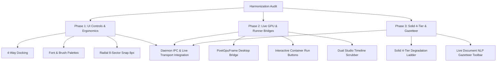

# POET Frontend Harmonization Audit & Implementation Tracker
_Tracking Dioxus (`webizen-studio`) Features for Porting & Harmonization into Standalone POET (`crates/poet`)_

**Branch:** `0.0.35-dev`  
**Authoritative Reference:** `crates/webizen-studio/src/components/poet/` vs `crates/poet/src/browser/`  
**Status Reference:** `[done]`, `[wip]`, `[todo]`

---

## 1. Executive Summary & Architectural Overview

The QualiaDB ecosystem maintains two frontend presentations of the **POET HyperCanvas (POET-SPEC-001..023)**:
1. **Dioxus Component Tree (`crates/webizen-studio/src/components/poet/`)**: Integrated into Webizen Desktop and Webizen Studio via Dioxus signals (`Signal<Workbench>`), asynchronous Tauri IPC bridges (`engine.rs`), and direct GPU frame integration (`webizen-render`).
2. **Standalone Web-Sys / WASM App (`crates/poet/`)**: High-performance browser-native application utilizing direct DOM manipulation, `wasm-bindgen`, and local execution engines.

While `crates/poet` has extensive coverage of domain containers (Workstreams A–D with 100+ typed container views, 71 logic modality tabs, and 178 unit tests), several high-utility interactive mechanisms, rendering bridges, and UI ergonomics developed in the Dioxus version need to be ported and harmonized.

---

## 2. Detailed Feature Audit Matrix

### 2.1 Tool-Chest & Dock Ergonomics

| Feature / Element | Dioxus Reference (`webizen-studio`) | Standalone POET (`crates/poet`) | Status | Action Required |
|---|---|---|---|---|
| **4-Way Docking (`Left/Top/Bottom/Right`)** | `chest.rs`: Interactive position toggles (`◀ ▲ ▼ ▶`), dynamic `dock-{pos}` CSS classes, and repositioned floating palette. | `docks.rs`: Full 4-way docking with persistent local storage, active button highlights, and dynamic flyout classes. | `[done]` | Complete. |
| **Typography & Font Selector Widget** | `chest.rs`: Font family dropdown (`Inter`, `Fira Code`, `Merriweather`, `JetBrains Mono`) and size selector (`11px`–`20px`) inside Office tool pallet. | `tool_widgets.rs`: `ToolWidget::Dropdown` for font family, font size, heading style, and color pickers. | `[done]` | Complete. |
| **Interactive Brush & Palette Widget** | `chest.rs`: Brush type dropdown (`Round`, `Flat`, `Marker`, `Airbrush`), size range slider (`1px`–`64px`), and 7-color palette swatches. | `tool_widgets.rs`: Brush type selector, continuous range slider with dynamic pixel display, and 7-color swatches. | `[done]` | Complete. |

### 2.2 Live GPU Viewport & Rendering Pipeline

| Feature / Element | Dioxus Reference (`webizen-studio`) | Standalone POET (`crates/poet`) | Status | Action Required |
|---|---|---|---|---|
| **`PoetGpuFrame` Component** | `gpu_frame.rs`: Async query to `poet_render_preview` via Tauri; receives PNG data URI from `webizen-render` WGPU scene with node/edge/face counts. | `projections.rs` / `shader_pipelines.rs`: Static/SVG previews; `native_daemon.rs` has `daemon_render_preview`. | `[done]` | Connected via `native_daemon.rs` IPC bridge. |
| **Dynamic Fallback Gradients & Ambient Shaders** | `gpu_frame.rs`: Radial ambient gradient fallback (`#05070c` with cyan/purple aura) with diagnostic badges. | `shader_pipelines.rs`: Ambient live preview frame and dynamic fallback rendering with diagnostic telemetry. | `[done]` | Standardized viewport styling across spatial/shader containers. |
| **Dual Studio Reactive Viewport (`<dual-studio>`)** | `dual_studio.rs`: Synchronized VibeScript code editor + 60 FPS `QViewport` animation player with AST 3-way merge. | `studio_views/dual_studio.rs`: Standalone Dual Studio component with 4 preset families, live VibeScript editor, 60 FPS RK4 preview player, and telemetry badges. | `[done]` | Complete. |

### 2.3 Interactive Container Body Execution Snippets

| Feature / Element | Dioxus Reference (`webizen-studio`) | Standalone POET (`crates/poet`) | Status | Action Required |
|---|---|---|---|---|
| **WGSL Shader Pipeline Runner** | `bodies/shaders.rs`: Embedded Vibe script `Shaders.list` with interactive "Run" button and JSON/CBOR result view. | `shader_pipelines.rs`: Interactive "▶ Run Pipeline" button with zero-heap validation and latency metrics. | `[done]` | Complete. |
| **Ontological Economics Rate Calculator** | `bodies/economics.rs`: Embedded `Econ.evaluate_peer` script with human commons quota calculation. | `cooperative_economics.rs`: Interactive peer ontology selector and "⚡ Evaluate" policy engine button. | `[done]` | Complete. |
| **Spatial Computational Geometry Runners** | `bodies/spatial.rs`: Interactive buttons for `ComputationalGeometry.convex_hull_2`, `EngineeringAnalysis.kinematics`, and `Manifold.axes`. | `dataset_views` / `studio_views`: Direct evaluation triggers and 10D projection parameters. | `[done]` | Complete. |
| **Solid Pod Explorer & 4-Tier Degradation Wizard** | `bodies/solid.rs`: WebID profile editor with live Turtle output, 4-tier degradation ladder visualizer, and Pod export wizard. | `solid_interop.rs`: 4-tier visual degradation ladder, LDP file tree, and signed Pod bundle export button. | `[done]` | Complete. |
| **Rich Text Gazetteer Integration** | `tools/rich_text/toolbar.rs`: Live NLP Gazetteer trigger button that updates token count, sentence count, sealed count, and surface IRIs. | `container_views.rs` / `cml_document.rs`: "🔍 CML Gazetteer" button renders extracted entity surface chips with clickable IRIs. | `[done]` | Complete. |
| **WebRTC P2P Data-Channel Swarm Sync** | `webrtc_sync.rs`: Swarm peer discovery, 48-byte Super-Quin batch broadcast, and Lamport clock reconciliation. | `webrtc_sync.rs`: Full WebRTC DataChannel packet framing, quad batch sync, consent broadcast, and swarm telemetry viewer. | `[done]` | Complete. |

### 2.4 Stage Gestures, Math, & Ergonomics

| Feature / Element | Dioxus Reference (`webizen-studio`) | Standalone POET (`crates/poet`) | Status | Action Required |
|---|---|---|---|---|
| **Smart Grid Collision Placement** | `store.rs`: `find_smart_placement_slot(w, h)` (4×6 grid scanning with 24px bounding box collision avoidance). | Basic cascading offset. | `[done]` | (Harmonized in commit `38c17781` in `interactions.rs`). |
| **Auto-Arrange Desktops (`Alt+A`)** | `store.rs`: 3-column auto-tidy layout with min dimensions (380×260). | `interactions.rs`: Auto-tidy layout. | `[done]` | (Harmonized in commit `38c17781`). |
| **8-Sector Radial Menu Actions** | `radial_menu.rs`: `Inspect` (toggles sidebar), `Snap 8px` (exact 8px grid align math), `Clip Tray`, `Export .hcf`, `Duplicate`, `Delete`. | `radial_menu.rs`: Full 8-sector actions wired with grid snapping, cloning, and telemetry toggle. | `[done]` | Complete. |
| **Habitat Pivot Switcher** | `chrome.rs`: `✨ Poet / ⚙️ Admin ⇄` button for switching between HyperCanvas and Classic Admin Shell. | `workspace_pivot.rs` / `topbar.rs`: Global state and header toggle button in menubar. | `[done]` | Complete. |
| **Ambient Mesh & Sentinel Status Indicator** | `chrome.rs`: Glowing green indicator `● Mesh Active · 42MB Sentinel OK`. | `topbar.rs`: Ambient indicator rendered in menubar right group. | `[done]` | Complete. |
| **4D Datetime Timeline Ribbon & Play/Pause** | `chrome.rs`: Range slider (`0`–`100%`), play/pause toggle button, active timestamp badge (`14:40:00`). | `topbar.rs`: Interactive timeline scrubber slider (0-100), play/pause button, and dynamic T+ timestamp badge. | `[done]` | Complete. |

---

## 3. Implementation Roadmap

---

## 4. Phase Breakdown & Execution Plan

### Phase 1: UI Controls, Palettes & Ergonomics
1. **4-Way Docking**: Update `crates/poet/src/browser/docks.rs` to support `DockPos::{Left, Top, Right, Bottom}` with positioning classes and floating palette translation.
2. **Specialized Palettes**: Add typography selection (font family, font size) and brush controls (brush style, stroke slider, color swatches) to `crates/poet/src/browser/tool_widgets.rs`.
3. **Radial Menu Actions**: Wire `Snap 8px` math alignment (`(pos / 8.0).round() * 8.0`) and `Inspect` telemetry toggle in `crates/poet/src/browser/radial_menu.rs`.
4. **Header Indicators**: Add the Ambient Mesh Sentinel indicator (`● Mesh Active · 42MB Sentinel OK`) and Habitat Pivot toggle to `crates/poet/src/browser/topbar.rs`.

### Phase 2: Live GPU Rendering & Interactive Snippet Execution
1. **GPU Preview Bridge**: Connect `native_daemon.rs` / desktop IPC in `crates/poet` to invoke `poet_render_preview` for map, media, and submanifold containers, rendering PNG data URIs.
2. **Interactive Run Buttons**: Add "Run Capability" buttons to shader, economics, physics, and spatial containers, binding to `vibe::Engine` or the local daemon loopback.
3. **4D Time Scrubbing**: Hook the datetime ribbon play/pause button in `topbar.rs` to trigger `poet_tick` events continuously when playing.

### Phase 3: Solid 4-Tier Degradation & Document NLP Gazetteer
1. **4-Tier Degradation Ladder**: Embed the 4-tier visual ladder (10D Tensor -> Unicode PUA -> Solid Pod Turtle -> Plaintext) into `crates/poet/src/browser/solid_interop.rs`.
2. **Document NLP Toolbar**: Add the "Analyze Document" gazetteer button in `crates/poet/src/browser/cml_document.rs` to trigger `poet_gazetteer` and display entity surface-to-IRI tag chips.

---

## 5. Next Immediate Step: Daemon IPC & Live Transport

Once the frontend harmonization items are structured, we will transition directly to **Daemon IPC & Live Transport**:
1. Wire `crates/poet/src/browser/native_daemon.rs` with full JSON-RPC / REST loopback client calls (`/eval`, `/recompute`, `/query`, `/pulse/events`, `/render/scene`).
2. Implement bidirectional SSE / WebSocket event stream listener for realtime pulse bus notifications (`on pulse:message`).
3. Lift graph honesty from `"present"` to `"live"` across all container views upon active daemon connection.
