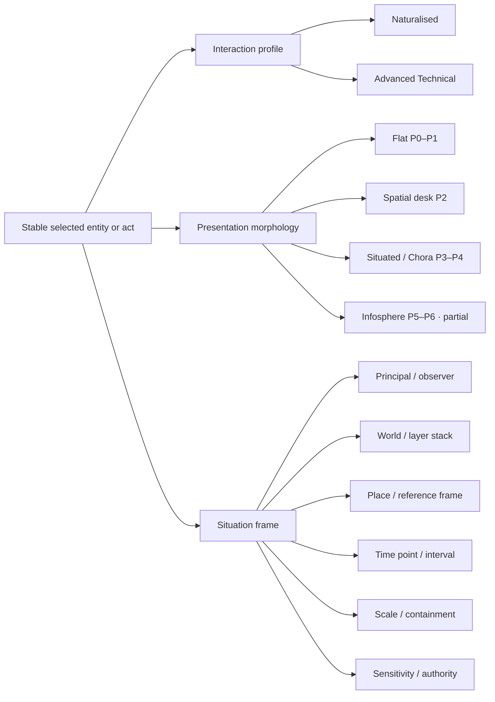
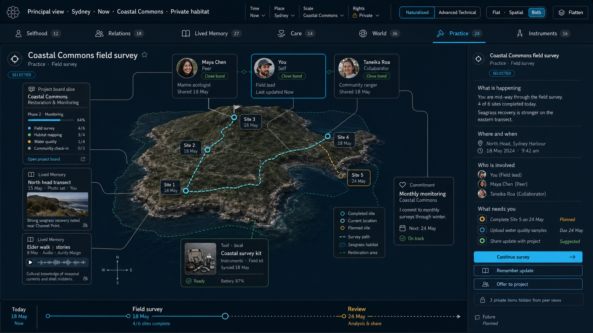
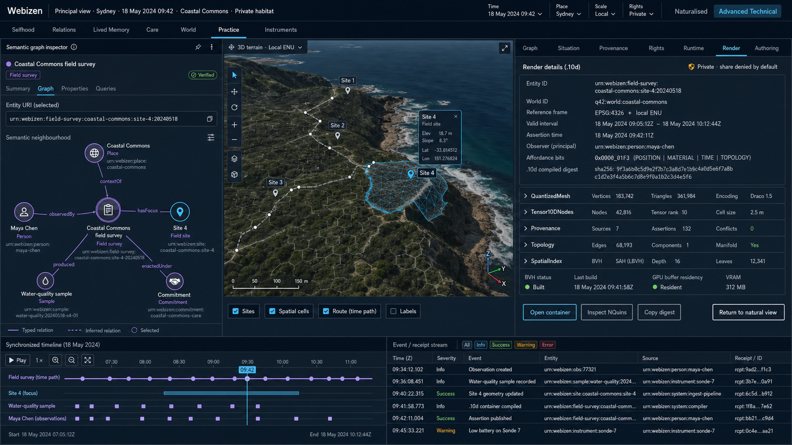
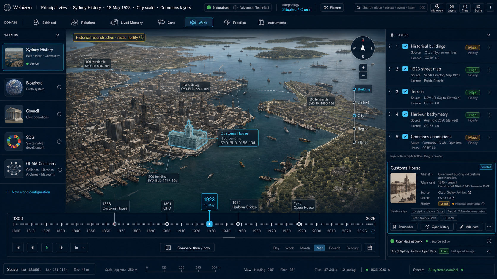
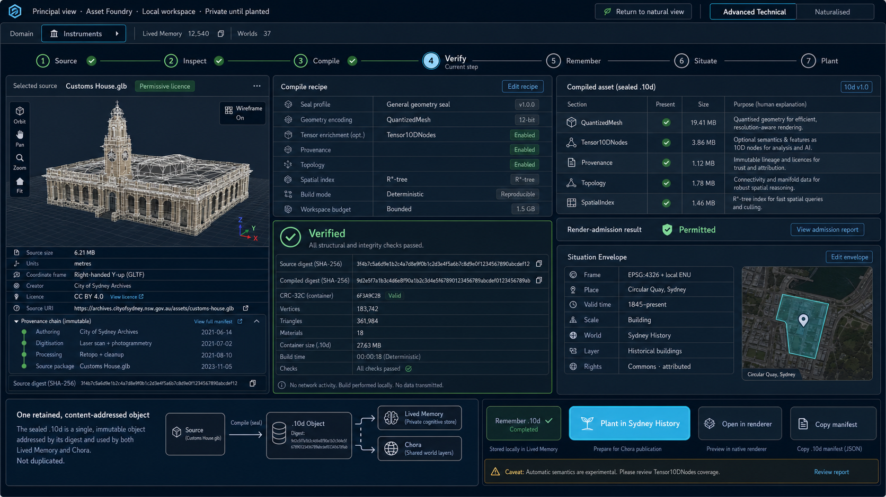

# Webizen capability and interface naturalisation map

**Date:** 2026-07-29

**Status:** corrective addendum to the first-pass UX audit

**Scope:** Webizen Desktop, Webizen Studio, Qualia client/core capabilities,
Advanced Technical presentation, Chora, and the GLB → `.10d` spatial asset path.

> **Setup and relations addendum:** The repository-wide review of first-run,
> settings, chat, mail, people, social-web, mesh, Solid and consent surfaces is
> in [Webizen Desktop UX Addendum: Setup, Settings, Relations and
> Communications](webizen-setup-relations-ux-addendum-2026-07-29.md). Its main
> finding is that communications are implemented but fragmented and sometimes
> incorrectly labelled, while setup is real but far narrower than the
> apparatus it claims to prepare.

## Correction to the first-pass audit

The first-pass audit correctly identified serious discoverability, accessibility, layout,
and workflow defects. Its four concept plates were useful as **flat P1 workspace studies**,
but they reduced the product too quickly to a familiar desktop-app rail. That is not a
sufficient model for Webizen.

The harm is design compression: a team implementing those plates as the target information
architecture could hide or strand the graph, observer/rights, provenance, temporal,
spatial, multi-sensory, scientific, governance, and n-dimensional capabilities already
present in Qualia. The cost would be another UI rewrite and a false choice between
“approachable” and “powerful.”

This addendum reverses that framing:

- map capabilities before choosing navigation;
- treat natural and technical interfaces as projections of the same objects;
- treat flat, spatial, temporal, and Chora presentations as morphology, not separate data
  products;
- use stable entity identity, observer rights, provenance, place, and time across every
  projection;
- retain the first four images only as **one low-dimensional presentation family**.

## Existing source-of-truth documents

The repository already contains a strong conceptual spine that the first audit should have
started from:

- `docs/plans/socio-neuromorphic-ict-interface-plan.md` — canonical life-domain capability
  inventory and naturalisation plan.
- `docs/plans/mindware-functionality-capability-report.md` — entity-view readiness,
  observer/rights, projections, and desktop invoke contract.
- `docs/plans/presentation-morphology-and-multisensory-display.md` — P0–P6 morphology,
  SceneContract, `.10d`, Chora, and multi-sensory projection.
- `docs/plans/spatio-temporal-commons-canvas/` — Chora engine, world/layer ontology,
  place-time, scale, networking, and roadmap.
- `docs/manuals/hypermedia-library-functional-spec.md` — full Lived Memory behaviour.
- `docs/manuals/computational-3d-assets-and-digital-twins.md` — 3D asset and digital-twin
  boundaries.

This document is a source-verified UI/UX delta, not a replacement for those plans.

## Scale of the capability surface

The current tree contains approximately:

- 358 top-level Webizen Studio component files;
- 274 top-level `*_qapp.rs` disciplinary components;
- 36 Dioxus routes in `webizen-studio/src/main.rs`;
- 472 desktop functions annotated as Tauri commands under
  `webizen-desktop/src/commands`;
- full engine families for graph/query, inference, modalities, identity, governance,
  storage, networking, 3D/10D render, vision, audio, medical, domain science, numerical
  solvers, privacy, and GPU kernel generation.

The design problem is therefore not choosing a prettier menu for a small application. It is
creating an inhabitable human projection over a capability graph.

## Capability map

The canonical seven life domains remain the best top-level human map. They are not seven
isolated applications: objects and acts move between them.

| Human domain | Naturalised capabilities | Technical depth that must remain available |
|---|---|---|
| **Selfhood** | profile, data home, Sanctuary, body basis, identity summary, personal rights, accessibility | DIDs, credentials, key material state, consent grants, deontic norms, guardianship, conduct/audit records |
| **Relations** | people, invitations, conversations, groups, offers, agreements, reception/mail | peer mesh, signed packages, relay envelopes, chat DAGs, directory ontology, common-ground policy, MCP gates |
| **Lived Memory** | remember, find by meaning/time/place, timeline, map, bookmarks, offers, forget | facets, CML/COF, provenance graph, observer wings, SPARQL/export, `.hmc`, semantic containers |
| **Care** | wellbeing, medicines, reminders, welfare pathways, anatomy, connected records | clinical engines, biosense, consent policy, provenance, guardianship and restricted access |
| **World** | browser attention, trust, bookmarks, Chora, maps, open layers, 10D objects | world configuration, layer sources, spatial indexes, temporal query, asset manifests, network disclosure |
| **Practice** | projects, collaboration, boards, work items, milestones, commitments | immutable transitions, N3 rules, deontic contracts, CRDT state, legislation graphs, cooperative primitives |
| **Instruments** | local models, assistant, Vision, Listen, knowledge tools, scientific instruments | model runtime, GGUF/P64, MCP, SPARQL, GPU/WGSL, tensor/solver parameters, privacy engine, qApp authoring |
| **Assurance** | “what happened?”, recover, export diagnostics | logs, supervisor, WAL, provenance, validation, raw telemetry, capability manifests, developer harnesses |

### Cross-domain flows are the primary navigation unit

The interface should be designed around complete acts, not route ownership:

| Flow | Start → end |
|---|---|
| Remember something | World / Relations / Practice → Lived Memory → find by meaning, time, or place |
| Work with someone | Relations → Practice → project memory → commitment / offer |
| Use a local model | Instruments → conversation or practice → remembered result with provenance |
| Care under dignity | Selfhood → Care → restricted memory → deliberate consent |
| Explore a situated subject | Lived Memory / Anatomy / World → Spatialize → Temporalize → Flatten |
| Audit a result | any selected object → Advanced Technical → provenance / rights / runtime → return to natural view |

## Interface architecture: three independent axes

A single “simple versus advanced” toggle is not enough. It would conflate language,
presentation, and situation. Webizen should expose three independent axes.



### Axis A — interaction profile

#### Naturalised

- human terms and complete tasks;
- recognisable objects instead of backend fields;
- progressive disclosure;
- recommendations explain why;
- technical identifiers remain copyable from details, not required for routine use;
- the same engine truth and rights gates remain active.

#### Advanced Technical

Advanced Technical is not a second application or a hidden junk drawer. It is a persistent,
optional inspection and authoring profile over the same selected object.

Recommended sub-lenses:

| Lens | Shows |
|---|---|
| **Graph** | NQuins, RDF-star, entity IDs, typed edges, SPARQL, SHACL results |
| **Situation** | physical/semantic coordinate frame, time interval, scale, world, layer, observer |
| **Provenance** | source, licence, digests, derivation, signatures, WAL/history |
| **Rights** | sensitivity, observer projection, affordance bits, deontic permit/forbid, consent |
| **Runtime** | model/device state, allocations, GPU/VRAM, execution receipts, events |
| **Render** | SceneContract, `.10d` sections, mesh counts, Tensor10D nodes, LOD/spatial index |
| **Authoring** | N3, ontology, world configuration, layer stack, qApp/instrument parameters |

The mode must retain the current selection, camera, timeline, and route. Switching it on
should open technical depth beside the natural view—not teleport the user to an unrelated
operations dashboard.

### Axis B — presentation morphology

| Level | Human presentation | Engine projection |
|---|---|---|
| **P0–P1 Flat** | documents, cards, threads, forms, accessible lists | Dioxus / web chrome |
| **P2 Spatial desk** | layered boards, canvases, object workbench | flat + SceneContract |
| **P3–P4 Situated / Chora** | place, world layers, body/world stage, pan-time-scale navigation | native renderer, `.10d`, Chora world config |
| **P5–P6 Infosphere** | semantic strata and multi-sensory projection | Tensor10D, spectral/audio contracts; product path partial |

Every spatial view must provide **Flatten**, preserve entity identity, and obey the same
observer and rights projection. Care, Secret, legal, crisis, accessibility, and reduced
motion may force a lower presentation level.

### Axis C — situation frame

The user's point about consciousness and situated experience is structurally useful:
objects and acts should be presented as happening **for someone, somewhere, sometime, at a
scale, in a world, under conditions**.

The UI should use a universal **Situation Bar**:

- **Who / observer:** principal, peer, guardian, steward, instrument, auditor;
- **World:** active configuration and layer stack;
- **Place:** geographic frame, body frame, constructed scene, or semantic topology;
- **Time:** now, historical point, valid interval, or replay window;
- **Scale:** organ, body, room, city, planet, celestial, or semantic zoom;
- **Rights:** sensitivity, authority, hidden items, consent;
- **Presentation:** natural/technical and flat/spatial state.

In Naturalised mode this is a concise sentence or capsule, for example:

> Sydney · 12 May 2025 · Coastal Commons · principal view · 3 private items hidden

In Advanced Technical it expands to the exact world ID, coordinate/reference frame,
valid/assertion intervals, observer status, presentation level, and projection parameters.

### Do not conflate physical and semantic coordinates

Qualia already has several coordinate systems:

- Chora assets use world origin, latitude/longitude, valid-from/valid-until, and spatial
  cells.
- `render::place_time` combines place relations and intervals.
- Tensor10D uses `[q,v,w,x,y,z,t,α,μ,σ]`; `x/y/z` are semantic/manifold topology unless a
  declared profile maps them to a physical frame.
- Anatomy has body/system/part-of frames and developmental `t`.

The UI needs a typed `SituationEnvelope`, not an unlabeled “coordinates” tuple. Every
coordinate display should identify its frame and provenance.

## GLB → `.10d`: already real, but not yet a coherent product lifecycle

### Verified implementation

The core path is implemented in `qualia-core-db::render::compile_10d`:

```text
GLB / OBJ / STL source
        ↓ import_asset
triangle Mesh
        ↓ deterministic compilation
sealed .10d
  ├─ QuantizedMesh
  ├─ optional Tensor10DNodes
  ├─ optional ProvenanceSidecar
  ├─ optional Topology
  └─ optional SpatialIndex (BVH + kd-tree)
        ↓
whole-file CRC-32C / compiledDigest + q42 manifest
        ↓
decode_10d_mesh / renderer upload
```

Targeted verification on 2026-07-29:

- 13 `render::compile_10d` tests passed;
- deterministic compile and digest behaviour passed;
- mesh round-trip passed;
- provenance-in-container passed;
- anatomy and developmental bindings passed;
- Tensor10D node/σ round-trip passed;
- vision seal topology and spatial-index sections passed.

The current Chora flagship-world tests also passed (3/3): distinct world IDs, historical
ordering, and idempotent seed behaviour.

### Existing consumers

| Consumer | What exists |
|---|---|
| **Anatomy** | discovers HRA/CCF GLBs, downloads on request, compiles organs to `.10d`, caches raw and compiled assets, records model/system/provenance, loads cached assets into the renderer |
| **Developmental anatomy** | Carnegie stages bind gestational age to the `.10d` `t` axis |
| **Vision / 10D browser** | seals meshes with Tensor10D nodes, provenance, topology, and spatial indexes; browser/load/scrub paths are partial |
| **Chora layers** | NASA GIBS Earth imagery, Yale/other star fields, and planetary surfaces compile to `.10d`; the command also uploads coloured meshes to the native renderer |
| **General geometry** | `compile_asset` accepts GLB/OBJ/STL and emits a bound q42 manifest |

### The Chora asset lifecycle gap

`chora_download_layer` compiles a `.10d` in memory and uploads mesh arrays to the native
renderer, but currently returns only summary metadata. It does not persist the generated
container as a content-addressed Lived Memory asset, register its entity/manifest, or plant
that retained entity into the active world. Meanwhile the visible Chora panel leads with a
separate `/chora-universe.html` iframe and console-like world/layer controls.

That creates a split:

```text
visible iframe universe          native renderer + compiled .10d
        UI                                  engine
         └──────── not yet one selected, persistent world object ────────┘
```

### Target asset lifecycle

1. **Find / choose source** — local GLB, permitted catalogue, open-data layer, or generated
   geometry.
2. **Inspect source** — licence, creator, media type, size, coordinate units, intended use.
3. **Compile** — choose ordinary or vision seal; show bounded progress.
4. **Verify** — container header, CRC, sections, provenance, mesh sanity, render admission.
5. **Remember** — store `.10d` by content hash and register it as a Lived Memory entity.
6. **Situate** — assign a declared physical, body, or semantic frame; time interval; scale;
   world; layer; and rights.
7. **Plant** — add the retained entity to a Chora world configuration.
8. **Render** — stream the retained `.10d` into the native shared renderer.
9. **Inspect / derive** — Naturalised description or Advanced Technical sections,
   provenance, graph, and render diagnostics.

This can be exposed as **Add to world** in Naturalised mode and **Asset Foundry** in
Advanced Technical mode. They are two views of the same lifecycle.

### Authoritative path

Use `render::assets::import_asset` + `render::compile_10d` as the general compiler. The
older `webizen-desktop/src/commands/glb_ingest.rs` direct-BIN/Tensor mapping is an Anatomy
prototype and should not become a second authoritative general compiler.

## Chora as interface, not a decorative destination

Chora already has:

- persistent world configurations;
- active-world and temporal navigation state;
- layer catalogues and flagship History, Biosphere, Council, SDG, and GLAM worlds;
- NASA/USGS/ESA/Yale-attributed layer sources;
- spatio-temporal region querying;
- valid-time visibility and spawn/decay alpha;
- signed planting/pulling of spatial assets;
- native coloured-mesh upload;
- camera modes and a world render-surface descriptor.

The present interface surfaces these as an iframe, a Unix-epoch range input, Sydney-specific
“Execute Scan,” world cards, and layer download controls. That is an engine console, not a
natural Chora experience.

### Naturalised Chora

- direct-manipulation world surface is primary;
- search place, object, event, or layer;
- pan = space, scrub = time, zoom = scale;
- layer drawer explains source, licence, fidelity, and network use;
- selected object opens a human description and its relations;
- **Remember**, **Open in project**, **Compare then/now**, and **Add to world** are primary
  acts;
- provenance/rights are visible but quiet;
- world-of-man construction and natural-world approximation are labelled differently.

### Advanced Technical Chora

- exact world config and layer order;
- coordinate/reference frame and units;
- time point/window, valid time, and assertion time;
- region query geometry and spatial-cell IDs;
- `.10d` section table, digests, topology/BVH/kd-tree;
- scene graph, shader/render status, camera state;
- NQuins, provenance, licence, network endpoints, and deontic admission;
- world authoring, asset planting, and deterministic replay tools.

## One object, several valid views

Example: a selected heart asset.

| Projection | What the person sees |
|---|---|
| **Natural + Flat** | Heart, cardiovascular system, body location, related records, source, educational warning |
| **Natural + Situated** | Heart mesh in the body, surrounding organs, developmental/current time, scale and layer controls |
| **Technical + Flat** | entity URI/ID, body-system edges, q42 manifest, source/compiled digests, licence, SHACL/admission |
| **Technical + Situated** | `.10d` sections, Tensor10D nodes, body coordinate frame, t-axis, picking/topology, render telemetry |

No view duplicates the heart as a different product object.

## Revised delivery programme

### C0 — capability registry and truth pass

- Adopt the canonical socio-neuromorphic inventory as the starting map.
- Add current source-verified deltas, especially Chora and `.10d`.
- For each capability record: home domain, entry/exit flow, readiness, sensitivity,
  natural label, technical surface, spatial/temporal suitability, and test evidence.
- Resolve documentation drift where formerly stubbed `.10d` sections are now implemented.

### C1 — shared selection and Situation Envelope

- Extend the process-wide view session with world, typed place/reference frame, time
  point/window, scale, and render/morph profile.
- Preserve stable entity selection across browser, library, projects, Anatomy, Chora, and
  technical inspectors.
- Build the Situation Bar in natural and expanded technical forms.

### C2 — Naturalised / Advanced Technical profiles

- Build profile switching as a projection of the current object.
- Consolidate existing developer panes into Graph, Situation, Provenance, Rights, Runtime,
  Render, and Authoring inspectors.
- Keep Advanced Technical discoverable, keyboard-accessible, and persistent per principal.
- Do not let it bypass observer, consent, or sensitivity gates.

### C3 — projection and morphology compiler

- One selection produces flat widgets, SceneContract, and optional audio sheets.
- Implement Flat / Spatial desk / Situated-Chora / Both controls using the existing
  entity-view projection and renderer.
- Keep Flatten permanent and immediate.

### C4 — retained `.10d` asset lifecycle

- Add local GLB/OBJ/STL picker and catalogue source selection.
- Compile/verify/store/register/plant/render as one recoverable job.
- Retain provenance and licence; disclose network access before downloads.
- Reuse the same path for Anatomy, Vision, Chora, and user assets.

### C5 — Chora surface unification

- Replace the iframe-plus-console split with the native shared render surface as the primary
  view.
- Attach world/layer/time/scale controls to actual rendered state.
- Bind picked render objects to stable entity selection and Lived Memory.
- Retain world configuration and attribution as inspectable data.

### C6 — domain naturalisation

- Rework Selfhood, Relations, Lived Memory, Care, World, Practice, Instruments, and Assurance
  as domain projections and cross-domain flows.
- Keep specialist functions; place them in the correct natural act and technical lens.

### C7 — accessibility, assurance, and human validation

- Care/Secret/reduced-motion forced-flat tests.
- Keyboard and screen-reader alternatives for every spatial action.
- Contrast and colour-semantic tests across themes.
- Dogfood complete flows using both Naturalised and Advanced Technical profiles.

## Acceptance stories

1. Select an item in Lived Memory, Spatialize it, inspect its `.10d`/provenance in Advanced
   Technical, then Flatten without losing selection.
2. Choose a permitted GLB, compile and verify it, remember it, plant it in a Chora world,
   reopen it later, and reproduce the same digest.
3. Scrub a history world and see valid assets appear/disappear while the natural date and
   technical interval agree.
4. Zoom from body to organ without losing the part-of relation or coordinate-frame label.
5. Change observer from Principal to Peer and see private objects disappear in both card and
   spatial presentations, with a truthful hidden-count explanation.
6. Open a project artefact as a board card, memory entity, and workshop object with the same
   entity identity.
7. Use a local model as an Instrument, retain its output with model/provenance information,
   and inspect runtime receipts without representing the model as a person.

## Design direction for the next visual concepts

The next concept set should not be another collection of conventional app pages. It should
show:

1. a **Naturalised Habitat** with the Situation Bar and cross-domain selection;
2. the same selection in **Advanced Technical** with graph/provenance/render lenses;
3. a **Situated Chora** world with real time, scale, layers, provenance, and `.10d` objects;
4. an **Asset Foundry** showing GLB → verified `.10d` → Memory → Chora planting.

## Revised concept plates

### Naturalised Habitat



The selection crosses Practice, Relations, Lived Memory, Instruments, commitment, place,
and time without requiring the person to operate those as unrelated apps.

### Advanced Technical



The same selected survey, terrain, place, observer, and time remain active while graph,
situation, provenance, rights, runtime, render, and authoring depth becomes available.

### Situated Chora



The native world is primary. Worlds, layer order, attribution, fidelity, network use,
time, and scale remain understandable and controllable.

### GLB → `.10d` Asset Foundry



The expert lifecycle makes compilation and retention explicit: source, inspection,
deterministic seal, verification, Lived Memory retention, Situation Envelope, and Chora
planting.

## Image-generation prompt set

All four concepts used the built-in image-generation path and a shared native-workstation
language: accessible deep navy/charcoal surfaces, off-white text, restrained cyan
selection/actions, semantic green/amber, crisp typography, high information density, no
glass/neon styling, and no unstyled browser controls.

1. **Naturalised Habitat:** Situation Bar; Naturalised/Advanced Technical profile control;
   Flat/Spatial/Both morphology; seven life domains; one Coastal Commons field-survey
   entity projected simultaneously as terrain, people, memories, project state,
   commitment, instrument, rights, and timeline.
2. **Advanced Technical:** same field-survey selection and situation; semantic graph;
   synchronized terrain/time; Graph/Situation/Provenance/Rights/Runtime/Render/Authoring
   lenses; `.10d` sections, entity/world/reference-frame data, receipts, and rights barrier.
3. **Situated Chora:** Sydney History world in 1923; native 3D city/harbour view; world
   configurations, attributed/fidelity-labelled layer stack, time scrub, scale ladder,
   selected Customs House, Remember/Open history/Add note, and open-data disclosure.
4. **Asset Foundry:** Advanced Technical Source → Inspect → Compile → Verify → Remember →
   Situate → Plant workflow for a permitted Customs House GLB; deterministic `.10d`
   recipe, section table, provenance/digests/admission, Situation Envelope, retained
   Lived-Memory object, renderer preview, and Chora planting.
