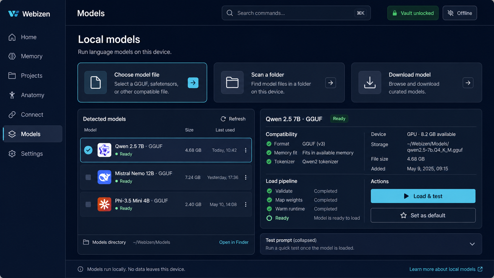
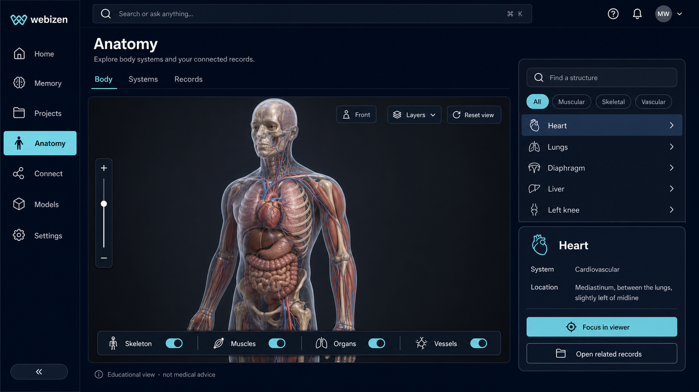
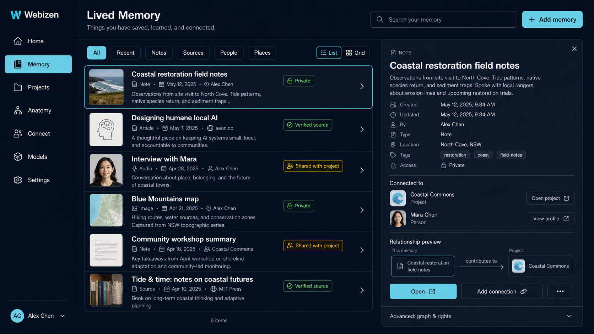
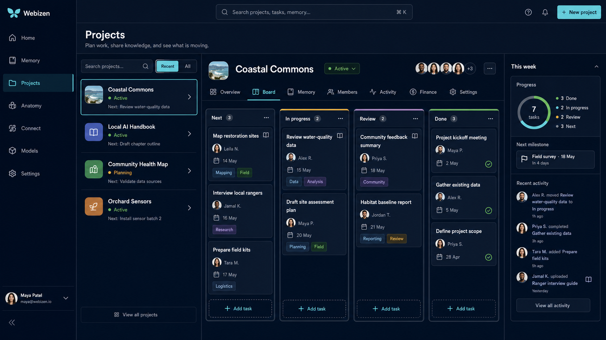

# Webizen Desktop UX audit and redesign plan

**Date:** 2026-07-29

**Scope:** Webizen Desktop shell, Webizen Studio navigation, local-model workflow,
Anatomy, Lived Memory / hypermedia library, Projects, themes, and shared interaction
patterns.

> **Scope correction:** the four concept plates in this document are flat P1 workspace
> studies, not the target information architecture for the complete Webizen/Qualia
> capability set. The broader capability map, Naturalised / Advanced Technical profiles,
> situation model, Chora morphology, and GLB → `.10d` lifecycle are defined in
> [`webizen-capability-naturalisation-map-2026-07-29.md`](webizen-capability-naturalisation-map-2026-07-29.md).

## Executive verdict

The reported usability problems are reproducible. Webizen has substantial functionality,
but the UI exposes the implementation map instead of a coherent set of user journeys.
Important capabilities are split across several surfaces, advanced controls are shown
before basic tasks, and the visual system is not consistently applied. Some defects go
beyond preference:

- Anatomy is hard to discover and its main 3D panel is clipped in the tested desktop
  viewport.
- The model-loading path is buried, prerequisite-heavy, and lacks a normal local-file
  picker even though the backend accepts a model path.
- Model Lifecycle displays fixed telemetry and an abort affordance without a working
  action, so it cannot currently be treated as a truthful status surface.
- Several default-theme text/background combinations are below WCAG contrast targets.
  Inactive sidebar links also fall back to browser-default blue because their base colour
  is not defined.
- Lived Memory leaves only about 137 px of vertical space for its main content at
  1280 × 720 and uses several nested scroll regions.
- Projects is fragmented across different routes and abstractions, while the first
  experience is a collection of forms rather than a project workspace.

This should be treated as an information-architecture and interaction redesign, with an
immediate defect/accessibility pass first. A cosmetic reskin alone will not fix it.

## Method

The audit combined:

1. Source review of the Dioxus UI, Tauri command surface, client API, theme engine, and
   navigation.
2. A local static build inspected in the in-app browser at 1280 × 720, including DOM
   measurements and computed colours.
3. Workflow tracing for local model detection/activation, Anatomy discovery, library
   creation/browsing, and project creation/selection.
4. A repository-wide count of common input and colour patterns.

The static preview cannot execute native Tauri commands. Native backend findings are based
on command/API tracing and should be verified by the integration tests in this plan.

## Findings

### Critical — restore trust and basic operability

#### F-01: Model Lifecycle presents simulated state as operational state

`components/model_lifecycle.rs` starts at a hard-coded phase, uses fixed progress and VRAM
values, renders an Abort Loading button without a handler, and offers Force Next Phase
against a backend that refuses arbitrary phase changes. It looks like an operational
control panel but behaves like a prototype.

**Impact:** users cannot tell whether a model is loading, stalled, or absent. This directly
undermines the model setup journey.

**Action:** remove the panel from production navigation until it is bound to real lifecycle
events. Replace fixed values with a typed state stream:
`NotConfigured → Validating → Loading → Ready → Error`, with cancellation supported only
when the runtime can actually cancel.

#### F-02: Anatomy's primary viewer is clipped

On `/anatomy`, the region labelled `3D Anatomy body view` rendered at roughly 50 px high in
the tested viewport while its children were taller. The section hides overflow, so the
interactive viewer is effectively absent. Two white cards also inherit near-white text,
making their contents unreadable.

**Impact:** the feature appears missing even after a user finds its route.

**Action:** make the viewer the first and dominant route content, remove the clipping
interaction, define an explicit minimum block size, and give all cards semantic surface and
foreground tokens. Add a screenshot test at the desktop default of 1200 × 800.

#### F-03: Readability fails across themes and feature-local hard-coded styles

The default accent button tested at approximately 1.67:1 contrast. Five of the seven theme
accent/white-text combinations are below 4.5:1, and most are also below 3:1. The sidebar's
base `.nav-item` style omits `color`, allowing browser-default blue on a dark background.
Library uses many hard-coded colours and no shared Qualia theme variables.

**Impact:** navigation and lists can be unreadable, particularly in alternate themes and
low-quality displays.

**Action:** introduce semantic pairs such as `--action-bg`/`--action-fg`,
`--surface-*`/`--text-*`, and `--status-*`/`--status-*-fg`. Test the pairs, not isolated
colours, across every supported theme. Feature components must not guess foreground colour.

### High — core journeys

#### F-04: Loading a local LLM is not a findable, complete journey

The only broad model-management UI is the fourth large card in Settings, below General,
Engine, and Connectivity. It requires the storage location first, scans only a `Models`
subdirectory, and supports URL download through three raw fields. The backend can activate
an arbitrary model file path, and the desktop already uses a file-dialog plugin elsewhere,
but the model UI provides no **Choose model file** action.

Connect Chat has another Detect/Activate path, while Studio contains lifecycle and harness
panes. These surfaces do not form one obvious setup flow.

**Action:** add a first-class **Models** destination to the primary rail and command palette.
Provide three explicit entry points:

- Choose a local `.gguf` or `.p64` file.
- Scan a folder.
- Download from a trusted URL/catalogue.

After selection, validate format, architecture, memory fit, and tokenizer metadata; show
real progress; activate; then offer **Test model**. Persist the successful choice and show
the active model globally.

#### F-05: Navigation duplicates hierarchy and hides important destinations

The shell combines top tabs, a long sidebar, an omnibox, and a command palette. Many
destinations appear more than once with different names. Anatomy sits low in the sidebar;
the command palette has no direct Anatomy destination and an Anatomy query can lead to
10D / Infosphere instead. A model query produces Instruments, not model management.

**Action:** use one primary rail with 6–8 stable destinations and contextual subnavigation.
Make command-palette results exact, task-oriented, and route-backed. Move internal/domain
taxonomy into browse views rather than global chrome.

Recommended primary destinations:

1. Home
2. Memory
3. Projects
4. Anatomy
5. Connect
6. Models
7. Settings

#### F-06: Lived Memory is an expert authoring console masquerading as a library

The default screen exposes morphology modes, rights filters, ingest, facets, timeline
controls, and a multi-field creation form at once. Internal phrases such as “entity-view
morph,” “observer rights,” and “not a folder tree” precede the user's content. At 1280 ×
720, nested headers and toolbars leave only about 137 px for the collection pane, with
multiple nested scrollbars.

`components/wellfair/library_panel.rs` is about 2,448 lines, contains 14 input declarations,
42 buttons, and roughly 190 hard-coded colour literals. It combines several lifecycles and
is well beyond the repository's preferred module size.

**Action:** make the collection the default object:

- one search field, saved-view chips, view toggle, and **Add memory** action;
- cards or compact rows with title, type, date, provenance, and access state;
- a selection inspector for metadata and relations;
- a separate advanced graph/rights inspector;
- a typed creation composer opened on demand.

Split controller/data-loading, collection view, inspector, ingest, composer, and advanced
graph tooling into focused modules.

#### F-07: Projects has no single product model

The Practice route stacks project creation, work board, finance, and credentials. Its first
screen is raw fields for name, description, and licensing ontology. Existing projects are
only visible as a selector inside contribution logging. Meanwhile Relations → Projects
contains a separate, more extensive collaboration system with projects, members, packages,
and chat. The work board tells users to select a project elsewhere.

**Impact:** creating a project does not create a clear sense of place; users cannot predict
which “Projects” route owns a project or its board.

**Action:** define one canonical project identity and repository/API. Build a Project Hub
around it:

- recent/all projects;
- project overview with status and next action;
- board/list/timeline views;
- members and access;
- files/memory;
- activity and contribution log;
- finance and credentials as project tabs, not globally stacked forms.

Creation should be a short dialog. Ontology, ROI, DID, and licensing detail belong in an
Advanced step or project settings.

### Medium — consistency, resilience, and content design

#### F-08: Forms are the dominant interaction primitive

Across the component source there are about 273 raw input declarations in 64 files. Many
panels expose backend-shaped fields, URIs, DIDs, hashes, or numeric settings instead of
recognisable object selection and progressive disclosure.

**Action:** introduce shared field, picker, combobox, segmented-control, disclosure,
empty-state, validation-summary, and command components. Default to selection and direct
manipulation where the system already knows the available objects.

#### F-09: Styling is locally authored rather than system-governed

The component tree contains about 2,740 hard-coded hex literals versus about 1,456 theme
variable references. This makes theme switching unpredictable and causes visually similar
controls to have different states, spacing, and focus treatment.

**Action:** create a small Webizen design layer with semantic tokens and component states.
Forbid new feature-local colour literals except in data visualisation palettes. Migrate
high-traffic screens first.

#### F-10: Errors expose infrastructure rather than recovery

Some UI errors expose host-bridge terminology, command names, or `JsValue`-style detail.

**Action:** map errors to user-facing categories with a recovery action and a disclosure for
technical detail. Examples: **Unlock vault**, **Choose storage**, **Retry model scan**,
**Reconnect service**, or **Copy diagnostics**.

#### F-11: Host API availability needs lifecycle integration coverage

Desktop startup builds `HostApiState` from an unlocked `KeyVault`. `load_or_generate`
normally returns an unlocked vault, so a circular first-run dead-end was not established.
However, the host API is initialized as startup state and many Wellfair commands fail when
it is absent. Lock/unlock, startup failure, and recovery should be tested explicitly so a
degraded start cannot strand Anatomy, Memory, or Projects for the full session.

## Target experience

### Model setup

1. Open **Models**.
2. Choose file, scan folder, or download.
3. Review compatibility and storage impact.
4. Load with real stage/progress reporting.
5. Run a one-prompt smoke test and set as default.

The active model is visible in the shell status area. Errors retain the selected file and
offer a concrete recovery.

### Anatomy

Anatomy is one click from the primary rail. The route opens directly to the 3D body, with
Body / Systems / Records tabs. A compact system list, search, and layer controls sit beside
the viewer. Scorecards and technical diagnostics are secondary drawers, not the page's
opening content.

### Lived Memory

Memory opens as a recognisable library: content first, search second, advanced semantics on
demand. Selecting an item opens provenance, rights, relations, and timeline in an inspector.
Adding content uses a typed composer. Graph morphing remains available in an expert view.

### Projects

Projects opens on a recent/all list with a meaningful project preview. Opening a project
creates a stable workspace with Overview, Board, Memory, Members, Activity, Finance, and
Settings. The same project is used across collaboration, contributions, and credentials.

## Delivery plan

### Phase 0 — stabilise the current UI (2–4 days)

- Fix the Anatomy clipping and white-on-white cards.
- Define base navigation foreground/focus styles.
- Correct action foregrounds and list colours across all seven themes.
- Remove or label simulated model telemetry; remove non-working actions.
- Replace raw bridge errors on the four audited routes.
- Add 1200 × 800 visual checks for Models, Anatomy, Memory, and Projects.

**Exit:** all four routes are readable and navigable; no control implies an action it cannot
perform.

### Phase 1 — shell, search, and model quick-start (1 week)

- Replace duplicate top/side navigation with the primary rail.
- Add exact command-palette destinations and route-level page headers.
- Build the first-class Model Manager and native file/folder selection.
- Bind it to real validation, activation, lifecycle events, cancellation, and a smoke test.
- Show active model and vault/connectivity status without opening Settings.

**Exit:** a new user can load a compatible local model and produce a test response without
visiting Settings or knowing the storage layout.

### Phase 2 — rebuild the three principal workspaces (2–3 weeks)

- Anatomy: viewer-first layout, systems browser, records tab, resilient loading/error states.
- Memory: content-first collection, item inspector, add composer, advanced graph view.
- Projects: canonical project model and hub, then board/members/activity tabs.
- Migrate existing specialist functionality rather than deleting it; place it in the
  appropriate advanced view.

**Exit:** each route has one obvious primary object and one primary action.

### Phase 3 — design system and accessibility enforcement (1–2 weeks)

- Land semantic colour, typography, spacing, elevation, focus, and motion tokens.
- Land shared controls and standard loading/empty/error patterns.
- Migrate remaining high-traffic panels and remove local colour guesses.
- Add automated contrast tests for every theme, keyboard journeys, reduced-motion support,
  and screenshot regression checks.
- Split oversized components in accordance with the repository structure rules.

**Exit:** WCAG AA contrast for normal text, full keyboard operation of critical journeys,
and no new uncontrolled feature-local colour literals.

### Phase 4 — measured usability validation (ongoing)

- Five moderated first-use sessions covering model load, Anatomy, Memory, and Projects.
- Instrument task completion, route backtracking, errors, and time to first useful result.
- Resolve the top failure cluster before expanding feature scope.

## Acceptance criteria

- **Model:** from opening Models to starting activation in no more than three deliberate
  actions; real state and progress only; a selected local file never requires manual copying.
- **Anatomy:** reachable in one primary-navigation action and by exact command-palette search;
  viewer occupies at least 60% of route content at 1200 × 800.
- **Memory:** default state has one search field, one primary add action, and no advanced
  authoring form; no more than one primary content scrollbar.
- **Projects:** a newly created project opens immediately in the canonical workspace and its
  board without route hopping.
- **Accessibility:** text meets WCAG AA contrast in every supported theme; visible focus and
  full keyboard operation for the four critical journeys.
- **Layout:** at 1200 × 800, primary content receives at least 65% of usable vertical space.
- **Truthfulness:** no fixed or synthetic runtime telemetry is presented as a live reading.
- **Errors:** user-facing messages name the failed task and offer a recovery; technical detail
  is optional.

## Redesign visual language

The concept views use a single compact rail, a quiet dark-navy foundation, high-contrast
off-white text, restrained cyan actions with dark foreground text, amber only for attention,
and consistent 8 px spacing. They avoid gradients, glass effects, decorative noise, and
permanent advanced forms. The intended character is calm, precise, and humane rather than
“developer console.”

Generated concept images are stored in `docs/audits/images/webizen-redesign/`.

## Concept plates

### 1. Model Manager

### 2. Anatomy

### 3. Lived Memory

### 4. Project Hub

## Image-generation prompt set

All four images used this shared system prompt:

> High-fidelity 16:9 native desktop UI for Webizen. One compact 208 px left rail
> containing Home, Memory, Projects, Anatomy, Connect, Models, and Settings; one top
> command search; no duplicate navigation. Accessible dark navy background `#0B1020`,
> surfaces `#151D2E` and `#1B2538`, primary text `#F4F7FB`, secondary text `#B8C3D4`,
> restrained cyan action `#61D5E5` with dark foreground, and green/amber only for semantic
> status. No gradients, glassmorphism, neon, or unstyled browser controls. Use an 8 px
> spacing grid, 12 px radii, crisp typography, and clear focus states. The result should
> feel calm, humane, precise, and native.

The view-specific prompts were:

1. **Model Manager:** first-class local-model workflow with Choose model file, Scan a
   folder, and Download model entry points; detected-model collection; file/device/storage
   details; compatibility checks; truthful validation/loading stages; Load & test and Set
   as default actions; no fabricated progress.
2. **Anatomy:** viewer-first Body / Systems / Records workspace; large non-gory anatomical
   body visual; layer and camera controls; searchable systems list; selected structure
   inspector; connected-record action; educational-use note; no scorecard before the viewer
   and no clipped content.
3. **Lived Memory:** content-first personal knowledge library with one search, one Add
   memory action, saved-view chips, readable content collection, provenance/access status,
   selection inspector, connections and relationship preview; graph and rights collapsed
   behind Advanced; no raw identifiers or permanent ingest form.
4. **Project Hub:** one canonical project workspace with project switcher, meaningful status
   and next action, Overview / Board / Memory / Members / Activity / Finance / Settings
   tabs, readable kanban board, milestone and activity summary; no raw DID, ontology, ROI,
   licensing, or contribution forms on the default screen.
