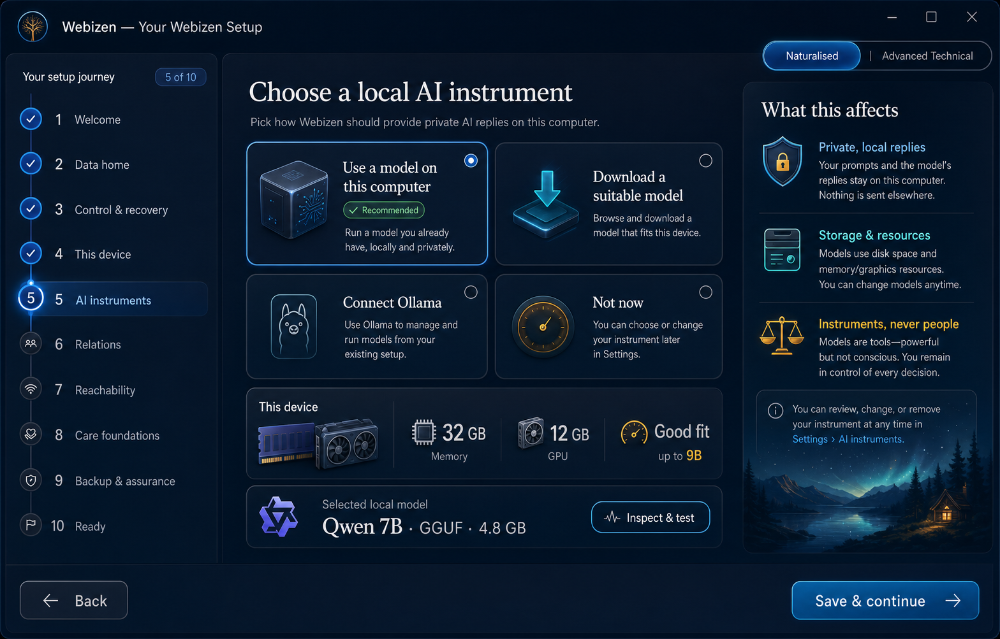
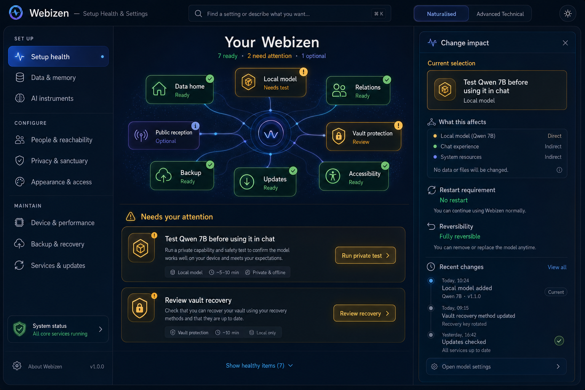
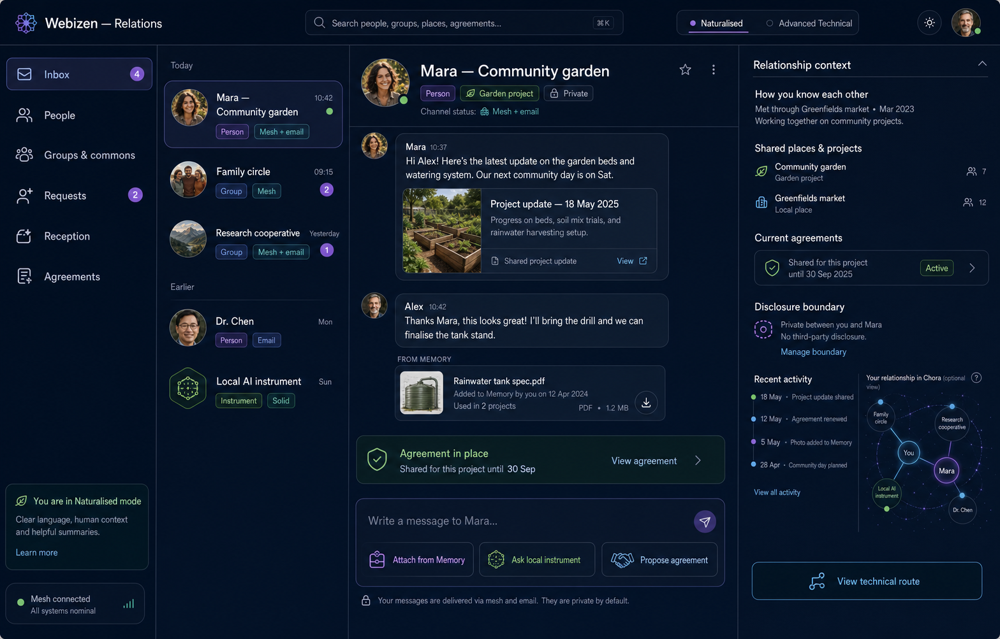
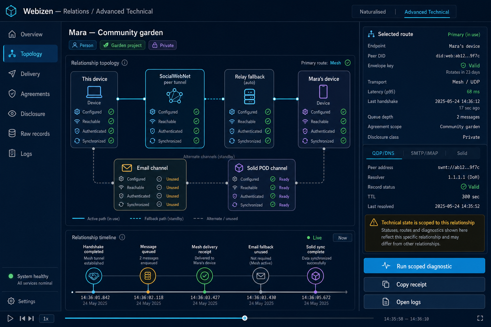

# Webizen Desktop UX Addendum: Setup, Settings, Relations and Communications

**Date:** 2026-07-29

**Scope:** source-backed capability and information-architecture review

**Companion:** [Webizen capability naturalisation map](webizen-capability-naturalisation-map-2026-07-29.md)

## Executive finding

The communications and social-web capabilities have not been removed from the
codebase. They have been **decomposed across too many differently named
surfaces**, some of which are incorrectly labelled in navigation. Setup has the
inverse problem: a very small first-run gate hands the person into an extremely
large, flat settings form while several mature configuration tools remain
reachable only through QApp dispatch.

This produces two misleading impressions:

1. “Webizen has no social or communications system,” although the repository
   contains chat sessions, contacts, groups, invites, mesh peering, relays,
   semantic mail, domains, agreements, live-share consent and Solid chat
   interoperability.
2. “Webizen is configured,” although first run only records welcome, storage
   and an inference-backend label. It does not establish, test and explain the
   wider apparatus.

The redesign should therefore create two first-class systems:

- **Your Webizen** — a resumable setup, configuration, recovery and assurance
  environment;
- **Relations** — a coherent human and social environment whose transports,
  agreements and technical network controls are revealed progressively.

Both systems should support the same interaction-mode axis already proposed for
the wider product:

- **Naturalised mode:** choices expressed as intentions, relationships and
  outcomes;
- **Advanced Technical mode:** exact paths, ports, protocols, keys, policies,
  queues, traces and raw records.

This is not “basic versus complete.” Both modes address the same underlying
objects. They differ in vocabulary, density and control granularity.

## What exists now

### First run

The persisted setup spine is real:

- `SetupState` stores completion, current step and completed steps;
- the gate resumes at the first incomplete step;
- legacy installs with an existing config are silently marked complete;
- the UI presents four screens: welcome, storage, inference backend and ready.

Only three choices are required by the backend:

1. `welcome`
2. `storage`
3. `inference`

The setup UI is therefore narrower than Webizen’s actual operating envelope. It
does not currently establish or verify:

- data strata and migration;
- vault protection and recovery;
- the person’s control material and relationship identifiers;
- device and hardware suitability;
- a usable model, despite asking how inference should run;
- accessibility and appearance;
- network and peer reachability;
- optional public front door, mail or Solid POD;
- backup, update and restore posture;
- sanctuary and disclosure defaults;
- setup health after completion.

The final setup screen promises “Chat + local LLM,” “Social directory” and
“Semantic mail,” but no completion test proves that a local model can answer,
that a peer is reachable, or that mail has been onboarded. This is a
promise/readiness mismatch.

### Settings

The primary settings page is a 1,212-line component. It combines:

- theme and storage;
- daemon host and port;
- inference backend;
- base connectivity cost;
- model scanning, activation and URL download;
- QPU access, eight provider credentials and GSR controls.

It contains at least twelve raw `input` elements in addition to reusable text,
number and select controls. “Models” appears after General, Engine and
Connectivity. QPU provider configuration follows directly in the same page.

Meanwhile, separate components already exist for:

- agent configuration;
- hardware configuration and capability inspection;
- key-vault management;
- model lifecycle;
- storage-driver configuration;
- updater controls;
- Solid LDP browsing;
- peer connection and directory management.

Most are dispatched through the QApp system rather than composed into a
coherent configuration environment. This is a capability-discovery failure:
settings are both **too crowded** and **incomplete**.

### Relations and communications

The current `/talk` route is the closest thing to a coherent social habitat. It
contains five tabs:

- Chat
- People
- Reception
- Mail
- Projects

The supporting code is substantial. The desktop exposes approximately:

- 30 social/chat/agent commands;
- 70 mail, front-door, peer, agreement, Solid and related commands.

The underlying capabilities include:

- local and group chat sessions;
- participant management;
- structured chat graphs and fragments;
- local-agent streaming;
- contacts and a personal directory;
- signed invites, magic links and connection identifiers;
- SocialWebNet mesh peering and relay synchronization;
- project-scoped group chat and cooperative sharing;
- purpose inboxes and per-relationship addresses;
- local SMTP receive plus optional external SMTP/IMAP;
- domain front-door records and DNS publication;
- bilateral agreements and consent states;
- Solid long-chat export/import and Solid POD transfer;
- explicit live-share approval for companion projections.

This is not deprecated functionality. It is **buried, conflated and
misclassified**.

## Where the current information architecture breaks

### 1. The labels do not describe the destinations

The Advanced navigation currently presents:

- **Mail** → `/communications` → a Care-domain “Live Share Consent” inbox that
  explicitly says it is *not chat*;
- **People (Nexus)** → `/nexus` → a research canvas with papers, claims,
  epistemic threads and native scientific dispatch;
- `/talk` → the actual Chat, People, Reception, Mail and Projects habitat.

This is more serious than weak naming. It trains the person not to trust
navigation.

### 2. One Chat surface is carrying several products

`ConnectChat` is more than a message thread. It carries profile state, invites,
contacts, groups, sessions, model activation, agent roster, MCP tool access,
jobs and project scope. The result is a dense operator console inside the
ordinary conversation surface.

Chat should answer three immediate questions:

1. Who or what am I conversing with?
2. Where is this conversation going?
3. What may leave my apparatus?

Model lifecycle, agent tooling and mesh configuration should be available in
context, but should not dominate the composer.

### 3. “People” combines relationship formation with network administration

The People tab includes profile, invite generation, accepting raw JSON
packages, magic links, starting/stopping mesh services, editing peer endpoints,
social peers, contacts and group creation.

The naturalised layer should show people, groups, invitations and relationship
status. Host/port editing, peer tunnel state and raw invite payloads belong in
Advanced Technical mode.

### 4. Social book, personal directory and relations overlap

There are at least three concepts of “people”:

- chat contacts and social peers;
- directory actors and categories;
- WellFair social-book actors, delegation rules and scoped health sharing.

They need not become one undifferentiated database. They do need one legible
view of a relationship with explicit facets:

- person, organisation, care team, service or instrument;
- how they are known;
- active conversations and projects;
- agreements and delegations;
- shared information and expiry;
- network reachability;
- contextual, pairwise identifiers.

The UI should expose the distinction without making the person hunt between
routes.

### 5. Transport is mistaken for the social object

Chat, mail, mesh, relay and Solid are transports or representations. The
primary social object is the relationship and its shared context. A
conversation may use more than one transport over time.

The interface should foreground:

- person/group;
- conversation;
- shared project or purpose;
- agreement;
- place and time;
- disclosure boundary.

It should reveal transport details on request.

### 6. Setup and settings do not form a lifecycle

First run disappears permanently once three flags are complete. Settings is
then a long page. There is no durable “setup health” surface showing what is:

- complete;
- optional;
- degraded;
- disconnected;
- awaiting a decision;
- unsafe;
- recoverable.

Configuration should remain a living, resumable system, not a one-off wizard.

## Proposed product architecture

## A. “Your Webizen”: setup and configuration

### Persistent shell

Create a configuration shell with:

- a left-side system map;
- a central task or configuration panel;
- a right-side “what this affects” explanation;
- global settings search;
- a Naturalised / Advanced Technical switch;
- setup health and repair status;
- a reversible change log;
- clear restart, migration and destructive-change warnings.

The shell has four top-level states:

1. **Set up** — guided first run and newly enabled capability flows;
2. **Configure** — normal day-to-day preferences;
3. **Maintain** — updates, storage, backups, model housekeeping and services;
4. **Assure** — diagnostics, permissions, disclosure, recovery and audit.

### Setup journey

The setup journey should be resumable and branch according to the person’s
intent:

1. **Welcome and interaction style**
   - explain the personal apparatus;
   - choose Naturalised, Advanced Technical, or “ask me when needed”;
   - set accessibility needs before presenting later choices.
2. **Data home**
   - choose storage;
   - explain mindware strata rather than one undifferentiated vault;
   - validate capacity and permissions;
   - show migration/restart implications.
3. **Control and recovery**
   - establish protection and recovery material;
   - distinguish identifiers from identity;
   - explain what can and cannot be recovered.
4. **This device**
   - inspect CPU/GPU/RAM/storage and local services;
   - produce a plain-language suitability result;
   - allow exact tuning in Advanced Technical mode.
5. **AI instruments**
   - use a model already on this computer, download a recommended local model,
     connect Ollama, or defer;
   - verify by running one private test prompt;
   - show size, expected speed, memory fit and provenance before download.
6. **Relations**
   - choose a display name for local presentation;
   - optionally import contacts or connect a person/device;
   - keep raw connection payloads under an advanced disclosure.
7. **Reachability and public front door** (optional)
   - private/local only;
   - peer mesh;
   - domain and mail;
   - Solid POD;
   - explain the exposure created by each step.
8. **Care and personal foundations** (optional)
   - sanctuary posture;
   - accessibility;
   - anatomy reference assets;
   - companion pairing and live-share defaults.
9. **Backup, updates and assurance**
   - choose a backup target;
   - verify a small restore;
   - select update posture;
   - review privacy and connectivity.
10. **Ready**
   - show tested capabilities, not marketing promises;
   - open the first useful task;
   - leave incomplete optional items in Setup Health.

### Configuration domains

| Naturalised domain | Ordinary questions | Advanced Technical view |
|---|---|---|
| Data & memory | Where does my information live? What is using space? | paths, quotas, storage drivers, indices, migration jobs |
| AI instruments | Which local model answers? Will it fit? | GGUF/P64 metadata, mmap/VRAM lifecycle, backend, context, traces |
| People & reachability | Who can reach me, and how? | mesh endpoints, relay, DNS, QDP, SMTP/IMAP, Solid |
| Privacy & sanctuary | What stays private? What may be shared? | policies, grants, sensitivity classes, key and vault state |
| Appearance & access | Can I read and operate this comfortably? | theme tokens, contrast report, rendering and input configuration |
| Device & performance | Is this device healthy enough? | hardware topology, thermal policy, GPU/QPU providers, ports |
| Backup & recovery | Can I recover my work? | schedules, destinations, encryption, restore verification |
| Services & updates | What is running and current? | daemon bindings, service logs, update channels, restart controls |

QPU credentials, daemon addresses and raw network costs belong in Advanced
Technical mode, not beside theme and storage on the ordinary settings landing
page.

## B. “Relations”: communications and social web

### Primary structure

The primary Relations habitat should have six stable destinations:

1. **Inbox** — all conversations needing attention, with source/transport chips;
2. **People** — people, organisations, care teams and explicitly marked
   services/instruments;
3. **Groups & commons** — group conversations, cooperative spaces and shared
   projects;
4. **Requests** — invites, connection requests, live-share consent, agreement
   changes and delivery problems;
5. **Reception** — how others can find or contact the person;
6. **Agreements** — promises, delegations, permissions and disclosure scope.

Mail should be a conversation channel inside Relations and a detailed account
under Reception. It should not be a misleading alias for live-share consent.

### Conversation model

Each conversation header should expose:

- participants, with person/instrument distinction;
- purpose and shared project;
- current place/context;
- time range and latest activity;
- transport(s): local, mesh, relay, email, Solid;
- disclosure/sensitivity state;
- active agreements;
- model or agent participation, if any.

The composer remains simple. Secondary actions appear as meaningful verbs:

- add a person;
- attach from Memory;
- ask a local instrument;
- propose an agreement;
- share for a purpose;
- move into a project;
- inspect technical route.

### Social-web view

“Social web” should not mean a conventional addictive feed. A Webizen-native
social view can be a situated field of:

- relationships;
- shared places and projects;
- invitations and offers;
- public/commons objects;
- correspondence;
- time and presence;
- provenance and rights.

The Chora/3D engine is appropriate as an **optional morphology** for this same
information:

- people and groups occupy meaningful places rather than a random graph;
- distance can express active context, not social worth;
- time can be scrubbed to show how a relation or project changed;
- channels can be spatial paths;
- disclosure boundaries can be visible membranes;
- `.10d` assets can represent places, groups, projects or commons artefacts;
- a flat list always remains available and semantically equivalent.

No relationship should become “more important” merely because it is visually
central, larger or closer. Spatial encoding needs a legend, keyboard
equivalence, reduced-motion mode and non-spatial fallback.

### Advanced Communications view

The same Relations objects can open an Advanced Technical inspector with:

- mesh and relay topology;
- endpoint and dialability state;
- handshake and envelope-key status;
- message queue and synchronization receipts;
- domain, QDP, MX, SPF and service records;
- SMTP/IMAP and Solid resource state;
- agreement and consent encodings;
- raw payload view with copy/export controls;
- logs and diagnostics scoped to the selected relationship.

This replaces the current pattern of placing network administration directly
inside People.

## Navigation repair

Immediate route and label corrections:

| Current | Problem | Proposed |
|---|---|---|
| `/talk` “Relations” | correct destination, legacy URL | keep URL compatibility; make this the sole primary Relations shell |
| `/communications` “Mail” | destination is live-share consent | move into Relations → Requests → Live share |
| `/nexus` “People (Nexus)” | destination is a research/epistemic canvas | rename to Knowledge Nexus; place under Memory or Advanced |
| Social Book under Selfhood | useful but isolated relationship facets | surface relevant facets in Relations → People; keep Care-specific editing where needed |
| Connect/Directory QApps | real capabilities are hard to discover | compose into Relations; retain technical standalone views for Advanced |
| Settings flat page | mixes beginner and infrastructure controls | replace with configuration shell and indexed domains |

The old routes can redirect to the new destinations so deep links and QApps do
not break.

## Delivery plan

### Phase 0 — truth and route repair

- Correct the Mail and People (Nexus) labels.
- Add redirects or contextual hand-offs for overlapping routes.
- Make the destination and scope of Live Share Consent explicit.
- Add a visible Relations entry to the command palette and onboarding finish.
- Stop promising a usable local LLM until a model test has passed.

**Acceptance:** every navigation label accurately predicts the component opened.

### Phase 1 — configuration shell

- Create the setup/configuration domain registry.
- Split the existing settings component by domain.
- Add settings search, completion state and impact explanations.
- Move QPU, daemon, raw ports and provider keys into Advanced Technical mode.
- Register hardware, storage, vault, lifecycle and updater components.

**Acceptance:** a person can find “model,” “backup,” “storage,” “privacy” or
“network” by ordinary words, without knowing component or protocol names.

### Phase 2 — model and storage journeys

- Add native file/folder pickers.
- Turn local-model setup into discover → inspect → fit check → activate → test.
- Turn storage changes into inspect → plan migration → execute → verify.
- Add visible recovery and rollback states.

**Acceptance:** a new person can load an existing GGUF file and receive one
verified local reply without typing a path or URL.

### Phase 3 — unified Relations shell

- Build Inbox, People, Groups, Requests, Reception and Agreements destinations.
- Reuse existing SocialHub, Directory, Social Book, Connect and WellFair
  capabilities behind coherent view models.
- Keep person, organisation, care team, service and instrument roles explicit.
- Separate conversation from model/agent administration.

**Acceptance:** contacts, peers, actors and consent facets are reachable from
one relationship view without pretending they are the same record.

### Phase 4 — transport and agreement integration

- Present chat, mail, mesh, relay and Solid as channels on conversations.
- Surface delivery and synchronization state.
- Add agreement/consent summaries at relationship and conversation level.
- Move endpoint/DNS/SMTP/Solid detail into the scoped Advanced inspector.

**Acceptance:** the person can explain who received what, by which channel,
under which agreement and when.

### Phase 5 — setup lifecycle and assurance

- Expand first run into the branchable journey above.
- Add Setup Health to Settings after onboarding.
- Add repair actions, restart requirements, backup verification and update
  status.
- Version setup steps so new capabilities can introduce optional follow-ups
  without replaying the entire wizard.

**Acceptance:** incomplete or degraded configuration remains visible and
repairable after first run.

### Phase 6 — situated social morphology

- Define the shared relation/place/time projection model.
- Add Chora as an optional view of the same Relations data.
- Support `.10d` place and commons assets with rights/provenance.
- Provide list, keyboard, reduced-motion and high-contrast equivalence.

**Acceptance:** selecting an item in flat Relations and situated Relations
identifies the same underlying object and preserves the same actions and
permissions.

## Design guardrails

- A person is never represented as a model, agent, endpoint, DID or contact
  record alone.
- An instrument is never presented as a peer person.
- “Connected” must distinguish configured, reachable, authenticated and
  synchronized.
- “Private” must state private from whom and at which layer.
- No setting is considered safe merely because it has a default.
- Changes to storage, keys, public reachability or disclosure require impact
  previews and recoverable staging.
- Technical controls remain available without forcing technical vocabulary into
  ordinary flows.
- All colour combinations and states must pass contrast checks across every
  supported theme; hard-coded light cards inside dark surfaces must be removed.
- Empty states teach the next meaningful action and never imply a capability is
  absent when it is merely unconfigured.

## Concept views

These are product-direction plates, not literal implementation screenshots.
They demonstrate information hierarchy, interaction modes and capability
placement.

### Setup: AI instruments

### Persistent setup health and settings

### Relations in Naturalised mode

### Relations in Advanced Technical mode

The exact generation prompts and original ImageGen output paths are preserved
in [PROMPTS.md](images/webizen-setup-relations/PROMPTS.md).

## Source evidence

Primary implementation areas reviewed:

- `crates/webizen-studio/src/components/onboarding.rs`
- `crates/qualia-client-core/src/setup.rs`
- `crates/webizen-studio/src/components/settings_page.rs`
- `crates/webizen-studio/src/main.rs`
- `crates/webizen-studio/src/components/social_hub/`
- `crates/webizen-studio/src/components/connect_chat.rs`
- `crates/webizen-studio/src/components/connect_pane.rs`
- `crates/webizen-studio/src/components/directory_pane.rs`
- `crates/webizen-studio/src/components/nexus.rs`
- `crates/webizen-studio/src/components/wellfair/communications_panel.rs`
- `crates/webizen-studio/src/components/wellfair/social_book_panel.rs`
- `crates/webizen-desktop/src/commands/social.rs`
- `crates/webizen-desktop/src/commands/mail.rs`
- `crates/qualia-client-core/src/chat_session.rs`
- `crates/qualia-client-core/src/chat_graph.rs`
- `crates/qualia-client-core/src/chat_mesh.rs`
- `crates/qualia-client-core/src/chat_relay.rs`
- `crates/qualia-client-core/src/social_mesh.rs`
- `crates/qualia-client-core/src/solid_chat.rs`
- `crates/qualia-client-core/src/front_door.rs`
- `crates/qualia-client-core/src/directory.rs`
- `crates/qualia-client-core/src/agreements.rs`
