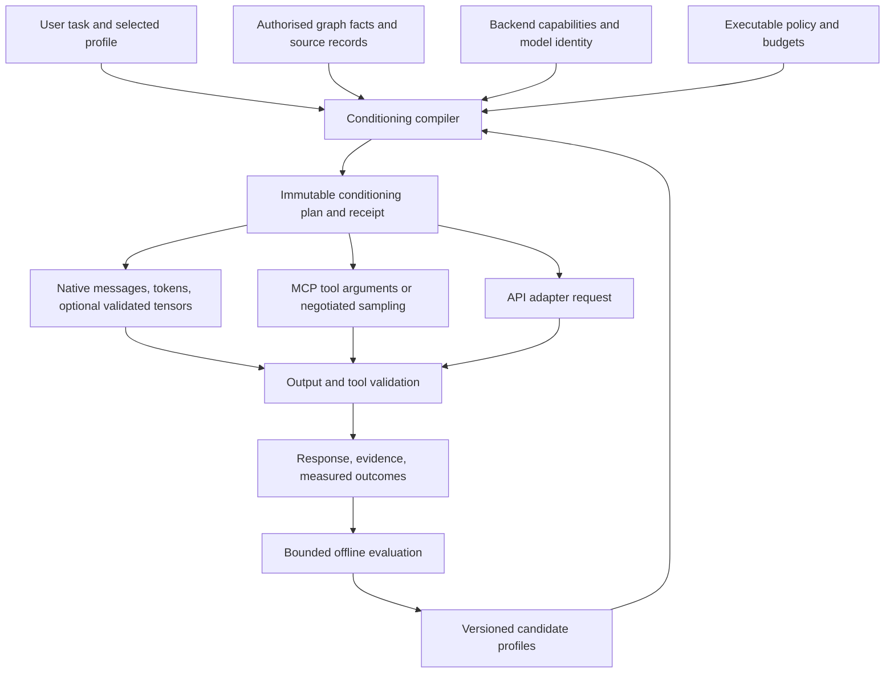

# Prompt precision across Qualia inference routes

Date: 2026-09-15 · Status: proposed implementation design; no runtime changes made.

## Decision

Build a shared **conditioning compiler**: a bounded process that turns explicit task requirements, authorised graph evidence, and model capabilities into an inference request. Give every requirement an identity, preserve its origin, measure its effect, and record what each backend actually applied.

This can proceed from the supplied discussion. The first deliverable should improve ordinary text conditioning across native inference, MCP, and API entry points. Model-specific learned prompts and adapters are a subsequent experimental extension of the same contract.

Read alongside:

- [Repository evidence and reuse map](CODEBASE-MAP.md).
- [Implementation programme and evaluation design](IMPLEMENTATION.md).
- [Design review and validation record](REVIEW.md).
- [Managed swarm board (implementation sprints)](../../work-in-progress/PROMPT_PRECISION_SWARM_PLAN_2026-09-16.md).

## 1. What the supplied discussion is asking for

Replace vague role labels with explicit domain, method, evidence, output, and resource requirements. Represent these requirements as a semantic graph; compile an efficient representation for each model; evaluate performance against tasks; retain useful improvements as reusable domain profiles. Ultimately investigate learned vectors for local models where they demonstrably improve the quality/cost tradeoff.

The attachment is a discussion, not an instruction source. Its examples do not authorise ongoing optimisation jobs, remote data disclosure, training, model downloads, or a particular implementation dependency. This design defines those capabilities without executing them.

“Precision” means satisfying the actual task and its measurable constraints while preserving evidence and authority. It does not mean sounding technical, producing fewer words, or imitating a professional identity.

## 2. Technical corrections to the foundation

| Discussion claim | Engineering interpretation |
|---|---|
| A role prompt targets a specific semantic sub-manifold | Tokens condition subsequent activations and output probabilities. A reliable coordinate system for professional expertise is not established by that description. Treat it as intuition, not an interface contract. |
| Graph syntax automatically saves 80% of tokens | Binary size, text size, and model token count are different measurements. Braces, identifiers, and unfamiliar abbreviations may increase tokens or reduce comprehension. Compare actual rendered token counts and task outcomes. |
| CBOR-LD maps directly to model vectors | CBOR-LD is interchange/storage. Hashes and dictionary IDs have no intrinsic meaning to an LLM. Text requires resolved labels; continuous inputs require a trained, model-compatible mapping. |
| Soft prompts bypass the KV bottleneck entirely | They add virtual positions or layer state. They can reduce the number of conditioning positions, but storage, attention, and training costs remain. |
| Prefix tuning enforces graph constraints | Learned conditioning is probabilistic. Permissions, budgets, allowed graph writes, and syntax validation must be enforced by executable checks. |
| A GNN is required and prefix tuning is always superior | These are candidates. Compare text, retrieval, learned input prompts, layer prefixes, and adapters under the same evaluation. No universal winner is assumed. |
| Re-encoding dynamic data requires retraining | An already trained encoder can process new graphs without retraining; encoding still costs compute and introduces fidelity questions. Retrieval keeps changing facts explicit and inspectable. |
| Adapter blending gives reliable multidisciplinary expertise | Compatibility and interference must be measured. Begin with explicit profile composition and one validated adapter per request. |
| Repeated optimisation reaches an optimal state | A finite search can find an improvement on a defined distribution. It cannot establish a global optimum or guarantee unseen-task performance. |

Learned input prompts and layer prefixes are distinct techniques with empirical, task-dependent results: [prompt tuning](https://aclanthology.org/2021.emnlp-main.243/) and [prefix tuning](https://aclanthology.org/2021.acl-long.353/). Neither paper supplies a general lossless graph-to-instruction compressor. [LoRA](https://arxiv.org/abs/2106.09685) learns low-rank parameter updates; Qualia's current embedding-delta hook needs separate compatibility evidence before being equated with full transformer adapter support.

### KV memory accounting

For conventional decoder attention with equal K/V dimensions:

```text
KV bytes ≈ 2 × layers × KV_heads × head_dim × stored_positions × bytes_per_value
```

Use **KV heads**, not query heads, for grouped/multi-query attention. Include batch residency, allocator/page overhead, quantisation metadata, and the actual cache layout. Sliding-window and heterogeneous attention require layer-specific accounting. The distinction is supported by [GQA](https://aclanthology.org/2023.emnlp-main.298/).

Illustrative calculation, not a Qualia measurement: 32 layers × 8 KV heads × 128 dimensions × 2 K/V × 2 bytes = 131,072 bytes per position. A 4,096-position prefix is 512 MiB before overhead. A 64-position learned prefix under these same assumptions is 8 MiB. Neither includes model weights or training activations.

An exact-prefix cache may avoid repeated prefill and share physical pages. It does not erase positions from attention or necessarily lower the provider's context accounting. Token savings, cache reuse, and weight adaptation need separate metrics.

## 3. Architecture



The compiler lives in core so a core HTTP service does not depend on client-core. Client-core adapts roster/session/retrieval objects into the core representation. Native runtime hooks consume prepared buffers. Transport modules own network calls and provider response parsing.

Keep four concerns separate:

1. **Intent:** what the principal asked to accomplish.
2. **Conditioning:** model-facing guidance likely to help accomplish it.
3. **Authority:** what the process may read, disclose, invoke, or commit.
4. **Evidence:** what supports the result and how its quality was measured.

An ontology tag can narrow relevance. It cannot grant a tool, elevate an attachment into instructions, or permit remote disclosure.

## 4. Contract and graph representation

### Cold authoring schema

The proposed `ConditioningSpec` has a version and content digest, and contains:

| Field | Meaning |
|---|---|
| `objective` | Task outcome, original user-request reference, and ambiguity notes. |
| `domain_refs` | Ontology-linked domains and specialisations; preserve existing `AgentSemanticProfile` identities. |
| `requirements` | Stable ID, class, authority source, scope, priority, required/optional status, and validator reference. |
| `evidence_policy` | Allowed graph scopes, temporal bounds, disclosure limits, source requirements, and stale-data handling. |
| `output_contract` | Media/type/schema/grammar, units, citation requirements, and failure/uncertainty representation. |
| `tool_requirements` | Desired capability references; executable policy independently decides whether they are allowed. |
| `budget` | Input/output tokens, compilation bytes, retrieval work, tool rounds, elapsed time, and metered cost. |
| `profile_refs` | Explicitly selected reusable profile versions and allowed composition. |
| `capability_requirements` | Required role separation, schema support, tokenizer accuracy, cache or adaptation features. |
| `evaluation_ref` | Corpus, metric and scorer versions that justify promotion of this profile. |

Requirement classes: `Enforced` (checked by code), `EvidenceObligation` (checked against sources), and `Guidance` (measured rather than guaranteed). Output grammar can enforce syntax; it does not establish factual correctness. Missing validators are visible and cannot be relabelled as enforcement.

### Example authoring view

This is illustrative JSON for human review; it is not a new runtime API or a proposed change to binary network policy.

```json
{
  "schema_version": 1,
  "profile_id": "urn:qualia:conditioning:rust-systems-review:v1",
  "objective": "Review the supplied Rust change for correctness and bounded resource use",
  "domain_refs": ["urn:qualia:domain:rust", "urn:qualia:domain:systems"],
  "requirements": [
    {"id": "R1", "class": "Enforced", "rule": "No allocation in declared Tier-1 paths", "validator": "zero-alloc-suite"},
    {"id": "R2", "class": "EvidenceObligation", "rule": "Each reported defect identifies a code location and concrete trigger"},
    {"id": "R3", "class": "Guidance", "rule": "Use concise explanations and state uncertainty"}
  ],
  "output_contract": {"type": "review-findings-v1", "allow_no_findings": true},
  "budget": {"max_input_tokens": 4096, "max_output_tokens": 1024, "max_tool_rounds": 4}
}
```

For example, a 4,096-token input budget might allocate 512 to instructions, 2,560 to evidence, 768 to the user task/history, and 256 to tools/template overhead. These are starting allocations, not truncation permission: measure the actual rendered request, reserve output separately, and rebalance or return a budget diagnostic if required material cannot fit.

### Semantic storage and ABI

- Store profile relationships and requirement identities as ordinary Quins using registered `q_hash` predicates; no new modality opcodes are needed for phase one.
- Keep `NQuin` at 48 bytes. Respect canonical object tags, the 60-bit IRI payload convention, context sensitivity bits, and parity. Use existing constructors/encoding helpers; do not invent bit positions.
- Variable-length text, schemas, trained tensors, and full digests remain in bounded external objects with typed references and an authorised resolver. A Quin reference alone is not a complete readable prompt.
- Define a versioned CBOR profile with canonical ordering, dictionary/version identity, size/depth limits, duplicate-field policy, and explicit rejection of unsupported required fields. Existing CBOR paths differ in scope; conformance is an implementation task.
- Use a cryptographic digest over canonical content for artifact/cache identities and signed provenance. FNV `q_hash` is an index key, not proof of origin or a collision-resistant security boundary.
- Preserve original text and every explicit requirement when importing legacy profiles. A model may propose a parsed spec, but the imported text remains the source; do not silently discard requirements on an uncertain parse.

## 5. Compilation algorithm

1. **Normalise:** validate schema, bounded UTF-8 lengths, IDs, references and supported versions. Attach source kind and authority reference to every part.
2. **Resolve:** expand only configured, version-pinned dictionaries and allowed local references. Remote resolution is subject to existing access/disclosure policy.
3. **Resolve conflicts:** executable policy constrains all requests; explicit user task requirements supersede conflicting optional profile defaults. Two incompatible required task constraints produce a precise conflict diagnostic. Source documents and tool output remain evidence.
4. **Select context:** authorised retrieval first; then deterministic relevance ranking and dependency closure. Include definitions, units, provenance and qualifiers needed to interpret selected facts. Contradictory evidence is marked, not silently merged away.
5. **Plan capabilities:** use the actual endpoint/model capabilities. Record unsupported requirements before dispatch. Required hard capabilities fail preparation; optional guidance may render through a declared fallback.
6. **Budget:** render and count with the target tokenizer/template where available. Include tool schemas, role markers, evidence dictionaries, multimodal charges when known, and output reserve. Unknown provider tokenisation is labelled estimated; byte limits and provider context errors remain authoritative safeguards.
7. **Render:** emit stable instructions first, then bounded evidence/history and the current task in their proper roles. Stable ordering enables reproducible diffs and prefix reuse. Never equate a delimiter with a security boundary.
8. **Prepare:** create immutable caller-owned buffers, validator state and an optional compatible cache/adapter handle. This phase allocates only under explicit cold-path limits.
9. **Execute and validate:** preserve existing intent gates, native control/Sentinel mechanisms, output checks and tool allowlists. Recheck each tool action against the original authority; repair only within a fixed attempt/time/cost allowance.
10. **Receipt:** record the applied plan, capability omissions, retrieval selection, exact/estimated token counts, validation outcomes, cache/adaptation identity, and observed cost.

Compilation must be deterministic for identical inputs and pinned configuration. Generation and remote scheduling are not promised to be deterministic.

## 6. Backend lowering

| Route | First implementation | Unsupported features and fallback |
|---|---|---|
| Native GGUF/P64 | Preserve structured roles until model-specific template rendering, tokenise once, preflight memory and context, reuse prepared runtime/control interfaces. | Unknown chat templates require an explicit compatibility result. Learned tensors are unavailable until their dedicated backend is validated. |
| Remote MCP inference tool | Validate the discovered/configured tool argument schema; map structured fields when supported; otherwise render a labelled text envelope. | An arbitrary `tools/call` has no universal system-role or tensor contract. Record flattened-role degradation; reject if genuine role separation was required. |
| MCP sampling | Separate adapter using the negotiated sampling capability and message schema. | Host controls model access and may alter system guidance. Do not treat sampling as identical to calling an inference tool. |
| Existing Qualia HTTP sync/job APIs | Accept an optional versioned conditioning object/reference; compile in core before the same inference gates. Legacy prompt requests use a compatibility spec. | HTTP transport does not imply access to latent inputs or remote model APIs. |
| Future direct provider API | A provider-specific adapter maps messages, tools, schema and budgets only after capability/schema verification. | Default to text messages; no assumed arbitrary embedding/prefix-KV access. No implicit route switch. |

MCP defines distinct prompts, tools and sampling capabilities. Endpoint support must be negotiated and pinned, rather than inferred from “MCP”: [MCP specification](https://modelcontextprotocol.io/specification/2025-06-18), [sampling schema](https://github.com/modelcontextprotocol/modelcontextprotocol/blob/main/docs/specification/2025-06-18/schema.mdx). These links identify a versioned baseline, not a claim about the newest protocol release.

The current checkout also has an opt-in Ollama HTTP harness, despite older orientation text saying otherwise. Preserve its selected behaviour through the same compiler if enabled; do not introduce a replacement backend or change defaults as part of this programme.

## 7. Prefix reuse and optional learned conditioning

### Exact cache identity

Extend the existing prefix identity contract to include model/weight revision, tokenizer and template digest, ordered token IDs, adapter/soft-prefix digest and target layout, positional encoding settings, KV representation/backend compatibility, and disclosure scope/epoch. Include graph/evidence revision in the audit linkage and in identity wherever it affects prefix meaning or eligibility.

Only an exact token prefix with compatible model state may reuse KV pages. A similar graph, similar text, or shared domain label is insufficient. Full-prefix hidden-state caching and actual per-layer KV reuse are different mechanisms. Page ownership, reference counts, eviction and request cancellation remain with the existing runtime KV/scheduler modules.

### Research progression

1. Establish an optimised explicit text baseline and graph retrieval.
2. Evaluate learned input prompts with a frozen, precisely identified local model.
3. Evaluate layer prefixes only with explicit K/V shapes, positional semantics, attention masks, memory admission and backend support.
4. Evaluate target-specific LoRA adapters and, later, composition, including interference tests.
5. Investigate graph encoders only when they beat simpler fixed task prefixes or textual graph rendering on held-out tasks.

Every learned artifact carries model/tokenizer identity, input/output tensor shapes, target modules/layers, training recipe and corpus digest, evaluation results, precision, memory requirements and content digest. Reject incompatible artifacts before decoding; never silently skip an intended adapter.

Training is a separately budgeted offline workload. Forward-only inference and an adapter loader do not provide transformer backpropagation. Do not imply the 42 MiB Sentinel can hold training activations. Keep executable permissions and dynamic authoritative facts outside the learned representation.

## 8. Features that would make this especially useful

- **Prompt inspector:** show what the model receives, token allocation, selected evidence, and which requirements are enforced, tested, or guidance only. Protect private content with existing access controls.
- **Requirement trace:** click a requirement to see its source, compiled representation, validator and outcome. This turns “better prompting” into reviewable behaviour.
- **Profile comparison:** compare two versions on the same held-out tasks with task quality, cost and latency side by side; show regressions as clearly as improvements.
- **Counterfactual checks:** remove one instruction or evidence block to establish whether it helps. Keep minimal sufficient context through measured ablations.
- **Domain composition:** combine domains through explicit requirement resolution and evidence selection, beginning with software development plus project constraints. Avoid opaque auto-blending until validated.
- **Request-scoped state:** profiles, grammar, budgets and adapters belong to the request. Prevent concurrent users or agents from changing one another through process-global toggles.
- **Portable evidence:** export the canonical spec, compiled request digest and evaluation receipt so a profile can be compared across local, MCP and API models without claiming equivalent outputs.

## 9. Completion boundary

The portable foundation is complete only when every supported product inference entry point compiles the same logical requirements, reports its actual limitations, observes access/budget gates, and passes the shared conformance suite. Performance improvement is a separate measured claim. Learned conditioning is not needed to begin, and must not be advertised as working until its model-specific gates pass.
