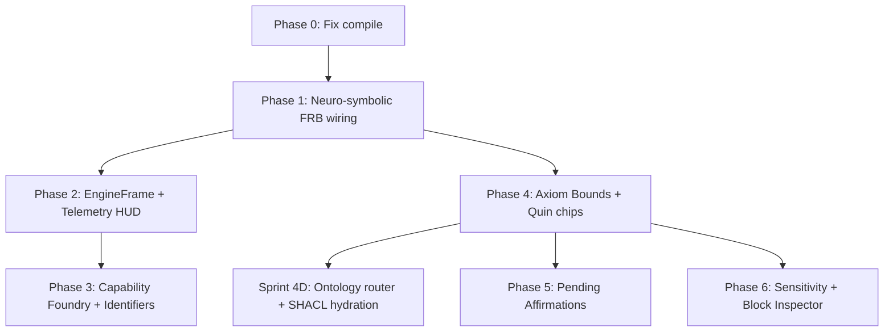

# Qualia Flutter 0.0.9 — UI/UX Overhaul & Neuro-Symbolic Wiring Plan

_Branch target: `0.0.9-dev` | Last updated: 2026-06-08_  
_Status: Planning reference for new agent sessions_

This document is the **complete handoff reference** for overhauling `qualia-flutter` and wiring it to the Sprint 3B/3C neuro-symbolic engine (FSM sieve, `semantic_quin`, WAL cryptographic handoff). Read it before writing Flutter or FRB code.

**Related engine docs:** [`AGENTS.md`](../../AGENTS.md) · [`CLAUDE.md`](../../CLAUDE.md) · [`ARCHITECTURE.md`](ARCHITECTURE.md) · [`flutter-api-reference.md`](flutter-api-reference.md)

---

## 0. Executive Summary

| Layer | Status (2026-06-08) |
|-------|---------------------|
| **Engine** (`qualia-core-db`) | ✅ Chunked prefill, FSM sieve, mmap lex masks, WAL + agency stamping, e2e test green (263 tests) |
| **Client core** (`qualia-client-core`) | ❌ **Does not compile** — `LocalLlmAgent` struct literal missing private sieve fields |
| **Flutter UI** (`qualia-flutter`) | ⚠️ Chat shell wired for **free-text** inference only; **not** wired to sieve/WAL/orchestrator |
| **Zero-copy Quins** (`Uint64List`) | ❌ Not implemented in FRB — streams use JSON NDJSON strings today |

**Philosophical mandate:** Flutter is the **ultimate "dumb UI"** — completely subjugated to the Rust Vault's ethical and mechanical rules. It subscribes to engine streams and repaints; it does not own graph truth.

### 0.1 Terminology policy (UN Human Rights instruments)

All user-facing copy, screen titles, and plan language must align with terms found in [OHCHR Core International Human Rights Instruments](https://www.ohchr.org/en/instruments-listings). **Do not use the word *sovereign* or *sovereignty*** in UI strings, documentation for this milestone, or marketing metaphors.

| Avoid | Use instead (HR-aligned) | Instrument / basis |
|-------|--------------------------|-------------------|
| Sovereign (any sense) | **Principal** / **human agency** / **rights-holder** | UDHR Preamble (inherent dignity); ICCPR Art. 1 (self-determination) |
| User / consumer | **Principal** (natural person) / **participant** | UDHR Art. 1; CRC Art. 12 (participation of the child) |
| Owner (of data) | **Principal** / **rights-holder** | UDHR Art. 12 (privacy); ICCPR Art. 17 |
| Master / slave (UI roles) | **Principal** / **delegate** / **agent** | Agency model in `agency.rs`; CRC guardianship norms |
| App Store | **Capability Foundry** / **Extension Vault** | Human agency, not extractive commerce |
| Download (passive) | **Acquire capability** / **ratify extension** | Participation and informed choice |
| Kids' app (generic) | **Dependent participant** / **guardianship** | CRC Art. 3 (best interests), Art. 5 (evolving capacities) |

### 0.2 Ecosystem terminology — identifiers & verifiable claims (not *identity*)

Per [`docs/sdo-info/README.md`](../sdo-info/README.md) and [`webizen-protocol-rfc.md`](webizen-protocol-rfc.md), the Webizen ecosystem **does not treat DIDs, nyms, or credentials as human identity**. Those are technical artifacts that *relate to* the enumerated reality of a person — they do not substitute for it.

| Term | Meaning | UI / plan usage |
|------|---------|-----------------|
| **Human identity** | Enumerated human reality in lived and social context | **Reserved** — do not use as a screen title, button label, or shorthand for a DID. Refer only in protocol/architecture docs when discussing the enumerated concept. |
| **Identifier** | Technical label: DID, URI, `q_hash`, `did:q42` pointer, session DID | ✅ Primary UI term — _"Principal identifier"_, _"Identifier nym"_, _"Rotate identifier"_ |
| **Identifier Nym** | Contextual projection facet (Address Book / extension bridge) | ✅ When user picks which facet to present to an app |
| **Verifiable claim** | CBOR-LD attestation artifact (inference about an identifier) | ✅ Provenance chips, VC input on vault screen, co-signature cards |
| **Verifiable credential** | Signed claim package | ✅ Same family as verifiable claims; use when referring to W3C VC flows |
| **Auth** | Keys, signatures, keychain material | ✅ _"Signing material"_, _"OS keychain delegation"_ — not _"identity"_ |

**Do not use *identity* in Flutter UI copy** for wallet onboarding, profile tabs, or settings — even as a synonym for DID. Legacy FRB symbols (`loadIdentity` / `saveIdentity`) may remain in code until renamed; **user-visible strings** must say **identifiers** and **verifiable claims**.

**Preferred wallet / profile onboarding framing:**

- **"Principal identifier & human agency setup"** — seed → `did:q42` principal identifier → OS keychain delegation of signing material.
- Follow-on step: **"Verifiable claims"** — view/import CBOR-LD attestations bound to the principal identifier (not "identity documents").
- Copy should stress **inherent dignity**, **privacy**, **self-determination**, and **security of the person** (ICCPR Arts. 1, 17, 9) — without collapsing those rights into a single technical identifier.

**Engine terms (keep as-is):** `principal_did_hash`, `Human Agency Hook` (`agency.rs`), `Webizen`, `Identifier Nym`, `Guardianship`, `Bilateral Micro-Commons`, CBOR-LD verifiable claims.

---

## 1. Current Baseline (What Exists vs. What's Missing)

### 1.1 Wired today (pre–0.0.9)

| Area | Files | Behavior |
|------|-------|----------|
| Chat streaming | `chat_screen.dart` → `runInferenceStream()` | NDJSON `token` / `done` / `error` events |
| FRB bridge | `qualia-flutter/rust/src/api/qualia_api.rs` | Spawns thread → `chat_inference::run_chat_inference_full()` |
| Webizen gating | `chat_inference.rs` | `validate_intent` / `validate_output` on `FreeText` intents |
| UI feedback | `chat_screen.dart`, `chat_citation_chips.dart` | `committed`, `block_reason`, ontology citation chips |
| Chat environment | `chat_environment_sheet.dart`, `chat_environment_bar.dart` | Model, ontologies, prior sessions |
| Graph panel | `chat_graph_panel.dart` | Session graph fragments (JSON APIs) |
| Hardware telemetry | `hardware_telemetry_service.dart` | CPU/RAM/daemon polled every 2s via `getHardwareTelemetry()` |
| Qapp vault | `qapp_vault_screen.dart` | Install/list Qapps (App Store metaphors) |
| Wallet | `wallet_screen.dart` | Balances, Nym, portfolio, identifier load (`loadIdentity` FRB — rename UI strings only) |

### 1.2 Not wired (Sprint 3B/3C engine features)

| Engine capability | Flutter exposure |
|-------------------|------------------|
| FSM sieve (`NeuroSymbolicSieve`) | ❌ `output_mode` hardcoded to `N3OutputMode::FreeText` in `chat_inference.rs` |
| `semantic_quin: Option<QualiaQuin>` | ❌ Not in `ChatInferenceResult`; dropped after streaming infer |
| `TaskOrchestrator::orchestrate_inference` | ❌ Chat bypasses orchestrator; no WAL handoff from UI path |
| `configure_sieve_lex()` | ❌ Never called from client-core |
| `WalHandoffResult` / `wal_committed` | ❌ Not surfaced to Dart |
| Thermal governor (`Cool`/`Warm`/`Critical`) | ❌ Not exposed to Flutter |
| `SuspendedTransactionQueue` | ❌ No "Pending Affirmations" UI |
| Sensitivity lanes (`PUBLIC`/`RESTRICTED`/`CLASSIFIED`) | ❌ No Sanctuary Mode rendering |
| `Uint64List` zero-copy Super-Quin views | ❌ Not in FRB (aspirational in architecture docs) |

### 1.3 Compile breakage (fix first)

`crates/qualia-client-core/src/chat_inference.rs` constructs `LocalLlmAgent` with a struct literal:

```rust
let agent = LocalLlmAgent {
    agent_did: ...,
    backend: ...,
    memory_used_bytes: ...,
};
```

After Sprint 3B/3C, `LocalLlmAgent` has private fields: `use_sieve_output`, `sieve_lex_path`, `sieve_spec`. **Must use `LocalLlmAgent::new()`** (or add a public builder). Verify with:

```powershell
cargo check -p qualia-client-core
cargo check -p qualia-flutter
```

---

## 2. Architectural UI/UX Patterns (The "Dumb UI" Mandate)

### 2.1 Core principles

1. **Rust Vault is source of truth** — Flutter does not duplicate graph state, provenance, or inference results in heavy state managers.
2. **Stateless render cycles** — Subscribe to Rust streams; repaint. Avoid Redux/Bloc patterns that mirror engine data.
3. **Zero JSON on Quin hot paths** — 48-byte `QualiaQuin` crosses the FFI as `Uint64List` (6 × u64) or FRB struct with six `u64` fields. Never JSON-LD or string parsing for structured graph emission.
4. **Mechanical sympathy visible** — Users see RAM floor, thermal state, and model lifecycle because the engine operates near a **512 MB RAM ceiling**.

### 2.2 Target data flow

```
Rust Vault (qualia-core-db + qualia-client-core)
    │
    ├─ StreamSink<EngineFrame>     // unified engine events
    │     ├─ token deltas (String)  // LLM text only
    │     ├─ semantic_quin (Uint64List × 6)
    │     ├─ thermal_state
    │     ├─ memory_pressure
    │     └─ suspended_txs[]
    │
    └─ Flutter: EngineFrameNotifier (Riverpod)
           └─ Repaint widgets only — no authoritative graph copy
```

### 2.3 FRB / zero-copy migration layers

| Data | Today | 0.0.9 target |
|------|-------|--------------|
| Token stream | JSON NDJSON `String` | Keep `String` (LLM text is inherently heap) |
| `semantic_quin` | Not exposed | **`Uint64List` length 6** (mandatory) |
| Graph panel batches | JSON APIs | `Uint64List` views over daemon/mmap |
| Block inspector | N/A | `Uint64List` view over SuperBlock mmap |
| `done` event | Full `ChatInferenceResult` JSON | Add `semantic_quin` as int list, not nested objects |

After FRB changes:

```powershell
cd crates/qualia-flutter
flutter_rust_bridge_codegen generate
```

---

## 3. Phase 0 — Unblock the Build (Session 1, ~1h)

**Goal:** Restore compiling Flutter ↔ Rust path.

### Tasks

- [ ] Replace `LocalLlmAgent { ... }` in `chat_inference.rs` with `LocalLlmAgent::new(agent_did, model_path)` and patch `backend` fields if needed.
- [ ] Add `LocalLlmAgent::with_local_backend(...)` on `qualia-core-db` if chat needs custom `AgentBackend::Local` without exposing private sieve fields.
- [ ] Confirm `cargo check -p qualia-client-core` and `cargo check` in `qualia-flutter/rust` pass.
- [ ] Smoke-test `runInferenceStream` from Flutter (free-text path unchanged).

### Acceptance

- `cargo test -p qualia-core-db --lib` still passes (no engine regressions).
- Flutter app builds and chat returns text + `committed` flag.

---

## 4. Phase 1 — Neuro-Symbolic Wiring (Sprint 4A)

**Goal:** Close the engine loop (sieve → Quin → WAL) through the chat path.

### 4.1 Rust: `qualia-client-core`

**File:** `crates/qualia-client-core/src/chat_inference.rs`

| Change | Detail |
|--------|--------|
| Intent mode | Use `N3OutputMode::GraphMutation` when session environment requests graph write (new flag on `ChatInferenceOptions` or session env JSON) |
| Orchestrator | Route graph-mutation turns through `TaskOrchestrator::orchestrate_inference()` instead of raw `agent.infer()` |
| Lex sidecar | Call `agent.configure_sieve_lex(path)` — prefer ontology `.q42.lex` adjacent to active graph, else `data/schemaorg/30.0/schemaorg-current-https.q42.lex` |
| Intent frame | `intent_predicate == mcp_intent_frame_hash` (required by Webizen Rule 6) |

**Extend `ChatInferenceResult`:**

```rust
pub struct ChatInferenceResult {
    // existing fields...
    pub semantic_quin: Option<[u64; 6]>,  // Super-Quin fields, zero JSON
    pub wal_committed: bool,
    pub sieve_token_count: u8,            // expect 3 when sieve active
}
```

**Extend `stream_event_done`:** include new fields in JSON `done` payload (quin as `[u64; 6]` array, not string).

### 4.2 Rust: `qualia-flutter` FRB

**Files:** `rust/src/api/qualia_api.rs`, run codegen

- [ ] Add `SuperQuinView` type (six `u64` fields or `Uint64List`).
- [ ] Mirror extended `ChatInferenceResult` in Dart (`lib/src/rust/api/`).

### 4.3 Dart: `chat_screen.dart`

| Behavior | Detail |
|----------|--------|
| Sieve complete | When `semantic_quin` present and `text` empty → render **Quin badge row**, not chat bubble |
| WAL status | Show subtle "Ledger committed" when `wal_committed == true` |
| Misalignment | Surface `AgentError::SieveMisaligned` as Shield-style block message |

**New widget:** `SuperQuinProvenanceChip` (extends or replaces `ChatCitationChips` for sieve output):
- Displays `Subject → Predicate → Object` (resolve via lex sidecar or hex hash).
- Tap opens `SuperQuinInspectorSheet` (6 field hex + parity).

### Acceptance

- Graph-mutation session produces 3-token sieve output visible as Quin chips.
- `test_e2e_llm_to_wal_pipeline` behavior reachable from UI path (WAL file `.qualia_graph_mutations.wal` or session-scoped test WAL).
- Free-text chat unchanged.

---

## 5. Phase 2 — EngineFrame & Telemetry HUD (Sprint 4B)

**Goal:** Expose mechanical sympathy; thermal-aware UI.

### 5.1 Extend `HardwareTelemetry` (FRB)

**Current** (`qualia_api.rs`): `cpu_percent`, `ram_used_gb`, `ram_total_gb`, `daemon_status`.

**Add:**

```rust
pub struct HardwareTelemetry {
    // existing...
    pub thermal_state: String,       // "Cool" | "Warm" | "Critical"
    pub llm_memory_bytes: u64,       // from LocalLlmAgent::memory_used_bytes
    pub memory_floor_mb: u32,        // 512
    pub model_lifecycle: String,     // Discovered | Active | Scrubbing | ...
    pub kv_cache_used_mb: u32,       // optional, from engine
}
```

Wire `thermal_state` from `TaskOrchestrator` / `ThermalGovernor` (replace `NullThermalGovernor` stub over time).

### 5.2 UI: `VaultHudBar`

Persistent top or bottom bar (or integrate into `chat_environment_bar.dart`):

| Signal | Threshold | UX |
|--------|-----------|-----|
| RAM backpressure | > 384 MB used | Amber segment |
| RAM critical | > 512 MB floor | Red + "Memory ceiling" |
| Thermal `Warm` | orchestrator | "Logic may throttle" badge |
| Thermal `Critical` | orchestrator | Dim non-essential animations; "Cooling: Logic Throttled" |
| Model `Scrubbing` | scrubbing_lock | Disable LoadModel actions in UI |
| Daemon | port 4242 | Green/amber status dot |

**Provider:** extend `hardwareTelemetryProvider` or add `engineFrameProvider`.

### Acceptance

- HUD updates every 2s (match existing poll interval).
- When orchestrator blocks non-critical inference at `Critical` thermal, UI shows badge **before** user sends prompt.

---

## 6. Phase 3 — Capability Foundry & Principal Identifiers (Sprint 5B)

**Goal:** Purge extractive metaphors; harden **principal identifier** and **verifiable claims** onboarding per §0.1–§0.2 (HR-aligned, no *identity* / *sovereign* UI labels).

### 6.1 `qapp_vault_screen.dart` → Extension Vault / Capability Foundry

| Old copy | New copy |
|----------|----------|
| App Store | **Capability Foundry** / **Extension Vault** |
| Install app | **Acquire capability dimension** |
| Users | **Principals** / **Agents** |
| Download | **Ratify extension** |

**UX:** Each Qapp card shows capability graph summary (ontology scopes, deontic norms) before acquisition — not star ratings or download counts.

### 6.2 `wallet_screen.dart` → Principal Identifier & Human Agency Setup

**Onboarding (once per principal / natural person):**

1. Generate 12-word seed phrase → derive native **principal identifier** (`did:q42`) — ICCPR Art. 1 (self-determination); this is an **identifier**, not the enumerated totality of human identity (§0.2).
2. Delegate Ed25519 signing material to OS keychain (Windows Credential Locker / macOS Keychain) — **security of the person** (ICCPR Art. 9).
3. Show **non-recoverable** warning once; never re-display seed (privacy, ICCPR Art. 17).
4. Bind `principal_did_hash` for all `AgentIntent` paths in chat.
5. Optional second panel: **Verifiable claims** — import/display CBOR-LD attestations linked to the principal identifier.

**UI copy examples (§0.1 + §0.2 compliant):**

- Title: _"Principal identifier & human agency"_
- Subtitle: _"Your rights attach to you as a person; this identifier and your verifiable claims are technical instruments — not a platform account."_
- Tab label: _"Identifiers"_ (not _"Identity"_)
- Avoid: _sovereign_, _identity_ (as DID synonym), _citizen-sovereign_, _data owner supremacy_

Existing tabs (balances, Nym, portfolio) remain; **Identifiers** becomes first tab for new principals, with **Verifiable claims** as second onboarding step where VCs are used.

### Acceptance

- No user-facing string "App Store" or "Consumer" in vault flows.
- New principal can chat with derived `did:q42` without manual DID paste.

---

## 7. Phase 4 — Neuro-Symbolic Chat UX (Sprint 4C)

**Goal:** Chat is not an LLM wrapper — it bridges probabilistic generation with deterministic N3/Prolog graph queries.

### 7.1 Axiom Bounds drawer

Extend `chat_environment_sheet.dart` → **`AxiomBoundsSheet`**:

| Control | Maps to |
|---------|---------|
| Start Year / End Year sliders | LTL trace bounds / intent temporal frame |
| Spatial context (map or hash) | Allen interval / spatial mesh binding |
| Persist in session env | `InferenceContextPacket` in `context_binding.rs` |

Rust validates bounds in `validate_intent` / orchestrator preflight **before** KV prefill.

### 7.2 ShieldAlert

When Webizen clips anachronism (`DenyRollback`, 0x99 sentinel, or axiom violation):

- Render **`ShieldAlert`** chip on message (distinct from generic "Webizen blocked").
- Copy example: _"Fact clipped — outside axiom bounds [1930–1945]"_.

### 7.3 Provenance as primary output

**Rule:** When sieve completes, the **Quin row is authoritative**; LLM text is secondary or empty.

```
[verified] Patient → hasFever → True     [Ledger ✓]
     ↑ tap
  SuperQuinInspectorSheet
    - 6 × u64 hex fields
    - sensitivity badge
    - principal DID
    - WAL commit status
    - Ed25519 signature stub (future: full verify)
```

### Acceptance

- User can set axiom bounds and see ShieldAlert on violation.
- Sieve-generated messages show triple chips, not prose.

---

## 8. Phase 5 — Bilateral Guardianship (Sprint 5A)

**Goal:** UI for CRDT suspended transactions and co-signature flows (Wellfair / dependent participants). Language follows **CRC Art. 3** (best interests of the child) and **Art. 12** (participation) where minors are involved — never "sovereign" or proprietorial framing of dependents.

### 8.1 FRB APIs (new)

```rust
pub fn list_pending_affirmations() -> Vec<SuspendedTxView>;
pub fn apply_guardian_token(agreement_id: u64, token_quin: SuperQuinView) -> bool;
```

Backed by `SuspendedTransactionQueue` in `crdt.rs`.

### 8.2 Pending Affirmations tray

Global surface (tray icon badge + slide-over panel):

- Card per suspended Quin: _"Guardianship Proposal — medical graph share"_.
- Actions: **Co-sign** / **Deny**.
- On co-sign: `apply_consensus_token` wakes execution.

### 8.3 Chat integration

When `WalHandoffResult::Suspended`:

- Message shows amber **"Awaiting guardian affirmation"** (not failure).
- Tray badge increments.
- On ratification: green **"Cryptographically ratified"**.

### Acceptance

- Suspended mutation visible in tray within one poll cycle.
- Co-sign clears queue slot and updates message state.

---

## 9. Sprint 4D - Ontology Router & SHACL Hydration

**Goal:** Make the chat pipeline ontology-aware per turn, so context can deepen as new ontologies become available without retraining the LLM, while preserving deterministic routing and SHACL / logic enforcement in the Symbolic layer.

### 9.1 Current reality vs target

| Capability | Design intent | Current chat path |
|------------|---------------|-------------------|
| Context grows as ontologies are added | Retrieval and graph injection expand as new `.q42` artifacts are installed | Partial - session-scoped ontology selection and retrieval block injection exist, but routing is manual |
| Predicate-driven ontology suitability | Query predicates / namespaces identify best-fit ontologies | Not wired - all scoped ontologies are scanned equally |
| SHACL / N3 / deontic / epistemic enforcement loop | Sentinel validates LLM proposals against routed shapes and rules | Partial - engine has these capabilities, chat path uses only a thin subset |
| Corrective retry on shape violation | Bounded regenerate-with-violation loop | Not implemented - current behavior is block / Shield |

### 9.2 Rust: ontology routing layer

**Files:** `crates/qualia-client-core/src/chat_retrieval.rs`, new `ontology_router.rs`, `context_binding.rs`

- [ ] Add an `OntologyRouter` that tokenizes query terms and candidate predicates, then ranks available ontologies by overlap rather than scanning all scoped ontologies equally.
- [ ] Extend `q42_lex` / lex-sidecar usage so the routing layer can act as an ontology registry, mapping predicate namespaces or high-confidence lex tokens to ontology ids and, later, BIDX-aligned ranges.
- [ ] Narrow `retrieve_graph_context()` to the routed ontology set for each turn, not only the session-static `ontology_ids`.
- [ ] Preserve fallback behavior when routing confidence is low: use session-selected ontologies plus schema.org bundle.

### 9.3 Rust: intent and orchestrator alignment

**Files:** `crates/qualia-core-db/src/llm_agent.rs`, `crates/qualia-client-core/src/chat_inference.rs`, `crates/qualia-core-db/src/orchestrator.rs`

- [ ] Extend `AgentIntent` with `context_namespaces: Vec<u64>` or equivalent routed ontology / predicate-namespace hashes.
- [ ] Pass routed ontology hashes through the chat inference path so sieve lex selection, retrieval context, and graph mutation validation are aligned per turn.
- [ ] Add a shape-selection stage ahead of `gate_llm_n3_output` so domain SHACL sets can be hydrated from the routed ontology set instead of always using the default observation shape.

### 9.4 SHACL + logic activation

- [ ] Route domain-specific SHACL shapes into chat turns when predicates indicate a medical, legal, civic, or other specialized context.
- [ ] Expose ontology-linked rule families for deontic, epistemic, and N3 logic where relevant, instead of treating them as engine-only side capabilities.
- [ ] Keep the Neuro-Symbolic split explicit: the LLM proposes, the Sentinel validates.

### 9.5 Bounded corrective loop

- [ ] Add a bounded corrective prompt loop in the orchestrator for SHACL / rule violations:
  1. LLM proposes candidate output
  2. Sentinel returns structured violation context
  3. One bounded retry is permitted with routed ontology + violation context
  4. Final failure yields `ShieldAlert` / block
- [ ] Ensure this loop never bypasses the existing safety halt, Webizen clipping, or hot-path constraints.

### 9.6 UI / product surface

- [ ] Add routed ontology visibility to the chat environment or provenance surface so a principal can see which ontologies grounded a given turn.
- [ ] Phase 3 Capability Foundry cards should later expose ontology scopes, SHACL shapes, and deontic / logic hooks before acquisition.

### Acceptance

- Installing a new ontology can affect future chat turns without model fine-tuning.
- A chat turn can route to a narrower ontology subset than the full session scope.
- Routed shapes and rules are selected per turn before validation.
- SHACL violation handling can perform one bounded corrective retry before Shield / block.

---

## 10. Phase 6 — Sensitivity & Block Inspector (Sprint 5B)

### 10.1 Sensitivity rendering

Map `QualiaQuin::get_sensitivity_byte()` / `context` high bits:

| Class | Value | UI |
|-------|-------|-----|
| PUBLIC | `0x00` | Normal rendering |
| RESTRICTED | `0x01` | Amber border + "DID handshake required to share" |
| CLASSIFIED | `0x02` | **Sanctuary Mode**: darkened chrome, screenshot block (`FLAG_SECURE` on Android), lock icons, no egress indicators |

Apply in: chat messages, graph panel nodes, Quin inspector, file attachments.

### 10.2 Block Inspector (power user / dev)

Debug overlay (Settings → Developer):

- FRB: `get_superblock_view(block_id) -> Uint64List`
- Render 40 KB SuperBlock as hex grid + decoded Quin slots
- Live validation that hot path uses zero JSON

### Acceptance

- Classified Quins never render in light "public" theme.
- Inspector shows raw bytes matching `qualia-cli ingest` layout.

---

## 11. Recommended Sprint Order



| Sprint | Phases | Deliverable | User-visible outcome |
|--------|--------|-------------|----------------------|
| **4A** | 0 + 1 | Compile fix + orchestrator chat path | Quin chips in chat; WAL status |
| **4B** | 2 | Telemetry HUD | RAM/thermal/lifecycle visible |
| **4C** | 4 | Axiom bounds + ShieldAlert | Constrained inference UX |
| **4D** | 9 | Ontology router + SHACL hydration | Per-turn ontology grounding and validation |
| **5A** | 5 | Guardianship tray | Co-sign suspended mutations |
| **5B** | 3 + 6 | Foundry rename + Sanctuary + Inspector | Principal identifiers, verifiable claims + classified data UX |

---

## 12. Key File Map

| Purpose | Path |
|---------|------|
| Chat UI | `crates/qualia-flutter/lib/screens/chat_screen.dart` |
| Chat environment | `crates/qualia-flutter/lib/screens/chat_environment_sheet.dart` |
| Citation chips | `crates/qualia-flutter/lib/widgets/chat_citation_chips.dart` |
| Telemetry | `crates/qualia-flutter/lib/services/hardware_telemetry_service.dart` |
| FRB API | `crates/qualia-flutter/rust/src/api/qualia_api.rs` |
| Chat inference | crates/qualia-client-core/src/chat_inference.rs |
| Chat retrieval | crates/qualia-client-core/src/chat_retrieval.rs |
| Ontology routing | crates/qualia-client-core/src/ontology_router.rs (planned) |
| Orchestrator | `crates/qualia-core-db/src/orchestrator.rs` |
| FSM sieve | `crates/qualia-core-db/src/neuro_symbolic_sieve.rs` |
| Lex mmap | `crates/qualia-core-db/src/q42_lex.rs` |
| WAL handoff | `crates/qualia-core-db/src/wal.rs` |
| Agency stamping | `crates/qualia-core-db/src/agency.rs` |
| LLM agent | `crates/qualia-core-db/src/llm_agent.rs` |
| CRDT queue | `crates/qualia-core-db/src/crdt.rs` |
| E2E reference test | `orchestrator::tests::test_e2e_llm_to_wal_pipeline` |

---

## 13. Engine Contracts (Do Not Violate in UI Work)

From `AGENTS.md` / `CLAUDE.md`:

| Rule | UI implication |
|------|----------------|
| No *sovereign* terminology | Use §0.1 HR-aligned terms in all Flutter strings and docs |
| No casual *identity* in UI | Use **identifier** / **verifiable claim** per §0.2; *human identity* is enumerated, not a DID label |
| 48-byte `QualiaQuin` | Display as 6 × u64; never parse LLM strings into graph on hot path |
| 512 MB floor | Show memory pressure; don't trigger parallel heavy inference in UI |
| Webizen gates all I/O | UI shows `blocked` / `ShieldAlert`, never bypasses validation |
| No Ollama | UI copy must not reference Ollama; local GGUF only |
| `infer` ≠ HTTP | All inference via `AgentRuntime` / orchestrator, not REST |
| Thermal `Critical` | UI must mirror orchestrator block for non-critical intents |

---

## 14. New Session Checklist

When starting a 0.0.9 Flutter session:

1. Read this document.
2. `git status` — confirm branch (`0.0.9-dev` or `main`).
3. `cargo check -p qualia-client-core` — if fails, start **Phase 0**.
4. `cargo test -p qualia-core-db --lib` — engine baseline must pass.
5. Identify sprint (4A–5B, including 4D) from Section 11.
6. After FRB changes: `flutter_rust_bridge_codegen generate` in `qualia-flutter`.
7. Do not commit unless user requests.

### Suggested first prompt for new session

> Implement Phase 0 and Phase 1 from `docs/manuals/0.0.9-flutter-plan.md`: fix `LocalLlmAgent` construction, wire graph-mutation chat through `TaskOrchestrator`, expose `semantic_quin` as `Uint64List` in FRB, and render `SuperQuinProvenanceChip` in `chat_screen.dart`.

---

## 15. Open Questions (resolve during implementation)

- [ ] Session-scoped WAL path vs global `.qualia_graph_mutations.wal` for UI commits?
- [ ] When to auto-select `GraphMutation` vs `FreeText` — user toggle or agent policy?
- [ ] Lex sidecar resolution order: session ontology → schema.org bundle → tokenizer fallback?
- [ ] `Uint64List` vs FRB `struct SuperQuinView { u64 × 6 }` — prefer struct for Dart ergonomics, `Uint64List` for block inspector mmap views.
- [ ] Real ThermalGovernor platform bindings (Windows/Android) vs mocked HUD first?
- [ ] Predicate namespace routing: lex-sidecar only first, or lex + BIDX hints together?
- [ ] Should context_namespaces live on AgentIntent, InferenceContextPacket, or both?
- [ ] Which routed ontology families get first-class corrective retry support: medical, legal, civic, all?
- [ ] Should chat file sensitivity remain derived from sharing by default, or become an explicit attach-time selector?

---

## 16. Revision History

| Date | Change |
|------|--------|
| 2026-06-08 | Initial plan: post Sprint 3C handoff, incorporates dumb-UI mandate, neuro-symbolic wiring, guardianship, sensitivity, and phased sprint order |
| 2026-06-08 | §0.1 terminology policy: ban *sovereign*; UDHR/ICCPR/CRC-aligned alternatives; Phase 3/5B copy updated |
| 2026-06-08 | §0.2 ecosystem terms: identifiers & verifiable claims; ban casual *identity* in UI; Phase 3 wallet copy revised |
| 2026-06-08 | Added Sprint 4D backlog for ontology routing, dynamic SHACL hydration, context_namespaces, and bounded corrective retry |

