# Q42/P64 Inference Pipeline

**Version:** 0.1  
**Date:** 2026-07-02  
**Status:** Implementation Manual  
**Applies to:** QualiaDB native and WebAssembly local-model inference  
**Format reference:** [P64 Weight Container Standard](standards/p64-weight-container-standard.md)

## Purpose

This manual explains how model weights, semantic context, inference compute,
governance, and output persistence fit together in QualiaDB.

The P64 standard defines bytes on disk. This document defines the runtime path:

```text
source model -> P64 -> validation -> residency -> prefill -> decode
             -> governance -> output grounding -> optional Q42/WAL commit
```

It is an implementation manual, not an interoperability standard. Statements
marked **implemented** describe code present on 2026-07-02. Statements marked
**planned** describe an architectural seam that exists but is not connected to
the production decode path.

## 1. Terminology and the naming boundary

Three artifacts must not be conflated:

| Name | Magic | Responsibility |
|---|---|---|
| GGUF | `GGUF` | Source model and supported runtime fallback |
| P64 | `p64\0` | Canonical cache-aligned model-weight container |
| Q42 volume | `Q42\0` | Semantic Quins, indexes, provenance, and Merkle-DAG history |

P64 and Q42 are siblings. P64 stores mathematical model state; Q42 stores
semantic and governance state.

Canonical P64 APIs are now available throughout the compile, tokenizer,
residency, native, and WASM paths. A smaller compatibility surface predates the
final naming decision and still uses `q42` for P64 weights:

| Canonical name | Compatibility name |
|---|---|
| `compile_gguf_to_p64*` | `compile_gguf_to_q42*` |
| `compileGgufToP64` | `compileGgufToQ42` |
| `p64FormatVersion` | `q42FormatVersion` |
| `mount_resident_model` | `mount_resident_q42` |
| `adopt_resident_p64_mmap` | `adopt_resident_q42_mmap` |
| `GgufTokenizer::to_p64_section` | `GgufTokenizer::to_q42_section` |
| `P64TensorIndex` | `Q42TensorIndex` |
| `P64TensorIndex::from_p64` | `P64TensorIndex::from_q42` |

These names are compatibility aliases, not evidence of a second `.q42` weight
format. New documentation and user-facing surfaces should say **P64**.

## 2. Pipeline overview

```mermaid
flowchart LR
    source["GGUF or high-fidelity Safetensors"] --> transcode["P64 transcoder"]
    transcode --> p64["P64 v3<br/>weights + descriptors + tokenizer + CRCs"]
    p64 --> validate["P64TensorIndex::from_p64"]
    validate --> resident["Resident mmap / browser byte store"]
    resident --> compat["Synthetic GgufTensorIndex<br/>absolute P64 blob offsets"]
    compat --> prefill["Prompt tokenization + chunked prefill"]
    prefill --> decode["Autoregressive decode<br/>KV cache + output projection"]

    q42["Q42 graph context"] --> intent["Intent and grounding gates"]
    intent --> prefill
    decode --> sentinel["Phase-8 Sentinel<br/>LogitStream / ControlStream"]
    sentinel --> decode
    decode --> output["AgentOutput"]
    output --> postflight["Output validation + optional grounding"]
    postflight --> wal["Semantic Quin WAL / suspended consensus"]

    forge["WGSL Forge"] -. "certifies kernels and P64 layer math;<br/>not the production decode owner" .-> decode
```



The production owner of inference is `QTensorEngine` in `gguf_bridge`. The
Forge produces and certifies compute artifacts; it does not currently replace
the engine's hand-written transformer-forward path.

## 3. Component map

| Stage | Primary implementation |
|---|---|
| GGUF/Safetensors to P64 | `q42/p64_weight.rs` |
| P64 validation and descriptor index | `P64TensorIndex::from_p64` |
| Process-wide native residency | `inference/resident_model.rs` |
| P64-to-runtime compatibility index | `P64TensorIndex::to_gguf_index` |
| Tokenizer serialization | `inference/gguf_sharder.rs` (`Q42T` section) |
| Engine initialization and KV allocation | `gguf_bridge/init.rs`, `gguf_bridge/load.rs` |
| Prefill and forward execution | `gguf_bridge/prefill*`, `gguf_bridge/forward.rs` |
| Local decode loop | `inference/inference_agent.rs` |
| Intent, output, and grounding gates | `inference/orchestrator.rs` |
| Continuous tensor context | `inference/compute_universe.rs` |
| P64-to-Forge certification bridge | `wgsl_forge/graph_ops/p64_bridge.rs` |
| Browser exports | `wasm_llm.rs` |

## 4. Producing a P64

### 4.1 GGUF conversion

`compile_gguf_to_p64(input, page_log2)` is the canonical full-model producer.
It:

- parses GGUF metadata and tensor descriptors;
- preserves every source tensor, including unknown roles;
- assigns engine roles to recognized attention, FFN, norm, embedding, and
  output tensors;
- embeds model hyperparameters;
- embeds the `Q42T` tokenizer section;
- writes one 64-byte 10D manifold record per layer plus one global record;
- page-aligns every tensor blob; and
- writes metadata and per-tensor CRC-32C values.

The compatibility function `compile_gguf_to_q42` calls this same producer and
returns the same `p64\0` bytes.

`P64TensorIndex::validate_against_gguf` can perform a cold-path proof that a
byte-preserving P64 contains the same tensors, shapes, types, source offsets,
name hashes, lengths, and bytes as the source GGUF.

### 4.2 Quantized profiles

The producer can rewrite FFN projections to Q4_0 or BitNet-1.58b ternary
payloads. The tensor descriptor's `dtype`, not the container-level flag, is
authoritative.

The native loader can build a resident two-bit GPU representation for ternary
FFN tensors. If that build fails, the implementation logs the failure and uses
its fallback path. Quantized profiles must pass model-quality evaluation; a
container being structurally valid does not prove acceptable perplexity or
generation quality.

### 4.3 Safetensors conversion

The streaming Safetensors path emits valid P64 while bounding ingest working
memory to approximately the largest source tensor. Raw transcodes may lack a
tokenizer and complete model hyperparameters. They are useful as weight
containers but are not automatically bootable as complete language models.

For direct inference, use a full GGUF conversion or supply the missing model
metadata and tokenizer through a separately defined profile.

## 5. Validation before execution

`P64TensorIndex::from_p64` is the trust boundary for P64 structure. Before any
blob is exposed it validates:

- magic, version, and little-endian flag;
- page-size constraints;
- metadata section ordering and bounds;
- the metadata CRC-32C;
- tensor rank and manifold indexes;
- string references;
- page alignment and non-overlap of tensor blobs; and
- every tensor CRC-32C.

A caller must treat any validation failure as terminal for that P64. Falling
through and parsing the same bytes as GGUF is not a safe recovery strategy.

CRC-32C provides corruption detection, not publisher authentication. A
deployment that receives P64 from outside its trusted cache should also verify
a cryptographic digest or signature.

## 6. Native residency and boot

### 6.1 Process-wide resident slot

Native code can retain one mapped model in `ResidentModelSlot`. The slot stores:

- `model_id`;
- the canonicalized path;
- an `Arc<Mmap>`; and
- a `GgufLoadReport`.

Only one model is resident at a time. Mounting a model first clears the prior
slot.

The preferred format-neutral API is:

```rust
let model_id = qualia_core_db::q_hash(model_path);
let report =
    qualia_core_db::resident_model::mount_resident_model(model_id, model_path)?;
```

`mount_resident_model` opens and maps the file, selects P64 by the exact
canonical magic, otherwise delegates to the GGUF parser, initializes a
`QTensorEngine`, and retains the mapping for later inference sessions.
`mount_resident_q42` remains as a compatibility name for callers that already
know they have P64.

The mount uses `tokio::task::block_in_place`; callers must provide a compatible
multi-thread Tokio runtime.

### 6.2 Native auto-detection

`LocalLlmAgent` checks for an already-resident mmap whose path matches its
configured `model_path`. It magic-sniffs that mmap:

```text
p64\0 -> adopt_resident_p64_mmap
other -> adopt_resident_mmap as GGUF
```

`adopt_resident_q42_mmap` remains a compatibility alias.

If no matching resident mmap exists, `load_model_checked` maps the path and
uses the same canonical detection. P64 therefore works with or without an
explicit process-wide mount. Explicit mounting is still preferred when the
mapping should be reused across inference sessions.

### 6.3 Engine adoption

`adopt_resident_p64_mmap` performs these steps:

1. Validate the P64 and materialize its small descriptor index.
2. Convert descriptors to a synthetic `GgufTensorIndex`.
3. Set `tensor_data_offset = 0`, because P64 blob offsets are absolute
   file-relative offsets.
4. Copy model hyperparameters into the engine.
5. Reserve GEMM staging buffers.
6. Allocate the KV cache and its CPU mirror.
7. Retain the mmap as the immutable tensor-byte source.
8. Upload the output/logits projection once where possible.
9. Build the resident ternary-FFN dispatcher where applicable.

P64 does not become GGUF during this process. The synthetic index is an
internal compatibility view that lets existing quantized tensor fetch and
forward code consume P64 without duplicating the engine.

### 6.4 Tokenizer and tensor index

After adoption, the inference thread inspects the resident magic again.

For P64:

- the tokenizer is reconstructed from the embedded `Q42T` section; and
- `P64TensorIndex::to_gguf_index` supplies runtime tensor descriptors.

For GGUF:

- `GgufTokenizer::from_gguf` reads the KV metadata; and
- `GgufTensorIndex::from_gguf` reads tensor descriptors.

If a P64 tokenizer section is missing or malformed, the current agent falls
back to the default byte tokenizer. That keeps the process alive but does not
guarantee model-correct tokenization. Complete-model deployments should treat
that condition as a load failure.

## 7. Inference phases

The engine is constructed inside the dedicated native inference thread so
DirectML and wgpu handles do not cross unsupported `Send` boundaries.

### 7.1 Request setup

Before compute, the agent:

- hashes `graph_context` into a lightweight `prov_hash`;
- chooses the optional neuro-symbolic sieve configuration;
- detects and loads an optional LoRA adapter;
- creates fixed-capacity Phase-8 rings; and
- creates a bounded streaming channel when a token callback is supplied.

The `graph_context` hash is not a Q42 Merkle proof. It is a small request-local
provenance token derived from the first eight context bytes.

### 7.2 Prompt tokenization and buffers

The tokenizer encodes the prompt and identifies EOS. The runtime obtains the
embedding width from the tensor index, capped by the fixed local buffer limit.

The principal compute scratch buffers are stack arrays:

- embedding buffer: up to 8,192 `f32` values;
- FFN scratch buffers: up to 10,240 `f32` values each; and
- fixed chunked-prefill storage.

The decode implementation is not literally allocation-free end to end:
prompt/output token vectors, cold-path tokenizer/index state, streaming text,
and optional LoRA handling may allocate. The fixed compute buffers and
caller-buffered kernels keep large transient tensor allocations out of the
per-layer hot path.

### 7.3 Chunked prefill

The engine resets the KV cache, records prompt provenance, then processes all
prompt tokens except the final token in bounded chunks:

1. dequantize each token embedding from the mmap/P64 byte source;
2. run `dispatch_prefill_chunk`;
3. write layer K/V state into the cache; and
4. advance until the prompt prefix is resident.

Load and prefill timings are recorded separately from decode.

### 7.4 Autoregressive decode

The native release loop has a default budget of 256 generated tokens and a
30-second cooperative decode deadline. `MAX_OUTPUT_TOKENS` remains the absolute
post-flight ceiling.

Each step:

1. publishes a decode hint to the compute-universe fabric;
2. accepts or rejects any topology-draft proposal;
3. drains continuous Tensor10D context injection;
4. consumes a pending `DenyRollback`;
5. dequantizes the current token embedding;
6. optionally applies a compatible LoRA delta;
7. runs the full transformer forward pass and updates KV state;
8. applies final output normalization;
9. selects a token through resident GPU top-1, chunked argmax, or fallback;
10. publishes a small logit summary to the Sentinel;
11. applies rollback or the neuro-symbolic sieve;
12. appends and streams the accepted token; and
13. stops on EOS, a completed semantic Quin, sieve failure, budget, or deadline.

The production transformer path is `QTensorEngine::dispatch_transformer_forward`.
It consumes role-mapped model tensors through the compatibility index and
uses the existing engine kernels.

## 8. Phase-8 governance

### 8.1 In-loop Sentinel

Native inference creates two wait-free SPSC rings:

```text
LLM engine -> LogitStream   -> Sentinel
LLM engine <- ControlStream <- DenyRollback
```

The current anomaly witness is byte `0x99` in the selected logit's
little-endian `f32` representation. The Sentinel sends `DenyRollback`; the
engine consumes it on the next step and substitutes a deterministic neighbour
token.

This in-loop intercept is present in direct native local inference. It is not
equivalent to the broader orchestrator gates described below.

### 8.2 Orchestrated inference

`TaskOrchestrator::orchestrate_inference` wraps the agent runtime:

1. check thermal policy;
2. validate the declared `AgentIntent`;
3. apply the quantum-egress prompt gate;
4. register the agent identity Quin;
5. run inference;
6. optionally compile N3 output through SHACL and the Sentinel VM;
7. validate output provenance and token limits;
8. optionally resolve factual grounding; and
9. commit a structured semantic Quin to the WAL or suspend it for consensus.

Calling `infer_local_model_streaming` directly bypasses these pre-flight,
post-flight, grounding, and commit stages. It still uses the native Phase-8
logit/control rings.

### 8.3 Structured output

When the neuro-symbolic sieve is active, it can assemble an `NQuin` directly.
Otherwise the result is decoded text.

`AgentOutput` carries:

- text;
- an optional semantic Quin;
- provenance identifiers;
- token count;
- duration; and
- reported memory use.

`validate_output` currently requires a non-empty provenance vector and enforces
the absolute token ceiling. The optional grounding gate is stronger: it checks
whether a structured claim is actually supported by cited facts before a WAL
commit.

## 9. Q42 provenance relationship

### 9.1 Implemented today

Q42 participates in the inference system through:

- semantic graph context supplied to the request;
- intent scopes and namespace routing;
- SHACL/N3 validation;
- Tensor10D/Quin context injection;
- optional structured semantic output;
- grounding checks; and
- WAL/Merkle-DAG infrastructure used by graph mutation paths.

The P64 tensor manifest also retains source offsets and source-name hashes, and
byte-preserving conversion can be checked against its source GGUF.

### 9.2 Not yet implemented as a complete binding

There is no production generator that writes a canonical Q42 model-provenance
graph binding all of the following:

- a cryptographic digest of the source model;
- the P64 artifact digest and container version;
- the transcode/quantization policy;
- every P64 tensor pointer;
- model licensing and consent;
- the runtime/certified-kernel identity; and
- generated outputs.

`MODALITY_FLAG_LLM_TENSOR = 0b1001` and earlier GGUF pointer-map work provide
building blocks, but they do not constitute that complete binding.

Until a profile is implemented and frozen, do not describe a normal
`graph_context` hash or a P64 CRC as cryptographic model provenance. A future
Q42-to-P64 provenance profile should be specified separately from this runtime
manual.

## 10. Forge boundary

The WGSL Forge and the inference engine have distinct responsibilities.

### Forge currently does

- parse P64 role-tagged tensors through `p64_bridge`;
- dequantize and transpose layer weights for its graph representation;
- load selected weights into resident executor buffers;
- execute and compare a real transformer layer with a CPU oracle; and
- certify kernel/schedule behavior on supported hardware.

### Forge does not currently do

- own the production autoregressive loop;
- provide the active tokenizer or KV-cache lifecycle;
- replace `dispatch_transformer_forward`;
- emit every decode graph operation through all backend source lowerers; or
- attach a completed Q42 model-provenance graph to each generation.

The hand-written engine remains both the production path and the behavioral
oracle. Generated kernels should enter production only after parity,
performance, and backend-validation gates pass.

## 11. WebAssembly/browser path

### 11.1 Browser architecture

The implemented browser flow is:

```text
GGUF download
  -> compileGgufToP64
  -> P64 v3 bytes
  -> OPFS cache keyed by P64_VERSION
  -> initialize_webgpu_engine
  -> P64 validation and synthetic tensor index
  -> eager resident WebGPU weights/logits/norms
  -> inferWasmAsync
```

The async path is P64-aware: it reconstructs the tokenizer and synthetic tensor
index, performs asynchronous prefill and forward dispatch, streams decoded
deltas through the callback, and restores the engine instance after the call.

### 11.2 Browser compatibility repairs (2026-07-02)

The former browser blockers have been repaired:

1. all Rust format sniffing now uses `has_p64_magic`, which accepts only the
   canonical lowercase four-byte `p64\0` value;
2. both synchronous and asynchronous WASM inference reconstruct the tokenizer
   and tensor index from P64;
3. the OPFS cache now uses `.p64`, validates magic and version before accepting
   a hit or compiler result, and removes legacy `.q42` entries during cleanup;
4. new `compileGgufToP64` and `p64FormatVersion` exports are available while
   the Q42-named exports remain aliases;
5. missing `wasm_bridge` re-exports uncovered by the WASM build were restored;
   and
6. the checked-in full playground bundle was rebuilt with the repaired path.

The WASM target and full `wasm-pack` bundle compile successfully. A
model-backed browser/WebGPU run on 2026-07-02 compiled the local
SmolLM2-360M-Instruct Q8_0 GGUF to a 370.1 MB canonical P64 image, initialized
WebGPU from `p64\0`, and generated eight tokens. A warm OPFS load reported zero
network and zero compilation, reinitialized the engine, and reproduced the
same token sequence. The browser test harness also exposes explicit engine
release so residency teardown is testable.

### 11.3 Browser governance differences

The synchronous WASM loop performs the anomaly check inline rather than using
native threads and `rtrb`. The Extension Bus may offload a request to the
native daemon when connected.

Callers needing the complete intent/output/grounding/WAL workflow should use
the orchestrated native boundary or verify which governance features are
compiled into their WASM profile.

## 12. Lifecycle and eviction

`TaskOrchestrator` tracks:

```text
Discovered -> MappedToDisk -> StreamingVRAM -> Active -> Scrubbing
```

The lifecycle state is a coordination model; actual P64/GGUF mapping is handled
by the resident-model and engine loaders.

Eviction:

1. changes state to `Scrubbing`;
2. prevents concurrent model loading;
3. performs a deterministic volatile zeroing sweep over a fixed stack buffer
   sized by the recorded resident byte count;
4. clears the model identifier and residency accounting;
5. returns the lifecycle to `Discovered`; and
6. drops the process-wide mmap.

Dropping an mmap and GPU resources releases their backing allocations. The
fixed scrub loop clears its own scrub buffer; it does not overwrite an
immutable memory-mapped source file on disk.

## 13. Failure and fallback behavior

| Failure | Current behavior | Recommended caller policy |
|---|---|---|
| P64 structure or CRC invalid | `from_p64` returns error | Fail closed; do not parse as GGUF |
| P64 missing core hyperparameters | adoption fails | Reject as non-bootable model |
| P64 tokenizer missing/malformed | default tokenizer fallback | Reject for model-correct inference |
| Resident output upload fails | per-token upload fallback | Permit with performance warning |
| Resident ternary build fails | fallback path | Permit only if quality/correctness path is available |
| KV allocation fails | adoption fails | Reject load |
| GPU top-1 fails | chunked argmax fallback | Permit and record fallback |
| Prefill chunk fails | logged, loop advances | Treat as inference failure in strict deployments |
| Sieve rejects token sequence | `[sieve-misaligned]` / agent error | Do not commit |
| Grounding is weak or absent | orchestrator blocks | Route weak claims to human review |
| Thermal state critical | non-critical intent blocked | Retry after thermal recovery |
| Decode reaches deadline | loop stops | Return bounded partial output according to caller policy |

The implementation contains several fail-soft performance paths. A production
operator should distinguish a safe performance fallback from a semantic
correctness failure.

## 14. Verification

### 14.1 Container checks

The P64 module tests cover:

- GGUF-to-P64 byte-exact round-trip;
- 64-byte record and manifold alignment;
- filesystem persistence;
- metadata and tensor corruption rejection;
- tokenizer round-trip;
- raw and quantized Safetensors profiles; and
- loadability of quantized FFN variants.

Run the focused library tests with:

```powershell
cargo test -p qualia-core-db --lib p64_validation_tests
```

### 14.2 Native decode checks

`decode_with_metrics_blocking` auto-detects `p64\0`, mounts the correct resident
path, runs one bounded decode, reports decode throughput, and clears residency.
The `llm_bench_a0` integration tests exercise GGUF/P64 decode and quality
evaluation; hardware-dependent tests may be ignored by default.

```powershell
cargo test -p qualia-core-db --test llm_bench_a0
```

For tests requiring a local model:

```powershell
$env:QUALIA_TEST_MODEL='C:\path\to\model.gguf'
cargo test -p qualia-core-db --test llm_bench_a0 -- --ignored --nocapture
```

### 14.3 Forge certification

The ignored real-model bridge test converts a local GGUF to P64, reads
role-tagged layer weights, and compares Forge execution with its CPU oracle.
Passing this test certifies the tested graph; it does not prove that the
production decode loop is using Forge.

### 14.4 Browser release gate

Browser P64 release checks:

- [x] exact Rust and JavaScript `p64\0` header regression tests;
- [x] OPFS rejects historical `Q42W`, uppercase `P64`, truncation, and wrong versions;
- [x] WASM target compiles with `wasm-llm`;
- [x] the full playground `wasm-pack` bundle builds and exposes P64 plus compatibility exports;
- [x] a real model completes P64 initialization in Chrome/Edge WebGPU;
- [x] async prefill and at least one decode token complete;
- [x] a warm OPFS reload produces the same token sequence; and
- [x] release tears down the resident engine after that run.

## 15. Current status matrix

| Capability | Status |
|---|---|
| GGUF -> byte-preserving P64 | Implemented |
| P64 v3 validation and CRC checks | Implemented |
| Embedded tokenizer and hyperparameters | Implemented for full GGUF conversion |
| Native P64 mmap and synthetic runtime index | Implemented |
| Native P64 decode | Implemented with automatic format detection; explicit residency optional |
| Native resident logits and ternary FFN | Implemented with fallbacks |
| Chunked prefill, KV cache, forward, output norm, sampling | Implemented |
| Phase-8 native rollback channel | Implemented |
| Intent/output/grounding/WAL orchestration | Implemented when using `TaskOrchestrator` |
| P64-to-Forge real-layer certification | Implemented |
| Forge-owned production decode loop | Planned |
| Canonical Q42 graph binding source model -> P64 -> output | Planned |
| Browser P64 boot source and bundle | Repaired, build-verified, and model-backed WebGPU-verified |
| Browser GGUF fallback | Implemented subject to WebGPU capability |

## 16. Related documents

- [P64 Weight Container Standard](standards/p64-weight-container-standard.md)
- [Q42 Format Internal Draft](standards/q42-format-internal-draft.md)
- [WGSL Forge Manual](wgsl-forge.md)
- [WASM API](wasm-api.md)
- [Architecture Manual](ARCHITECTURE.md)
- [LLM on Forge/Q42/P64 Plan](../plans/llm-on-forge-q42-p64.md)
