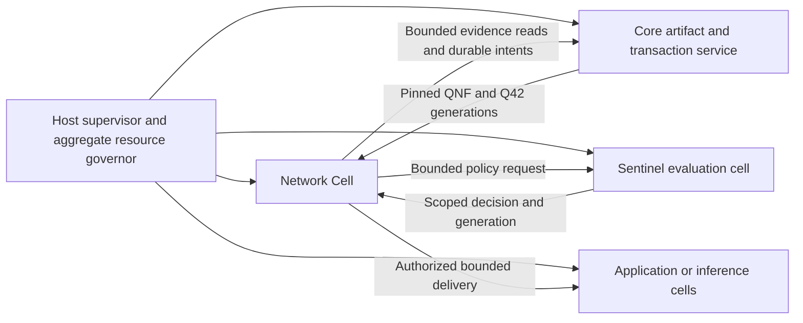

# QPR Network Cell and Memory Governance

**Status:** Proposed execution/deployment profile; not an implemented process sandbox

**Date:** 2026-09-06

## 1. Decision

Run networking in a dedicated **Network Cell** with its own supervisor, event loop, admission
ledger, memory pool and lifecycle. It runs QLink/QRoute/QSession and admitted services even when
inference or application work is busy. It consumes verified
[QNF evidence/views](../qnf-network-container-draft.md) and invokes the existing semantic core through
bounded interfaces. A cell is an ownership/execution boundary, not necessarily a physical CPU core.

For desktop/server deployments, prefer a separate process where the host can enforce isolation and
resource limits. An embedded single-process profile remains useful for constrained/WASM hosts and
tests, with honest reporting of its weaker fault/isolation boundary. Neither profile gives the
network cell automatic filesystem, administrative, payment or arbitrary qapp execution authority.

The user explicitly authorized reviewing the networking memory constraints. This design retains
the 42 MiB Sentinel evaluation-pass contract while replacing the earlier assumption that the whole
network service must share that same ceiling. A separately budgeted network cell may have a smaller
or larger configured ceiling; the host reserves it explicitly. No allocator exemption or unbounded
per-peer memory follows from creating another cell.

## 2. Responsibilities and boundaries

| Owner | Responsibility |
|---|---|
| Host supervisor/governor | Cell creation, authority grants, aggregate memory/work/energy/spend reservations, process supervision and revocation |
| Network Cell | Shared bearer I/O, protocol timers, transient ingress limits, crypto jobs, flow credit, service scheduling and lease completion |
| Sentinel/core evaluators | Supported semantic validation and policy compilation within admitted pass limits |
| Core artifact/transaction service | QNF/Q42 reads/publication, durable replay/effect/receipt state and crash recovery |
| Applications/inference cells | Their own admitted execution and UI; no bypass around network service authorization |

The network cell checks compact current handles in hot loops. Fresh ontology compilation or
expensive policy evaluation runs as admitted core work, with a reply capacity reserved first.
If the Sentinel is unavailable, new authority-dependent work waits within a deadline or fails.
Existing still-valid permits may continue within their explicit validity/resource scope. Revoke,
expiry and block rules are never relaxed to keep a connection alive.

## 3. Four different memory quantities

| Quantity | Meaning | Rule |
|---|---|---|
| Sentinel pass working set | All live data/scratch/stacks/referenced working pages needed by one admitted semantic pass | At most 42 × 1024 × 1024 bytes; include overhead, not only Quin slots |
| Network cell accounted working set | Tables, queues, crypto scratch, live/pinned evidence, send/receive commitments and shared ranges used by networking | Explicit cell ceiling selected by the host |
| Host aggregate | Unique owned/shared pages, all cells/workers, artifact cache, IPC and reserved platform overhead | Parent-governor cap; no multiplying capacity by creating child cells |
| Platform accounting | OS-reported commit/resident/kernel or cgroup charge, according to backend | Independently observed/enforced where available; do not equate it with logical arena bytes |

The existing [SlgArena](../../../../crates/qualia-core-db/src/governance/webizen/arena.rs) allocates a
full 917,504 × 48-byte Quin buffer, already 44,040,192 bytes, plus other state outside that buffer.
Its name/slot cap does not prove a 42 MiB complete-pass or process bound. A compliant integration
must reserve non-slot overhead and reduce admitted slot capacity, reuse caller storage, or partition
work. Merely starting a second full arena does not solve accounting.

### 3.1 Candidate network-cell profiles

| Profile | Accounted ceiling | Intended adaptation, not measured capacity |
|---|---:|---|
| Constrained | 8 MiB | Few adjacencies, small windows, low crypto concurrency; reject unsupported large profiles |
| Personal | 32 MiB | Local/private services with bounded cache and limited concurrent transfers |
| General | 64 MiB | Separate send/receive pools, larger verified-view cache and bounded PQ workers |
| Relay | 256 MiB | Explicitly provisioned queues/custody windows; persistent bytes still have a separate disk quota |

These are initial configurable test points, not universal defaults or guarantees of peer count.
The current 42 MiB single-runtime partition remains an optional embedded configuration. Increasing
resident networking capacity does not increase one Sentinel pass, alter protocol message limits,
allow one unbounded verification task, or bypass higher-level privacy/financial limits.

For a concrete planning example, a host can reserve 192 MiB as 64 MiB network ownership, 42 MiB
Sentinel ownership, 32 MiB artifact/IPC ownership, 22 MiB platform/supervision allowance and 32 MiB
headroom. Their sum is 192 MiB, not 42 MiB per service. Actual admission must also enforce each
pass/cell's referenced working-set ceiling. Referencing shared artifact pages may therefore reduce
the remaining private scratch available to that pass, even though the host physically counts the
shared pages once. The allowances must be fitted to measured platform overhead before a hard claim.

### 3.2 Reservations and ownership

The governor atomically reserves parent and child scopes before starting a cell/task or issuing
receive credit. Each allocation has one physical owner and possibly several charged borrowers.
Use unique allocation/lease IDs so host accounting counts physical pages once while each consumer
still obeys its local working-set cap. Never hide memory by relabelling it as cache, OS buffer or
another cell's property. Unknown/uncontrollable kernel costs require conservative allowance and
explicitly limited enforcement claims.

Queues, outstanding flow credit, pending crypto jobs, old/new QNF generations and IPC completions
remain charged until definitively released. Rebalancing cannot reclaim buffers still referenced
by a worker, DMA/OS I/O or recipient. If a process crashes, quarantine its shared leases until the
supervisor proves it can no longer access them; do not reuse memory based only on a timeout.

## 4. Bounded execution and compute budgets

Each event quantum has limits on input bytes, transitions, crypto operations, parser expansion,
output bytes and elapsed scheduling time. [Compute quantities](./compute-resource-accounting.md)
identify the exact evaluator/operation/device counting rule. Time-slicing alone cannot interrupt
every primitive safely; expensive jobs must have bounded input, workspace and implementation work
limits or run in a separately supervised worker that can be terminated without corrupting core state.

Use shared readiness-driven I/O and bounded queues. Do not dedicate a process/thread/arena to every
peer or packet. The default is one admission owner per cell, with leased bounded parallel workers.
The host charges their simultaneous memory and compute to the same parent budget. Affinity and
parallelism are optional scheduling choices, not evidence of isolation or constant-time execution.

Existing [worker cells](../../../../crates/qualia-core-db/src/platform/local_scheduler.rs) have
mailboxes/affinity and a `memory_boundary` field, but their work path still simulates execution and
that field is not an allocator limit. [Caller workspaces](../../../../crates/qualia-core-db/src/specialized_libs/computational_geometry/geometry_workspace.rs)
and budget patterns are useful; network ownership, aggregate reservation and enforcement need real
implementation. Do not present those existing class names as a completed network supervisor.

## 5. Cell IPC and authorization

Every request/completion binds the cell instance/epoch, operation ID, source/target scope, authority
and policy generation, deadline, reservation and lease range. Shared descriptors contain validated
offset/length/generation values, not cross-process pointers. Mutable receive buffers are untrusted;
validate a stable owned copy or enforce exclusive ownership while parsing to prevent data changes
between validation and use.

The supervisor grants only necessary bearer handles, bounded artifact operations and protocol keys.
Private long-term keys remain in a key provider; the cell receives purpose-scoped signing/KEM
operations or an explicitly isolated ephemeral key lease. Kernel validation and signing requests
also require quotas, so a compromised network process cannot turn the provider into an unlimited
signing oracle or spend service. A key reference is not authority to sign arbitrary bytes.

The core serializes durable commits with revocation ordering. A delayed IPC completion cannot
reintroduce authority after revocation or cancellation. Error/closure/revocation traffic has its
own bounded reserve and scheduling progress; it is still authenticated/rate-limited where possible.
Avoid control/data cyclic waits by reserving completion/cleanup capacity before admitting work.

## 6. Fault containment, restart and enforcement

Start a new cell with a fresh instance epoch and fresh online crypto state. Reconstruct durable
operation/receipt state and verified evidence from committed roots; revalidate current authority
before new delivery. QNF compiled views are caches, not portable permits. Never restore packet
numbers/keys from an untrusted artifact or replay settled/committed effects during restart.

Heartbeat loss is a supervisor signal, not proof that an operation failed or a buffer is unused.
First stop new admission, then drain or terminate within explicit host policy. Mark external effects
with uncertain outcomes for reconciliation using their original operation identity. A network-cell
failure should not discard core state or terminate independent local work merely by sharing a
global unbounded queue; fault-containment tests must demonstrate that behavior.

Native hosts should use supported OS controls in addition to the logical governor. Linux
[cgroup v2](https://www.kernel.org/doc/html/latest/admin-guide/cgroup-v2.html) exposes memory/CPU
controls; Windows [Job Object limits](https://learn.microsoft.com/en-us/windows/win32/api/winnt/ns-winnt-jobobject_extended_limit_information)
include process/job committed-memory limits. These accounting definitions differ: neither is a
portable synonym for the arena total or every mapped page. Record the chosen controls, failures,
shared-memory attribution and process-tree containment. Do not claim a backend enforces a limit
until tested on that host. Browser workers provide a different isolation/control surface and must
report it rather than claiming native process enforcement.

The network cell needs a CPU/work quota as well as memory limits so floods cannot starve the
Sentinel. Energy/thermal pressure reduces admitted optional work while preserving bounded control
progress. No cell raises its own limits or quietly claims another cell's unused allowance.

## 7. Admission decision for larger memory

Choose a larger cell only when an identified workload needs it: higher aggregate receive credit,
PQ evidence caching, sustained relay windows, concurrent immutable generations or custody service.
First measure metadata/queue overhead, backpressure and range-read behavior; more memory is not a
substitute for fixing amplification or unbounded retention. Specify the additional host memory,
compute and energy exposure, and keep the same access/authority constraints.

For the current repository, increased networking ceilings are a proposed separate execution profile,
not a change to `SlgArena` constants or existing ABI rules. P17 must encode and test that distinction.
Any later request to increase the Sentinel evaluator ceiling itself needs its own architecture and
ABI/target review; it is not implied by this network-cell decision.

## 8. Acceptance

P17 in [Implementation and Conformance](./implementation-conformance.md#qdnf-p17--network-cell-and-aggregate-memory)
must demonstrate independently running networking and policy/application work; parent-budget
conservation across cells; bounded queues/crypto under flood; shared lease cancellation/reclamation;
revocation during IPC/commit; fresh keys on restart; no duplicate durable effects; and actual platform
enforcement/overhead. Report 8/32/64/256 MiB configurations separately from 42 MiB Sentinel passes.
No existing affinity, mailbox or arena constant substitutes for those tests.
