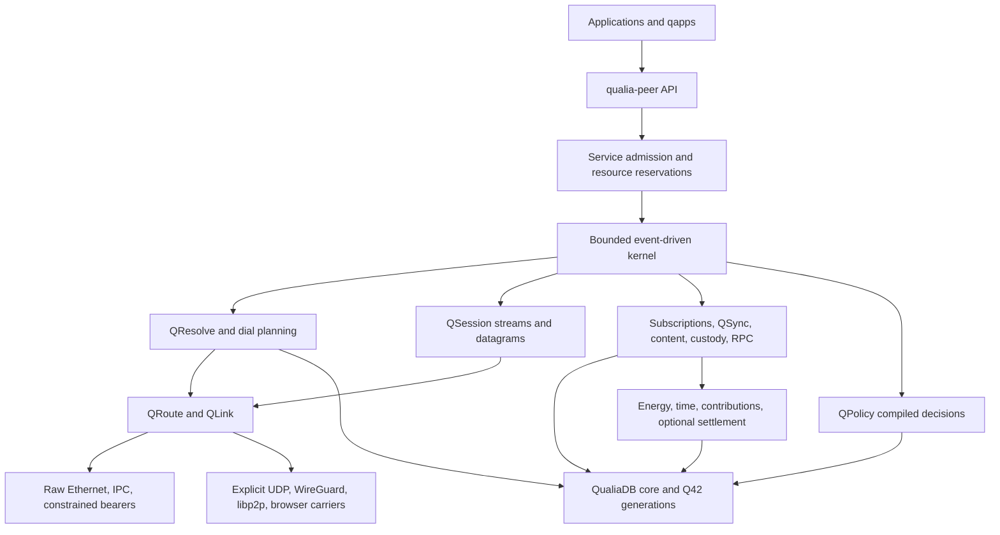

# Qualia Peer Runtime

**Short name:** QPR

**Status:** Proposed library architecture 0.1; not an implemented replacement

**Date:** 2026-09-06

**Scope:** A new independent replacement for libp2p built on QualiaDB and the QDNF protocols

## 1. Design decision

Build **Qualia Peer Runtime (QPR)** as the application-facing peer library for QDNF. A program opens
a governed service against a persistent resource, supplies memory and resource limits, and receives
typed events. The runtime resolves reachable providers, verifies authority, establishes sessions,
and exchanges authorized messages or graph changes. Applications can still use ordinary opaque
bytes; they do not have to represent every payload as RDF.

QDNF specifies the network: QLink, QRoute, QResolve, QPolicy, QSession, and QSync. QPR specifies the
software that composes them: node lifecycle, service registration, scheduling, buffer ownership,
storage integration, and application APIs. QPR introduces no second framing protocol or replacement
database. Its working crate name is `qualia-peer`; the name and module paths are proposals.

The intended implementation replaces libp2p's peer runtime, connection orchestration, discovery,
routing, multiplexing and dissemination in Qualia applications. Core operation, initial releases
and acceptance tests MUST work without libp2p. A separately packaged migration adapter is optional;
implementing that adapter does not satisfy the replacement objective.

The architectural advantage to pursue is **one verified semantic model from discovery through
delivery and accounting**. A service advertisement, permission decision, replication checkpoint,
and contribution receipt can reference the same pinned contract and Q42 evidence. Compact Quin
indexes and bounded execution make this usable on constrained peers. They do not establish a
performance advantage until measured.

The replacement target includes [post-quantum protection](./post-quantum-security.md) using the
repository's ML-KEM, ML-DSA and supporting crypto libraries. Hybrid key establishment and
post-quantum controller/record authentication are part of the target default profile. The older
classical QDNF suite remains a distinct compatibility profile, with no automatic downgrade.

### 1.1 Distinctive mechanisms to implement

| Mechanism | Concrete departure in this design | Evidence to produce |
|---|---|---|
| Semantic admission plan | Compile a pinned service/ontology/contract and current authority into one generation-bound plan used by discovery, delivery, replication and accounting | Same request obeys the same scope across reconnect, replicas and carrier changes |
| Q42 evidence and execution views | Exact signed objects and compact Quin projections share core persistence; active networking uses leased immutable views | Byte-exact recovery, bounded working set, immediate invalidation of stale authority |
| Governed differential synchronization | Transmit authorized changes and proofs of scoped checkpoints, with explicit gaps, dependencies and deletion frontiers | Recover a disconnected projection without leaking hidden graph state or replaying effects |
| Resource and contact scheduling | Jointly reserve memory, bytes, time, estimated/measured energy and optional agreed spend; batch permitted work across contact windows | Conserved reservations and measured useful work/energy under churn and thermal pressure |
| Cryptographic evidence reuse | Cache verified dual-signature evidence by full digest and current authority generation, keeping large PQ proofs outside packet forwarding | Fewer repeated verifications without accepting revoked, substituted or differently scoped evidence |

These are proposed innovations in composition and implementation. A claim of research or patent
novelty would require a separate prior-art assessment. Their value must be demonstrated in the new
runtime; renaming libp2p interfaces or wrapping its swarm is insufficient.

## 2. Relationship to libp2p

Libp2p is a modular framework with multiple transports, secure channels, multiplexing, discovery,
routing, and application protocols. It is extensible enough to host Qualia-specific protocols;
native below-IP operation and the integrated runtime contract are the reasons for a separate QPR
implementation. [Libp2p specification index](https://github.com/libp2p/specs)

| Concern | Libp2p baseline | QPR design choice |
|---|---|---|
| Application abstraction | Peers, connections, streams, and negotiated protocols | Governed resource/service handles, with raw streams and datagrams beneath typed services |
| Identity and location | Peer IDs derived from public keys; transport addresses identify dial routes | Persistent DID/resource identity, contextual personas, verified controller authority, expiring DNI/RAR reachability, and local observed paths |
| Transports | Pluggable transports including QUIC, WebRTC, and WebTransport | QDNF-native raw bearers plus explicitly selected transition carriers; the same authorization boundary on each |
| Resource control | Go libp2p provides hierarchical scopes for transient work, peers, services, connections, and streams | Caller-owned arenas, bounded steps, aggregate reservations, and scoped energy/time observations tied to accepted agreements |
| Dissemination | Gossipsub includes peer scoring, mesh maintenance, and validation mechanisms | Authorized graph subscriptions and typed events, with bounded dissemination and QSync recovery of missed state |
| Durable application state | Application-selected storage and synchronization | Existing QualiaDB/Q42 exact objects, semantic projections, policy generations, and durable operation receipts |

The identity row follows the [Peer ID specification](https://github.com/libp2p/specs/blob/master/peer-ids/peer-ids.md).
Transport coverage follows the specification index. Resource scope comparisons refer specifically
to [Go libp2p's resource manager](https://github.com/libp2p/go-libp2p/tree/master/p2p/host/resource-manager),
not a promise about every implementation. The gossip comparison uses
[Gossipsub's defensive extensions](https://github.com/libp2p/specs/blob/master/pubsub/gossipsub/gossipsub-v1.1.md).
These are capabilities to retain or learn from, not claims that libp2p lacks authorization hooks,
bounded configurations, or application-defined persistence.

QPR is an API and architecture alternative, not wire-compatible with libp2p by default. A transition
adapter can carry QDNF over a negotiated libp2p stream. Translating a foreign application protocol
requires an explicit service gateway, its own permissions, and documented loss of semantics.

## 3. Architecture

The kernel consumes events and emits effects. It does not own a Tokio runtime, create a thread per
peer, load an ontology while forwarding, or perform an HTTP request inside an evaluator. Native,
browser, and test hosts supply I/O, monotonic time, cryptographic randomness, key operations, and
bounded cold work. Each completion returns through the same admission boundary.

Policy compilation and Q42 publication produce immutable generations. Fast paths use verified
handles, fixed tables, and caller-owned slices. Q42 bodies are range-read or mapped where supported;
compressed/encrypted/network data still require bounded decoding or encryption buffers. The
[runtime model and API](./peer-runtime-api.md) defines ownership and accounting in detail.

## 4. Identity and peer state

QPR distinguishes four things:

| Reference | Meaning | Security rule |
|---|---|---|
| Principal/resource | Intended DID, governed graph, service, or immutable artifact | Preserve full identifier and strong digest; verify the applicable controller/manifest authority |
| Persona | A principal's key/identifier in one relationship or context | Bind authorized scope and rotation; no universal public person-to-device map |
| Reachability record | Expiring RAR, DNI, provider grant, or relay offer | Validate issuer, audience, sequence, expiry, withdrawal, and exact record bytes |
| Live path | Locally observed bearer/session route | Challenge the current endpoint; an observation does not update signed authority |

The peer store is a scoped view over core records, not another heap map of authoritative strings.
It separates unverified candidates, verified evidence, observations, failures, and revocations.
Rebuilding indexes never renews expired authority. Local `q_hash` keys can accelerate a lookup but
cannot select a service or equate principals without full-reference verification.

Block and revocation changes invalidate affected handles before new application delivery. A
long-lived stream rechecks the current authorization generation at each bounded delivery/commit
boundary. Offline authority is explicitly time-limited; a disconnected peer cannot claim to know a
revocation it has not received. Uncertain expiry clocks yield a non-allow decision where required.

## 5. Dial planning and reachability

An application's connect request names a resource, purpose, context, service, deadline, and budget.
QResolve produces up to eight verified candidates from at most 64 raw candidates and 16 expensive
verifications, as specified in [Identifier and Resolution](./identifier-resolution.md). The planner
first filters authorization, privacy, bearer availability, expiry, and resource constraints; only
then does it rank latency, availability, and measured/estimated resource cost.

At most three candidates race under one reservation. Losing attempts release leases and cannot
dispatch an application operation. Deduplication uses the intended resource and authority scope;
simultaneous connections for unrelated personas are never silently coalesced. The winning transport
still has to prove the intended target in QSession. Relays and introducers cannot substitute it.

| Environment | Connection path | Failure behavior |
|---|---|---|
| Same raw bearer | QLink discovery/manual invitation, QRoute, QSession | Report no authorized route; no DNS fallback |
| Routed QDNF realms | Signed realm routes and a verified target RAR | Bounded route alternatives; no trust inherited from transit |
| UDP/IP transition | Explicit locator candidates; authenticated observation and rendezvous-assisted probing | Limited attempts, then an authorized relay or explicit unreachable outcome |
| Existing libp2p deployment | Negotiated opaque QDNF carrier stream | Existing libp2p reachability machinery may be used within this adapter |
| Browser | Advertised WebRTC/WebTransport or other implemented browser carrier | Report dependencies on signaling, IP, browser trust, and gateways; never claim raw-bearer independence |
| Disconnected destination | Optional authorized custody service | Accepted storage means custody, not destination delivery |

For a dedicated UDP transition adapter, rendezvous probes MUST bind a session challenge, expire
quickly, target consented candidates, and enforce global/per-candidate byte and time limits. They
must not become an arbitrary-address scanning or reflection service. NAT traversal is best effort;
firewalls, endpoint-dependent mappings, or unavailable rendezvous peers can require relaying.
Libp2p's [hole-punching design](https://libp2p.io/docs/hole-punching/) and
[Circuit Relay v2 reservations](https://github.com/libp2p/specs/blob/master/relay/circuit-v2.md)
are relevant prior art. QPR's new direct-probe wire profile remains a separate freeze gate; until it
exists, transition implementations use an implemented adapter or report unsupported reachability.

Keepalives, relay renewals, and discovery consume reservations and are disabled when unnecessary.
A radio need not remain awake just because a graph subscription exists. A peer may advertise an
imprecise, consented availability window; this is a hint, never a guarantee or required location.

## 6. Services as governed interfaces

A service descriptor binds the full service IRI/version, message schemas, supported reliability,
resource limits, capability operations, sensitivity, and optional semantic contract bundle. The
descriptor is signed evidence with bounded expiry; service selection binds its digest in the
authenticated channel. Unknown critical features fail before the channel opens.

The SDK offers six related interfaces:

1. Open a stream or send an expiring datagram to a governed service.
2. Call a typed, capability-bound RPC with a deadline and cancellation handle.
3. Subscribe to a bounded, authorized graph projection or event feed.
4. Synchronize signed operations or fetch Q42 content blocks against a verified manifest.
5. Deposit encrypted messages with an authorized custodian and collect distinct receipts.
6. Accept a resource/contribution agreement and optionally settle accepted obligations.

Service admission is separate from message validity. An authorized publisher can still send a
malformed object; a validly signed object can still be unauthorized. Deontic policy handles duties
and permissions; SHACL validates the selected structural profile; epistemic/conflict state records
uncertainty. None makes an asserted fact true or arbitrary remote code safe.

See [Semantic Peer Services](./semantic-peer-services.md) for subscription, replication, custody,
and compute semantics. Private delivery initially uses pairwise sessions. Group encryption is an
optional, independently specified profile; a realm group key is not an application group key.

## 7. Commons and resource-aware operation

Every work scope can carry joules and seconds with explicit measurement scope and confidence:
measured, estimated, or unknown. Memory, bytes, CPU counters, and storage limits remain additional
dimensions. CPU cycles are not silently treated as joules; elapsed time, CPU time, airtime, and
human contribution time are distinct quantities.

The scheduler can defer a background Q42 transfer until a permitted low-cost contact window,
prefer a nearby authorized replica, coalesce requests, or stop admitting work under thermal pressure.
It records the reason and preserves agreed deadlines and essential control capacity. Unknown energy
does not mean free work and need not prevent an authorized gift or byte/time-bounded service.
Hard energy guarantees require a conservative enforceable measurement/model; software estimates
alone cannot promise an exact physical ceiling.

Ontologically defined contracts use the pinned CBOR-LD profile in
[Ontological Contracts](./ontological-contracts.md). Commons-funded, gifted, reciprocal, and paid
work use the same [accounting lifecycle](./commons-and-resource-economics.md). Payment is optional,
aggregated above the packet path, and cannot buy broader consent. Optimizing energy/time is not a
claim that those dimensions determine human worth or a universal exchange rate.

For example, a community sensor publishes to an authorized environmental graph; a sleeping phone
later obtains the missed signed operations from a custodian. Q42 stores verified source objects
and compact indexes. A community fund can cover relay/storage work, accounted separately in joules,
device seconds, and accepted monetary units. The sensor need not own a wallet or join a blockchain.

## 8. Implementation boundaries

| Proposed library location | Owns | Depends on |
|---|---|---|
| `qualia-core-db/src/net/qdnf/` | QDNF wire/state machines already planned in P0–P9 | Canonical core types, crypto, policy, Q42 adapters |
| `qualia-core-db/src/net/peer/` | Runtime kernel, leases, scheduler, service registry, dial planner, graph subscriptions, custody orchestration | QDNF plus verified core primitives |
| `qualia-peer` crate | Small public facade, native/UDP hosts, examples and conformance entry points | Feature-limited core; core MUST NOT depend back on the facade |
| Optional migration package | Foreign libp2p carrier and explicit application protocol gateways | Public peer interfaces plus foreign stack; not a dependency of the replacement runtime |
| Existing Q42/storage owners | Exact artifact storage, generation publication, bounded durable commits/recovery | Core storage infrastructure, extended where evidence is missing |
| Client/qapp libraries | User consent, presentation, application schemas and merge behavior | Public peer facade; no bypass into raw transport authority |

Within `net/peer/`, separate `runtime/`, `resources/`, `dial/`, `services/`, `subscriptions/`,
`replication/`, `custody/`, `host/`, and `receipts/` directories as needed. Each has a routing
`mod.rs`; cold builders, hot steps, platform I/O, and tests have different owners/files. Do not put
this runtime into the existing `p2p/swarm.rs` behaviour wrapper or a new monolithic `peer.rs`.

The minimal build selects core Q42/crypto/policy facilities, native IPC, and QDNF services. The
facade does not automatically make the current large core crate lightweight: dependency extraction
and feature isolation are explicit deliverables. A native-only build must exclude libp2p, DNS/IP
adapters, GPU/LLM runtimes, and settlement backends from its dependency closure. Browser and
constrained profiles publish actual supported capabilities, not empty stubs that return success.

## 9. Migration and engineering tradeoffs

Start with the first native slice in [Implementation and Conformance](./implementation-conformance.md),
exposed through the same QPR API used by transition carriers. Existing applications migrate through
adapters around chat, share, and signed-op sync; they need not rewrite all application state.

An optional libp2p migration carrier keeps the outer secure transport and carries the inner QDNF session when that
preserves end-to-end target proof across relays. This costs extra framing/encryption and, over a
reliable stream, head-of-line blocking. Initially allow reliable service traffic only on that
carrier, disable QSession loss recovery for packets reliably delivered by it under a negotiated
carrier profile, and let the outer transport own congestion control. Application ACK, authorization,
flow bounds, replay checks, and service receipts still apply. Precise carrier mapping needs vectors;
do not tunnel unreliable traffic and silently promise native datagram behavior.

Initially the reliable carrier must join the actual QSession endpoints, with one logical ordered
stream and no cross-mode migration/multipath. Changing to native packet recovery requires a new
authenticated session and application resume; a reliable relay hop alone cannot disable end-to-end
loss recovery.

Run shadow validation without applying mutations, then move a service's writes to one authority
path at a time. Cross-carrier operation IDs and durable inbox state prevent duplicate application
effects. Ambiguous payment submission must reconcile through its original adapter. Rollback of
software preserves these records and cannot restore revoked keys or replay settled obligations.

QPR takes on substantial protocol work: congestion/recovery, mobile connectivity, key rotation,
storage crash semantics, private dissemination, and independent interoperability. Tight memory
bounds limit concurrency; pinned semantics complicate upgrades; scoped discovery can reduce public
reachability. Existing libp2p applications also have ecosystem/tooling advantages. No speed, energy,
anonymity, scale, or security superiority is claimed from this design alone.

## 10. Completion criteria

The implementation roadmap extends P0–P9 with QPR work packages in
[Implementation and Conformance](./implementation-conformance.md#12-qualia-peer-runtime-programme).
The first reviewable product is two applications using the facade for authenticated discovery,
one reliable service, one datagram service, and a denied operation over native IPC/raw Ethernet,
with bounded memory and no IP dependency. Semantic subscriptions, reconnect recovery, and optional
custody then demonstrate the advantages of sharing the QualiaDB core.

Freeze schemas, wire vectors, rejection behavior, and carrier mappings before interop claims.
Measure the same application workload on QPR and the repository's libp2p version with equivalent
security, persistence, payload, topology, and limits. Report latency distributions, verified useful
bytes, resident/arena memory, CPU work, attributable energy, and failure recovery separately.
