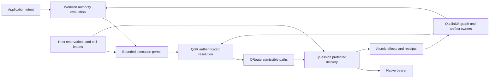

# QDNF/QPR 0.0.37 — implementation review and advancement plan

**Review date:** 2026-09-09

**Baseline:** branch `0.0.37`, commit `17b6b467c8a4548e302f603674dd594a67be7398`

**Status:** Review complete; enhancement work proposed and unchecked. This document does not certify the current stack.

**Scope:** A native Qualia network stack, replacing libp2p through QPR, with semantic authority, bounded parallel execution, private communications and sustainable service provision.

## 1. Decision and intended outcome

Continue the native QDNF/QPR implementation. Its useful primitives, bounded tables and library decomposition provide a foundation, but the reviewed application path is still an IPC demonstration with disconnected security, policy and persistence components. The next release must first make those components enforce one complete protocol.

The defining advancement should be **a network in which an application's authorised intent becomes a bounded execution plan over authenticated graph state**. QualiaDB supplies persistent facts and indexes; Webizen evaluates authority; QSR resolves admissible destinations; QRoute selects feasible paths; QSession protects delivery; QSync and the transaction owner bind effects to recoverable receipts. Semantics should improve destination selection, data minimisation, caching and resource use without exposing private relationships to routers.

The programme has three deliverables:

1. A secure, durable native vertical slice on an actual bearer, with measurable resource enforcement.
2. A scalable semantic network: authenticated QSR, constrained multipath, selective graph synchronisation and parallel service cells.
3. A qualified application platform: confidential known-peer care, finite commons compensation, funded provider roles and selective evidence preservation.

“State of the art” is an acceptance ambition, not an existing result. Novel mechanisms must beat matched alternatives on declared workloads, or remain experimental. No universal superiority over Kademlia, QUIC or existing databases is claimed.

Read alongside the [original programme](README.md), [QSR design](../qualia-scoped-rendezvous.md), [QSR evaluation](../qsr-evaluation.md), [clinical and protection requirements](../socially-defined-protection.md), [finite compensation](../finite-project-compensation.md) and [evidence design](../electronic-evidence-and-retention.md). Existing requirements remain binding. This plan adds an implementation-based priority order; it does not mark the original 30 packages complete.

The [advanced algorithm recipes](advanced-algorithm-recipes.md) specify bounded QSR traversal, handover, multipath, durable compensation and evidence algorithms as small implementation assignments. The [sensitive-operations blueprint](sensitive-operations-blueprint.md) supplies exact label/profile contracts, clinical/biometric workflows and 40 adversarial acceptance scenarios. Both are part of the implementation plan.

## 2. What the implementation review establishes

These are source-level findings at the baseline commit. Severity describes priority before deployment, not demonstrated remote exploitability. Several files correctly label themselves partial.

| ID | Finding and concrete consequence | Source evidence | Owner |
|---|---|---|---|
| R01 — critical | The facade directly constructs an Active session with `PolicyOutcome::Allow`, a zero DNI and its own identity as target. Applications can obtain apparent admission without verified remote identity or current policy execution. | [host/mod.rs](../../../../../crates/qualia-core-db/src/net/peer/host/mod.rs), lines 149–166 | E01, E02, E04 |
| R02 — critical | Facade stream send/receive frames and copies payload bytes without the network AEAD/replay layer. The vertical demo also derives keys and then discards them. | [host/mod.rs](../../../../../crates/qualia-core-db/src/net/peer/host/mod.rs), lines 169–201; [vertical.rs](../../../../../crates/qualia-core-db/src/net/qdnf/vertical.rs), lines 72–118 | E02, E04 |
| R03 — critical | `finished_mac` hashes public transcript material and role without a secret. The key derivation stores the transcript digest but does not feed it to its KDF calls. This is not secret-key confirmation or a transcript-bound key schedule. | [crypto/handshake.rs](../../../../../crates/qualia-core-db/src/net/qdnf/crypto/handshake.rs), lines 54–68 and 99–105 | E02 |
| R04 — high | Rekey slots track generation numbers; rotation does not derive/install/erase traffic secrets. Path activation accepts a reused slot ID without its generation. | [rekey.rs](../../../../../crates/qualia-core-db/src/net/qdnf/session/rekey.rs), lines 27–61; [paths.rs](../../../../../crates/qualia-core-db/src/net/qdnf/session/paths.rs), lines 48–79 | E02, E09 |
| R05 — high | Raw Ethernet open/send/receive return PlatformUnsupported unconditionally. Working IPC uses shared process memory; it is useful transport scaffolding, not a demonstrated physical network. | [raw_ethernet.rs](../../../../../crates/qualia-core-db/src/net/qdnf/bearer/raw_ethernet.rs), lines 19–44; [ipc.rs](../../../../../crates/qualia-core-db/src/net/qdnf/bearer/ipc.rs) | E05 |
| R06 — high | “Exact” QSR computes `key.0[0] % 96` against byte intervals. The intended radix has 16 digit values and up to 96 four-bit positions in a 384-bit key. Current lookup has no full-key or authenticated snapshot proof. | [qsr.rs](../../../../../crates/qualia-core-db/src/net/qdnf/resolve/qsr.rs), lines 6–46 | E07 |
| R07 — high | Route selection has no requested target input and counts candidates before checking only expiry. SPF is capped at 16 nodes and emits one next hop. An origin advertisement is not proof of reachability. | [records.rs](../../../../../crates/qualia-core-db/src/net/qdnf/resolve/records.rs), line 34; [spf.rs](../../../../../crates/qualia-core-db/src/net/qdnf/route/spf.rs), lines 6, 72, 113; [flood.rs](../../../../../crates/qualia-core-db/src/net/qdnf/route/flood.rs), line 68 | E07, E08 |
| R08 — high | Replication scan generates bytes from offsets; block verification has no payload input and sets a boolean. These paths do not establish transfer of authentic Q42 data. | [scan.rs](../../../../../crates/qualia-core-db/src/net/peer/replication/scan.rs), line 279; [transfer.rs](../../../../../crates/qualia-core-db/src/net/peer/replication/transfer.rs), line 142 | E06, E11 |
| R09 — high | Replication receipt progression uses in-memory state and caller-supplied stages; crash snapshots model recovery without demonstrating an atomic durable commit. Checkpoint membership rebuilds the complete small set. | [receipts.rs](../../../../../crates/qualia-core-db/src/net/peer/replication/receipts.rs), lines 113–141; [crash.rs](../../../../../crates/qualia-core-db/src/net/peer/replication/crash.rs), line 3; [proof.rs](../../../../../crates/qualia-core-db/src/net/peer/replication/proof.rs), line 85 | E06, E11 |
| R10 — high | PeerHost validates a byte value but exchange ignores it. Each NativePeer constructs its own nominal host ledger; this does not enforce an aggregate process budget. CellTable has four flags and leases, not worker/arena ownership. | [qualia-peer/lib.rs](../../../../../crates/qualia-peer/src/lib.rs), lines 23–39; [host/mod.rs](../../../../../crates/qualia-core-db/src/net/peer/host/mod.rs), lines 37–56; [cells/admit.rs](../../../../../crates/qualia-core-db/src/net/peer/cells/admit.rs), lines 21–44 | E03, E04, E10 |
| R11 — high | Reservations can be released by arbitrary resource amounts using saturating subtraction. Public Copy cell tokens expose the byte amount used on release. Counter bookkeeping needs authoritative ownership records to prevent false reclamation. | [ledger.rs](../../../../../crates/qualia-core-db/src/net/peer/runtime/ledger.rs), line 126; [cells/admit.rs](../../../../../crates/qualia-core-db/src/net/peer/cells/admit.rs), lines 34–40 and 123–138 | E03 |
| R12 — high | ArenaAdmit explicitly does not construct or reset SlgArena. SlgArena still allocates its 42 MiB table and growable rule vectors separately. Exact table size leaves no room for other pass state under a total 42 MiB ceiling. | [arena_admit.rs](../../../../../crates/qualia-core-db/src/governance/webizen/arena_admit.rs), lines 1–13 and 88–96; [arena.rs](../../../../../crates/qualia-core-db/src/governance/webizen/arena.rs), lines 138–213 | E03, E06 |
| R13 — high | The QDNF harness allocation counter records explicit calls; it does not intercept allocation. It cannot prove zero heap activity in dependencies or error paths. A real allocator hook already exists elsewhere in core. | [harness/allocation.rs](../../../../../crates/qualia-core-db/src/net/qdnf/harness/allocation.rs), lines 8–27; [allocation_counter.rs](../../../../../crates/qualia-core-db/src/specialized_libs/computational_geometry/allocation_counter.rs), lines 96–123 and 239–259 | E00, E03 |
| R14 — integration | Native qualia-peer opts out of core defaults and enables qdnf. Default core still enables libp2p-compat; the new facade therefore does not establish migration of default applications/daemons. | [qualia-peer/Cargo.toml](../../../../../crates/qualia-peer/Cargo.toml); [core Cargo.toml](../../../../../crates/qualia-core-db/Cargo.toml), lines 11 and 81–85 | E20 |
| R15 — high | Contract compilation accepts signed/supported booleans and checks shape/rule digests without verifying original bytes, contexts, ontology or signing authority. | [compile.rs](../../../../../crates/qualia-core-db/src/net/qdnf/contracts/compile.rs), lines 33–55 | E01, E12 |
| R16 — high | Clinical route exchange rejects Blocked but accepts other inactive contact states; standing permits check time/purpose without live contact/revocation. A nonempty byte slice can be called ciphertext. | [clinical.rs](../../../../../crates/qualia-core-db/src/net/qdnf/session/clinical.rs), lines 79, 155 and 257 | E02, E14 |
| R17 — high | RemainingTarget is copied numeric state without a shared obligation owner. Separately, the core commons gate returns true on fulfilment before checking bilateral protection. Payment completion can therefore bypass that gate's privacy condition. | [economics/mod.rs](../../../../../crates/qualia-core-db/src/net/qdnf/economics/mod.rs), line 44; [core lib.rs](../../../../../crates/qualia-core-db/src/lib.rs), lines 1305–1326 | E17 |
| R18 — high | Clinical mailbox delivery advances digest/length metadata without retrieving ciphertext or obtaining recipient acknowledgement. Evidence-intent markers are not a complete durable custody implementation. | [clinical.rs](../../../../../crates/qualia-core-db/src/net/qdnf/session/clinical.rs), lines 306–339; [wal_intent.rs](../../../../../crates/qualia-core-db/src/wal_intent.rs), lines 112 and 189 | E11, E19 |
| R19 — integration | Fabric-specific join guards are not connected to the general identity/reasoning boundary. OWL inverse-functional sameAs derivation needs typed/scoped handling before authority consumes it; an actual person merge was not demonstrated. | [fabric/join.rs](../../../../../crates/qualia-core-db/src/net/qdnf/fabric/join.rs), line 40; [OWL materialize.rs](../../../../../crates/qualia-core-db/src/modalities/logic/owl/materialize.rs), line 324 | E12 |

Preserve the real work: primitive crypto adapters, frame codecs, bounded packet/stream bookkeeping, fair scheduler, generation-aware lease checks, caller-buffered Q42 range access, operation hashing and privacy-oriented policy structures. Their unit tests are valuable component evidence. They become protocol guarantees only when the application path invokes them with authenticated inputs and actual I/O.

### Review validation and limits

- Confirmed branch/commit and source call paths; reviewed independent security, resolution/storage and semantic/service audits.
- The original task register contains **30 pending packages**. The dated progress log reports **471 native-filter tests and two facade tests** after an earlier merge; those are historical reports, not fresh passes at this review.
- Attempted `cargo +stable test -p qualia-peer --lib --offline`: failed while compiling dependency build scripts because `link.exe` was unavailable. No tests executed successfully in that attempt. No compiler installation or toolchain substitution was made.
- No live Ethernet, adversarial network, clinical deployment, throughput, energy or enterprise-scale result was measured here.
- New task completion must be backed by source fingerprints and executed evidence. A true-returning policy function, a synthetic page or an in-memory crash model cannot substitute for the boundary under qualification.

## 3. Architectural commitments

### 3.1 One enforceable application path

The public facade must expose handles produced by verified transitions, with private fields and no unchecked Active/Allow constructors. Wire structs remain untrusted parsed inputs. A verified token carries its issuer, scope, generation and lifetime; a field named “verified” is never its own proof.

Transport authentication and application authorization remain separate. Pairwise invitations can bootstrap a known peer directly without global discovery; QSR is used when needed. A public connection cannot obtain content simply because its link handshake succeeded.

Use a deterministic, bounded state-machine kernel with caller-supplied clock, entropy, storage completion and bearer events. Platform drivers perform I/O; the kernel consumes events and emits bounded actions. This permits reproducible simulation and platform reuse without implementing a second scheduler or a hidden network database.

### 3.2 Semantic execution permits

Introduce a local **execution permit** compiled from pinned ontology/CBOR-LD/SHACL/N3 inputs and current verified claims. It binds operation ID, principal and acting capacity, recipient/service, purpose, allowed projection, policy/source/identity generations, expiry, freshness requirements, resource ceilings and any accepted quote digest.

The permit is a capability for the local runtime, not an identity claim and not a new cryptographic primitive. Exported authority requires the established signed/delegated instrument format. Router-visible labels disclose only the authorised forwarding class and necessary routing information; medical categories, child/PEP classifications and employment relations stay private.

Cache decisions by the full security context and immutable input generations. A change in consent, delegation, clinician key or contract invalidates dependent decisions before new effects. Cache miss, conflicting evidence and incomplete reasoning are explicit outcomes. Learned scores and semantic similarity may rank already-authorised candidates; they cannot grant access.

### 3.3 Shared core, exact bytes and memory

Keep the 48-byte NQuin ABI. Do not reinterpret a 60-bit object token as the entire record capacity or assume a new 42-data/6-parity byte layout: the current six-u64 representation and parity implementations must be reconciled through the owning ABI specification.

Q42 stores semantic projections. Original signed bytes, ciphertext, full cryptographic digests and large proofs use the existing artifact/volume owners and bounded references. XOR parity is corruption bookkeeping, not authentication. A new QNF envelope is selected only if measured framing, range access or recovery requirements justify it; it must not duplicate storage, transactions or garbage collection.

The **42 MiB pass ceiling includes every charged buffer and scratch allocation used by that pass**. The existing 42 MiB slot backing is not proof of that ceiling. Calculate usable slots after reserving rules, bindings, indexes, stacks and scratch, or stream work across admitted passes. Explicitly document any capacity change without silently relaxing the total ceiling.

Each ordinary cell remains at most 512 MiB. The host admits the aggregate of cells, shared state, kernel queues, pinned memory, crypto scratch and temporary handover copies. Large graphs and ontologies remain on persistent storage and are processed through bounded windows. The 512-entry recent-slot ring is lossy cache metadata; it is never the evidence, replay or financial ledger.

### 3.4 Where the innovation belongs

| Mechanism | Purpose-designed advancement | Proof required |
|---|---|---|
| Semantic execution permits | Compile application purpose and graph authority once, then enforce a small bounded fast path | Equivalent decisions to the reference evaluator; invalidation before effects; no cross-context reuse |
| Authenticated QSR | Scoped full-key radix covers plus semantic posting intersections and explicit snapshot completeness | Correctness against an independent closed-world oracle; honest incomplete results; matched Kademlia comparison |
| Constraint-first multipath | Filter by authority, reachability, privacy, deadline and quote; then choose a bounded Pareto set using latency, loss, joules and typed work | No policy tradeoff hidden in a weighted score; loop/failover tests; benefit over single-path baselines |
| Content-aware synchronisation | Transfer authorised graph changes and verified artifacts rather than complete replicas | Real disk bytes; private membership handling; lower total cost including proofs and maintenance |
| Parallel provider cells | Single-owner queues, partitioned graph/index work and host-wide admission | Scale with measured cores/NIC queues while preserving memory caps, fairness and reclamation |
| Finite commons recovery | Accepted resource contributions recover through a shared capped obligation with humanitarian exemptions | Atomic cap conservation, idempotent settlement, terminal fulfilment and independently examinable receipts |

These are engineering hypotheses and integrated behaviours. They are not claims of patent novelty, proven asymptotic advantage or automatic legal enforceability.

## 4. Library ownership and agent swarm rules

Keep `qualia-peer` as the application facade and the QualiaDB core as the graph/storage owner. Extract an independent crate only when dependency direction, portability or build isolation requires it; do not create competing databases, runtimes or identity authorities.

| Library boundary | Focused files/directories to use or introduce | Responsibility excluded |
|---|---|---|
| `net/peer/host/` | `builder.rs`, `driver.rs`, `admission.rs`, `session_handle.rs`, `events.rs` | Crypto algorithms, synthetic demo data |
| `crypto/network/` and `qdnf/crypto/` | Existing primitive adapters; `schedule.rs`, `finished.rs`, `proofs.rs`, `secret_owner.rs` | Consent decisions and routing |
| `qdnf/session/` | `packet_protection/`, `recovery/`, `streams/`, `datagrams/`, `paths/` | Disk commits and payment settlement |
| `qdnf/bearer/` | `ipc/`, `ethernet/`, `xdp/`; each has receive, transmit, lifecycle, platform tests | Identity inference from locators |
| `net/peer/runtime/`, `cells/` | Reservation owners, buffer slices, scheduler queues, worker handover | Per-peer replacement “host” ledgers |
| `qdnf/resolve/` | `qsr/` with keys, cover codec, proof, traversal, postings, snapshots, handover | Full graph replication or policy authoring |
| `qdnf/route/` | Topology validation, adjacency index, incremental SPF, constraints, multipath, convergence tests | Public medical/social classifications |
| `qdnf/contracts/`, `fabric/` | Decode, semantic closure, verified claims, compile, invalidation, permit | Arbitrary network fetch during policy execution |
| `net/peer/replication/` | Source adapter, block verification, delta planner, commit adapter, resume | Parallel WAL or synthetic product source |
| `qdnf/session/clinical/` | Pairing, care permits, mailbox adapter, recipient boundary, revocation tests | Implicit guardian/team/AI permissions |
| `qdnf/economics/` | Units, quote, obligation, holds, settlement adapter, receipts, provider roles | Mandatory currency or personal debt |
| Core evidence owner with network adapters | Capture policy, preservation, custody, disclosure, verification | Permanent packet capture by default |
| Dedicated qualification harness | Scenario definitions, fault injection, reference oracles, measurements | Shipping fixture grants as production authority |

Convert an existing `name.rs` into `name/mod.rs` with focused children when needed; preserve its public module path. `mod.rs` routes and re-exports. Implementation files should stay below 500 lines; split sooner for mixed responsibilities. The current clinical and multihop harness files are already 500 lines. This prose plan is deliberately cohesive and exempt from implementation line limits.

Every claimable task below follows these rules:

- One named implementer and a distinct reviewer; explicit disjoint write paths, predecessor versions, invariants, tests and artifact budget.
- Shared facade signatures, registries, Cargo features, core ABI and storage transactions have a single integration owner. Contributors propose interface changes through a reviewed contract before parallel dependent edits.
- Split each package into child assignments of approximately one reviewable session; the package remains open until integration tests pass. Avoid assigning an entire layer to one agent as an undifferentiated task.
- States: unclaimed → claimed → implementing → review → integrated → qualified. “Code merged” is not “qualified.” Failed or inapplicable platform checks are explicit.
- Handoff includes exact revision/diff, executed commands, observed outcomes, supported target/profile, unresolved findings and retained artifact paths. Reviewer tests through a public boundary.
- Deterministic simulation, malicious test peers and independent reference implementations are permitted in tests. Product mocks, synthetic data sources and caller-asserted proof flags are prohibited on the selected production path.
- No fixture IDs, entropy, time, permissive fallback, fake cryptographic oracle or success-only stub may ship through production defaults.
- Use the existing [swarm protocol](swarm-protocol.md) and [task register](task-registry.json). E00 cross-references new work to original child checks; this document must not become a competing completion ledger.

## 5. Dependency-ordered implementation checklist

All checks below are future work. Each package's “accept” condition is mandatory in addition to its checkbox items.

### E00 — establish reproducible qualification and claim mapping

**Depends on:** none. **Owner:** integration/QA. **Original packages:** FND-01, QA-01, QA-02.

- [ ] E00.1 Record baseline source/feature/target fingerprints and map R01–R19 to original child checks without bulk-checking prior packages.
- [ ] E00.2 Provide a supported MSVC runner and Linux native runner; pin compiler, dependency lockfile and commands; validate offline reproducibility once dependencies are provisioned.
- [ ] E00.3 Connect the real allocator hook to QDNF tests, counting allocation calls and peak bytes, including alloc/dealloc pairs and delegated worker threads.
- [ ] E00.4 Add independent wire/crypto/graph oracles and bounded fault scenarios. Include negative-control tests proving each instrument can detect an intentionally introduced defect.
- [ ] E00.5 Separate component, process, physical-network and application results in CI; retain byte-budgeted machine-readable results and redacted captures.

**Accept:** a failure of encryption, real payload verification or allocation interception makes qualification fail even if all state-table unit tests pass.

### E01 — make verified authority unforgeable within the API

**Depends on:** E00. **Owner:** authority/API. **Original:** FND-02–03, SEM-01, RT-03.

- [ ] E01.1 Separate decoded claims from verified credentials, authorised contact, installed session keys and executable permits; keep trusted constructors private.
- [ ] E01.2 Require full-strength digest bindings for principal, recipient, instrument, scope and purpose. Short URI hashes accelerate lookup only.
- [ ] E01.3 Reject zero/default identity and operation bindings where authority is required; validate delegation scope, expiry, independence and revocation through current sources.
- [ ] E01.4 Add generation-bearing handles to all asynchronous mutations and validate them against owner-held records.
- [ ] E01.5 Add external-crate compile-fail tests for constructing trusted state and behavioural tests for malformed, expired and conflicting inputs.

**Accept:** an application cannot obtain an active protected service by setting enums/booleans or substituting an identifier for identity authority.

### E02 — repair and integrate the hybrid cryptographic protocol

**Depends on:** E00, E01. **Owner:** crypto. **Original:** CRY-01–02, NET-02, NET-05.

- [ ] E02.1 Specify versioned transcript fields, role labels, negotiation and domain separation; bind transcript/identities/context into handshake and application key schedules using existing reviewed primitives.
- [ ] E02.2 Replace unkeyed Finished with directional, secret-derived HMAC confirmation; verify in constant time. Include both required authentication components and key-possession proofs before activation.
- [ ] E02.3 Build one packet protection API joining directional keys, authenticated headers, packet numbers and replay state. Authenticate before updating receive windows or producing plaintext.
- [ ] E02.4 Replace generation-only rekey with secret derivation, installation and erasure; bound overlap and secret lifetime; preserve nonce uniqueness across retries, restarts, migration and parallel cells.
- [ ] E02.5 Handle entropy failure, malformed PQ messages, all-zero DH output, downgrade, reflection, unknown-key-share and identity misbinding. Keep 0-RTT disabled in the qualified profile.
- [ ] E02.6 Replace self-repeating vector “oracles” with independent known-answer and cross-implementation evidence; obtain independent protocol/security review before security release.

**Accept:** changed transcript or either wrong shared secret breaks confirmation; recorded wire payload is ciphertext; tamper/replay yields no application bytes or state advance.

Use final [ML-KEM FIPS 203](https://csrc.nist.gov/pubs/fips/203/final) and [ML-DSA FIPS 204](https://csrc.nist.gov/pubs/fips/204/final) profiles as primitive references. These standards do not certify the novel QDNF composition. Revalidate errata, libraries and profile identifiers when implementing.

### E03 — bind resource accounting to owned memory and execution

**Depends on:** E00, E01. **Owner:** runtime/core. **Original:** CORE-01, RT-01–02.

- [ ] E03.1 Replace arbitrary release amounts with non-forgeable reservation handles; owner stores charges and scope identity. Reject stale/double/foreign release and checked-arithmetic overflow atomically.
- [ ] E03.2 Make one host owner aggregate every cell/role/session/operation. Bind leased ranges to actual caller-owned backing; no separately mutable Copy budget authority.
- [ ] E03.3 Connect ArenaAdmit to actual SlgArena storage, rule capacity, scratch and reset; make network Sentinel evaluation iterative and caller-buffered.
- [ ] E03.4 Account for the entire 42 MiB pass and each 512 MiB ordinary cell, including shared, pinned, stack, kernel and cryptographic resources under explicit charging rules.
- [ ] E03.5 Preserve essential cancellation, key retirement and reclamation progress under saturation; measure fairness and release on success/error/cancel/unwind.
- [ ] E03.6 Test exhaustion/overflow and stale cell-token mutation; demonstrate that creating more identities or peers cannot multiply host admission.

**Accept:** real measured memory agrees with the accounting model within documented platform overhead; all charged resources reconcile after lifecycle completion. No pass exceeds its total ceiling.

### E04 — deliver one secure public QPR host

**Depends on:** E01, E02, E03. **Owner:** facade/integrator. **Original:** RT-03, NET-01–05.

- [ ] E04.1 Refactor host/mod.rs into focused builder/driver/admission/session-handle modules; pass actual resources and bearer into construction.
- [ ] E04.2 Route public listen/dial/send/receive/close through verified contact, key confirmation, policy permit and protected packet paths.
- [ ] E04.3 Implement explicit polling/deadlines/backpressure/cancellation; commit send offsets only after accepted ownership transfer and handle partial/failing sends.
- [ ] E04.4 Make repeated session open/close reconcile reservations; support multiple bounded sessions and streams rather than overwriting a single slot.
- [ ] E04.5 Replace the facade's fixed two-peer, 64-byte demo as its application API; keep a separate example exercising real public operations.

**Accept:** two separately constructed peers exchange authorised protected data through public QPR; denied, stale and wrong-recipient traffic never reaches the application.

### E05 — make native networking real across processes and machines

**Depends on:** E03, E04. **Owner:** bearer/platform. **Original:** NET-01–02, OPS-01.

- [ ] E05.1 Implement Linux AF_PACKET open/bind/receive/transmit/lifecycle in focused modules with minimal privileged setup and observed-source metadata.
- [ ] E05.2 Test two processes across veth/network namespaces, then separate hosts on Ethernet. Distinguish these evidence levels.
- [ ] E05.3 Bind discovery/reachability challenges to scope, peer and observed locator; reject expired beacons and enforce pre-authentication byte/work amplification budgets.
- [ ] E05.4 Negotiate bounded MTU, fragment/reassemble large PQ handshakes with admission before buffering, and handle truncation, interface loss and reconnect.
- [ ] E05.5 Define platform support and administered encapsulation/EtherType use; unsupported Windows/WASM/edge paths remain explicit, with no silent Internet fallback.

**Accept:** encrypted multi-process and physical-link delivery succeeds without libp2p, DNS or IP dependencies inside the native realm; hostile discovery cannot allocate unbounded state.

### E06 — connect shared core storage and durable transactions

**Depends on:** E01, E03. **Owner:** core storage. **Original:** CORE-01–04, SVC-01, EVD-01.

- [ ] E06.1 Route network scans to real caller-buffered Q42 range/volume sources, bounded manifests and indexes; include sparse-range scan work in budgets.
- [ ] E06.2 Bind network operation, graph/artifact effect and receipt in the existing durable transaction owner; specify crash/finality semantics and stream recovery.
- [ ] E06.3 Reconcile canonical parity/ABI and scope/source/policy generation cache keys. Lossy cache eviction never becomes evidence of absence.
- [ ] E06.4 Store signed originals and semantic closure separately from derived projections; stream large proofs/objects with validated lengths and full digests.
- [ ] E06.5 Evaluate Q42 plus existing artifact envelopes against a QNF extension using real workloads; record the format decision, versioning and migration vectors.
- [ ] E06.6 Test actual data larger than resident memory, torn writes, process kills, corrupt/truncated volumes and interrupted publication.

**Accept:** restart exposes a consistent effect/receipt pair, actual bytes verify, and large datasets never require whole-graph or whole-log allocation.

### E07 — implement authenticated QSR and semantic lookup

**Depends on:** E01, E02, E06, E12. **Owner:** resolution. **Original:** NET-04, SEM-01.

- [ ] E07.1 Replace first-byte modulo lookup with full 384-bit keys, four-bit digits, bounded iterative traversal and endpoint-complete cover validation.
- [ ] E07.2 Verify scope-authorised covers, publisher/checkpoint grants, source-controller signatures, immutable snapshot roots and monotonic generations; persist fork/rollback detection.
- [ ] E07.3 Implement bounded exact/facet posting plans, intersections and residual evaluation with explicit continuation. Distinguish Found, EmptyInSnapshot, Incomplete, Stale and Conflict.
- [ ] E07.4 Separate membership from index completeness. Bind source snapshot/compiler/index root and expose whether completeness is publisher-asserted or independently reconstructed.
- [ ] E07.5 Implement scoped opaque private tokens, admission before expensive verification, negative-result non-enumeration, key rotation and isolation of private graph statistics.
- [ ] E07.6 Handle hot exact keys by replication/coalescing and large postings by stable full-record secondary partitioning; enforce acyclic commitments.
- [ ] E07.7 Implement epoch handover: fence old admission, drain accepted writes, persist boundary, transfer state, verify readiness, activate new writer. Fail unavailable on ambiguous ownership.
- [ ] E07.8 Compare against an asynchronous cached Kademlia baseline with equivalent semantic indexes, transport, crypto, replication and budgets; include bootstrap and maintenance.

**Accept:** same-first-byte/different-key tests return exact results; forged/missing/partial covers cannot prove absence; handover loses no accepted mutation. No unmeasured “better than Kademlia” claim.

### E08 — constraint-first routing and convergence

**Depends on:** E01, E03, E05, E07. **Owner:** routing. **Original:** NET-03–04.

- [ ] E08.1 Validate topology origin, scope, adjacency, sequence, expiry and withdrawals before index insertion; target-filter route candidates before ranking.
- [ ] E08.2 Replace fixed 16-node demonstration limits with admitted caller-backed adjacency indexes and incremental recomputation; bound worst-case work and continuation.
- [ ] E08.3 Establish topology-derived reachability and loop-free forwarding; test disconnected graphs, duplicate origins, zero/equal costs, stale edges and partition healing.
- [ ] E08.4 Filter paths by hard permission/privacy/resource/deadline constraints; select a bounded deterministic Pareto set using independently typed metrics and declared tie breaks.
- [ ] E08.5 Add failure-domain diversity, hysteresis, hold-down and repair without route oscillation; authenticate inter-realm policy and prevent route leaks.
- [ ] E08.6 Distinguish verified topology facts from untrusted price/energy/latency advertisements; apply capped exploration only among feasible paths.

**Accept:** maliciously cheap or fast routes cannot bypass authority; multipath and repair improve declared failure workloads without persistent loops or control-plane overload.

### E09 — reliable, paced, multiplexed QSession

**Depends on:** E02, E03, E04. **Owner:** transport. **Original:** NET-05.

- [ ] E09.1 Integrate ACK ranges, send timestamps, loss/PTO, flow credit and retransmission with protected packet numbers; normal duplication/reordering must not spuriously close sessions.
- [ ] E09.2 Implement RTT estimation, byte-based congestion accounting, pacing and ECN validation; distinguish application flow control from network congestion control.
- [ ] E09.3 Provide independently controlled streams and unreliable deadline-aware datagrams; isolate head-of-line blocking and cap out-of-order buffering.
- [ ] E09.4 Give every path mutation a generation-bearing handle and authenticated reachability proof; separate per-path RTT/congestion state from connection authority.
- [ ] E09.5 Establish single-path correctness before coupled multipath scheduling; prevent opening more paths from gaining unfair shared-bottleneck capacity.
- [ ] E09.6 Specify PMTU changes, stalled readers, ACK attacks, packet/stream exhaustion, time overflow, idle shutdown and key-epoch overlap.

**Accept:** simultaneous control, interactive and bulk flows remain bounded under loss/reordering; all retransmissions authenticate under fresh packet numbers and usable paths recover without nonce reuse.

Use [RFC 9000](https://www.rfc-editor.org/rfc/rfc9000.html), [RFC 9002](https://www.rfc-editor.org/rfc/rfc9002.html) and [RFC 9221](https://www.rfc-editor.org/rfc/rfc9221.html) as transport review references and comparison baselines. QSession remains a separately versioned native protocol; adapting mechanisms does not make it QUIC wire-compatible.

### E10 — scale provider cells through ownership-preserving parallelism

**Depends on:** E03, E04, E06. **Owner:** runtime/platform. **Original:** RT-02, ECO-02.

- [ ] E10.1 Replace the four-cell demonstration table with admitted caller-backed cell descriptors; keep the per-cell cap and one aggregate host reservation owner.
- [ ] E10.2 Partition NIC queues, sessions and index ranges by stable ownership. Use bounded SPSC transfer queues and explicit ownership receipts rather than shared mutable packet buffers.
- [ ] E10.3 Implement worker startup, failure, drain and handover with generation fencing, temporary double-reservation and cancellation.
- [ ] E10.4 Separate small network cells, Sentinel passes, storage workers and isolated exceptional compute. Prohibit an LLM exception from consuming essential network reserves.
- [ ] E10.5 Measure 1/2/4/8/16-cell scaling where hardware permits, NUMA placement, idle energy and saturation fairness; include shared NIC/storage bottlenecks.
- [ ] E10.6 Add optional Linux AF_XDP acceleration only after the portable bearer passes the same semantics and lifecycle suite.

**Accept:** throughput scales on declared workloads without multiplying memory authority, copying secrets into untracked workers or losing accepted work on handover.

AF_XDP offers explicit UMEM/ring ownership and driver-dependent zero-copy operation; feature detection and measured fallback are required. See the [Linux kernel documentation](https://www.kernel.org/doc/html/latest/networking/af_xdp.html). Acceleration must preserve the same policy and packet authentication boundary.

### E11 — real selective synchronisation and durable service effects

**Depends on:** E02, E04, E06, E07, E09. **Owner:** replication/services. **Original:** SVC-01–03.

- [ ] E11.1 Replace synthetic scan production paths with immutable source adapters; verify block bytes against authenticated manifests before marking them usable.
- [ ] E11.2 Implement bounded Merkle membership/range witnesses, manifest paging and resumable transfer; distinguish object membership from query completeness.
- [ ] E11.3 Plan semantic projections and deltas only from authorised views. No private cross-tenant deduplication or membership oracle.
- [ ] E11.4 Atomically deduplicate operation effects and receipts; handle concurrent resume, cancellation, tombstones and rollback through core transactions.
- [ ] E11.5 Implement durable ciphertext custody and explicit accepted/stored/delivered/application-acknowledged states; never treat a length/digest as stored content.
- [ ] E11.6 Add delay-tolerant transfer profiles with expiry and current-authority checks before release; distinguish transport retry from user-visible duplicate effects.

**Accept:** a multi-volume dataset is transferred from real storage, survives interruption and verifies at the receiver; no duplicate effect or false delivery receipt occurs.

The [Bundle Protocol reference](https://www.rfc-editor.org/rfc/rfc9171.html) is useful when specifying disconnected lifecycles. A QDNF mailbox does not become Bundle Protocol compatible merely by using store-and-forward.

### E12 — compile real contracts and enforce identity separation

**Depends on:** E01, E03, E06. **Owner:** semantics. **Original:** FND-02, SEM-01.

- [ ] E12.1 Replace signed/supported booleans with verified exact artifact inputs; pin CBOR-LD contexts, ontology, shapes, rules, vocabulary and compiler version.
- [ ] E12.2 Compile an explicitly supported, bounded semantic fragment into Webizen execution permits. Unsupported required vocabulary produces Unsupported, never Allow.
- [ ] E12.3 Apply entity/claim/handle/instrument distinctions at ingestion, reasoning and authority consumption; guard general sameAs/inverse-functional inference from merging natural persons or transferring authority.
- [ ] E12.4 Track claim provenance, issuer scope and disagreement; relationship confidence and a caller-selected NaturalAgent enum cannot certify identity.
- [ ] E12.5 Invalidate compiled decisions through source/policy/identity generations; recheck queued effects at commit/release.
- [ ] E12.6 Test malicious context substitution, ontology changes, expired delegation, alias collisions and contradictory claims against a separately implemented evaluator.

**Accept:** the same signed contract bytes have a pinned meaning, changed dependencies invalidate it, and identifiers cannot stand in for personhood or authority.

### E13 — enforce markings and information-flow inheritance

**Depends on:** E01, E06, E12. **Owner:** information-flow policy. **Original:** SEM-01, NET-05, EVD-01; enhancement to protection requirements.

- [ ] E13.1 Implement the bounded label schema, join/release rules and examples in the [sensitive-operations blueprint](sensitive-operations-blueprint.md).
- [ ] E13.2 Bind markings to authenticated envelopes and durable objects. Missing, unknown or stripped labels on protected content fail closed.
- [ ] E13.3 Propagate restrictions to replies, summaries, translations, embeddings, model context, query results, exports, logs, receipts and backups.
- [ ] E13.4 Enforce recipient/compartment/purpose/environment constraints at every egress and materialisation boundary, including Vibe/Poet host calls and background workers.
- [ ] E13.5 Implement explicit reviewed release/declassification as a new derivation with authority and provenance; preserve the original label.
- [ ] E13.6 Test lattice properties, multi-input conflicts, covert metadata outputs, forged release requests, cache contamination and delegated tool egress.

**Accept:** a sensitive request cannot produce a less-protected answer by default, and no transport switch, model call or retry strips its handling requirements.

### E14 — known-peer medical communications and protected children

**Depends on:** E02, E04, E09, E11, E12, E13, E16. **Owner:** clinical application/security. **Original:** NET-05.21–24, SVC-03, protection gates.

- [ ] E14.1 Implement private authenticated pairing with the known clinician and actual receiving endpoint; avoid public patient, VIP-family or diagnosis discovery.
- [ ] E14.2 Require active mutual contact and current care authority for standing permits. Suspended, blocked, revoked and wrong-audience states cannot release medical content.
- [ ] E14.3 Protect medical payloads and attachments with verified recipient envelopes; bind selected projection, label, purpose and expiry to content.
- [ ] E14.4 Separate clinician, hospital team, guardian, referral, recording, transcription and AI-processing grants. Expose the actual key recipients to the sender.
- [ ] E14.5 Support confidential help independent of an abusive controller and age/capacity/mandate-specific policy; do not automatically notify a potentially abusive guardian.
- [ ] E14.6 Support reviewed clinical interchange adapters, large imaging attachments and patient-record association checks without embedding medical decisions in networking.
- [ ] E14.7 Test offline queues, clinician departure/key rotation, referral, mistaken recipient, restored backups and response-label inheritance through the public application API.

**Accept:** a known patient can send selected records to an authorised clinician under the selected protection profile; no intermediary can decrypt; transport delivery never asserts clinical review or care.

### E15 — biometric protection and privacy-preserving verification

**Depends on:** E02, E06, E12, E13, E14. **Owner:** biometric/privacy specialist. **Original:** protection/identity requirements; advanced extension.

- [ ] E15.1 Distinguish raw capture, derived template, match result and identity assertion. A biometric match never grants network authority by itself.
- [ ] E15.2 Default to device-local matching and hardware-protected credential use; provide a non-biometric recovery/access alternative.
- [ ] E15.3 When remote processing is explicitly authorised, bind modality, algorithm/version, quality, provenance, purpose, recipient and retention to encrypted objects.
- [ ] E15.4 Prevent public templates, reusable unsalted biometric hashes, cross-purpose linking and silent reuse for identification/surveillance.
- [ ] E15.5 Evaluate cancellable templates, secure multiparty matching and the existing privacy engine against a concrete threat model; qualify selected mechanisms independently before use.
- [ ] E15.6 Approve modality/device/use-case thresholds, confidence/sample-size requirements, population/accessibility coverage and attack/leakage limits before qualification; measure against them. Synthetic fixtures alone do not establish operational accuracy. Missing or failed criteria keep remote matching unselectable.

**Accept:** capture/processing requires explicit authority; compromise does not turn a reusable template into a global network identifier; no remote match is marketed as infallible identity.

### E16 — hostile-environment protection profiles

**Depends on:** E02, E03, E05, E09, E13. **Owner:** security/platform/operations. Profile foundations precede clinical integration in E14.

- [ ] E16.1 Implement the profile negotiation, minimum floors and budgeted overheads in the sensitive-operations blueprint; negotiate only compatible profiles, never downgrade for cost.
- [ ] E16.2 Add protected local vaults, hardware-backed key references where supported, local lock/expiry, crash-dump controls and minimal notification previews.
- [ ] E16.3 Add optional approved relay separation, padded traffic classes, batching and bounded cover traffic; state observer/collusion assumptions and measure correlation resistance.
- [ ] E16.4 Implement prepared offline contact packages, short-lived scoped capabilities and ciphertext queues with clear expiry/freshness outcomes.
- [ ] E16.5 Separate controlled compartment gateways and removable-media workflows from general routing; verify labels and releasability at every transfer.
- [ ] E16.6 Exercise seizure, malicious access point, hostile relay, traffic analysis, clock rollback, key-service outage, insider misuse and coerced-access scenarios using generic protected-transport fixtures. Clinical application scenarios follow in E14 and E21.
- [ ] E16.7 Document what the endpoint/platform can and cannot enforce. Remote wipe and attestation cannot guarantee safety after endpoint compromise or seizure.

**Accept:** the selected deployment profile meets an explicit threat model and performance budget; unsupported requirements produce a visible unavailable state without weakening confidentiality.

### E17 — finite commons recovery and humanitarian exemptions

**Depends on:** E06, E12, E13. **Owner:** economics/core transactions. **Original:** ECO-01.

- [ ] E17.1 Replace copied RemainingTarget values with a stable project-obligation identity and durable owner covering providers, versions and funding sources.
- [ ] E17.2 Model accepted contributions, prior funding, agreed capped return, non-cash discharge, holds, settlement and payout separately.
- [ ] E17.3 Enforce operation-specific personal/corporate/humanitarian classifications and exemption precedence; employment alone never bills personal use.
- [ ] E17.4 Quote operating cost O, fees F and positive recovery A separately. With target T, settled recovery S, authorised discharge W and holds H, enforce S + W + H <= T.
- [ ] E17.5 Reserve A <= max(0, T - S - W - H) atomically. Deduplicate finalisation, refunds and provider migration; finite offline allotments cannot exceed the global remaining allocation.
- [ ] E17.6 Make fulfilment terminal for creation-cost recovery; subsequent operating services remain separately quoted. Fulfilment must never bypass bilateral privacy or clinical restrictions.
- [ ] E17.7 Test concurrent last payments, chargeback/finality rules, duplicate callbacks, partial funding and cross-provider replay; preserve gifts and access without wallets.

**Accept:** humanitarian exemptions and the finite cap hold across crashes/concurrency, and financial fulfilment changes only the appropriate charging rule.

### E18 — funded network roles and resource measurement

**Depends on:** E08, E10, E11, E17. **Owner:** provider services. **Original:** ECO-02, RT-02.

- [ ] E18.1 Add role activation for routing, relay, resolution, custody, storage and compute with explicit service scope, budget, quote and accepted funding source.
- [ ] E18.2 Represent joules, elapsed/CPU time, typed compute work, byte-time and network bytes separately; measured, estimated and unknown values remain distinguishable.
- [ ] E18.3 Bind metering to operations without exposing private application labels or patient relationships in public settlement.
- [ ] E18.4 Implement capped micropayment aggregation and adapters for selected settlement systems; no mandatory token or compulsory natural-person wallet.
- [ ] E18.5 Recover provider failure/withdrawal, disputes and incomplete work without duplicate payout or holding protected content hostage.
- [ ] E18.6 Test funded “turn on router role” operation alongside community-funded service, humanitarian priority and exhaustion of provider budgets.

**Accept:** enabling a funded role admits real resources, delivers the measured service and produces recoverable settlement evidence under a finite budget.

### E19 — selective electronic evidence and protected audit

**Depends on:** E06, E11, E13, E17. **Owner:** evidence/core.

- [ ] E19.1 Define ephemeral diagnostic, bounded operational, selected incident, obligation and preserved evidence classes; apply sensitivity and purpose to all.
- [ ] E19.2 Preserve selected original bytes, dependencies, authority-at-time, ordering, uncertainty and custody transitions before their ephemeral sources expire.
- [ ] E19.3 Implement overlapping preservation holds, authenticated release, retention deadlines and GC transactions; preserve contrary/contextual material needed to avoid misleading selections.
- [ ] E19.4 Encrypt sealed evidence separately, restrict examination/export and record disclosed subsets; hashes alone do not preserve examinable content.
- [ ] E19.5 Provide offline verification, manifest completeness/gap reports and cryptographic renewal while retaining originals.
- [ ] E19.6 Test process failures, tampered bundles, unavailable clocks, key retirement, hold/GC races and compromised custodians.

**Accept:** an authorised examiner can recover and verify the selected bytes and their provenance without unrestricted access to patient records. Technical evidence support is not a guarantee of admissibility or prosecution.

### E20 — application migration, federation and operational readiness

**Depends on:** E04, E05, E07, E09, E12, E13. **Owner:** applications/release. **Original:** OPS-01–02, REL-01.

- [ ] E20.1 Inventory every daemon/client networking call and feature dependency; migrate selected applications through QPR without leaving alternate bypasses.
- [ ] E20.2 Produce a Native Independent build proving absence of libp2p and implicit DNS/IP fallback; isolate the LIG and compatibility builds.
- [ ] E20.3 Add capability/version negotiation, policy distribution, signed update metadata, anti-rollback and migration/rollback fixtures.
- [ ] E20.4 Define inter-organisation trust onboarding, clinician/mission credential scope, revocation, compartment mappings and incident ownership; no universal organisational superuser.
- [ ] E20.5 Provide redacted operational dashboards, profile compatibility diagnostics, key rotation/recovery runbooks and safe failure messages.
- [ ] E20.6 Verify accessibility, offline preparation and degraded-operation behaviour with realistic users and devices.

**Accept:** the deployed application uses the qualified path; a feature flag or gateway cannot silently substitute weaker security or reinterpret markings.

### E21 — adversarial qualification and release evidence

**Depends on:** E00–E20. **Owner:** independent QA/security/release.

- [ ] E21.1 Execute the scenario and metric matrix below and the blueprint's security acceptance cases on exact release builds.
- [ ] E21.2 Fuzz codecs, proofs, contracts and labels; model-check ownership/commit/epoch state machines; test race and memory safety boundaries with suitable supported tools.
- [ ] E21.3 Commission independent cryptographic composition and hostile-environment review; close findings with regression evidence.
- [ ] E21.4 Run long-duration churn, overload, clock drift, disk exhaustion and partition tests with conservation and confidentiality assertions.
- [ ] E21.5 Publish supported profiles, known limitations, measured costs and reproducible comparisons; do not infer deployment certification from test counts.
- [ ] E21.6 Gate public release on evidence for the selected support matrix and an operational authority's deployment acceptance.

**Accept:** a separate reviewer can reproduce the claimed guarantees and identify unsupported cases without reconstructing this conversation.

## 6. Sequencing and integration gates

E00 starts immediately. E01 then enables parallel crypto, resource and storage work. E12/E13 should begin as soon as their core interfaces stabilise: information-flow rules belong in the design before clinical, biometric or AI features are connected.

| Gate | Required packages | Demonstration that opens the next gate |
|---|---|---|
| G0 — trustworthy primitives/interfaces | E00–E03 | Real instrumentation, private verified states and transcript/key confirmation negatives |
| G1 — protected native application | E04–E06, E09 | Public QPR sends authenticated encrypted data over an actual bearer using real storage and budgets |
| G2 — semantic and protection foundations | E07, E08, E11–E13, E16, E17 | Authenticated resolution, selective durable effects, propagated markings, negotiated profiles and durable obligation foundations |
| G3 — protected mission applications | E14–E16, E19 | Known-peer medical/biometric scenarios under selected hostile-environment profiles |
| G4 — sustainable scalable providers | E10, E18 | Multi-cell routing/custody/compute with conserved resources and finite recovery |
| G5 — deployable stack | E20, E21 | Qualified application migration, federation, independent review and operational runbooks |

Cross-package integration precedes optimisation. Prototype acceleration and advanced privacy experiments may run in parallel with isolated interfaces, but cannot be labelled qualified or made defaults before their prerequisite gates.

One valid package topological order is E00 → E01 → E02 → E03 → E04 → E05 → E06 → E09 → E12 → E13 → E07 → E08 → E10 → E11 → E16 → E14 → E15 → E17 → E18 → E19 → E20 → E21. Independent ready packages may run in parallel. Gate presentations group acceptance demonstrations rather than requiring every package to execute in numerical order.

### First ten junior-developer assignments

Use the [implementation recipes](sensitive-operations-blueprint.md#10-junior-developer-and-agent-execution-recipes) for the exact workflow and interface conventions.

1. Add a failing public-boundary test that observes plaintext in the current facade and expects protected delivery.
2. Add Finished tests using different shared secrets and equal transcripts; make the old construction fail.
3. Add QSR full-key collision and incomplete edge-cover regression tests.
4. Add a test that mutates a copied cell token's byte amount and verifies reservation conservation.
5. Wire the real allocation counter into a minimal QDNF test with an allocating negative control.
6. Replace public trusted-state construction with private validated constructors; make external forged construction fail to compile.
7. Bind key schedule, Finished, AEAD and replay into the protected IPC path.
8. Replace a synthetic scan with a small actual Q42 artifact; corrupt bytes and require verification failure.
9. Implement label parsing/join tests before allowing a sensitive request into the public service path.
10. Demonstrate response inheritance and revocation-after-enqueue in the known-peer clinical path.

Assignments 1–5 can be separate read/write lanes. Assignments 6–10 require the reviewed interfaces and predecessors described above. Tests that reveal current defects may remain expected-failure fixtures only in a clearly excluded development branch; a release gate never ignores them.

## 7. Qualification workloads and proposed performance objectives

These numbers are **initial engineering targets to be validated and ratified at E00**, not measured results or promised service levels. Preserve failed results and incompleteness rates; do not tune away hard cases.

| Area | Workload | Required observation / initial objective |
|---|---|---|
| Correctness/security | Tamper, replay, forged authority, label stripping, revoked grants | Zero unauthorised plaintext releases/effects across the suite; all known critical findings closed |
| Memory | Construction, steady state, errors and handover | Tier-1 zero allocation calls; <=42 MiB per total pass; <=512 MiB per ordinary cell; admitted aggregate host use |
| QSR exact/semantic | 10k/100k/1m records; uniform, skewed and hostile keys; matching oracle | Exact correctness and honest completeness; seek >=20% lower p95 total lookup latency or bytes on declared target workloads, with no concealed failure increase |
| Routing | 16/17/256/4k-node topologies in bounded simulation; real 2/4/8-hop links | No persistent loops; report convergence/loss/control traffic and worst-case work; do not equate simulated scale with deployment |
| Transport | RTT 1/50/200/800 ms; loss 0/1/5/20%; reorder/duplication; changing MTU | Report goodput, p50/p95/p99 latency, fairness, bytes/J and timeout failures; match security/transport conditions in comparisons |
| Enterprise | 1/2/4/8/16 cells where hardware supports them | Seek >=70% parallel efficiency up to eight cells on a workload with demonstrated CPU headroom; disclose NIC/disk saturation and total host memory |
| Durable sync | Real 8 GiB and >=100 GiB persistent corpora; controlled divergence | No whole-corpus RAM dependency; verified bytes, bounded recovery, no duplicate committed effect |
| Cache | Real exact/facet/negative lookups and invalidation | Seek >=20% lower resident bytes per usable entry without >5% p99 regression; include proof bytes, generation keys and fragmentation |
| Clinical/profiles | Small messages, 10 MiB records, 1 GiB imaging; intermittent connectivity | Confidentiality/inheritance preserved in every profile; report latency, storage and energy overhead separately for padding/relay/offline features |
| Economics | Concurrent final payments, duplicate callbacks, partitions | S + W + H <= T always; no duplicate settlement; terminal recovery fulfilment |
| Evidence | Capture/hold/delete races and restored archives | Recoverable originals or explicit gaps; correct authorised disclosure and retention |
| Availability | Control floods and stalled data consumers | Essential reclamation/control progress under admitted saturation; quantify starvation bounds per scheduling configuration |

Run paired baseline/variant trials with declared seeds, warm/cold caches, hardware/OS/NIC/driver, compiler/features, sample sizes and confidence intervals. Measure physical energy with an appropriate meter when claiming joules; otherwise mark estimates or unavailable. Never rank GPUs, CPUs and accelerators by an untyped universal “compute unit.”

The Cloudflare cache article supports examining redundant fields, packed variable-size data and reusable scratch, while measuring locality and resident memory. For QualiaDB, translate that lesson into caller-owned indexed slabs and immutable artifact references under existing core ownership. Do not copy its heap allocation strategy into Tier-1 code. See [Cloudflare's cache analysis](https://blog.cloudflare.com/dns-cache-memory-optimization-1111/).

## 8. Advanced capabilities and research boundaries

The [sensitive-operations blueprint](sensitive-operations-blueprint.md) supplies detailed profile, label, medical, biometric and hostile-environment implementation requirements. It is part of this plan, not an optional reading list.

Additional experiments are permitted behind explicit profiles:

- Asynchronous protected groups using reviewed group-key mechanisms. [MLS RFC 9420](https://www.rfc-editor.org/rfc/rfc9420.html) addresses group key establishment and forward/post-compromise security; it does not by itself establish a post-quantum QDNF profile. Do not invent an unreviewed PQ group schedule.
- Selective-disclosure credentials, private service discovery, secure multiparty biometric matching and confidential compute. Each requires a threat model, selected reviewed construction, compatible crypto profile and independent test vectors.
- Privacy-preserving aggregate telemetry using the existing privacy engine, with privacy-budget accounting and consent/purpose boundaries. Aggregate output still receives derived markings until an authorised release policy accepts it.
- Hardware offload for bulk crypto/index work only where measured transfer costs and ownership complexity are justified. Small control operations stay on the simplest qualified path.
- Resilient scope-authority replication beyond the initial single writer. Consensus safety, availability and membership changes require a separately reviewed protocol; a replicated file or quorum count is not Byzantine consensus.

None of these experiments is necessary to fake a “complete” baseline. A deployment may select a capability only once its declared security, resource and interoperability gate passes.

## 9. Completion and handoff checklist

- [ ] FINAL.1 Every R01–R19 finding has a qualified implementation or a deployment-blocking recorded limitation.
- [ ] FINAL.2 E00–E21 and the blueprint's selected-profile checks have actual evidence, independent review and original-package cross-references.
- [ ] FINAL.3 Public QPR, clinical applications and provider services invoke the same verified security/policy/storage boundaries.
- [ ] FINAL.4 No production placeholder, synthetic page source, manufactured Allow, unkeyed confirmation or metadata-only “durable delivery” remains in selected paths.
- [ ] FINAL.5 Source files meet ownership/decomposition rules; examples, tests, platform drivers and generated artifacts are separate.
- [ ] FINAL.6 Documentation states supported platforms, protection profiles, overheads, comparison results and unresolved research assumptions.
- [ ] FINAL.7 The deployment authority accepts operational configuration and residual risk; no “UN certified,” “untraceable,” or unconditional quantum-secure claim is inferred from this plan.
