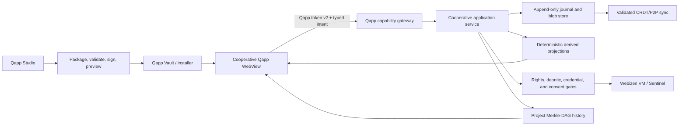
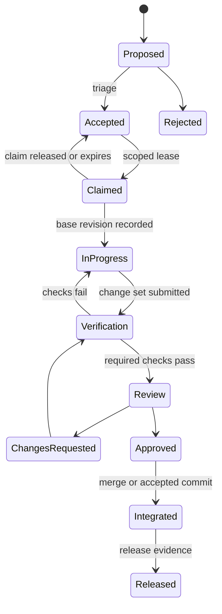

# Cooperative Qapps and Qualia Desktop Implementation Plan

**Status:** Proposed implementation plan  
**Audit date:** 2026-07-03  
**Qualia baseline:** branch `0.0.24`, commit `f8a0657c`  
**Audited source:** `C:\Projects\Local_LIbraries\app-development\cooperative`  
**Target repository:** `C:\Projects\qualia-27062026`

## 1. Executive decision

The cooperative library should be treated as a product and interaction specification, not
as production code to copy into Qualia Desktop.

The useful material is:

- a broad Cooperative Projects product model;
- concrete screens for projects, tasks, issues, roadmaps, budgets, contributions,
  agreements, claims, economics, strategic canvases, and project assets;
- an early cooperative ontology and N3 rule vocabulary;
- a wider specification for personal finance, receipt ingestion, jurisdiction profiles,
  tax abstraction, social collaboration, and verifiable exports.

The library is not currently a functional application. Most screens contain static example
data, alert-based placeholders, random benchmark values, or calls to a nonexistent
`127.0.0.1:4848` API. It also depends on CDN-hosted Tailwind, Font Awesome, and Google
Fonts, contains duplicate generated pages, has unresolved licensing/provenance for its
large Pages theme bundle, and includes ontology/rule syntax that is not ready for the
current Qualia parser and ABI.

The recommended target is:

1. a reusable cooperative domain service shared by desktop, mobile, WASM adapters, and
   installed Qapps;
2. one canonical, offline-capable, multi-page `Cooperative` Qapp;
3. Qapp Studio support for creating, validating, signing, previewing, installing, and
   exporting new Qapps;
4. reusable templates for a Project Board, Cooperative Finance, Agreement Room, and
   read-only Sponsor View;
5. staged delivery that reuses Qualia's existing ledger, project, journal, policy,
   deontic, credential, Merkle-DAG, WebTorrent, CRDT, and Qapp infrastructure;
6. a self-hosting `QualiaDB Development Cooperative` workspace that uses the same project,
   task, agreement, contribution, and history system to coordinate development of the
   QualiaDB codebase itself.

Advanced financial settlement, automatic “equity,” legal adjudication, and public
federated analytics must not be part of the first release. They require explicit
jurisdiction policy, consent, contestability, and human approval.

## 2. Goals and non-goals

### 2.1 Goals

- Make cooperative project work genuinely usable in Qualia Desktop.
- Preserve offline-first and local-processing guarantees.
- Make project, contribution, money, and agreement state replay-safe and auditable.
- Allow installed Qapps to access cooperative features through narrow, token-gated host
  capabilities.
- Let users create project-specific Qapps without hand-authoring package metadata.
- Let the QualiaDB maintainers use the Cooperative Qapp to manage this repository's
  backlog, task claims, change sets, reviews, checks, releases, and contributor evidence.
- Reuse existing Qualia engines rather than reproduce them in JavaScript.
- Keep all evaluator and aggregation hot paths deterministic and bounded by the 42 MB
  Sentinel.
- Provide an explicit migration path for existing WellFair finance and project records.

### 2.2 Non-goals for the first release

- Importing the Pages theme bundle or its legacy Angular/React demos.
- Using Tailwind CDN, cloud fonts, or any runtime CDN dependency.
- Sending receipts, ledger data, project data, or identity data to a cloud AI service.
- Building a second graph database inside a Qapp.
- Treating generated “stewardship shares” as regulated equity or transferable tokens.
- Automatically deciding legal disputes or moving escrowed funds.
- Implementing a traditional centralized social network.
- Replacing Qualia's existing benchmark, DocuQuin, ILP, WebTorrent, or Studio systems.

## 3. Audit scope and source quality

### 3.1 Authored cooperative material

The functional audit covered:

- `social-cooperative.html`
- `ui/cooperative/`
- `docs/cooperativeproject/*.html`
- `other_pages/*.html`
- `ontology/cooperative-projects.ttl`
- `ontology/cooperative-brainstorming.n3`
- `ontology/cooperative-evaluation.n3`
- `integration/cooperative-projects/outline1.md`
- `integration/cooperative-projects/chat_with_gemini`
- `migrate_cooperative_ui.py`

The `pages/bundle/` directory is primarily a third-party UI/theme distribution. It is not
evidence that the cooperative functionality is implemented.

### 3.2 Source-quality findings

| Finding | Consequence | Plan response |
|---|---|---|
| Approximately 19,000 files, mostly bundled theme/vendor material | A bulk migration would import unnecessary code and unclear licensing | Use only the cooperative-specific information architecture and interaction ideas |
| Most `docs/cooperativeproject` pages are byte-identical to `other_pages` copies | There is no reliable canonical UI tree | Treat `other_pages` as the more complete reference set; do not import either tree |
| Static cards and hard-coded metrics | Screens do not prove domain behavior | Rebuild views over typed host snapshots and derived projections |
| `alert()` and DOM-only mutations | Create, claim, verify, cash-out, and subproject flows are placeholders | Implement command handlers and durable receipts before enabling controls |
| Fake port `4848` endpoints | Evolution, escrow, and ILP demos do not connect to the Qualia daemon | Route through the existing daemon/Qapp bridge and active daemon port |
| CDN-hosted UI dependencies | Breaks offline operation and weakens CSP | Bundle minimal local assets and use QPrime/Shoelace tokens |
| Dynamic `innerHTML` with user-entered project names | XSS risk | Render typed data through Dioxus or escaped DOM operations |
| Ontology omits `owl:` and `rdfs:` prefix declarations | Turtle is not production-valid | Replace it with a versioned ontology and parser tests |
| N3 rules use multi-triple bodies and SWAP math | Current N3 parser truncates multi-triple formulas and does not provide this math contract | Use supported single-rule forms or native bounded derivations |
| Integration notes use outdated object-tag wording | Risks ABI conflicts | Use canonical helpers from `frame_layout.rs` and current inline tags |
| No source-root licence for authored/co-bundled assets was found | Direct redistribution is unsafe | Reimplement behavior and visual structure; perform a licence review before reusing any asset |
| Several files contain mojibake | Text is not release-ready | Rewrite copy in UTF-8 and add encoding checks |

## 4. Functional inventory and disposition

| Audited capability | Evidence | Existing Qualia foundation | Disposition |
|---|---|---|---|
| Project discovery and hub | `cooperative.html`, `index.html` | Basic Qapp catalogue and project records | Build a real local project dashboard; remote discovery remains opt-in |
| Project creation and hierarchy | `project-detail.html` | `wellfare-core::projects::Project` | Extend with parent, phase, scope, status, governance, and propagation policy |
| Tasks and Kanban | `kanban.html` | No complete cooperative work-item service | Build |
| Issues | `issues.html` | Merkle-DAG contest/fork primitives exist | Build work-item issues first; connect formal contests later |
| Roadmaps and milestones | `roadmap.html` | Studio timeline/render primitives exist, but no project roadmap model | Build |
| Contributions and time | `project-detail.html`; integration spec | `Contribution`, replay-safe obligation derivation, desktop panel | Extend and promote |
| Budgets and payment pools | `budgets.html` | Basic signed ledger and ILP dispatcher | Build budgets as envelopes over ledger entries; no automatic payment in MVP |
| Project economics and obligation valuation | `economics.html`, `monetization.html` | Effort totals exist; ILP transport exists | Build deterministic fixed-point valuation; stage ILP settlement later |
| Sponsorship and donations | `contribute.html` | Ledger can record income | Build recording and allocation; external payment execution remains adapter-gated |
| Contracts, claims, and credentials | `contracts.html` | Deontic logic, VC, agency signatures, suspended M:N queue | Compose real service and UI; do not use the static Agreements pane |
| Strategic canvases | `canvases.html` | Qapp/Studio panes and graph records | Build as structured project documents after MVP |
| Project assets and knowledge | `project-assets.html` | Semantic library, DocuQuin, ontology import | Integrate existing systems through references |
| Brainstorming and approach taxonomy | `ui/cooperative`, ontology/N3 | RDF/N3 ingest and provenance | Build lightweight idea/review records after task MVP |
| Social/address book | integration spec | `social_connect.rs`, WellFair Social Book, consent store | Reuse and add project-scoped membership/invites |
| Offline collaboration | integration spec | CRDT, signed sync outbox, P2P protocol, WebTorrent services | Connect project envelopes to the validated sync path |
| did:git staged evolution | `evolution.html` | Real `DagStore`; project wrapper is still a legacy shim | Build a project history service over persisted DAG nodes |
| Federated analytics | `analytics.html` | Privacy engine, credentials, federation infrastructure | Defer until local analytics and consent are complete |
| Semantic escrow/adjudication | `escrow.html` | Deontic/paraconsistent/provenance engines | Defer; require human review and appeal |
| Personal finance | integration spec | Basic signed ledger and balances | Expand into import, reconciliation, reporting, and project allocation |
| Financial receipt capture/OCR | integration spec | Policy receipts and blob store, but not financial OCR | Build local-only capture/extraction as a separate pipeline |
| Jurisdiction identities and tax | integration spec | Identity Nyms and simple hard-coded tax schemas | Build signed, versioned jurisdiction packs using integer arithmetic |
| Accountant export | integration spec | Health export packages and checkpoint receipts | Build CSV first, then OFX/QIF and verifiable archive |
| DocuQuin library/pipeline | `library.html`, `docuquin-pipeline.html` | Existing DocuQuin and ontology tools | Link to the existing app; do not duplicate |
| Benchmark suite | `benchmark.html` | Existing benchmark harness | Reuse; do not add to Cooperative Qapp core |
| Cooperative development of QualiaDB | Project/task/roadmap concepts plus repository integration notes | Git repository, `DagStore`, coordination ISA, intent ingestion, manual notices, GitHub Actions | Build a local-first Development Cooperative workspace and bounded Git/forge adapters |

## 5. Existing implementation that must be reused

### 5.1 Qapp platform

- `crates/qualia-client-core/src/qapp_registry.rs`
  defines `qapp.json`, entrypoints, named pages, capability declarations, ontologies,
  models, UI surfaces, export targets, and `did_git`.
- `crates/qualia-client-core/src/qapp_install.rs`
  provides atomic install, hashes, ABI checks, Ed25519 production signature checks,
  version archives, revocation, and registry reconciliation.
- `crates/qualia-client-core/src/qapp_manifest.rs`
  compiles install-time capability data into a fixed Sentinel record.
- `crates/qualia-client-core/src/qapps_protocol.rs`
  serves installed assets over loopback.
- `crates/qualia-client-core/src/api.rs`
  provides readiness inspection, token issuance, launch-context assembly, and entrypoint
  resolution.
- `crates/webizen-desktop/src/commands/mod.rs`
  launches each installed Qapp in a dedicated Tauri WebView window.
- `crates/webizen-studio/src/studio_canvas.rs`
  already edits multi-page declarative workspaces.
- `crates/qualia-client-core/src/studio_workspace_wal.rs`
  persists workspace deploy and undo history as Quins.

### 5.2 Cooperative and finance foundations

- `crates/wellfare-core/src/projects.rs`
  already has projects, memberships, immutable contributions, author chains,
  deterministic merge, and replay-safe obligation derivation.
- `crates/wellfare-core/src/finance.rs`
  already has immutable minor-unit ledger entries, project links, deterministic merge,
  and derived multi-currency balances.
- `crates/qualia-client-core/src/wellfair/api.rs`
  commits these records to the signed journal and derives obligations across validated
  inbound sync operations.
- `crates/webizen-studio/src/components/wellfair/projects_panel.rs` and
  `finance_panel.rs` prove the desktop host path, but expose only minimal forms.

### 5.3 Governance, history, and transport

- `crates/qualia-core-db/src/deontic_logic.rs`
- `crates/qualia-core-db/src/foundation/crdt.rs`
- `crates/qualia-core-db/src/identity/agency.rs`
- `crates/qualia-core-db/src/crypto/verifiable_credential.rs`
- `crates/qualia-core-db/src/platform/git_bridge.rs`
- `crates/qualia-core-db/src/p2p/`
- `crates/qualia-core-db/src/services/webtorrent_seeder.rs`
- `crates/qualia-core-db/src/services/ilp_dispatcher.rs`
- `crates/qualia-core-db/src/specialized_libs/linear_algebra/privacy/`

These are engines or usable foundations. The static Studio components
`agreements_rights.rs`, `webtorrent_seeder.rs`, and `p2p_dashboard.rs` are presentation
mockups and must not be mistaken for live control surfaces.

### 5.4 Development-coordination foundations

- `coordination/NOTICES.md` is a useful but manually edited, unstructured claim/progress
  feed.
- `AGENTS.md` and the release handover documents contain task, verification, and session
  knowledge that should be linkable from project records.
- `docs/manuals/standards/MULTI_AGENT_PROTOCOL.md` defines a coordination ISA. Its
  deterministic core exists in `governance/coordination.rs`, while root-delegation,
  suspended-queue, VC persistence, and routing seams remain host work.
- `docs/manuals/standards/AGENT_INTENT_LOGGING_SPEC.md` and
  `qualia-cli/src/ingest/agent_intent.rs` provide an early intent-log path. The current
  ingester still uses placeholder dispatch hooks and an empty current-lock graph, so it is
  not yet a repository lock authority.
- `platform/git_bridge.rs` has a real in-memory Merkle-DAG, forks, merges, branch pointers,
  serialization, and fast-export. Its project convenience wrapper still creates an empty
  store and falls back to legacy fixture output.
- `.github/workflows/` builds releases, deploys Pages, and runs benchmarks. It does not
  currently provide a general `pull_request` validation workflow. The benchmark workflow
  writes generated results directly back to `main`, which should be surfaced as an
  explicit bot-authored development event.

These foundations should be composed behind a repository service. Neither the Qapp nor an
agent should receive an unrestricted shell.

## 6. Target architecture



### 6.1 Boundary rules

- The Qapp is a view and intent client. It does not calculate authoritative balances,
  obligations, agreement status, or sync results.
- All writes pass through the host service, policy gate, journal, and receipt path.
- User identity comes from the verified session token, never from a Qapp-supplied
  `actor_did`.
- A Qapp never receives unrestricted filesystem, key-vault, journal, or network access.
- Network access is denied by default. Project peer sync is a host capability, not an
  arbitrary browser fetch.
- UI allocation is acceptable; evaluator and derivation hot paths must follow the fixed
  buffer and 42 MB rules.

## 7. Qapp security prerequisite

The current Qapp token contains a signed Qapp DID and allowed shape strings, but no expiry,
audience, nonce, capability list, or revocation identifier. The loopback asset server also
does not add a Qapp CSP or isolate apps by origin. This is not a sufficient boundary for
restricted financial and agreement data.

Before the Cooperative Qapp can access non-public records, implement Qapp session token v2:

```text
version
qapp_did
package_content_hash
session_id
issued_at_unix
expires_at_unix
audience = qualia-daemon
allowed_shape_hashes[]
allowed_capability_hashes[]
max_sensitivity
nonce
```

Required controls:

1. Verify signature, expiry, audience, installed package hash, revocation state, capability,
   sensitivity, and requested project context on every host intent.
2. Obtain the actor DID from the unlocked host session.
3. Keep launch tokens short-lived and single-session.
4. Scrub credentials from the URL immediately. Prefer a one-time bootstrap code exchanged
   for an in-memory session; do not retain tokens in local or session storage.
5. Add per-Qapp origin isolation or an equivalent WebView request boundary. At minimum,
   prevent one installed Qapp from reading another Qapp's assets.
6. Emit CSP, `X-Content-Type-Options: nosniff`, a restrictive referrer policy, and
   frame/navigation policy headers.
7. Reject remote scripts, remote fonts, inline event handlers, `eval`, and unlisted
   connect targets during package validation.
8. Bind WebSocket/MCP sessions to the same token and package identity.
9. Return a durable policy receipt for every state-changing command.
10. Make a locked key vault return a recoverable error rather than panic.

This work benefits all installed Qapps and is a release gate, not optional Cooperative
scope.

## 8. Cooperative domain model

### 8.1 Recommended ownership

Create `crates/qualia-cooperative-core` as a transport-neutral domain crate. Move or adapt
the reusable finance/project types and derivations from `wellfare-core` into it, while
leaving compatibility re-exports in `wellfare-core`.

This avoids making every cooperative project a health-vault feature and prevents duplicate
models. `qualia-client-core` should own persistence, host API, policy receipts, and sync
adapters.

Recommended target modules:

```text
crates/qualia-cooperative-core/src/
  lib.rs
  ids.rs
  project.rs
  work_item.rs
  roadmap.rs
  contribution.rs
  valuation.rs
  budget.rs
  agreement.rs
  canvas.rs
  commands.rs
  projections.rs
  validation.rs

crates/qualia-client-core/src/cooperative/
  mod.rs
  api.rs
  store.rs
  migration.rs
  policy.rs
  sync.rs
  history.rs
  export.rs
  qapp_gateway.rs
```

### 8.2 Stored records

| Record | Required fields |
|---|---|
| `Project` | stable id/DID, name, description, status, parent id, created/updated assertion time, owner context, sensitivity, governance agreement id |
| `ProjectMembership` | project id, member DID, role, invitation/acceptance state, ratification id |
| `Phase` | project id, name, order, status, start/end constraints |
| `WorkItem` | project/phase id, type task/issue/milestone, title, description, status, priority, estimate, assignee, credential requirements, dependencies |
| `Contribution` | project/work-item id, contributor DID, type, quantity, unit, evidence reference, event time, predecessor, valuation-policy id |
| `LedgerEntry` | signed minor units, currency, category, counterparty, project/work-item id, receipt/blob id, jurisdiction-profile id |
| `Budget` | project/phase id, currency, ceiling, version, agreement id |
| `PaymentPool` | project/phase/task scope, currency, committed/available/settled amounts derived from ledger events |
| `AgreementProposal` | project id, version, terms hash, deontic norms, required signers, threshold, expiry |
| `Ratification` | proposal id, signer DID, author-scoped Merkle root, signature, asserted time |
| `CanvasDocument` | project id, canvas type, versioned typed sections |
| `Idea` / `Review` | project/challenge id, approach type, impact/complexity evidence, provenance |

### 8.3 Derived projections

The following are computed views, not mutable source-of-truth totals:

- project completion;
- Kanban columns;
- roadmap state;
- obligation totals per project/contributor;
- obligation value under a named valuation policy;
- budget remaining and payment-pool availability;
- sponsorship allocation;
- stewardship-unit allocation;
- agreement active/pending/expired status;
- credential readiness;
- project history and contested state;
- aggregate analytics.

Every cached projection must include its source revision/Merkle root and be safely
recomputable.

### 8.4 Numeric rules

- Money uses signed integer minor units plus ISO 4217 currency.
- Higher precision uses integer micro-units with an explicit scale.
- Effort uses integer minutes.
- Rates and multipliers use fixed-point integers or rational numerator/denominator pairs.
- Never aggregate currencies without an explicit, versioned exchange-rate observation.
- Never use `f32`/`f64` for authoritative money, tax, share, or obligation calculations.
- Reject overflow and invalid scale rather than saturating silently.
- Contributions merge by stable id before aggregation.
- Corrections append compensating/superseding records; they never mutate signed history.

### 8.5 Hierarchy and obligation propagation

- Reject cycles in parent/subproject relationships.
- A subproject inherits no governance or financial policy unless an explicit signed
  inheritance policy says so.
- Parent obligation propagation is opt-in, versioned, and bounded to declared categories.
- The same contribution id must never count in both child and parent totals unless the
  policy describes allocation shares whose sum is exactly one.
- Graduation to independent governance creates a signed transition and preserves prior
  history.

## 9. Ontology, SHACL, and rule work

Create a new canonical asset set under:

```text
bundled/ontologies/qualia/cooperative/
  cooperative.ttl
  cooperative-shapes.ttl
  cooperative-rules.n3
  catalog.json
  examples/
```

Requirements:

- Declare all prefixes and validate Turtle in tests.
- Reuse PROV-O, DOAP, ODRL, schema.org monetary types, W3C VC, and existing Qualia
  namespaces where their semantics fit.
- Keep custom classes only for genuinely cooperative concepts.
- Add SHACL shapes for projects, memberships, phases, work items, contributions, ledger
  links, budgets, agreement proposals, ratifications, and canvas documents.
- Define mapping tests from domain records to Quins and back.
- Hash terms at ingest/compile time and use canonical frame-layout helpers.
- Keep rule forms within current N3 parser support or extend the parser in a separately
  tested change before relying on multi-triple bodies.
- Implement valuation and propagation as bounded native derivations first; N3 rules may
  explain or validate policy, but unsupported SWAP math must not silently produce totals.
- Route shared project statements through the Bilateral Micro-Commons lane only when the
  relevant agreement and membership policy requires it.

The ontology in the audited library should be retained only as a traceability fixture, not
installed as the production ontology.

## 10. Host capability and Qapp API

### 10.1 Capability names

Add host-recognized, readiness-checked capabilities:

```text
qualia.cooperative.project.read
qualia.cooperative.project.write
qualia.cooperative.work.manage
qualia.cooperative.contribution.append
qualia.cooperative.finance.read
qualia.cooperative.finance.write
qualia.cooperative.agreement.propose
qualia.cooperative.agreement.ratify
qualia.cooperative.history.read
qualia.cooperative.sync.manage
qualia.cooperative.export
qualia.development.repository.read
qualia.development.task.manage
qualia.development.change.review
qualia.development.git.stage
qualia.development.git.commit
qualia.development.git.push
qualia.development.forge.issue
qualia.development.forge.pull_request
qualia.development.ci.dispatch
qualia.development.release.propose
```

The manifest may declare a subset. Required unknown capabilities must fail package
readiness clearly; recognized capabilities must be checked against the host build and
active policy.

### 10.2 Bridge tools

Use the existing Qapp WebSocket/MCP bridge instead of inventing the prototype's `4848`
REST server.

Minimum tools:

- `cooperative_list_projects`
- `cooperative_project_snapshot`
- `cooperative_apply_command`
- `cooperative_history`
- `cooperative_sync_status`
- `cooperative_export`

All mutations use one command envelope:

```json
{
  "request_id": "stable-idempotency-key",
  "project_id": "did:q42:project:...",
  "expected_revision": 42,
  "command": "work_item.create",
  "payload": {}
}
```

The host response contains:

```json
{
  "accepted": true,
  "revision": 43,
  "receipt_id": "urn:qualia:receipt:...",
  "affected_record_ids": [],
  "validation": []
}
```

Rules:

- `request_id` is required and replay-safe.
- The actor and Qapp identity come from the verified session.
- `expected_revision` prevents blind overwrites.
- Each command has a fixed schema and maximum payload size.
- Validation errors are structured and do not partially commit.
- Mutations are append-only and atomic at the journal boundary.
- Large evidence remains in the blob store and is referenced by hash.
- Subscription updates contain projection deltas, not unrestricted journal access.

### 10.3 Native Desktop integration

The existing WellFair project and finance panels should become consumers of the same
cooperative service, not a second implementation. Tauri commands may remain as a trusted
host adapter, but their behavior must call the same command handlers used by Qapps.

## 11. Canonical Cooperative Qapp

### 11.1 Package layout

```text
bundled/qapps/Cooperative/
  qapp.json
  package-manifest.json
  index.html
  app.js
  qualia-bridge.js
  styles.css
  workspace.yaml-ld-q42
  assets/
  Knowledge/
    cooperative.ttl
    cooperative-shapes.ttl
    cooperative-rules.n3
```

Release builds generate and sign `package-manifest.json`; developer builds may regenerate
it locally. All runtime assets are local.

### 11.2 Qapp pages

| Page | MVP | Later |
|---|---|---|
| Projects | list, create, archive, local search | opt-in peer discovery |
| Project overview | status, members, phases, current obligation summary | public project card |
| Work | Kanban, tasks, issues, dependencies, credential readiness | automation rules |
| Roadmap | phases and milestones | temporal simulation |
| Contributions | time/resource logging, evidence, contributor totals | inferred suggestions requiring confirmation |
| Finance | project-linked ledger, budget, pools, basic reports | bank reconciliation, tax packs |
| Agreements | proposal, term preview, ratification state | claims and settlement |
| History | signed revisions, forks, contested records | merge assistance |
| Assets | ontology/document/blob references | DocuQuin launch handoff |
| Development | repository health, backlog, claims, changes, reviews, checks, coordination | forge sync and release management |
| Settings | identity Nym, sensitivity, sync, governance, export | advanced analytics |

### 11.3 Manifest policy

- `app_id`: `did:qualia:qapp:cooperative`
- offline support: true
- remote endpoints: none by default
- maximum sensitivity: Restricted for the first release
- named pages listed in `x_qualia.pages`
- package declares only the capabilities used by enabled pages
- required ontology domains remain within the fixed compiled capability limit
- Classified/Sanctuary records are withheld unless a later, explicitly reviewed host
  surface supports them

### 11.4 Qapp templates

Qapp Studio should ship templates that create separate packages with narrower authority:

1. **Project Board** — overview, work, roadmap, contributions.
2. **Cooperative Finance** — project ledger, budget, reports, accountant export.
3. **Agreement Room** — terms, credentials, ratification, history.
4. **Sponsor View** — read-only public/consented impact and funding view.
5. **Development Cooperative** — backlog, repository, review, CI, release, and
   coordination pages with repository-write capabilities disabled until explicitly bound.

Templates must create independent `app_id` values and least-privilege capability sets.
They are not aliases that inherit the canonical Qapp's token.

## 12. Qapp creation in Webizen Studio

The current Studio can edit multi-page workspaces and persist them to the WAL, but it does
not provide a complete installed-Qapp package workflow. Add a **Package & Publish** mode.

### 12.1 Creator workflow

1. Start from blank, an installed package, or a signed template.
2. Set name, package id, app DID, version, category, icon, description, and author DID.
3. Define pages and entrypoints from the Studio workspace.
4. Select host capabilities from a live registry, with explanations and sensitivity
   consequences.
5. Select ontologies, SHACL shapes, models, and optional local-only services.
6. Generate `workspace.yaml-ld-q42` and `qapp.json`.
7. Bundle local HTML/CSS/JS/WASM/assets.
8. Run package lint, offline audit, CSP audit, accessibility checks, ABI/API checks, and
   readiness inspection.
9. Generate file hashes and `package-manifest.json`.
10. Sign through the key vault after showing the exact capability and file diff.
11. Preview in an isolated development WebView using a disposable token.
12. Install locally, export an archive/directory, or publish through an explicitly enabled
    distribution adapter.

### 12.2 Required implementation

Add:

```text
crates/qualia-client-core/src/qapp_builder.rs
crates/qualia-client-core/src/qapp_lint.rs
crates/qualia-client-core/src/qapp_archive.rs
crates/webizen-studio/src/components/qapp_package_wizard.rs
crates/webizen-studio/src/components/qapp_capability_picker.rs
crates/webizen-studio/src/components/qapp_package_report.rs
```

Extend:

- `QappPackageManifest` with an explicit schema version and author/publisher identity;
- Qapp token claims with v2 session fields;
- Studio export to compose package and workspace manifests;
- installer support for a deterministic archive format, while preserving directory
  installs for development;
- readiness checks to validate declared host capabilities and CSP/offline policy;
- content manifest signing so serialization is canonical and independently verifiable.

### 12.3 Lint rules

Fail packaging for:

- path traversal or absolute asset paths;
- missing entrypoints/pages;
- remote script/font/style URLs when offline support is declared;
- undeclared network origins;
- inline handlers or `eval`;
- package files missing from the content manifest;
- unsupported ABI/host API versions;
- duplicate app ids;
- more ontology domains than the Sentinel capability record permits;
- capability use not declared in `qapp.json`;
- SHACL or ontology parse failure;
- invalid UTF-8;
- inaccessible page titles, landmarks, or keyboard navigation.

Warn for:

- large assets;
- unused capability declarations;
- broad sensitivity clearance;
- missing chat/representation contract;
- missing screenshots or user documentation;
- non-reproducible generated files.

## 13. Personal finance, receipt, jurisdiction, and export work

### 13.1 Personal finance

Build on the existing immutable ledger:

- transaction editing through append-only corrections;
- categories and split allocations;
- project/work-item allocation;
- counterparties and accounts;
- CSV import first, then OFX and QIF;
- deterministic reconciliation with explicit user confirmation;
- Profit and Loss, Balance Sheet, and Cash Flow projections;
- per-currency reporting without implicit conversion;
- export of the exact records behind every report.

Bank integration is file-based first. Direct bank APIs are out of scope until a separate
credential and network-policy review.

### 13.2 Financial receipt ingestion

Do not confuse financial source receipts with existing policy/audit receipts.

Implement:

- local file/camera intake for PDF/JPEG/PNG;
- content-addressed blob storage;
- local OCR/VLM adapter with a strict result schema;
- extracted vendor, date, total, tax, currency, and confidence;
- human confirmation before creating a ledger entry;
- cryptographic link from ledger entry to original blob and extraction provenance;
- deterministic fallback to manual entry;
- no remote inference fallback.

### 13.3 Jurisdiction profiles and tax

The current `tax_schema.rs` examples use hard-coded schemas and floating-point evaluation.
They are not sufficient for accounting output.

Create signed, versioned jurisdiction packs containing:

- jurisdiction id and effective dates;
- identifier type, such as ABN, without hard-coding Australia into the core;
- fixed-point tax rules;
- source/provenance metadata;
- applicability predicates;
- test vectors;
- disclaimer and estimation status.

Tax results are estimates unless a pack is explicitly attested. Users select the active
Identity Nym and jurisdiction profile; the core graph does not mutate historical entries
when a tax pack changes.

### 13.4 Accountant handoff

Delivery order:

1. deterministic CSV plus manifest;
2. OFX;
3. QIF;
4. a verifiable archive containing exports, receipt blobs or consented copies, hashes,
   checkpoint/Merkle evidence, schema versions, and a human-readable index.

Every export produces a policy receipt and records exactly which sensitivity projection was
used.

## 14. Agreements, credentials, and claims

### 14.1 Agreement lifecycle

```text
Draft -> Proposed -> PartiallyRatified -> Active
      -> Rejected | Expired | Superseded | Contested
```

- Drafts have no enforcement effect.
- Proposal freezes a canonical terms hash.
- Each ratification signs the proposal hash and author-scoped project Merkle root.
- M:N thresholds use the existing suspended transaction mechanism.
- Active agreements compile supported terms into deontic Quins.
- Amendment creates a new version and never rewrites prior signatures.
- Revocation/termination follows explicit agreement terms and creates an auditable event.

### 14.2 Credential-gated work

- Work items reference required credential shapes.
- Readiness reports distinguish missing, expired, revoked, and unverified credentials.
- The host verifies credentials; a Qapp only receives the minimum result needed.
- A missing credential blocks claim/assignment but must not hide the existence of a public
  task unless policy says so.

### 14.3 Claims and stewardship units

- A claim is a signed statement about work, payment, or entitlement, not a payment itself.
- Stewardship units are project-governance accounting units by default.
- Transferability, cash-out, or conversion requires a signed policy and jurisdiction
  adapter.
- The MVP can display proposed and earned units but cannot execute cash-out.
- All valuation policies show inputs, version, calculation, and contest route.

## 15. Social, sync, and project history

### 15.1 Membership and invitations

Reuse Social Book/contact DIDs. A project invitation contains:

- project DID and minimal public metadata;
- inviter DID;
- requested role;
- agreement/version hash;
- sensitivity and sync scope;
- expiry and nonce;
- inviter signature.

Accepting an invitation creates a membership proposal/ratification; it does not grant
global contact access.

### 15.2 Sync

- Sync is project-scoped and opt-in.
- Send signed journal operations or compact project envelopes, not raw application state.
- Validate author, agreement, capability, sensitivity, schema, and predecessor before
  applying an operation.
- Quarantine contradictions/invalid operations rather than dropping them silently.
- Derive money and effort only after stable-id deduplication.
- Demonstrate convergence under duplication, reordering, partition, and replay.
- WebTorrent distributes content-addressed packages/assets; validated CRDT/P2P messages
  carry state changes.

### 15.3 did:git and history

Connect project events to the real `DagStore`:

- persist per-project DAG nodes;
- compute author-scoped roots over the records in the commit;
- maintain signed branch pointers;
- create contest forks for disputed contributions/terms;
- implement merge policy and conflict Quins;
- expose history read-only in the first release;
- remove use of `generate_fast_export_stream_for_project`'s empty-store legacy shim from
  production project flows.

Git fast-export is an interoperability view, not the authoritative store.

## 16. Advanced features and safeguards

### 16.1 ILP and threshold shifts

Only after budget and agreement correctness:

- record verified payment receipts;
- bind payments to project/pool/obligation ids;
- make dispatch idempotent;
- derive threshold state from unique receipts;
- require an agreement-defined transition;
- compile a state transition through the Webizen policy path;
- never trust a browser-side accumulated total.

### 16.2 Federated analytics

Only after local analytics:

- credential-gated requests;
- explicit purpose and expiry;
- minimum cohort size;
- differential privacy budget;
- optional homomorphic aggregate path;
- no raw project/member records;
- a result receipt showing privacy parameters and source revision.

### 16.3 Escrow and disputes

The audited “80/20 judgement” demo must not become automatic legal adjudication.

Build only after:

- parties ratify a dispute policy;
- funds are handled by an approved adapter;
- evidence and provenance are contestable;
- there is a human review and appeal path;
- paraconsistent isolation preserves contradictory claims;
- no VM result is described as a court judgment.

## 17. QualiaDB Development Cooperative

### 17.1 Purpose

QualiaDB should be the first substantial project managed by the Cooperative system. This
“dogfood” mode turns the current codebase into a bound cooperative project whose work
items, task claims, change sets, reviews, verification evidence, decisions, and release
candidates can be inspected from Qualia Desktop.

The development workspace must augment Git, not replace it:

- Git remains authoritative for source files, branches, commits, and tags.
- The local filesystem remains authoritative for uncommitted work.
- GitHub or another forge remains authoritative for its remote issues, pull requests,
  checks, and releases.
- Qualia stores signed links, derived projections, coordination state, review decisions,
  and evidence bound to immutable Git object ids and forge event ids.
- A graph record must never claim that code was committed, tested, pushed, merged, or
  released unless the corresponding Git/CI/forge evidence exists.

The initial repository binding is:

```text
Project: QualiaDB Development
Repository DID: derived from canonical remote + root commit
Local root: C:\Projects\qualia-27062026
Primary remote: https://github.com/mediaprophet/qualiaDB.git
Development policy: AGENTS.md + repository-scoped agreements
Coordination feed: coordination/NOTICES.md (legacy import)
```

The local path is configuration, not portable identity. Repository identity is derived
from canonical repository evidence and explicitly confirmed by the user.

### 17.2 Current development-management gaps

| Area | Current state | Needed state |
|---|---|---|
| Work intake | Task maps, plans, handovers, and static issue pages | One queryable backlog linked to source evidence and optional forge issues |
| Coordination | Human-readable `coordination/NOTICES.md` | Durable claims/leases with conflict detection and a generated human-readable feed |
| Agent sessions | Draft intent-ingestion specification and partially wired coordination ISA | Minimal signed session receipts linked to tasks, changes, tests, and outcomes |
| Repository status | Available through Git CLI only | Read-only repository health and change projections in Desktop |
| Git writes | Manual commands outside the Qapp | Narrow stage/commit/branch capabilities with previews and explicit approval |
| Reviews | Git/GitHub/manual review | Local diff review, inline findings, decision records, and remote review links |
| CI | Pages, benchmark, and tag-release workflows | Fast pull-request gates plus full/nightly/release evidence |
| Project history | Real `DagStore`, but no persisted repository-project service | Git-object-bound project DAG with repository and Qualia history cross-links |
| Releases | Tag-triggered workflow and handover documents | Release-candidate checklist, approvals, artifact hashes, SBOM, provenance, and rollback notes |
| Contribution evidence | Commits and manual session notes | Multi-dimensional evidence covering code, review, tests, docs, design, coordination, and maintenance |

### 17.3 Development records

Add development-specific records to `qualia-cooperative-core`:

| Record | Purpose |
|---|---|
| `RepositoryBinding` | Repository DID, canonical remote, local root approval, default branch, current HEAD, policy id |
| `DevelopmentTask` | Backlog item with acceptance criteria, dependencies, risk, release target, and forge links |
| `TaskClaim` | Actor/agent, exact path or subsystem scope, lease, base revision, and status |
| `ChangeSet` | Base/head Git object ids, changed paths, patch hash, author/session links, and declared task |
| `VerificationRun` | Exact command/profile, start/end, exit result, environment fingerprint, log/artifact hashes |
| `ReviewRecord` | Reviewer, change-set id, findings, disposition, scope, and reviewed revision |
| `DecisionRecord` | ADR/proposal, alternatives, ratifiers, status, and affected components |
| `CheckRunMirror` | Forge check id, commit SHA, status, conclusion, URL, timestamps, and artifact references |
| `ReleaseCandidate` | Version, commit/tag proposal, included tasks, required checks, approvals, artifact manifest |
| `ContributionReceipt` | Evidence bundle linking accepted work to commits, reviews, tests, docs, and coordination |
| `DevelopmentSession` | Delegated actor, task, base state, intended scope, outputs, verification, and outcome |
| `RepositoryEvent` | Read-only normalized event for fetch, branch, commit, push, PR, merge, tag, or release |

Rules:

- A `TaskClaim` is coordination, not ownership of the code or exclusion of human access.
- Claims expire and may be released; the permanent record stores history without retaining
  a permanent lock.
- A `ChangeSet` is identified by Git object ids and patch hash, not a mutable branch name.
- Verification is valid only for the exact commit/worktree snapshot it tested.
- Reviews become stale when the reviewed patch hash changes.
- Contribution receipts do not create financial obligations unless a separate signed
  compensation policy explicitly says so.
- AI assistance is recorded as tooling/provenance. It does not erase the natural person's
  authorship, responsibility, or right to credit.

### 17.4 Repository onboarding and health

The Development Cooperative workspace must be able to:

1. select a repository directory through a native folder picker;
2. resolve and display the canonical absolute path;
3. confirm the path is a Git repository;
4. show current branch, HEAD SHA, remotes, upstream, ahead/behind counts, tags, dirty paths,
   submodules, and ignored/untracked summaries;
5. detect the repository's governing files (`AGENTS.md`, licence, contribution guide,
   code owners, toolchain files, workflows, plans, and changelog);
6. calculate a read-only repository snapshot hash;
7. ask the user to confirm the repository DID and local binding;
8. create no branch, file, index entry, stash, fetch, or network request during onboarding.

The binding should fail closed if the stored root resolves outside the approved workspace
or if the repository identity no longer matches. Moving a repository requires a new local
path approval but does not change the repository DID.

### 17.5 Backlog, roadmap, and dependency management

The QualiaDB development project uses the general Cooperative records with additional
software fields:

- issue type: feature, bug, security, documentation, refactor, performance, release,
  research, or maintenance;
- affected crates/modules and path scope;
- acceptance tests and verification commands;
- target platforms and feature flags;
- risk level and required review class;
- dependencies and blockers;
- release milestone;
- linked plan/ADR/SHACL/ontology;
- linked local task and remote issue/PR ids;
- current base and accepted commit ids.

Importers may propose backlog items from:

- `AGENTS.md` task maps and known issues;
- `docs/plans/`;
- handover documents;
- `coordination/NOTICES.md`;
- failing checks and test logs;
- GitHub issues.

Imports are previews. The user confirms which proposed items become active tasks. A stale
plan paragraph must not silently become an assigned obligation.

### 17.6 Cooperative development workflow



Each transition appends an event. The Qapp derives the current state.

A normal change journey is:

1. triage a task and define acceptance evidence;
2. claim an exact scope against a base commit;
3. create or select a branch after user confirmation;
4. edit with the user's chosen tool or agent;
5. detect the resulting working-tree change;
6. bind the patch hash to the task/session;
7. run the declared local verification plan;
8. review the diff and findings;
9. stage exact files or hunks after confirmation;
10. create a commit after showing message, staged diff summary, and task links;
11. push only after a separate confirmation;
12. open/update a pull request only after showing destination, title, body, and remote;
13. observe CI and review;
14. record integration and release evidence.

The user may perform Git steps outside Qualia. The watcher records confirmed repository
events without pretending it executed them.

### 17.7 Task claims, agent sessions, and conflict prevention

Replace manual `CLAIM` lines with structured, time-bounded claims while retaining a
generated `coordination/NOTICES.md` view for humans and simple tools.

A claim contains:

```text
task_id
actor_did
instrument_id (optional)
base_commit
path_scopes[]
intent_summary_hash
claimed_at
expires_at
status
```

Conflict rules:

- overlapping path scopes produce a warning or suspension according to project policy;
- read access is never blocked;
- no claim can lock the entire repository without explicit human approval and a short
  lease;
- expired claims stop blocking but remain auditable;
- changes based on a different HEAD require revalidation before staging;
- unrelated dirty work belongs to the user and must not be included automatically;
- two valid alternative patches may be retained as contested branches/change sets for
  human comparison;
- because the current repository policy forbids Git worktrees, only one mutation session
  may switch branches in the shared canonical checkout at a time.

Wire the implemented coordination ISA carefully:

- root delegation verifies the actual session grant;
- resource declarations are estimates and circuit breakers, not developer billing;
- suspended transactions surface to the user with evidence;
- performance evidence is descriptive and contestable;
- no automatic “reputation market” may punish a person, deny human rights, or determine
  contributor compensation;
- one failed check or mistaken hypothesis must not become a permanent negative identity
  label.

Store minimal structured receipts by default. Raw prompts, private chat transcripts,
personal circumstances, secrets, and unrelated filesystem content stay local and are not
committed to the repository.

### 17.8 Local Git adapter

Create a bounded native adapter:

```text
crates/qualia-client-core/src/development/
  mod.rs
  repository.rs
  git_read.rs
  git_write.rs
  task_store.rs
  coordination.rs
  verification.rs
  review.rs
  forge.rs
  release.rs
  provenance.rs
```

Implementation requirements:

- invoke Git with `std::process::Command` and an argument array, never a shell-built command;
- pin the approved repository root as `current_dir`;
- use `--` before user-controlled paths where Git accepts it;
- canonicalize and verify every path remains inside the bound repository;
- capture stdout, stderr, exit code, and exact Git version;
- enforce command-specific time and output limits;
- redact credential-bearing URLs and secrets before persistence;
- preserve the pre-command repository snapshot and compare the post-command result;
- serialize repository mutations per bound repository;
- expose a dry-run/preview result when Git supports one;
- never infer permission for a broader Git action from a narrower capability.

Read-only operations include:

- status, diff, log, show, branch/tag listing, remote listing with redaction, worktree root,
  merge-base, blame, and object verification;
- local check/test process status and stored logs;
- no implicit fetch.

Write operations require separate capabilities:

| Capability | Permitted operation |
|---|---|
| `qualia.development.git.branch` | Create/switch a named development branch after dirty-tree checks |
| `qualia.development.git.stage` | Stage explicitly selected paths/hunks |
| `qualia.development.git.commit` | Commit the already reviewed index |
| `qualia.development.git.fetch` | Fetch from one approved remote |
| `qualia.development.git.push` | Push one shown refspec to one approved remote |
| `qualia.development.git.tag` | Create a shown annotated/signed tag |

Always forbidden without a distinct recovery workflow and explicit user authorization:

- `reset --hard`;
- `clean`;
- deleting or overwriting branches/tags;
- force push;
- rewriting published history;
- discarding working-tree files;
- automatic stash;
- creating Git worktrees or alternate clone paths while repository policy forbids them;
- recursive file deletion;
- changing remotes or credential configuration.

The first release should implement read, branch, stage, and commit. Fetch, push, tag, and
release publication follow only after the local path is proven.

Branch switching is refused when the tree is dirty, another mutation session is active,
or the checked-out base changed since preview. The adapter must not work around that
refusal with an automatic stash or a new worktree.

### 17.9 Review and change-set inspection

The Qapp needs a review surface that shows:

- task and acceptance criteria;
- base/head commit and patch hash;
- changed, added, deleted, renamed, untracked, generated, and ignored files;
- staged versus unstaged changes;
- inline review comments tied to file/blob/line identity;
- generated or vendored-file classification;
- API, ABI, ontology, migration, security, and documentation impact declarations;
- tests selected, tests run, failures, skips, and untested risk;
- reviewer decisions: comment, request changes, approve locally, or withdraw approval.

Approval is revision-specific. If the patch changes, the UI marks prior approvals and
verification as stale.

Secret scanning, binary-size checks, licence headers, forbidden remote URLs, and generated
artifact drift should run before staging. Findings inform the user; automated repair is a
new task/change set, not a hidden mutation.

### 17.10 Verification and CI

Add `.github/workflows/ci.yml` for `pull_request` and development-branch pushes. Keep the
fast gate bounded:

1. formatting check;
2. targeted Rust checks for changed crates;
3. core unit tests;
4. Qapp package/offline/security lint when Qapp files change;
5. Studio WASM check when Studio/client code changes;
6. documentation link/encoding checks when docs change;
7. changed-workflow syntax and permission audit.

Use path-aware expansion, but never allow the mapper to skip a required safety test. Full
workspace, cross-platform, large benchmark, GPU, and release builds remain scheduled,
manual, nightly, or release gates as appropriate.

The Cooperative Qapp should:

- propose a local verification plan from changed paths;
- let the user edit/approve it;
- run approved commands through a bounded process runner;
- stream logs without storing secrets;
- bind each result to the exact repository snapshot;
- mirror remote check status by commit SHA;
- link logs and artifacts without claiming success from a workflow name alone.

The benchmark workflow's direct writes to `main` should be replaced with one of:

- an artifact-only result;
- a bot branch and pull request;
- an explicitly approved generated-data update.

This prevents automated benchmark output from racing human commits or silently changing
the development project.

### 17.11 Forge integration

GitHub is the current forge, but the domain model should remain forge-neutral.

The optional GitHub adapter supports:

- read repository metadata;
- import and reconcile issues, labels, milestones, pull requests, reviews, checks, and
  releases;
- create/update an issue;
- open/update a pull request from an already pushed branch;
- submit a prepared review;
- dispatch an approved workflow;
- draft a release.

Rules:

- use the platform connector or `gh`/HTTPS adapter behind the host; never expose a PAT to
  Qapp JavaScript;
- display the GitHub account, repository, base branch, and exact mutation before sending;
- retain remote node id, URL, update timestamp, and ETag/version where available;
- use idempotency/deduplication so reconnect does not create duplicate issues or comments;
- keep local tasks usable offline and reconcile conflicts explicitly;
- do not mirror private issue/comment bodies into shared project state without consent;
- do not merge, close, publish, or delete remotely as a side effect of a local status
  change.

### 17.12 Release management

The Development Cooperative release page should build a candidate, not publish
automatically.

A candidate includes:

- proposed version and target commit;
- included tasks/change sets and excluded known work;
- changelog and migration notes;
- required local and remote checks;
- supported target matrix;
- security/licence/ontology/Qapp compatibility reviews;
- artifact names, sizes, SHA-256 hashes, signatures, and SBOM/provenance references;
- known limitations and rollback/recovery steps;
- required human approvals.

Publication sequence:

1. freeze the candidate commit;
2. verify a clean tree and expected branch;
3. run/observe required checks;
4. review generated release notes and artifact plan;
5. obtain release approval;
6. create the annotated/signed tag after a separate confirmation;
7. let the existing tag workflow build artifacts;
8. verify uploaded artifact hashes and workflow conclusions;
9. publish or finalize the release only after confirmation;
10. append the release receipt.

No Qapp or agent may create a release merely because tests passed.

### 17.13 Contribution evidence and fair attribution

QualiaDB contribution reports should recognize:

- accepted code;
- design and architecture decisions;
- tests and reproducibility work;
- code review;
- documentation;
- issue triage and coordination;
- security findings;
- release and maintenance work;
- translations, accessibility, ontology work, and community support.

Do not rank contributors by lines changed, commit count, tokens consumed, hours inferred,
or an opaque agent score. Reports show evidence and declared policy. People can contest
incorrect attribution and can choose whether a contribution is public.

Co-authorship trailers, signed commits, review identities, and agent/tool provenance are
preserved when present. The system must not fabricate a DID, signature, co-author, test
result, or contribution value.

### 17.14 Development workspace UI

Add a `QualiaDB Development` preset to the Development Cooperative template:

| Page | Functions |
|---|---|
| Development dashboard | repository state, active milestone, claims, dirty-tree warning, checks, release readiness |
| Backlog | local/forge issues, acceptance criteria, dependencies, priorities, release target |
| Board and roadmap | proposed through released workflow and milestone timeline |
| Repository | branch, HEAD, upstream, remotes, status, changed paths, history |
| Changes | patch viewer, staged/unstaged split, task/session binding, stage/commit actions |
| Reviews | findings, approvals, stale-review detection, PR/review links |
| Verification | approved local test plans, live logs, exact-revision results, artifacts |
| CI | local and remote check runs by commit SHA |
| Coordination | active claims, expiring leases, conflicts, sessions, generated notices |
| Decisions | plans, ADRs, governing documents, handovers, known limitations |
| Releases | candidate checklist, artifacts, approvals, tag/workflow status |
| Contributions | evidence-based, consent-aware contribution reports |

Repository mutation controls are absent or disabled until a repository is explicitly
bound and the user grants the corresponding capabilities.

### 17.15 Dogfood bootstrap

Bootstrap the QualiaDB project without rewriting repository history:

1. bind the current repository read-only;
2. capture baseline branch, commit, remotes, dirty state, workflows, and governing files;
3. create the `QualiaDB Development` cooperative project;
4. import `coordination/NOTICES.md` as legacy events with provenance;
5. link existing plans, handovers, and AGENTS task entries as source documents;
6. propose, but do not auto-activate, backlog items from unresolved plans/issues;
7. link commits from the selected baseline forward;
8. create a release milestone matching the current development branch;
9. use implementation of this Cooperative/Qapp plan as the first managed initiative;
10. enable branch/stage/commit only after the read-only projections match Git CLI output.

Do not import private agent transcripts or infer contributor obligations from historical
commit metadata.

### 17.16 Development-specific acceptance journeys

#### Journey A — Safe local change

1. Bind a dirty QualiaDB repository read-only.
2. Confirm that existing user changes are shown and untouched.
3. Create and claim a scoped task.
4. Create a development branch after approval.
5. Make a change outside or inside the Qapp.
6. Inspect the exact diff and run an approved verification plan.
7. Stage only selected paths/hunks.
8. Commit after reviewing the staged patch and message.
9. Confirm the task, change set, commit, tests, and receipt cross-link correctly.

#### Journey B — Cooperative collision

1. Two sessions claim overlapping path scopes.
2. The second claim is warned/suspended without blocking reads.
3. The user narrows a scope or keeps both as alternative change sets.
4. Neither session's files are discarded.

#### Journey C — Pull request and CI

1. Explicitly push a reviewed branch.
2. Preview and open a pull request.
3. Observe checks by exact commit SHA.
4. Record review comments and a new patch revision.
5. Mark older checks/reviews stale.
6. Record merge evidence without fabricating it locally.

#### Journey D — Release candidate

1. Select a commit and proposed version.
2. Resolve all required checks and known blockers.
3. Generate reviewed notes, artifact plan, hashes, and rollback instructions.
4. Approve tag creation separately.
5. Observe the existing release workflow and verify resulting assets.

### 17.17 Development-specific security and governance gates

- Read-only repository access is the default.
- Every local or remote mutation has a dedicated capability and confirmation.
- Protected branches reject direct push by policy.
- Force push and destructive recovery are outside normal Qapp capabilities.
- Secrets, `.env` contents, credential helpers, key material, and private remotes are
  redacted.
- Build/test commands come from an approved allowlist or require per-command approval.
- No arbitrary shell text from tasks, issues, agents, or Qapp content is executed.
- Untrusted patches are reviewed before any build that can run build scripts.
- Remote issue/PR text is untrusted content and cannot become a command.
- Repository events are signed/hashed where possible and always bound to Git object ids.
- Human approval is required for merge, tag, release, remote publication, compensation,
  contributor sanctions, and governance changes.
- The system supports correction, appeal, and provenance for disputed development records.

## 18. Delivery work packages

### WP0 — Contracts and architecture baseline

**Priority:** P0  
**Dependencies:** none

Deliver:

- ADR for cooperative core ownership and WellFair compatibility;
- ADR for Qapp package/workspace manifest composition;
- canonical command schemas and capability names;
- ontology namespace and record-version policy;
- migration fixtures from current WellFair records;
- threat model for restricted-data Qapps.

Acceptance:

- no duplicate project/ledger source of truth;
- current record ids remain traceable;
- every later work package has an explicit host boundary.

### WP1 — Qapp host hardening

**Priority:** P0  
**Dependencies:** WP0

Deliver:

- Qapp token v2;
- verified MCP/WebSocket session binding;
- capability and package-hash enforcement;
- token expiry/revocation tests;
- per-app asset/origin isolation;
- CSP/security headers;
- offline/CSP package lint.

Acceptance:

- a Qapp cannot read another Qapp's assets or call undeclared capabilities;
- expired, altered, revoked, wrong-audience, and wrong-package tokens fail;
- locked vault behavior is recoverable;
- token material is absent from browser history after bootstrap.

### WP2 — Qapp creator and package pipeline

**Priority:** P0  
**Dependencies:** WP1

Deliver:

- Studio Package & Publish wizard;
- manifest generation;
- deterministic archive/directory build;
- content manifest generation and signing;
- preview/install/export;
- package report and readiness integration;
- four cooperative templates.

Acceptance:

- a user can create, sign, install, relaunch, and export a minimal offline Qapp without
  manually editing JSON;
- changing one packaged byte invalidates verification;
- rebuilding identical inputs yields identical unsigned package content.

### WP3 — Cooperative core and persistence

**Priority:** P0  
**Dependencies:** WP0

Deliver:

- `qualia-cooperative-core`;
- project hierarchy, work items, phases, contributions, fixed-point valuations, budgets,
  agreements, and projections;
- client-core store, command handler, policy receipts, and migrations;
- compatibility adapters for current WellFair panels and data.

Acceptance:

- replay/reorder does not duplicate money or effort;
- hierarchy cycles are rejected;
- all projections are deterministic and revision-bound;
- tests cover overflow, currency separation, correction records, and propagation.

### WP4 — Cooperative Qapp MVP

**Priority:** P1  
**Dependencies:** WP1, WP3

Deliver:

- bundled package and local assets;
- projects, overview, work, roadmap, contributions, history, and settings pages;
- host bridge client;
- accessible responsive UI using QPrime tokens;
- local-only operation and meaningful empty/error states.

Acceptance journey:

1. create a project;
2. add a phase and task;
3. invite or add a local member;
4. log a contribution;
5. see replay-safe obligation totals;
6. inspect the signed history and receipt;
7. close and relaunch with state intact.

### WP5 — Finance, receipts, and accountant export

**Priority:** P1  
**Dependencies:** WP3, WP4

Deliver:

- project allocation in the ledger UI;
- budgets and payment-pool projections;
- CSV import/reconciliation;
- reports;
- local financial receipt pipeline;
- CSV/OFX/QIF export and verifiable archive;
- jurisdiction profile foundation.

Acceptance:

- duplicate imports and sync replays cannot alter balances;
- receipt extraction always requires confirmation;
- no network request occurs during receipt processing;
- exports reproduce tested fixtures byte-for-byte.

### WP6 — Agreements and credential-gated work

**Priority:** P1  
**Dependencies:** WP3, WP4

Deliver:

- agreement proposal/version/ratification service;
- deontic compilation;
- M:N activation;
- credential requirements on work items;
- claims viewer and contest action;
- Agreement Room template.

Acceptance:

- unsigned drafts have no enforcement effect;
- threshold activation occurs once;
- expired/revoked credentials block gated claims;
- amendments preserve earlier terms and signatures.

### WP7 — Project-scoped social sync and did:git history

**Priority:** P2  
**Dependencies:** WP3, WP6

Deliver:

- signed invitations;
- project-scoped sync envelopes;
- two-peer convergence;
- project DAG persistence, forks, and branch pointers;
- live sync/history UI backed by services, replacing hard-coded metrics.

Acceptance:

- two offline peers converge after reconnect;
- duplicate/reordered frames do not double-count;
- unauthorized project records remain quarantined;
- a dispute fork preserves both histories.

### WP8 — Advanced economics and analytics

**Priority:** P3  
**Dependencies:** WP5, WP6, WP7

Deliver selectively:

- sponsorship allocation;
- stewardship-unit policy;
- ILP payment receipt integration;
- agreement-gated threshold transitions;
- privacy-preserving aggregate analytics;
- strategic canvases and brainstorming records.

Acceptance is feature-specific and requires a policy/security review before activation.

### WP9 — QualiaDB Development Cooperative, local-first

**Priority:** P1 dogfood gate  
**Dependencies:** WP2, WP3, WP4

Deliver:

- development records and repository binding;
- read-only Git status/history/diff projections;
- backlog, claims, changes, reviews, verification, coordination, and decision pages;
- bounded local process runner;
- branch, exact stage, and commit capabilities;
- legacy notices/plans/handover import;
- generated `coordination/NOTICES.md` compatibility view;
- QualiaDB Development workspace preset.

Acceptance:

- binding and inspecting the current dirty repository causes no mutation;
- repository projections match Git CLI fixtures;
- exact path/hunk staging never includes unrelated work;
- stale base commits, tests, and reviews are detected;
- overlapping claims preserve both actors' work;
- the Cooperative/Qapp implementation can be managed as the first dogfood initiative.

### WP10 — Forge, CI, and release integration

**Priority:** P2  
**Dependencies:** WP9

Deliver:

- forge-neutral remote model and optional GitHub adapter;
- issue/PR/review/check/release reconciliation;
- separately approved fetch, push, PR, workflow-dispatch, and tag operations;
- `.github/workflows/ci.yml` pull-request gates;
- benchmark-result bot branch/PR or artifact-only flow;
- release-candidate service, artifact manifest, SBOM/provenance links, and approvals;
- evidence-based contribution reporting.

Acceptance:

- offline local tasks reconcile without duplicate remote objects;
- Qapp code never receives forge credentials;
- remote mutations show account/repository/ref/payload and require explicit authority;
- checks and reviews bind to exact commit/patch ids;
- direct/force push to protected branches is refused;
- tag and release publication remain separate human approvals.

### WP11 — Release hardening

**Priority:** P0 release gate  
**Dependencies:** all features selected for release

Deliver:

- migration rehearsal;
- package signature/revocation drill;
- full offline test;
- accessibility audit;
- two-peer fault tests;
- resource and 42 MB Sentinel measurements;
- documentation and operator recovery steps;
- update to `AGENTS.md`, `HANDOVER.md`, capability inventory, and bundled Qapp index when
  implementation is actually complete.

## 19. Test and verification plan

### 19.1 Unit and property tests

- stable-id merge idempotence, associativity, and order independence;
- contribution and ledger replay safety;
- fixed-point valuation golden vectors;
- hierarchy cycle rejection;
- allocation shares sum exactly to one;
- currency isolation;
- agreement threshold and expiry;
- credential state transitions;
- command idempotency;
- deterministic package manifests and archives;
- token claim validation;
- ontology and SHACL fixtures;
- repository identity and path-containment fixtures;
- task-claim overlap, lease, and expiry properties;
- change-set and patch-hash stability;
- stale review/check detection;
- Git argument construction without shell interpolation;
- repository event idempotency and forge reconciliation.

### 19.2 Integration tests

- Qapp install, readiness, capability compilation, launch, and bridge authentication;
- Qapp write -> policy check -> journal -> receipt -> projection;
- WellFair panel and Cooperative Qapp produce the same service result;
- project-linked ledger and obligation reports;
- local blob/OCR/manual-confirmation flow;
- export bound to checkpoint;
- project DAG commit/fork/reload;
- validated peer sync;
- dirty-repository onboarding with zero mutation;
- repository snapshot -> task -> claim -> change set -> verification -> review;
- exact file/hunk stage and commit against fixture repositories;
- local task/remote issue and commit/PR/check reconciliation;
- release candidate bound to exact commit, tag proposal, and artifact manifest.

### 19.3 Security tests

- path traversal and sibling-Qapp asset access;
- XSS through project, task, contributor, and agreement text;
- CSP bypass and remote asset attempts;
- altered package file/signature;
- expired/replayed/stolen bootstrap token;
- overbroad capability call;
- sensitivity escalation;
- malicious sync frame;
- oversized payload and resource exhaustion;
- locked/revoked key vault;
- export redaction and consent boundaries;
- repository escape through symlink, prefix, pathspec, submodule, or malicious filename;
- shell metacharacters in branch, path, task, commit, and remote text;
- untrusted issue/PR content attempting command injection;
- accidental staging of unrelated dirty or secret files;
- credential-bearing remote URL redaction;
- protected-branch, force-push, destructive-command, and stale-HEAD refusal;
- malicious build script and unapproved verification-command handling.

### 19.4 End-to-end tests

Extend the existing Studio/Tauri Playwright harness:

- create a Qapp from the Project Board template;
- validate, sign, install, and launch it;
- create project/task/contribution;
- relaunch and verify persistence;
- create an agreement and collect signatures;
- sync with a second fixture peer;
- export an accountant package;
- run the entire journey with network adapters disabled;
- bind a dirty fixture repository without changing it;
- create/claim a task, create a branch, inspect a change, run checks, stage selected
  hunks, and commit after explicit approvals;
- simulate two overlapping agent claims and retain both change sets;
- push/open a PR through a mock forge, observe a new revision, and invalidate stale
  approval;
- construct a release candidate and prove that no tag or release appears without the
  separate publication approvals.

### 19.5 Suggested verification commands

```powershell
cargo test -p qualia-cooperative-core
cargo test -p wellfare-core
cargo test -p qualia-client-core --lib
cargo test -p qualia-core-db --lib
cargo check -p webizen-studio --target wasm32-unknown-unknown
cargo check -p webizen-desktop
.\scripts\studio-portal-smoke.ps1
.\scripts\studio-e2e-workflow.ps1
.\scripts\studio-gui-e2e.ps1
.\scripts\development-cooperative-e2e.ps1
```

Add a package-specific offline scanner and Cooperative Playwright suite rather than relying
only on the general Studio tests.

## 20. Migration and compatibility

### 20.1 Existing records

- Preserve `urn:wellfair:project:*`, `project_membership`, `contribution`, and
  `ledger_entry` ids.
- Add a versioned adapter that reads old summaries into new domain records.
- Write new records in the canonical cooperative schema after migration.
- Keep WellFair API re-exports during a deprecation window.
- Record a migration receipt with source checkpoint, target checkpoint, counts, and
  failures.
- Never silently infer agreement, parent, currency conversion, or valuation policy fields.

### 20.2 Existing Qapps

- Token v1 may remain read-only during a bounded transition.
- Token v2 is mandatory for state-changing and Restricted-data capabilities.
- Anatomy remains functional while its bridge is upgraded.
- Directory-based developer installs remain supported.
- Production packages require signed content manifests.

### 20.3 Audited prototype

Do not copy prototype state or hard-coded metrics. If demo fixtures are useful, convert
them into clearly labeled test/example packages with invented DIDs and no implication that
the displayed funding, contributors, credentials, or obligations are real.

### 20.4 Existing development records

- Import `coordination/NOTICES.md` as immutable legacy events before generating a
  replacement view.
- Link AGENTS task entries, plans, handovers, and commits; do not rewrite those source
  files during import.
- Preserve Git commit, tag, issue, PR, review, check, and release ids exactly.
- Treat historical verification claims as unverified narrative unless logs/artifacts and
  exact revisions are available.
- Do not infer task claims, hours, compensation, agent identity, or contributor consent
  from old commit messages.
- Record the selected import baseline and permit a complete rebuild of development
  projections from Git and forge evidence.

## 21. Risk register

| Risk | Severity | Mitigation |
|---|---:|---|
| Treating a WebView token as a durable bearer credential | Critical | Token v2, one-time bootstrap, expiry, memory-only storage, session binding |
| Cross-Qapp asset/origin access | Critical | Per-app origin/isolation and host request checks |
| Double-counting money or labor after sync | Critical | Stable ids, add-wins merge, pure derivations, idempotency keys, property tests |
| Legal meaning assigned to “equity,” cash-out, or adjudication | Critical | Default to non-transferable stewardship units; jurisdiction adapter and human approval gates |
| Unsupported N3 math silently drives valuation | High | Native fixed-point derivation plus golden tests |
| WellFair and Cooperative models diverge | High | Shared cooperative core and compatibility re-exports |
| Remote dependency or cloud inference leaks data | High | Offline package lint, CSP, disabled remote endpoints, network tests |
| Tax output presented as authoritative | High | Signed packs, effective dates, provenance, estimation labels |
| UI mockups are mistaken for live services | High | Service-backed status only; remove hard-coded production cards |
| Ontology/domain count exceeds fixed capability record | Medium | Domain-level claims, lint, explicit maximum |
| Large evidence breaks Sentinel/resource budgets | Medium | Blob references, bounded commands, caller-owned buffers |
| Project hierarchy creates recursive/unbounded evaluation | Medium | Cycle rejection and iterative bounded traversal |
| Theme/vendor licence ambiguity | Medium | Clean reimplementation and asset licence inventory |
| Qapp or agent executes arbitrary repository commands | Critical | Structured Git/process adapters, allowlists, per-command approval, no shell strings |
| Unrelated dirty work is staged or overwritten | Critical | Pre/post snapshots, exact path/hunk selection, stale-HEAD check, no destructive commands |
| Forge credential leaks into Qapp or logs | Critical | Host-only credential provider, token redaction, no PAT in WebView |
| Automated push/tag/release exceeds user intent | Critical | Separate capabilities and approval for push, PR, tag, workflow dispatch, and publication |
| CI result is attributed to the wrong revision | High | Bind every verification/check/review to commit SHA and patch hash |
| Agent metrics become punitive surveillance | High | Minimal receipts, contestability, no automatic human ranking or compensation decision |
| Remote issue or patch content causes command injection | High | Treat all remote text as data; structured arguments and explicit command plans |
| Development graph diverges from Git/forge truth | High | Git object ids and remote ids are authoritative; reconciliation and rebuild tests |
| Direct benchmark commits race human work | Medium | Artifact-only or bot branch/PR flow |

## 22. Release slices

### Release A — Safe Qapp creation

- Qapp token v2 and host hardening.
- Studio Package & Publish.
- Deterministic signed packages.
- Project Board template using local fixture/read-only data.

### Release B — Local cooperative work

- Cooperative core and migration.
- Canonical Qapp projects, tasks, roadmap, contributions, derived obligations, and history.
- No financial settlement or peer sync.

### Release C — QualiaDB Development Cooperative

- Read-only repository binding, dashboard, backlog, claims, changes, reviews, and local
  verification.
- Narrow branch, exact stage, and commit operations after approval.
- QualiaDB uses the workspace to manage implementation of the remaining releases.
- Forge credentials, push, tag, and release publication remain disabled initially.

### Release D — Cooperative finance and agreements

- Project-linked ledger, budgets, reports, receipt confirmation, exports.
- Agreement proposal/ratification and credential-gated tasks.
- Stewardship units are informational only.

### Release E — Peer cooperation and development forge integration

- Project invitations, validated sync, project DAG forks/merges.
- Sponsor View and narrow shared projections.
- Optional GitHub issue/PR/check integration, pull-request CI, and release candidates.

### Release F — Reviewed advanced capabilities

- ILP settlement, threshold shifts, privacy-preserving federation, and dispute tooling only
  after separate governance/security approvals.

## 23. Definition of done

The initiative is complete only when:

- the Cooperative Qapp is installed from the tracked bundled source and works fully
  offline;
- users can create additional least-privilege Qapps from Studio without editing manifests;
- the QualiaDB repository can be bound and inspected without mutation;
- maintainers can manage backlog, claims, changes, review evidence, checks, and release
  candidates from the Development Cooperative workspace;
- local Git and forge mutations remain separately capability-gated, previewed, and
  explicitly approved;
- Git object ids and forge event ids remain authoritative and development projections can
  be rebuilt from them;
- Qapp packages are deterministic, hashed, signed, revocable, and capability-audited;
- all Restricted data access uses Qapp token v2;
- project, task, contribution, ledger, budget, and agreement state is durable and
  replay-safe;
- current WellFair records migrate without duplication;
- obligation and money calculations use tested integer/fixed-point rules;
- agreement activation is signature- and threshold-backed;
- two peers converge without double-counting;
- exports are checkpoint-bound and independently verifiable;
- no production view displays invented metrics as live data;
- security, accessibility, offline, migration, and 42 MB resource gates pass;
- the implementation documentation and capability inventories are updated.

## 24. First implementation slice

Start with a narrow vertical slice that proves the architecture:

1. write WP0 ADRs and command schemas;
2. implement Qapp token v2 and one verified `cooperative_project_snapshot` tool;
3. extract the existing project/contribution types into the shared cooperative core with
   compatibility tests;
4. implement `project.create` and `contribution.append` through the common command path;
5. build a two-page Project Board Qapp from local assets;
6. add Studio packaging, lint, signing, install, and preview for that package;
7. run the end-to-end journey offline;
8. only then add tasks, finance, agreements, and sync.

This slice exposes the difficult boundaries early—package identity, Qapp authority,
service ownership, replay safety, and Studio authoring—without prematurely building the
large economics and governance surface.

The next dogfood slice is:

1. bind `C:\Projects\qualia-27062026` read-only;
2. import the legacy coordination feed and link this plan as the active initiative;
3. project repository status, backlog, claims, changes, and verification evidence;
4. validate projections against direct Git output;
5. enable branch creation, exact staging, and commit only after zero-mutation read tests
   pass;
6. use the workspace to manage its own remaining implementation.

## 25. Source evidence index

Primary audited evidence:

- `C:\Projects\Local_LIbraries\app-development\cooperative\other_pages\cooperative.html`
- `C:\Projects\Local_LIbraries\app-development\cooperative\other_pages\project-detail.html`
- `C:\Projects\Local_LIbraries\app-development\cooperative\other_pages\kanban.html`
- `C:\Projects\Local_LIbraries\app-development\cooperative\other_pages\roadmap.html`
- `C:\Projects\Local_LIbraries\app-development\cooperative\other_pages\issues.html`
- `C:\Projects\Local_LIbraries\app-development\cooperative\other_pages\budgets.html`
- `C:\Projects\Local_LIbraries\app-development\cooperative\other_pages\economics.html`
- `C:\Projects\Local_LIbraries\app-development\cooperative\other_pages\contracts.html`
- `C:\Projects\Local_LIbraries\app-development\cooperative\other_pages\contribute.html`
- `C:\Projects\Local_LIbraries\app-development\cooperative\other_pages\canvases.html`
- `C:\Projects\Local_LIbraries\app-development\cooperative\other_pages\evolution.html`
- `C:\Projects\Local_LIbraries\app-development\cooperative\other_pages\analytics.html`
- `C:\Projects\Local_LIbraries\app-development\cooperative\other_pages\escrow.html`
- `C:\Projects\Local_LIbraries\app-development\cooperative\other_pages\monetization.html`
- `C:\Projects\Local_LIbraries\app-development\cooperative\ontology\cooperative-projects.ttl`
- `C:\Projects\Local_LIbraries\app-development\cooperative\ontology\cooperative-brainstorming.n3`
- `C:\Projects\Local_LIbraries\app-development\cooperative\ontology\cooperative-evaluation.n3`
- `C:\Projects\Local_LIbraries\app-development\cooperative\integration\cooperative-projects\outline1.md`

Primary Qualia implementation evidence:

- `crates/qualia-client-core/src/qapp_registry.rs`
- `crates/qualia-client-core/src/qapp_install.rs`
- `crates/qualia-client-core/src/qapp_manifest.rs`
- `crates/qualia-client-core/src/qapps_protocol.rs`
- `crates/qualia-client-core/src/api.rs`
- `crates/qualia-client-core/src/studio_workspace_wal.rs`
- `crates/webizen-studio/src/studio_canvas.rs`
- `crates/wellfare-core/src/projects.rs`
- `crates/wellfare-core/src/finance.rs`
- `crates/qualia-client-core/src/wellfair/api.rs`
- `crates/qualia-core-db/src/identity/agency.rs`
- `crates/qualia-core-db/src/foundation/crdt.rs`
- `crates/qualia-core-db/src/platform/git_bridge.rs`
- `crates/qualia-core-db/src/services/webtorrent_seeder.rs`
- `crates/qualia-core-db/src/services/ilp_dispatcher.rs`
- `crates/qualia-core-db/src/domains/financial/tax_schema.rs`
- `crates/qualia-core-db/src/governance/coordination.rs`
- `crates/qualia-core-db/src/platform/git_bridge.rs`
- `crates/qualia-cli/src/ingest/agent_intent.rs`
- `docs/manuals/standards/MULTI_AGENT_PROTOCOL.md`
- `docs/manuals/standards/AGENT_INTENT_LOGGING_SPEC.md`
- `coordination/NOTICES.md`
- `.github/workflows/release.yml`
- `.github/workflows/pages.yml`
- `.github/workflows/benchmarks.yml`
