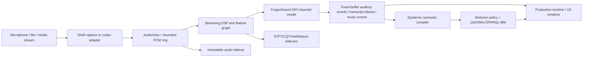
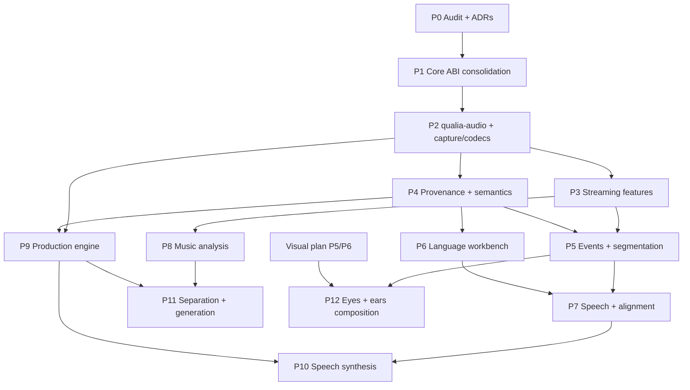

# Native Auditory, Language, and Music Intelligence for QualiaDB

**Status:** proposed implementation plan for review  
**Date:** 2026-07-03 (harmonized 2026-07-04)  
**Target branch:** `0.0.24`  
**Primary new crate:** `crates/qualia-audio`  
**Companion:** [`native-visual-intelligence-and-generative-3d.md`](native-visual-intelligence-and-generative-3d.md)
**Computational-geometry substrate:** [`native-computational-geometry.md`](native-computational-geometry.md)
§12.4 — the spectral-geometry seam (STFT/CQT/partial/chroma as geometric objects on the time-frequency
surface; the σ lane as the shared vision+audition spectral coordinate) and the shared-perception seam (the
`.10d` `t`-lane as the shared media timeline for cross-modal correlation) are mapped there.
**Scope:** acoustic event understanding, speech and language documentation, multilingual and
oral-language computational support, music analysis, music production, speech/audio generation,
and shared “eyes and ears” perception

This is the auditory companion to the native visual intelligence plan. It starts from QualiaDB's
existing U3 AcousticPlane, spectral sidecars, Sonic Tokens, Forge kernels, Q42/P64 split, and
governance stack. It does not introduce Candle, Burn, a Python service, or a second tensor runtime
as the centre of the architecture.

---

## 1. Intended outcome

Build a native auditory capability that can:

1. preserve and analyse recordings without reducing them to opaque text;
2. detect and classify environmental and human-made sounds;
3. support speech segmentation, transcription, translation, pronunciation, and synthesis;
4. help communities define computational resources for languages that are under-resourced,
   primarily oral, use multiple writing systems, or are not represented online;
5. analyse music at waveform, spectral, performance, symbolic, structural, and cultural levels;
6. provide a bounded, sample-accurate multi-track production engine;
7. generate or transform audio offline while preserving provenance and consent; and
8. compose auditory observations with visual observations over a shared media timeline.

The first learned milestone is **local acoustic event classification plus voice-activity/segment
detection**. Speech recognition, music production, and generative audio build on the same
contracts rather than arriving as unrelated frameworks.

---

## 2. Framework decision: extend Qualia's compute substrate

### 2.1 Why Candle or Burn are not the production runtime

[Candle](https://github.com/huggingface/candle) and
[Burn](https://burn.dev/docs/burn/) are legitimate Rust ML frameworks. They bring their own tensor
types, device/backend abstraction, execution graph, allocator/memory planner, model loaders,
kernel selection, and—in Burn's case—training/autodiff stack.

Those are useful capabilities in a new application. In QualiaDB they overlap with machinery that
already exists:

- P64/GGUF/Safetensors weight ingestion;
- typed Forge compute DAGs;
- multi-backend kernel generation;
- CPU differential oracles and adapter-specific certification;
- shared wgpu device ownership;
- resident weight and lifecycle planning;
- thermal/power policy;
- Q42 graph serialization and provenance;
- Webizen intent/output governance; and
- caller-buffered hot-path constraints.

Making Candle or Burn own auditory inference would create two device owners, two tensor ABIs, two
memory planners, two graph representations, and two certification stories. That weakens the
pipeline the project is trying to strengthen.

They may still be used outside the production boundary:

- as a development reference oracle for a supported model;
- to inspect or convert a model during Phase 0;
- to generate golden tensors and block-level fixtures;
- to compare quality/performance in a benchmark; or
- as a temporary importer whose output is P64 plus a Qualia compute graph.

They must not leak tensor/device types into the `qualia-audio` public ABI or become a hidden
runtime dependency.

### 2.2 External DSP, codec, and capture libraries

The same rule applies more selectively to audio libraries:

- OS capture and playback necessarily use platform APIs through a shell adapter.
- Codec crates may decode/encode at a cold, explicit media boundary.
- A mature resampler or codec may be reused after an allocation, determinism, licence, WASM, and
  maintenance audit.
- Real-time callback and model execution contracts remain Qualia-owned, fixed-buffer Rust APIs.

No dependency is accepted merely because it is “pure Rust.” The review gate is:

1. Which missing capability does it provide?
2. Does it introduce a competing device or tensor runtime?
3. Can it operate through borrowed/caller-owned buffers?
4. Is unsafe code or FFI isolated and fuzzed?
5. Is its numerical behaviour testable against a Qualia reference?
6. Is it viable on native, WASM, and the intended edge profiles?
7. Are licence, maintenance, and supply-chain risks acceptable?

---

## 3. Current Qualia capabilities reviewers should know

### 3.1 Capability inventory

| Capability | Current status | Relevance and boundary |
|---|---|---|
| **U3 AcousticPlane** | Implemented on the browser/Pages path | `audio/acoustic_plane.rs` maps `Tensor10D` to acoustic parameters, uses a bounded Sonic Token ring, and shares `[α, μ, σ]` with the visual projection. Desktop host parity remains incomplete. |
| **Sonic Token** | Implemented | Eight-byte `Pod` events carry delta time, event type, channel, note, velocity, tensor index, and flags. The 8-bit delta, 16 channels, and 16-bit tensor index are a compact render/control ABI, not a complete DAW event format. |
| **STFT from real samples** | Implemented as cold ingest | `audio/stft.rs` computes Hann-windowed STFT using Forge FFT where available and a CPU floor otherwise, then bakes 64-bin magnitude previews. Its current nested `Vec` API is cold-path, not streaming analysis. |
| **CQT from real samples** | Implemented as cold ingest | `audio/cqt_bake.rs` provides a direct CPU constant-Q transform and sidecar bake. It is useful for pitch/music features but is not yet streaming, phase-preserving, or tuned for long recordings. |
| **Audio spectral sidecar** | Implemented first version | `Q4AU` stores a small header and frame-major 64-bin `f32` magnitude previews. It does not yet describe channels, hop size, window, phase, time origin, loudness calibration, mel/MFCC data, or arbitrary feature planes. |
| **Forge FFT and compute DAG** | Implemented for current op set | FFT, matmul, elementwise, reduce, broadcast, attention, and other primitives can be reused. Streaming Conv1D, transposed convolution, resampling, mel banks, overlap-add, and audio-specific state nodes are missing. |
| **Parametric DSP** | Implemented first version | `audio/dsp_kernel.rs` produces bounded parametric voices from tensor state. It is a sonification/synthesis layer, not a general effects or musical instrument engine. |
| **Binaural/HRTF** | Implemented | Analytic and KemarLite paths, HRIR synthesis, FIR convolution, and positional gains exist. Full measured datasets and production room acoustics remain optional work. |
| **AudioWorklet and shared-memory transport** | Implemented on browser path | `Q3AS` SAB, float mirror, token slots, fallback transport, and worklet synthesis exist. This is a good real-time transport contract, not an ingest or learned-audio runtime. |
| **Phenomenal visual/audio σ parity** | Implemented and tested | U2 and U3 derive visual and auditory projections from the same spectral signature. This remains a presentation invariant and must not be confused with speech/music feature axes. |
| **`webizen-render::audio_contract`** | Partial duplicate | It defines generative/PCM sheets and an allocating `AudioScene`; several comments claim zero heap while using `Vec`/`String`. It should be reconciled with the core audio ABI rather than expanded independently. |
| **Multi-modal lexicon hashes** | Implemented as identity hooks | `SemanticModality::{Text, AudioHash, CeremonialVisual, PhoneticSchema}` gives non-text forms deterministic 60-bit identities. It does not supply phonology, morphology, alignment, transcription, or equivalence between modalities. |
| **GGUF/P64 tokenizer and local LLM** | Implemented for supported text models | Useful for textual language modelling after transcription. A model tokenizer is not a universal language representation and must not define a community's phoneme or orthography inventory. |
| **HMM/Kalman and learning solvers** | Implemented | Sequential models, classifiers, clustering, active learning, resampling, and metrics can support compact acoustic models, segmentation, tracking, and evaluation. |
| **Q42/WAL/epistemic/deontic stack** | Implemented | Auditory observations, transcript proposals, speaker labels, musical analyses, consent, corrections, and provenance can be represented without declaring machine output as fact. |
| **Audio capture** | Not implemented | No microphone/device capture dependency or stable capture adapter is present. |
| **General audio codecs and canonical ingest** | Not implemented | There is no WAV/FLAC/Opus/AAC/MP3 decode pipeline, channel policy, resampler, or archival media descriptor in the core/client crates. |
| **Streaming perceptual feature engine** | Not implemented | No bounded ring-based STFT/CQT/log-mel/MFCC/pitch/onset/loudness pipeline consumes live PCM. |
| **Acoustic event detection** | Not implemented | No learned environmental-sound/audio-event encoder or classifier runs through Forge/P64. |
| **Speech recognition/translation** | Not implemented | TTS/STT notes in the phone plan are future shell work. There is no native audio encoder, CTC/seq2seq decoder, forced aligner, diarizer, or transcript compiler. |
| **Language documentation workbench** | Not implemented | Hash hooks and QApps exist, but no governed resource bundle for recordings, phones, lexemes, morphology, translations, elicitation sessions, or community review. |
| **Music analysis** | Partial primitives only | CQT and Sonic Tokens help, but pitch tracking, onset/beat/tempo, chroma, chords, key, structure, score alignment, and performance analysis are absent. |
| **DAW/music production** | Scaffold only | `AudioScene` contains basic tracks, mute, volume, pan, and time. There is no sample-accurate timeline, routing graph, automation, effects, recording, editing, undo, or offline bounce. |
| **Speech/audio generation** | Not implemented | U3 parametric sonification exists; neural TTS, voice conversion, source separation, music generation, and waveform/codec-token models do not. |

### 3.2 Existing modules to reuse, not duplicate

- `crates/qualia-core-db/src/audio/`
- `crates/qualia-core-db/src/net/sonic_token.rs`
- `crates/qualia-core-db/src/wgsl_forge/`
- `crates/qualia-core-db/src/gpu_context.rs`
- `crates/qualia-core-db/src/q42/p64_weight.rs`
- `crates/qualia-core-db/src/inference/residency_planner.rs`
- `crates/qualia-core-db/src/inference/orchestrator.rs`
- `crates/qualia-core-db/src/query/lexicon.rs`
- `crates/qualia-core-db/src/solvers/learning/`
- `crates/qualia-core-db/src/solvers/transforms/`
- `crates/qualia-core-db/src/sparql_library/sparql_mm.rs`
- `crates/webizen-render/src/audio_contract.rs`
- `docs/js/qualia-audio-worklet.js`
- `docs/manuals/standards/q42-acoustic-plane-draft.md`
- `docs/manuals/adr/0007-u3-acoustic-plane-symbolic-audio.md`

---

## 4. Architectural boundaries

### 4.1 Crate responsibilities

| Layer | Responsibility |
|---|---|
| **`qualia-core-db::audio`** | Stable Sonic Token, spectral-sidecar, U3 uniform/SAB, DSP/HRTF, semantic compilation, and hot-path ABI definitions |
| **`qualia-audio`** | Borrowed audio views, codec/capture adapters, resampling, streaming features, learned audio model adapters, language/music analysis, production timeline, offline generation |
| **WGSL Forge + shared GPU** | Typed compute graphs, certified kernels, resident weights, transient buffers, shared adapter execution |
| **P64** | Learned model weights and their mathematical descriptors |
| **Q42/NQuins** | Media identity, time-aligned observations, language/music semantics, provenance, consent, licences, corrections, model receipts |
| **Content-addressed sidecars** | Original recordings, canonical lossless derivatives, feature planes, transcripts/alignments, stems, mixes, model outputs |
| **Desktop/browser shell** | Device permission, microphone/audio-device selection, platform capture/playback, file picker, visible session state |

`webizen-render::audio_contract` should become an adapter over core contracts or be deprecated.
There must be one authoritative spectral/event ABI.

### 4.2 Source recording versus semantic truth

The existing acoustic standard says not to treat MP3/AAC as semantic truth. That must not be
interpreted as permission to discard source recordings.

For language documentation, evidence, music, and cultural archives:

1. preserve the imported/captured source bytes as an immutable content-addressed asset when policy
   permits;
2. create a canonical decoded/lossless analysis derivative with explicit sample format, rate,
   channels, layout, and clock;
3. derive spectral sheets, embeddings, segments, and model results from that asset;
4. store semantic claims and derivation links in Q42; and
5. keep access, retention, and cultural-protocol rules attached to both source and derivatives.

Q4AU is a compact spectral projection. It is not a substitute for the recording.

### 4.3 Real-time and cold-path separation



The real-time callback may move samples between preallocated buffers and update atomic/ring state.
It must not decode files, allocate, write Q42, run unbounded beam search, block on GPU completion,
or perform filesystem/network I/O.

---

## 5. Public API shape for `qualia-audio`

```rust
#[repr(u8)]
pub enum SampleFormat {
    I16,
    I24Packed,
    I32,
    F32,
}

#[repr(C)]
pub struct AudioView<'a> {
    pub bytes: &'a [u8],
    pub frames: u32,
    pub channels: u16,
    pub sample_rate: u32,
    pub frame_stride_bytes: u32,
    pub format: SampleFormat,
}

#[repr(C)]
pub struct AuditoryEvent {
    pub class_hash: u64,
    pub source_hash: u64,
    pub confidence_u16: u16,
    pub channel: u16,
    pub start_frame: u64,
    pub end_frame: u64,
    pub track_id: u32,
    pub flags: u32,
}

#[repr(C)]
pub struct TranscriptToken {
    pub form_hash: u64,
    pub proposed_meaning_hash: u64,
    pub confidence_u16: u16,
    pub language_slot: u16,
    pub start_frame: u64,
    pub end_frame: u64,
    pub speaker_track: u32,
    pub flags: u32,
}

pub trait AuditoryModel {
    fn capabilities(&self) -> AuditoryCapabilities;

    fn infer_chunk(
        &mut self,
        audio: AudioView<'_>,
        events_out: &mut [AuditoryEvent],
        tokens_out: &mut [TranscriptToken],
        embedding_out: &mut [f32],
        workspace: &mut [u8],
    ) -> Result<AuditoryOutputCounts, AudioError>;
}
```

Frames—not floating-point seconds—are authoritative at the compute boundary. A rational media
time base maps them to presentation time. Wall-clock/capture time and Q42 Lamport time remain
separate fields.

Proposed features:

```toml
default = ["cpu-reference"]
cpu-reference = []
gpu = ["qualia-core-db/gpu-runtime", "qualia-core-db/wgsl-forge"]
codecs = []
native-capture = []
speech = ["gpu"]
music = []
production = []
generation = ["gpu"]
```

Codec and platform-capture dependencies are selected only after Phase 0 audits. They remain behind
adapters and do not alter these public views.

---

## 6. Shared eyes-and-ears representation

Visual and auditory systems share:

- a content-addressed `MediaAsset`;
- explicit media timelines and fragments;
- model execution receipts;
- epistemic claims and confidence;
- sensitivity, consent, retention, and licence policy;
- Q42 derivation/provenance;
- SPARQL-MM query surfaces;
- P64 model bundles;
- Forge execution and adapter certification; and
- 10D semantic projection where useful.

They do **not** share an invented universal dense tensor. Pixels, PCM, spectrograms, feature maps,
meshes, masks, and embeddings retain typed layouts.

Cross-modal observations link through asset/time identities:

```text
video asset
├── visual observation: proposed class "dog", frames 1200..1480, region R7
├── auditory observation: proposed class "bark", frames 5775360..5913600
└── alignment: both overlap media interval T and may describe the same event
```

The inference that the dog produced the bark is a causal/epistemic proposition, not a join made
true solely by temporal overlap.

---

## 7. Language support as infrastructure, not just ASR

### 7.1 Language resource bundle

Each language or language variety should be representable without requiring an existing model,
ISO code, online corpus, or standardized orthography.

```text
LanguageResourceBundle
├── community/authority DID and governance policy
├── local name(s), external identifiers where accepted, and variety relationships
├── access class and cultural/ceremonial protocol
├── recordings and elicitation-session provenance
├── speaker/performer consent and permitted uses
├── phone/phoneme inventory or community-defined sound categories
├── orthography/grapheme inventory (zero, one, or many)
├── pronunciation and grapheme-to-sound relationships
├── lexemes, morphemes, meanings, translations, and usage examples
├── aligned utterance/word/morpheme/phone time tiers
├── gestures/images/places/objects linked to meaning where appropriate
├── model and evaluation artifacts
└── revision, review, correction, and dispute history
```

BCP 47, Glottolog, ISO 639, IPA, Unicode, and other external systems may be linked when appropriate.
They are not allowed to erase community names, force an unsupported writing system, or make oral
knowledge second-class.

### 7.2 Computational ladder for a newly supported language

1. **Governance first:** identify authority, consent, access, benefit, retention, and export rules.
2. **Capture:** record losslessly with device/calibration/session metadata.
3. **Segmentation:** human-assisted utterance, pause, event, and speaker-turn boundaries.
4. **Sound inventory:** cluster/review acoustic segments; define phones or local categories.
5. **Alignment:** link recordings to meanings, translations, images, gestures, and optional text.
6. **Lexicon:** create pronunciation, morphology, examples, and semantic graph links.
7. **Compact models:** VAD, keyword/phrase recognition, pronunciation search, or phone recognition.
8. **ASR:** only after sufficient reviewed material and a suitable evaluation protocol exist.
9. **Synthesis:** only with explicit voice/performer/community permissions and misuse controls.
10. **Maintenance:** corrections, dialect/variety separation, model drift, and access changes.

This ladder creates value long before a full speech recognizer is statistically possible.

### 7.3 Representation rules

- `AudioHash` identifies bytes; it does not assert two recordings have the same meaning.
- `PhoneticSchema` identifies a schema; it does not assume IPA or a Western phonological model.
- Written form, pronunciation, meaning, speaker performance, and translation are distinct nodes.
- Machine transcription and alignment are epistemic proposals with model/version/confidence.
- Human/community review can attest, reject, or supersede without deleting the proposal.
- Restricted ceremonial recordings must not be used for training merely because they are stored.

---

## 8. Music and production representation

### 8.1 Analytical layers

Music analysis should keep multiple coexisting views:

| Layer | Examples |
|---|---|
| Signal | waveform, channels, sample format, loudness, noise, dynamics |
| Spectral | STFT/CQT, partials, timbre, chroma, spectral flux |
| Event | onset, pitch, duration, velocity, articulation, instrument proposal |
| Rhythmic | pulse, tempo curve, beat, metre, swing, polyrhythm |
| Harmonic | pitch-class representation, chord/key proposals, tuning system |
| Structural | phrase, section, repetition, variation, transition |
| Performance | timing, dynamics, intonation, gesture, spatial position |
| Symbolic | score/MIDI/MPE or community notation |
| Cultural/semantic | work, practice, ceremony, genre claims, participants, rights, provenance |

No single equal-tempered MIDI representation is universal. Sonic Tokens remain a compact renderer
event ABI; extended musical events need a versioned sidecar/timeline capable of higher-resolution
pitch, tuning, duration, articulation, and automation.

### 8.2 Production engine boundaries

A DAW-like engine needs:

- sample-accurate clip/event timeline;
- bounded track, bus, send, and effect graph;
- preallocated audio-block processing;
- automation lanes;
- destructive and non-destructive edit distinction;
- immutable source media plus derived renders;
- latency compensation;
- offline deterministic bounce;
- undo/history through operation records;
- device-independent session format; and
- explicit plugin sandbox/ABI if plugins are later supported.

Q42 describes session structure, authorship, rights, relations, and revisions. Dense PCM and
automation/event arrays live in typed sidecars. The audio callback reads a compiled fixed execution
plan, not the graph database.

---

## 9. Learned model and Forge requirements

### 9.1 Model order

Implement in increasing complexity:

1. compact acoustic embedding and event classifier;
2. voice/activity and general audio segmentation;
3. streaming speech encoder with keyword/phone recognition;
4. full transcription/translation for one well-supported test language;
5. music event and structure models;
6. source separation/restoration;
7. text/phoneme-to-speech with explicit voice consent;
8. audio/music generation.

### 9.2 Likely Forge extensions

Confirm against selected Phase-0 model graphs before changing the IR:

- streaming `Conv1D` and general `Conv2D`;
- depthwise/group convolution;
- transposed convolution for decoders;
- pooling and strided reduction;
- resample/interpolation and polyphase filter primitives;
- STFT/ISTFT windowing and overlap-add;
- mel/filterbank matrix application;
- layout/view/transpose/concat;
- normalization variants;
- recurrent/state-space scan where a selected model requires it;
- bounded CTC greedy and beam decode support;
- codec-token sampling for later generators.

Existing FFT, matmul, gather/dequant, attention, softmax, elementwise, reduce, broadcast, Slice,
Rope, resident weights, and shared-device execution should be reused.

### 9.3 Streaming state

A graph execution receipt must distinguish:

- immutable resident weights;
- session-persistent model state;
- rolling PCM/features;
- per-chunk transient workspace; and
- durable emitted events.

State continuity is keyed by media/capture session and explicit chunk sequence. Dropped,
duplicated, or reordered chunks must be detectable. Models may declare look-behind, look-ahead,
chunk, and algorithmic latency in frames.

---

## 10. Semantic and query representation

### 10.1 Auditory observations

Proposed vocabulary aliases:

- `q42:AudioAsset`
- `q42:AudioChannel`
- `q42:AudioFragment`
- `q42:AuditoryObservation`
- `q42:SpeechSegment`
- `q42:TranscriptProposal`
- `q42:LanguageVariety`
- `q42:PhoneticInventory`
- `q42:LexicalEntry`
- `q42:Pronunciation`
- `q42:Morpheme`
- `q42:Translation`
- `q42:MusicEvent`
- `q42:Performance`
- `q42:ProductionSession`
- `q42:proposesSoundClass`
- `q42:proposesWrittenForm`
- `q42:proposesMeaning`
- `q42:spokenBy`
- `q42:performedBy`
- `q42:alignedFragment`
- `q42:usesOrthography`
- `q42:usesTuningSystem`
- `q42:hasSpectralSidecar`
- `q42:hasFeatureSidecar`
- `q42:derivedStem`
- `q42:renderedMix`
- `q42:permittedTrainingUse`

All aliases become canonical IRIs hashed with `q_hash`.

### 10.2 SPARQL-MM extensions

The companion visual plan already requires foundational SPARQL-MM repair. Audio adds:

- sample/frame-accurate fragment bounds;
- channel and track selection;
- intersection/containment over media time;
- aligned transcript, phone, music-event, and visual-region queries;
- source-versus-derived asset relationships;
- model/confidence/review status;
- media-clock conversion without abusing Lamport metadata; and
- caller-buffered result APIs.

Example questions:

- Which reviewed words overlap this recording interval?
- Which model proposed this phone, and against which inventory revision?
- Where does this motif recur across performances?
- Which stems and effects produced this mix?
- Which audible events coincide with a visual observation?
- Which recordings are permitted for playback but not model training?

---

## 11. Implementation phases

### Phase 0 — Capability audit, ADRs, and reference corpus

**Goal:** establish the real baseline and choose the first useful models and media fixtures.

Deliverables:

- ADR: Qualia-native runtime versus external framework/reference tooling.
- ADR: source recording, canonical PCM, Q4AU features, Sonic Tokens, and Q42 responsibilities.
- ADR: `qualia-core-db::audio` versus `qualia-audio` ownership.
- Audit and consolidation plan for `webizen-render::audio_contract`.
- Model-op/memory matrices for the first acoustic classifier and speech encoder candidate.
- Redistribution-safe fixtures: tones, impulses, noise, environmental events, speech, music,
  multichannel snippets, and malformed files.
- A small, explicitly consented language-resource fixture with multiple alignment tiers.

Acceptance:

- every selected model op, state tensor, preprocessing rule, latency, and peak allocation is known;
- source and model licences permit the intended tests;
- no framework is selected merely because it already has a demo.

### Phase 1 — Consolidate core acoustic contracts

**Goal:** make the existing audio foundation authoritative and internally consistent.

Deliverables:

- reconcile U3 code, `AUDIO_PROJECT_STATUS.md`, acoustic draft, and renderer contract;
- one fixed `SpectralFrameView`/sidecar view type without `Vec`;
- version Q4AU metadata to include transform kind, channels, frame/hop/window, time origin, and
  feature-plane descriptors while retaining v1 reading;
- document Sonic Token limits and add an extended cold timeline format rather than overloading its
  bits;
- desktop parity for core U3 transport or an explicit tracked dependency if it remains separate;
- allocation audit for the worklet/callback hand-off.

Acceptance:

- browser and native adapters consume the same core ABI;
- v1 sidecars remain readable;
- spectral/event layout tests and σ parity remain green.

### Phase 2 — `qualia-audio` fixed-buffer API, capture, and codecs

**Goal:** ingest and stream real audio without making device or codec types architectural.

Deliverables:

- `AudioView`, mutable block view, channel layout, sample format, media time base, events, tokens,
  capabilities, errors, and workspace planner;
- bounded interleaved/planar conversion and sample-format conversion;
- deterministic channel mix policy;
- resampler with declared latency and CPU oracle;
- cold codec adapters for the accepted source formats;
- native/browser capture adapters with explicit permission and visible session state;
- content hashing and immutable source/canonical derivative commit.

Acceptance:

- repeated block conversion/resampling performs no allocations after construction;
- impulse, sine, channel-order, clipping, and rate-conversion golden tests pass;
- malformed or oversized media fails before unbounded allocation;
- capture cannot begin without shell permission and Webizen intent.

### Phase 3 — Streaming feature engine on Forge

**Goal:** turn the existing cold STFT/CQT functions into bounded streaming computation.

Deliverables:

- ring-based window/hop framing;
- phase-preserving STFT and ISTFT;
- CQT or log-frequency representation with a declared streaming policy;
- log-mel, MFCC, energy/loudness, zero crossing, spectral centroid/rolloff/flux;
- foundational pitch and onset features;
- CPU oracles and Forge kernels where acceleration is beneficial;
- typed multi-plane feature sidecars and 64-bin U3 preview projection.

Acceptance:

- chunked and one-shot transforms agree within tolerance;
- no boundary click/data loss across chunks;
- odd final chunks have explicit pad/drop policy;
- A2000 and CPU paths return the same classified feature values within certification tolerance.

### Phase 4 — Media provenance and auditory semantic compiler

**Goal:** make source, derivatives, features, observations, and access rules queryable.

Deliverables:

- Q42 compiler for audio asset, channel, fragment, feature, model run, and observation;
- epistemic representation for learned labels/transcripts;
- SHACL for sample formats, fragment bounds, confidence, model digest, and derivation;
- SPARQL-MM sample/time/channel queries;
- correction/attestation workflow;
- sensitivity propagation from recording to transcript, embedding, and derived stems.

Acceptance:

- an observation round-trips with identical frame bounds, time base, class, confidence, model, and
  source digest;
- correction does not erase the machine proposal;
- a restricted source cannot leak through an unrestricted transcript or embedding.

### Phase 5 — Acoustic events and segmentation

**Goal:** ship the first learned “ears” capability.

Deliverables:

- native P64/Forge acoustic encoder and compact classifier;
- environmental/event class ontology binding;
- VAD/general acoustic segmentation;
- bounded event smoothing and overlap handling;
- active-learning queue for uncertain/unrecognized events;
- calibration and abstention.

Acceptance:

- held-out real audio reports per-class precision/recall/F1, false alarms per hour, calibration,
  latency, and abstention;
- synthetic/augmented audio is never the only evaluation set;
- overlapping events can coexist;
- silence/noise does not force a class.

### Phase 6 — Community-governed language resource workbench

**Goal:** create useful computational language support before full ASR.

Deliverables:

- versioned `LanguageResourceBundle`;
- recording/session/consent workflow;
- sample-accurate multi-tier annotation editor;
- sound/phone inventory and community-defined phonetic schema;
- multiple orthographies and pronunciation links;
- lexeme, morpheme, meaning, translation, image/gesture/place links;
- import/export adapters for selected open linguistic formats without making one format canonical;
- review roles, disputes, revisions, and culturally bounded access/training permissions.

Acceptance:

- an oral-only language can be represented without invented text;
- one concept may have several pronunciations, forms, varieties, and contexts;
- access and permitted-use rules survive export/import;
- machine suggestions are visibly distinct from community-reviewed resources.

### Phase 7 — Native speech and alignment

**Goal:** execute speech models through Qualia's compute path.

Deliverables:

- selected streaming speech encoder graph and P64 bundle;
- VAD-connected utterance processing;
- bounded CTC greedy decode first, then bounded beam/lexicon decode if justified;
- keyword/phrase and phone recognition modes for small corpora;
- forced/aligned proposal generation with human correction;
- transcript compiler to language-resource and media-fragment graph;
- optional translation only where its text model and evaluation are separately supported.

Acceptance:

- block outputs match a trusted reference framework;
- word/phone error rates and time-alignment error are reported by language/variety;
- unknown speech may remain untranscribed;
- the decoder cannot silently map an unsupported language to a superficially similar supported one.

### Phase 8 — Music analysis

**Goal:** build reusable musical features and event/structure proposals.

Deliverables:

- pitch/fundamental tracking with confidence and polyphony limitations;
- onset, beat, tempo-curve, and metre proposals;
- chroma/tuning-system-aware pitch-class features;
- chord/key analysis as optional culturally scoped models, not universal truth;
- section/repetition/novelty analysis;
- score/MIDI alignment adapters;
- performance comparison over timing, dynamics, and intonation;
- music-ontology/Q42 mappings and review surfaces.

Acceptance:

- synthetic tones/rhythms and real licensed music fixtures have golden results;
- algorithms declare tuning/rhythmic assumptions;
- non-applicable harmonic models abstain;
- analyses retain model/version/confidence and can conflict without overwrite.

### Phase 9 — Native production engine

**Goal:** turn `AudioScene` from a data sketch into a bounded production runtime.

Deliverables:

- sample-accurate clip/event timeline and compiled execution plan;
- fixed-capacity tracks, buses, sends, effects, and automation for each runtime profile;
- gain, pan, mute/solo, fades, EQ/filter, dynamics, delay, convolution/reverb primitives;
- recording and non-destructive editing;
- latency compensation and metering;
- deterministic offline bounce to caller/file boundary;
- Q42 session graph, operation history, authorship, credits, rights, and derivation;
- optional MIDI/MPE/OSC adapters through bounded event queues.

Acceptance:

- audio callback has zero allocation, locks, filesystem, graph traversal, and network I/O;
- offline and real-time render agree for deterministic effects;
- edits never mutate immutable source assets;
- bounced mix can be traced to clips, effects, automation, and contributors.

### Phase 10 — Speech synthesis and voice transformation

**Goal:** provide accessible local speech output without normalizing unauthorized voice cloning.

Deliverables:

- text/phoneme frontend bound to a language-resource revision;
- selected TTS model through P64/Forge;
- speaker/voice asset with explicit consent scope;
- pronunciation override and community review;
- streaming or offline vocoder path;
- accessibility integration distinct from U3 manifold sonification;
- revocation and re-render policy for voice permissions.

Acceptance:

- intelligibility/pronunciation and speaker-similarity metrics are accompanied by human review;
- absent voice permission prevents synthesis;
- a voice permitted for playback is not automatically permitted for cloning/training;
- generated PCM is a derived sidecar, never emitted directly by U0 into the U3 hot path.

### Phase 11 — Source separation, restoration, and generative music/audio

**Goal:** add heavier creative models after storage, provenance, production, and consent are sound.

Deliverables:

- one selected separation/restoration model;
- typed stem/repair derivations;
- one selected symbolic or codec-token music/audio generator;
- deterministic seed/model/sampler receipts;
- production-timeline import of generated events/stems;
- quality, artefact, licence, and cultural-use evaluation;
- cancellation and resource admission.

Acceptance:

- generated/separated audio is never confused with source evidence;
- contributor and training-source licence requirements remain visible;
- exact model bundle and seed/sampler state are recorded;
- A2000 memory, latency, thermal behaviour, and quality tradeoffs are measured.

### Phase 12 — Cross-modal perceptual composition

**Goal:** make “eyes and ears” more than two independent toolbars.

Deliverables:

- shared media-clock service for video/audio;
- bounded visual/auditory event correlation proposals;
- cross-modal search and retrieval embeddings stored as sidecars;
- audiovisual scene/event graph;
- renderer overlay plus spatial audio navigation;
- disagreement/uncertainty UI;
- combined evaluation for temporal localization and event association.

Acceptance:

- clock drift and offsets are explicit and testable;
- temporal overlap alone never becomes an asserted causal identity;
- either modality can be absent;
- combined inference preserves each source model's provenance and confidence.

---

## 12. Storage and retention

| Artifact | Default treatment |
|---|---|
| Imported source recording | Immutable, content-addressed, governed by user/community policy |
| Canonical lossless derivative | Pinned when required for reproducible analysis; otherwise regenerable from preserved source |
| PCM block cache | Evictable |
| Q4AU/feature sidecars | Regenerable unless signed/published as an analysis artifact |
| Embeddings | Derived sensitive data; quota, access, and deletion policy required |
| Transcript/alignment proposal | Durable provenance; machine status retained |
| Reviewed language resources | Durable, revisioned, governed |
| Production source clips | Immutable |
| Mix previews/proxies | Evictable |
| Final masters/stems | User-selected retention and rights policy |
| Model P64 bundles | Installed/pinned or LRU according to model policy |
| Generated speech/music | Derived asset with model/seed/consent/licence receipt |

Storage estimates must be derived from recording duration, channel count, sample format/rate,
codec, feature planes, model bundle bytes, and retained derivatives. A guessed global disk number
is not an engineering budget.

---

## 13. Verification matrix

| Layer | Required evidence |
|---|---|
| Audio views | layout/stride/channel tests, malformed input fuzzing, cross-platform byte vectors |
| Capture/codecs | source hash, decode golden PCM, channel/rate metadata, truncation/error handling |
| Resampling/DSP | impulse/frequency response, latency, phase, clipping, chunk equivalence |
| Spectral features | sine/impulse/noise vectors, CPU/GPU differential tests, inverse round-trip |
| Forge/model | op-level oracle, Naga validation, reference-framework block/model parity |
| Streaming | chunk order, gaps, overlap, state reset, bounded back-pressure |
| Events/ASR/music | held-out real data, per-domain metrics, calibration, abstention, localization |
| Language resources | multi-form/oral-only fixtures, permissions, revision and correction round-trip |
| Production | zero-allocation callback, offline/real-time equality, latency compensation |
| Semantics | Q42/WAL/SPARQL-MM round-trip, SHACL, epistemic status, valid parity |
| Governance | consent denial, sensitivity inheritance, cultural protocol, no unauthorized egress |
| Performance | real-time factor, block deadline misses, CPU heap, 42 MiB pass audit, VRAM, power/thermal |

Expected commands will include:

```text
cargo test -p qualia-audio
cargo test -p qualia-core-db audio:: --lib
cargo test -p qualia-core-db phenomenal_hrtf phenomenal_sigma_visual_audio_parity --lib
cargo test -p webizen-render
cargo check -p qualia-client-core -p webizen-desktop -p webizen-studio
node docs/tests/phenomenal-verify.mjs --wasm-api docs/pkg/qualia/qualia.d.ts
```

Hardware tests remain opt-in and record adapter, backend, model digest, audio device, block size,
sample rate, schedule, and evidence level.

---

## 14. Governance and human-rights requirements

1. **Recording consent:** visible capture state, purpose, participants, storage, retention, and
   permitted-use scope.
2. **Voice is sensitive:** speaker recognition, diarization, emotion inference, health inference,
   and voice cloning require separate explicit capability/policy gates.
3. **Community authority:** language and cultural resources remain governed by the relevant people;
   public availability is not presumed.
4. **Oral knowledge equality:** no requirement that meaning first become Unicode text.
5. **Cultural protocols:** ceremonial, gender/role-restricted, seasonal, place-bound, sacred, or
   otherwise governed materials can carry enforceable access and training restrictions.
6. **No model laundering:** playback, research, annotation, training, synthesis, commercial use,
   and redistribution are distinct permissions.
7. **Epistemic honesty:** transcripts, translations, speaker labels, chords, genres, emotions, and
   meanings are proposals unless appropriately attested.
8. **Contestability:** speakers, performers, communities, and users can correct, restrict,
   deprecate, or dispute derived claims while preserving the audit trail.
9. **No silent egress:** recordings, transcripts, embeddings, and voice models stay local unless a
   separate authorized action succeeds.
10. **Accessibility without appropriation:** TTS and language tooling should increase access while
    preserving speaker/community control and benefit.

---

## 15. Dependency order



Language-resource work can begin before ASR. Music analysis and production can proceed in parallel
after the shared ingest/feature/semantic foundations exist. Generative audio is intentionally
late; it is not needed to deliver useful auditory intelligence.

---

## 16. Explicit non-goals

- Do not replace Forge/P64/shared wgpu with Candle or Burn.
- Do not make a codec, capture, or framework tensor type part of the public ABI.
- Do not treat Q4AU previews as the original recording.
- Do not put PCM, model weights, or feature matrices inside NQuins.
- Do not reinterpret `[q,v,w,x,y,z,t,α,μ,σ]` as arbitrary audio tensor axes.
- Do not equate model tokenizers with human language structure.
- Do not require writing before an oral language can be represented.
- Do not assume IPA, twelve-tone equal temperament, MIDI, Western harmony, or four-four metre is
  universally applicable.
- Do not run filesystem/network/graph operations from an audio callback.
- Do not call machine transcripts, translations, genres, emotions, or speaker identities facts.
- Do not enable voice cloning from a generic playback or recording permission.
- Do not route LLM-generated PCM directly from U0 into U3.

---

## 17. Questions for design review

1. Is `qualia-audio` the preferred public crate name, with U3 retained in core?
2. Should shared media/model/observation contracts live in `qualia-core-db`, or in a small
   `qualia-perception` crate used by both `qualia-vision` and `qualia-audio`?
3. Which lawful, redistribution-safe acoustic event corpus should certify Phase 5?
4. Which language/community partnership should guide the first real resource bundle?
5. Which source and canonical-lossless formats are mandatory in Phase 2?
6. Should Q4AU v2 support arbitrary feature planes or separate typed sidecar formats?
7. What parts of `webizen-render::audio_contract` remain useful after consolidation?
8. Which first speech model fits Forge's smallest justified op extension?
9. Which music assumptions must always be explicit in analysis outputs?
10. What is the first permitted TTS voice source and revocation policy?
11. Which first cross-modal use case materially benefits from combined visual/audio reasoning?

---

## 18. Definition of the first auditory release

The first release is complete when a user can:

1. import or visibly capture audio into the governed content-addressed media store;
2. preserve the source and create a canonical, explicitly described analysis derivative;
3. stream it through fixed-buffer STFT/CQT/log-mel features;
4. run a local P64/Forge acoustic classifier and segmenter;
5. receive bounded, calibrated events with sample-accurate intervals;
6. inspect them as epistemic claims linked to source, model, consent, and provenance;
7. query them through corrected SPARQL-MM;
8. correct/reject them without losing the machine proposal; and
9. hear/navigate the result through the existing U3 path.

Full ASR, language models, DAW production, TTS, and generative audio are later releases built on
this same substrate.
