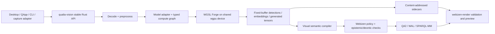
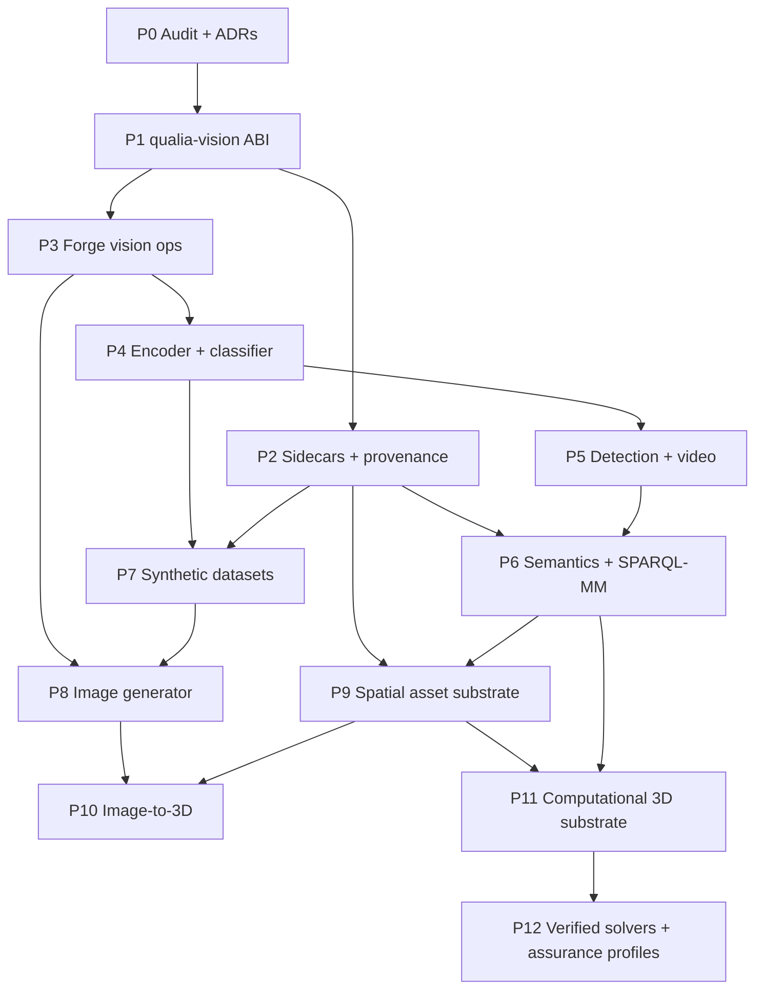

# Native Visual Intelligence and Generative 3D for QualiaDB

**Status:** in progress — Phase 1 ABI + CPU reference landed (`crates/qualia-vision`)  
**Date:** 2026-07-03 (harmonized 2026-07-04; Phase-1 start 2026-07-10)  
**Target branch:** `0.0.24`  
**Primary new crate:** `crates/qualia-vision` (workspace member; `cargo test -p qualia-vision`)  
**Auditory companion:** [`native-auditory-language-and-music-intelligence.md`](native-auditory-language-and-music-intelligence.md)  
**3D capability manual:** [`../manuals/computational-3d-assets-and-digital-twins.md`](../manuals/computational-3d-assets-and-digital-twins.md)
**Computational-geometry substrate:** [`native-computational-geometry.md`](native-computational-geometry.md)
§12 — Phase 9 (compiled spatial assets: mesh validation, decimation, BVH/meshlet/adjacency) depends on the
computational-geometry P2 (topology/spatial query) + P4 (3D algorithms); Phase 10 (image-to-3D) depends on
P4/P5 (reconstruction/meshing); Phase 11 (digital-twin substrate) depends on the `.10d` AnalysisMesh/Field
sections. The `.10d` container is the compiled geometry sidecar this plan's Phase 9 emits.
**Scope:** image classification, object detection, video understanding, governed synthetic
training data, native image generation, image-to-3D asset generation, compiled spatial assets,
and tiered engineering/biological digital twins

This plan translates the originating design conversation into the architecture that actually
exists in QualiaDB. It deliberately separates implemented capabilities, partial scaffolding,
and missing work so reviewers can judge the proposal without assuming that a named module is
already production-ready.

---

## 1. Intended outcome

Build visual intelligence as an independent native Rust library in the Qualia workspace, then
expose it to desktop, renderer, QApps, SPARQL-MM, and the Webizen runtime through stable
interfaces.

The system should eventually support five related but independently useful workflows:

1. **Understand images:** classify an image, detect multiple objects, optionally segment their
   regions, and express the results as confidence-bearing, provenance-linked semantic claims.
2. **Understand video:** run bounded frame sampling, detection, and tracking without treating
   every frame as a new unrelated graph.
3. **Build classifiers locally:** begin with a frozen visual encoder plus a compact trainable
   head; use governed real and synthetic examples to improve a selected domain rather than
   training a large vision model from scratch.
4. **Generate spatial assets:** run a local image generator and, later, an image-to-3D model;
   validate and store the resulting mesh/material asset while linking it to the source image,
   prompt, model, licence, and semantic identity.
5. **Compute over spatial assets:** compile render and analysis meshes into Q42-linked,
   page-aligned payloads, then run explicitly tiered engineering, biological, medical, or
   molecular workflows with units, convergence, uncertainty, validation, and safety evidence.

The first production milestone is **reliable local object classification/detection**, not the
entire generative pipeline at once.

---

## 2. Corrections to the originating advice

Several ideas in the conversation are directionally useful but do not fit QualiaDB as stated.

| Advice or assumption | Repository-grounded correction |
|---|---|
| Use a multimodal LLM as the primary real-time classifier and ask it for JSON bounding boxes. | A VLM is useful for open-vocabulary descriptions and disambiguation, but it is not the deterministic hot-path detector. Use a dedicated visual encoder/detector for boxes and scores, with an optional VLM enrichment pass. |
| Store raw images, embeddings, meshes, and pipeline state in one 10D tensor. | `Tensor10D` is a 40-byte semantic/manifold coordinate `[q,v,w,x,y,z,t,α,μ,σ]`. Dense pixels, feature maps, depth, masks, and geometry belong in typed sidecars or GPU buffers. A visual result may project into the 10D manifold; it must not redefine its axes. |
| Put generated meshes in either Q42 or P64. | Q42 stores semantic graph records and provenance. P64 stores page-aligned model weights and contains no NQuins. Images, videos, datasets, and GLB assets need content-addressed sidecars linked from Q42. |
| Add a Python or ComfyUI bridge as the architecture. | Import/export adapters may be useful for development, but the production capability should run through native Rust, P64/model manifests, the shared wgpu device, and WGSL Forge. |
| Use `qpu_dispatcher.rs` for heavy vision work. | Dense vision inference is classical GPU work. It belongs on the shared wgpu/Forge path. QPU paths are not substitutes for convolution, attention, raster processing, or mesh reconstruction. |
| The current `diffusion` module is an image generator. | `modalities/diffusion.rs` is graph/belief diffusion, and its WGSL pass still contains an explicit mock cellular rule. It is unrelated to latent image diffusion. A visual generator needs a distinct namespace and runtime. |
| Synthetic images avoid copyright, privacy, and provenance issues. | Synthetic data can reduce some collection risks but is not automatically rights-clean, unbiased, or correctly labelled. Generator/model licences, source references, prompt/seed, transformations, and evaluation provenance must be recorded. |
| Twelve GiB of VRAM guarantees that a named model fits. | Admission must be based on the exact weight bytes, quantization, activation/KV estimates, work buffers, and current adapter budget. Model names and community memory claims are not a memory plan. |
| OpenCV should become the core engine. | The stable core should be backend-neutral Rust views and fixed-buffer operations. OpenCV can be an optional compatibility/capture adapter behind a feature flag, not a type dependency throughout Qualia. |
| Converting a GLB to Q42 means the geometry is already native and accelerated. | The current CLI writes semantic mesh facts to Q42 but does not preserve dense geometry there or emit a compiled geometry payload. Keep Q42 as the semantic/control plane and add a page-aligned geometry/analysis sidecar so the renderer and solvers do not repeatedly parse GLB. |
| The heaviest simulation tier is also the safest. | Fidelity and assurance are independent axes. A costly nonlinear run may still be exploratory; a safety-relevant result requires verified inputs, convergence, uncertainty, applicable standards, independent evidence, and competent-human sign-off. |

### 2.1 External framework and computer-vision library policy

[Candle](https://github.com/huggingface/candle) and
[Burn](https://burn.dev/docs/burn/) are real Rust ML frameworks, but adopting either as the
production visual runtime would duplicate Qualia's tensor graph, device/backend ownership, memory
planner, model loader, kernel selection, and certification path. They may be used as development
references, conversion tools, or golden-output generators; their tensor/device types must not
enter the `qualia-vision` ABI.

Pure-Rust computer-vision libraries such as
[PureCV](https://docs.rs/purecv/latest/purecv/) or
[Kornia-rs](https://www.kornia.org/) may be evaluated operation by operation. “RustCV” is not a
single established replacement contract that should be selected by name alone. Pure Rust removes
one FFI boundary; it does not automatically guarantee zero allocation, deterministic results,
better performance, correct SIMD/GPU behaviour, or compatibility with Qualia's fixed buffers.

OpenCV remains useful as an optional interoperability/reference adapter where it has a mature
algorithm or device integration that Qualia lacks. No external library—C++, Rust, or otherwise—is
accepted wholesale. Each proposed dependency must identify the exact gap it fills and pass:

1. borrowed/caller-buffer compatibility and allocation audit;
2. unsafe/FFI isolation and fuzzing where applicable;
3. numerical comparison with a Qualia CPU/GPU oracle;
4. native/WASM/edge profile review;
5. licence, maintenance, and supply-chain review; and
6. proof that it does not create a competing tensor or GPU-device runtime.

---

## 3. Current Qualia capabilities reviewers should know

### 3.1 Capability inventory

| Capability | Current status | Relevance and boundary |
|---|---|---|
| **NQuin and Q42 semantic storage** | Implemented | Forty-eight-byte NQuins, Q42 volumes, lexicons, WAL, graph indexes, hashes, and provenance are the semantic control plane. They should describe media and results, not inline dense media. |
| **P64 v3 model-weight container** | Implemented | `q42/p64_weight.rs` provides page-aligned weight blobs, tensor descriptors, manifold records, tokenizer/hyperparameters, and CRC-32C. P64 is a sibling of Q42, not a generic asset container. Current roles are transformer-oriented and the v3 file offset space is below 4 GiB. |
| **GGUF/Safetensors ingestion** | Implemented with format-specific limits | GGUF tensors and tokenizer metadata can be indexed; Safetensors headers can be parsed and high-fidelity tensors preserved. A visual model still needs a supported architecture graph and preprocessing contract. |
| **WGSL Forge typed DAG and executor** | Implemented for its current op set | Multi-node GPU execution, shared-device use, CPU differential oracles, resident weights, and graph-to-Q42 serialization exist. Current ops cover transformer math, reductions, elementwise work, limited stencils, gather/dequant, scatter, and neighbour operations. General Conv2D/Conv3D, resize, pooling, layout transforms, and image sampling are absent. |
| **Process-wide shared GPU** | Implemented | `gpu_context::shared_gpu()` allows inference, Forge, and rendering to share the same wgpu device and adapter capability snapshot. This is the correct foundation for avoiding duplicate device ownership. |
| **Resident model lifecycle and thermal orchestration** | Implemented for existing model flow | GGUF/P64 mounting, lifecycle transitions, residency planning, thermal policy, and memory telemetry exist. Multi-model visual pipelines need a bundle-aware extension rather than a parallel scheduler. |
| **10D semantic tensor volume** | Implemented | The 10D structure, Q42 baking, mmap/resident substrate, CPU/GPU search, and renderer projection are real. It is suitable for semantic/spatiotemporal projections of detections and generated assets, not for raw NHWC/NCHW tensors. |
| **N-dimensional renderer SDK** | Implemented, geometry/material scope limited | Native/WASM rendering, shared wgpu 29, depth, bloom, picking, offscreen caller-buffered RGBA8 readback, tensor projection, and triangle mesh upload exist. |
| **OBJ/STL/GLB ingest** | Implemented as a geometry first cut | `render/assets.rs` reads positions and triangle indices and emits mesh metadata NQuins. GLB ingest currently omits normals, UVs, textures, materials, skins, animations, scene transforms, and most PBR semantics. |
| **GLB → Q42 asset compilation** | Implemented semantic subset | `qualia-cli::ingest_asset` mmaps OBJ/STL/GLB, creates mesh identity/count/bounds/centroid facts, and writes a unified Q42 v3 volume. Dense geometry is not stored or compiled for direct GPU/solver reuse. `mesh_to_nquins` also needs a parity correction. |
| **Q42 FEA mesh attachment** | Reserved, not wired | `QualiaSuperBlock::fea_mesh_index_id` reserves an analysis-mesh link, but `q42_volume::encode_superblock` currently writes zero in that field and the asset compiler emits no analysis mesh. |
| **Render physics** | Implemented, deliberately narrow | PGA joints, AABB transforms, deterministic world/material-floor admission, mass, and momentum support interactive artefacts. They are not a continuum-mechanics or collision/contact solver. |
| **Engineering analytical kernels** | Implemented subset | Axial stress/strain/deflection/factor of safety, Cauchy/principal/von-Mises/Tresca stress, drag/Reynolds, Basquin/Miner fatigue, kinematics, 1-DOF transient dynamics, and Monte Carlo reliability are real and tested. |
| **Thermal and CFD solvers** | Implemented bounded subsets | A 1-D steady conduction finite-difference solver and a bounded 2-D laminar incompressible CFD solver exist with validation and convergence/error paths. Arbitrary 3-D FEM, nonlinear mechanics, turbulence, compressible flow, and coupled multiphysics do not. |
| **Mathematical solver substrate** | Implemented, mixed allocation profiles | Linear algebra, RK4/integration, interpolation, optimization, statistics, transforms, vector calculus, exact arithmetic, units, and geometric algebra can support solver construction and independent oracles. Each intended hot path still requires an allocation and numeric audit. |
| **General physics/engineering libraries** | Mixed: real kernels plus extensive scaffolding | Large configuration/type surfaces describe meshes, solvers, materials, imaging, and safety parameters. Several high-level analyzers explicitly return `NotImplemented`; a type name is not evidence of an assembled solver. |
| **DICOM and medical semantics** | Implemented ingest/decision-support subsets | Part-10 parsing, split mmap pixel storage, Q42/WAL metadata, series lookup, overlays, comorbidity logic, clinical scores, drug checks, FHIR validation, and longitudinal trends exist. Volumetric segmentation and patient-specific biomechanics do not. |
| **Biological and chemical computation** | Implemented non-spatial subsets | Sequence alignment/k-mers/FASTA, organic-chemistry descriptors and thermochemistry, Lennard-Jones velocity-Verlet MD, and certified Forge motion steps are reusable. They do not yet form a tissue, organ, or regulated biomolecular simulation pipeline. |
| **Anatomy GLB prototype** | Prototype requiring replacement | `webizen-desktop::commands::glb_ingest` reads assets into a `Vec`, assumes the BIN chunk starts with packed positions, ignores glTF accessor layout, and overloads Tensor10D coordinates with ontology IDs. It must converge on the canonical core asset compiler. |
| **Classic learning solvers** | Implemented | KNN, SVM, LDA/QDA, Naive Bayes, random forest, PCA, clustering, metrics, resampling, and related tools can train/evaluate compact heads over extracted visual embeddings. They are not a deep CNN/diffusion training framework. |
| **Multimodal model catalogue/lifecycle metadata** | Partial | Resource records can mark a model multimodal and carry an `mmproj` path and vision modality flag. |
| **Native vision inference** | Scaffold only | `qualia-client-core/src/vision_ingest.rs` hashes an image, records WAL provenance, and maps projector file offsets. The native inference loop carries `vision_projector_path` in `AgentBackend` but does not execute it or consume image pixels. |
| **SPARQL-MM** | Partial and unsafe to treat as authoritative | Media fragments, dimensions, time windows, MA Ontology accessors, and C2PA-shaped functions exist. Predicate constants are placeholders/collide, fragment parsing is hash-derived, some query APIs allocate, spatial matching is incomplete, and signature verification is explicitly simplified. |
| **Image codec support** | Implemented at client boundaries | `qualia-client-core` decodes PNG/JPEG/WebP/GIF and creates thumbnails. This is useful cold-path plumbing, not a vision tensor runtime. |
| **Image generation** | Not implemented | There is no native latent-diffusion/DiT execution path, scheduler, VAE pipeline, or image-generator model adapter. |
| **Deep vision training/autodiff** | Not implemented | There is no general autograd tape, CNN training loop, optimizer/checkpoint pipeline, or native LoRA trainer for vision models. |
| **Image-to-3D generation** | Not implemented | Mesh import/rendering exists, but there is no reconstruction model runtime, sparse 3D/voxel pipeline, Gaussian-splat representation, mesh extraction, repair, or decimation implementation. |
| **OpenCV integration** | Not implemented | No OpenCV dependency or stable extension ABI exists today. |

### 3.2 Existing modules to reuse, not duplicate

- `crates/qualia-core-db/src/gpu_context.rs`
- `crates/qualia-core-db/src/wgsl_forge/`
- `crates/qualia-core-db/src/q42/p64_weight.rs`
- `crates/qualia-core-db/src/inference/resident_model.rs`
- `crates/qualia-core-db/src/inference/residency_planner.rs`
- `crates/qualia-core-db/src/inference/orchestrator.rs`
- `crates/qualia-core-db/src/tensor/`
- `crates/qualia-core-db/src/render/`
- `crates/qualia-core-db/src/render/assets.rs`
- `crates/qualia-core-db/src/render/physics/`
- `crates/webizen-render/`
- `crates/qualia-core-db/src/q42/q42_volume.rs`
- `crates/qualia-core-db/src/sparql_library/sparql_mm.rs`
- `crates/qualia-core-db/src/solvers/learning/`
- `crates/qualia-core-db/src/solvers/{linear_algebra,calculus,units,vector_calculus}/`
- `crates/qualia-core-db/src/specialized_libs/engineering_analysis/`
- `crates/qualia-core-db/src/specialized_libs/chemistry_modeling/molecular_dynamics.rs`
- `crates/qualia-core-db/src/domains/{biological,chemical}/`
- `crates/qualia-core-db/src/medical/`
- `crates/qualia-core-db/src/clinical_engine.rs`
- `crates/qualia-client-core/src/vision_ingest.rs`
- `crates/qualia-client-core/src/chat_files.rs`

---

## 4. Architectural boundaries

### 4.1 Artifact responsibilities

| Artifact | Stores | Must not be used for |
|---|---|---|
| **P64** | Model tensor bytes, tensor descriptors, roles, integrity data, model-local metadata | Images, videos, meshes, detection records, or claims |
| **Q42 / NQuins** | Identities, scene/component relationships, assertions, units, confidence, consent, licences, loads/BC references, derivations, run/evidence receipts, graph history | Dense pixels, large embeddings, field arrays, texture bytes, or mesh buffers |
| **10D Tensor10D** | A semantic/spatiotemporal projection of a node or observation | A general rank-10 ndarray or a replacement for image/model tensors |
| **Source-asset sidecars** | Immutable GLB/OBJ/STL, encoded media, textures, datasets, and authoring/interchange references | Runtime claims or silently mutable cache data |
| **Compiled geometry sidecars** | Page-aligned vertex streams, indices, primitive ranges, hierarchy, material slots, LODs, meshlets/BVH, adjacency, and source correspondence | Semantic policy, model weights, or an implied safety claim |
| **Analysis-mesh and field sidecars** | Surface/volume cells, groups, constraints, dense scalar/vector/tensor fields, time steps, and solver checkpoints | Unattributed conclusions or raw NQuin expansion per value |
| **GPU buffers** | Transient/resident execution tensors and render resources | Durable provenance |

Large visual sidecars follow the precedent already established for high-density spectral sheets:
the compact graph record links to a typed, checksummed external payload.

### 4.2 Runtime layering



The desktop owns file pickers, camera permissions, and operating-system capture. The new library
owns visual data contracts and compute. Qualia core owns graph semantics, policy, storage, and the
shared compute substrate.

### 4.3 Non-negotiable implementation rules

1. No `Vec`, `String`, `Box`, or hidden reallocation in per-frame inference, tracking,
   preprocessing, NMS, or render hand-off. Cold model import, codecs, manifests, and dataset
   construction may allocate.
2. All hot-path output is caller-buffered and bounded.
3. The 42 MiB Sentinel applies to each CPU execution pass. Large model weights and GPU-resident
   buffers are separately accounted and must not be disguised as arena data.
4. Every runtime-generated NQuin has valid field packing and parity and uses `q_hash` for IRIs.
5. GPU kernels have a CPU oracle or a second trusted reference, and certification is adapter,
   source, schedule, dtype, shape, and tolerance specific.
6. No model result becomes an unqualified fact merely because it has high confidence.
7. Capture and biometric-adjacent functions fail closed unless an explicit Webizen intent and
   applicable deontic permission are present.

### 4.4 Computational fidelity and assurance tiers

Do not encode “light versus heavy” as one ladder that implies heavier means safer. Every spatial
computation declares both a fidelity tier and an assurance class.

#### Fidelity tier

| Tier | Purpose | Current or planned capability |
|---|---|---|
| **F0 Asset** | Query, render, pick, inspect, and measure canonical geometry | Current mesh ingest/render path after the Phase-9 compilation fixes |
| **F1 Interactive** | Fast deterministic motion and approximate physical feedback | Current PGA joints, AABB/material-floor admission, mass/momentum, kinematics |
| **F2 Analytical** | Screening and reduced-order calculations | Current axial/stress/fatigue/drag, 1-D thermal, 1-DOF dynamics, reliability kernels |
| **F3 Numerical** | Grid/mesh simulation with convergence evidence | Current bounded 2-D laminar CFD; planned verified 2-D/3-D FEM/thermal/finite-volume work |
| **F4 Coupled/high-fidelity** | Expensive nonlinear, transient, stochastic, or multiphysics models | Planned contact/plasticity/FSI, ensembles/UQ, and research-grade tissue/organ mechanics |

#### Assurance class

| Class | Required meaning |
|---|---|
| **A0 Exploratory** | Provisional result, declared assumptions, no decision claim |
| **A1 Reproducible** | Immutable inputs, exact versions/profile, rerunnable receipt |
| **A2 Verified** | Units and admissibility checks, residuals, numerical oracle/regression evidence, validity domain |
| **A3 Validated** | Reference/experimental comparison, mesh/time-step sensitivity, uncertainty budget, independent review |
| **A4 Safety/regulated support** | Applicable standards/load cases, conservative factors, traceable test/material evidence, independent benchmark/solver, signed competent-human decision and change control |

Examples such as `F2/A3` or `F4/A1` make the distinction visible. The scheduler selects the
lowest fidelity that meets the declared purpose and error target, but never silently downgrades
a request. Qualia may orchestrate A4 evidence and enforce review; software output alone cannot
certify an engineered structure, medical device, biological intervention, or patient decision.

---

## 5. Public API shape for `qualia-vision`

The exact names may change during review, but the ABI properties should not.

```rust
#[repr(u8)]
pub enum PixelFormat {
    Gray8,
    Rgb8,
    Rgba8,
    Bgr8,
    RgbF32,
}

#[repr(C)]
pub struct ImageView<'a> {
    pub bytes: &'a [u8],
    pub width: u32,
    pub height: u32,
    pub row_stride: u32,
    pub format: PixelFormat,
}

#[repr(C)]
pub struct Detection {
    pub class_hash: u64,
    pub instance_hash: u64,
    pub score_u16: u16,
    pub x_min_u16: u16,
    pub y_min_u16: u16,
    pub x_max_u16: u16,
    pub y_max_u16: u16,
    pub frame_index: u32,
    pub track_id: u32,
    pub flags: u32,
}

pub trait VisualModel {
    fn capabilities(&self) -> VisualCapabilities;

    fn infer(
        &mut self,
        image: ImageView<'_>,
        detections_out: &mut [Detection],
        embedding_out: &mut [f32],
        workspace: &mut [u8],
    ) -> Result<VisualOutputCounts, VisionError>;
}
```

Normalized coordinates use fixed-width integers at the semantic boundary so boxes are stable
across native/WASM serialization. GPU-internal tensors remain f16/f32 as declared by the model.
Masks, dense depth, and large embeddings are separate caller-owned outputs or sidecar streams,
not fields added to `Detection`.

Proposed crate features:

```toml
default = ["cpu-reference"]
cpu-reference = []
gpu = ["qualia-core-db/gpu-runtime", "qualia-core-db/wgsl-forge"]
codecs = ["dep:image"]
opencv-compat = ["dep:opencv"]
native-capture = []
generator = ["gpu"]
reconstruction-3d = ["gpu"]
```

`opencv-compat` is optional and disabled by default. It converts `cv::Mat`/capture frames into
`ImageView`; model execution and graph semantics do not expose OpenCV types.

---

## 6. Semantic representation

### 6.1 A detection is an observation, not immediate ground truth

For each model run, emit a bounded graph describing:

- source media asset and content hash;
- frame or temporal fragment;
- spatial region;
- proposed class or classes;
- confidence/calibration;
- model artifact and exact model digest;
- preprocessing profile;
- runtime/backend and certification record;
- natural-person or agent principal;
- generation/derivation lineage where applicable.

The machine result should first be represented as an **epistemic claim** held by the model agent:

```text
model-agent  knows/believes  claim(detected-region rdf:type class)
```

Its confidence belongs in the established epistemic payload. A later signed human attestation,
trusted sensor rule, or domain policy may promote it to an asserted graph fact. Conflicting model
claims remain inspectable and can use the paraconsistent route rather than overwriting each other.

### 6.2 Proposed visual vocabulary

Use full canonical IRIs hashed with `q_hash`; names below are readable aliases.

- `q42:MediaAsset`
- `q42:VisualFrame`
- `q42:SpatialRegion`
- `q42:VisualObservation`
- `q42:ModelExecution`
- `q42:GeneratedAsset`
- `q42:hasFrame`
- `q42:hasRegion`
- `q42:proposesClass`
- `q42:confidence`
- `q42:observedByModel`
- `q42:usedPreprocessProfile`
- `q42:hasContentDigest`
- `q42:hasSidecar`
- `q42:hasMaskSidecar`
- `q42:hasDepthSidecar`
- `q42:hasEmbeddingSidecar`
- `q42:generatedFromPrompt`
- `q42:generatedWithSeed`
- `q42:generatedByModel`
- `q42:hasAssetLicence`
- `q42:hasEvaluationReceipt`

Spatial regions should use normalized fixed-point boxes plus the source width/height. Do not pack
four arbitrary dimensions into a single unversioned hash. Temporal/video observations use a
media time base and frame index in addition to graph/Lamport time.

### 6.3 SPARQL-MM repair required before public exposure

The visual work must repair, not merely call, the existing SPARQL-MM scaffold:

1. Replace placeholder/colliding MA Ontology and C2PA constants with canonical `q_hash` values.
2. Represent spatial and temporal fragments explicitly in NQuins.
3. Add caller-buffered `query_window_into` and `query_media_fragment_into`.
4. Implement real box containment/intersection and track matching.
5. Separate media time from the 29-bit Lamport clock.
6. Remove hash-derived pseudo-parsing of media fragment URIs.
7. Make C2PA verification status honest: parsed, integrity-checked, signature-verified, trust-chain
   evaluated, or unsupported. “A signature field exists” is not verification.
8. Add SHACL shapes for source asset, dimensions, region bounds, confidence, model digest, and
   derivation lineage.

---

## 7. Model and memory strategy

### 7.1 Model bundle

A runnable visual model is a bundle, not just a weight file:

```text
VisualModelBundle
├── one or more P64 weight containers
├── Q42 compute-graph identity / Merkle root
├── architecture adapter id + version
├── preprocessing profile
├── label lexicon / tokenizer where required
├── quantization and numeric tolerance profile
├── memory plan and required Forge op set
├── source/model/dataset licence records
└── certification and evaluation receipts
```

P64 v3 remains unchanged for ordinary conforming files. If a model exceeds the format's
single-file offset space, use a Q42 bundle manifest that references multiple individually valid
P64 shards; do not silently widen the v3 format.

### 7.2 Execution order

Implement model classes in increasing complexity:

1. frozen image encoder and classification head;
2. dedicated object detector with bounded NMS;
3. video detector plus tracker;
4. optional VLM enrichment through a genuinely executed vision projector;
5. latent image generator;
6. image-to-3D reconstruction model.

This order gives useful output before the generator and reconstruction op sets are complete.

### 7.3 Twelve-GiB A2000 admission

The A2000 is a target adapter, not a hard-coded assumption. Before activation:

```text
required =
    resident_weight_bytes
  + peak_activation_bytes
  + model_workspace_bytes
  + graph_executor_slabs
  + renderer_reserve
  + driver_safety_margin
```

The bundle is admitted only if this estimate fits the live adapter budget. The planner records
whether weights are fully resident, layer-streamed, or CPU-fallback. A pipeline that needs several
models normally loads them sequentially; it does not assume the detector, image generator, and 3D
generator coexist in VRAM.

The plan should report measured values on the actual A2000:

- cold model-map time;
- upload/residency time;
- peak dedicated/shared memory;
- per-image and per-frame latency;
- energy/thermal state;
- renderer coexistence headroom;
- quality change caused by quantization.

---

## 8. Implementation phases

Each phase is independently reviewable and must preserve existing inference and renderer tests.

### Phase 0 — Capability audit, ADRs, and fixtures

**Goal:** freeze boundaries before adding another model runtime.

Deliverables:

- ADR: Q42 vs P64 vs sidecar responsibilities.
- ADR: `Tensor10D` is a semantic projection, not dense visual storage.
- ADR: dedicated detector first, optional VLM enrichment second.
- A checked-in visual capability matrix generated from the actual model graph(s).
- Small redistribution-safe fixtures: images, a tiny encoder/detector model or synthetic weights,
  expected detections, a short video, and a textured GLB.
- Hardware baseline on the A2000 and CPU reference system.

Acceptance:

- reviewers can identify every required op, tensor shape, dtype, expected peak allocation, and
  unsupported feature before implementation;
- no model is selected solely because a third-party README says it fits in 12 GiB.

### Phase 1 — Independent crate and fixed-buffer contracts

**Goal:** add `crates/qualia-vision` without coupling it to desktop or OpenCV.

Deliverables:

- `ImageView`, `MutableImageView`, `Detection`, `VisualOutputCounts`, `VisualCapabilities`,
  `VisualModel`, `VisualPreprocessor`, and bounded error types;
- CPU reference resize, normalize, colour conversion, crop/letterbox, top-k, IoU, and NMS;
- caller-owned workspace planning API;
- feature gates described in section 5;
- fuzz/property tests for strides, dimensions, coordinate conversion, malformed input, and output
  overflow.

Acceptance:

- allocation counter proves zero allocations inside repeated preprocess/infer/postprocess calls
  after model/session construction;
- deterministic results for identical bytes, model, profile, and seed;
- crate builds with GPU and OpenCV features disabled.

### Phase 2 — Media sidecars, provenance, and governed ingest

**Goal:** replace the current “hash image path and projector offsets” ingest with durable media
identity.

Deliverables:

- content-addressed media store with streaming SHA-256/BLAKE3 policy, atomic commit, deduplication,
  byte quotas, and a caller-selected retention class;
- immutable source-media descriptor with MIME type, dimensions, colour profile/orientation where
  available, capture/import time, and sensitivity class;
- Q42/WAL compiler for asset, sidecar, licence, derivation, and consent relationships;
- migration adapter from `qualia-client-core::vision_ingest`;
- explicit separation between source media, thumbnails/proxies, model-ready tensors, and derived
  media.

Acceptance:

- importing the same bytes twice produces one sidecar and two permissible provenance events;
- failed/partial writes are not addressable;
- restricted/classified media never falls through to a public graph context;
- deleting an allowed cache derivative does not delete the immutable provenance record.

### Phase 3 — Vision ops on WGSL Forge

**Goal:** make the typed DAG capable of executing the selected encoder/detector, without adding
model-name-specific WGSL strings.

Likely new primitives, confirmed against Phase-0 graphs:

- `Conv2D` with stride, padding, dilation, groups, and depthwise mode;
- `Pool2D`;
- `Resize2D`/interpolation;
- reshape/view, transpose/permute, concat, and pad;
- argmax/top-k support appropriate for dense classifier heads;
- image normalization and channel-layout conversion;
- optional sampler/random-noise primitives only when the generator phase begins.

Reuse existing matmul, elementwise, reduce, broadcast, gather/dequant, attention, softmax, and
shared-device executor paths.

Deliverables:

- CPU oracle per op;
- Naga validation;
- A2000 differential certification over edge shapes, tail dimensions, and non-contiguous logical
  layouts;
- graph serialization update with collision-free opcode allocation;
- liveness-aware workspace reuse so feature maps do not require one permanent slab allocation per
  node.

Acceptance:

- selected visual encoder graph matches the CPU/reference framework within declared tolerance;
- no per-node device creation, command submission, or host readback;
- peak workspace is within its declared plan.

### Phase 4 — Native visual encoder and compact classifier

**Goal:** deliver the first useful local image classifier.

Deliverables:

- import adapter for the selected encoder's weights and architecture metadata;
- P64 role extensions or model-local role table sufficient to distinguish convolution, norm,
  projection, and classifier tensors without breaking existing P64 readers;
- frozen visual embedding extraction;
- compact head options using existing Qualia learning solvers: nearest-centroid/KNN, linear SVM,
  or a small linear/softmax probe;
- calibration output and per-class thresholds;
- dataset split/evaluation receipts stored as graph-linked sidecars.

Acceptance:

- byte fixtures produce stable embeddings and class rankings;
- evaluation includes held-out **real** examples, not only generated examples;
- confusion matrix, precision/recall/F1, calibration error, abstention rate, and class coverage are
  recorded;
- the classifier can return “unknown/abstain” rather than forcing a class.

### Phase 5 — Object detection and bounded video tracking

**Goal:** identify multiple objects and retain identity across sampled frames.

Deliverables:

- selected detector architecture adapter and bounded detection head;
- fixed-buffer NMS with class-aware and class-agnostic modes;
- frame sampler with explicit time base and back-pressure;
- bounded tracker (for example IoU/motion association) with caller-owned track slots;
- optional OpenCV capture/interop adapter and native platform capture adapters;
- no face recognition or biometric identity enrolment in the generic object-detection milestone.

Acceptance:

- multi-object fixtures produce boxes/classes/scores within model/reference tolerance;
- overflow returns a deterministic truncation/error policy and never reallocates;
- dropped frames do not corrupt track time;
- camera use requires explicit shell permission and Webizen intent.

### Phase 6 — Semantic compiler, SPARQL-MM, and QApp integration

**Goal:** make results meaningfully queryable without promoting guesses to facts.

Deliverables:

- visual observation to epistemic NQuin compiler;
- human attestation/rejection path;
- paraconsistent preservation of conflicting observations;
- repaired SPARQL-MM and SHACL work from section 6.3;
- queries for “objects proposed in this region/time range,” “observations by model/version,” and
  “assets derived from this source”;
- desktop/Studio result overlay using the renderer's existing picking and offscreen paths.

Acceptance:

- a detection round-trips through WAL/Q42 and returns through SPARQL with identical media time,
  box, class hash, confidence, model digest, and provenance;
- a human correction does not erase the original machine claim;
- sensitivity and deontic policies filter both media bytes and derived observations.

### Phase 7 — Governed synthetic dataset factory

**Goal:** create useful labelled data without pretending synthetic-only accuracy is sufficient.

Implement two sources in this order:

1. **Renderer-driven procedural scenes.** Use controlled geometry, camera, lighting, occlusion,
   background, and transformations. Extend offscreen rendering to emit exact object-id masks,
   depth, normals, and boxes. These labels come from the scene graph and are reliable.
2. **Generative images.** Add model-generated variations only after provenance, prompt/seed
   capture, and label verification are available. Generated labels are proposals unless a
   conditioning mechanism or human review establishes them.

Deliverables:

- immutable dataset manifest containing class ontology version, source partitions, generator
  model digest, prompts/seeds, render/generation parameters, licences, and transformations;
- deterministic split by source identity to prevent near-duplicate leakage;
- perceptual and content-hash deduplication;
- scenario matrix for viewpoint, scale, illumination, blur, occlusion, backgrounds, and known
  failure cases;
- active-learning queue that prioritizes uncertain real examples for review;
- quota and garbage-collection policy for reproducible derivatives.

Acceptance:

- every sample can be regenerated or its immutable source retrieved;
- train/validation/test sets do not share a source lineage;
- synthetic uplift is measured on held-out real data;
- class balance and subgroup/domain coverage are reported rather than assumed.

### Phase 8 — Native image generation

**Goal:** execute one selected, licence-compatible image generator through the Qualia runtime.

This phase begins with a model compatibility audit. It must not reuse
`modalities::diffusion` or the mock `shaders/diffusion.wgsl` namespace.

Deliverables:

- generator-specific graph adapter expressed through Forge primitives;
- text encoder/tokenizer path, denoiser/transformer or U-Net path, scheduler, VAE decode, and
  deterministic seeded noise;
- quantization quality gate;
- incremental preview/cancellation;
- output image sidecar plus Q42 generation receipt;
- safety and consent policy hooks that are transparent, local, and reviewable.

Acceptance:

- fixed seed + exact model/graph/scheduler versions yields a stable result within declared numeric
  determinism limits;
- CPU/reference-framework differential tests cover individual blocks;
- A2000 peak memory and renderer coexistence are measured;
- cancellation releases transient buffers and leaves no falsely committed asset.

### Phase 9 — Canonical GLB-to-Q42 computational asset compiler

**Goal:** finish the existing GLB-to-Q42 intent: preserve Q42 as the semantic/control plane while
compiling geometry into a directly mmap/GPU/solver-ready payload.

Current-state correction:

- `qualia-cli::ingest_asset` already mmaps OBJ/STL/GLB and writes semantic mesh facts into a
  unified Q42 v3 volume;
- the current Q42 contains identity, source format, counts, bounds, and centroid, not the dense
  vertex/index stream;
- `QualiaSuperBlock::fea_mesh_index_id` exists but the current encoder leaves it zero;
- `mesh_to_nquins` currently creates zero-parity records and must be corrected; and
- the separate desktop Anatomy GLB parser must be retired or made a thin client of the canonical
  core importer because its direct BIN-offset assumptions are invalid for general glTF.

Deliverables:

- one canonical scene IR in core with bounded, checked accessors and stable IDs for asset, scene,
  node, component, primitive, material, texture, and LOD;
- extend GLB ingest/export for normals, tangents, UVs, indexed primitives, node hierarchy and
  transforms, materials/PBR textures, embedded buffers, and an explicitly documented subset for
  skins, animations, morphs, sparse accessors, and non-triangle modes;
- content-addressed source GLB preservation plus a versioned, checksummed, page-aligned compiled
  geometry sidecar containing GPU/SIMD-friendly streams, primitive ranges, hierarchy, material
  slots, LODs, and optional BVH/meshlet/adjacency sections;
- explicit coordinate system, handedness, unit, transform, quantization, and source-to-compiled
  correspondence metadata;
- mesh validation: finite coordinates, checked offsets/strides, index bounds, degenerate faces,
  winding, manifold/watertight diagnostics, self-intersections where required, bounds, texture
  limits, and malicious-size guards;
- real mesh simplification/decimation with error metrics and persistent LOD correspondence;
- renderer support for the preserved attributes/material subset without reparsing the GLB;
- valid-parity Q42 facts for scene/component/material/LOD/source/compiled-payload relationships;
- a documented decision to wire `fea_mesh_index_id` to the compiled analysis mesh or supersede
  it with a versioned Q42 predicate; and
- migration of Anatomy/VH-Male assets through the canonical path with semantic identifiers
  attached to component IDs rather than overloaded Tensor10D axes.

Acceptance:

- source GLB, Q42 manifest, and compiled geometry sidecar have immutable linked digests;
- cold import and warm compiled load are benchmarked, and warm load avoids JSON/accessor parsing;
- textured GLB round-trip preserves every declared supported attribute and emits an explicit loss
  report for unsupported features;
- every emitted NQuin verifies parity;
- differential render and picking tests prove the source/reference and compiled asset use the
  same component identity;
- malformed accessor offsets, strides, counts, indices, URI references, and oversized resources
  fail before allocation/upload; and
- before/after simplification reports triangle count, geometric error, bounds, topology, and
  material preservation.

### Phase 10 — Image-to-3D model

**Goal:** add reconstruction only after its output can be represented and validated honestly.

Deliverables:

- select one model by licence, graph compatibility, output representation, quality, and measured
  A2000 memory—not popularity;
- implement its visual conditioning, 3D latent/field operations, and decoder through typed Forge
  nodes;
- support one canonical first output: triangle mesh + PBR material **or** Gaussian splats, not both
  simultaneously;
- if the first output is splats/implicit fields, define a separate sidecar and renderer path;
- optional mesh extraction, repair, decimation, UV/material bake, and canonical GLB export;
- source-image-to-asset derivation graph and evaluation receipt.

Acceptance:

- a fixed fixture reconstructs without Python, IPC, or ComfyUI;
- geometry passes Phase-9 validation before commit;
- multi-view consistency, silhouette/depth error, mesh quality, and runtime are reported;
- failure produces an inspectable rejected artifact/receipt rather than a silently accepted mesh.

### Phase 11 — Computational 3D and digital-twin substrate

**Goal:** connect canonical assets to the real mathematical, engineering, physical, biological,
medical, and chemical capabilities already present, without claiming unsupported generality.

Deliverables:

- `ComputationalAsset`, `AnalysisMeshView`, `FieldView`, `MaterialView`, `LoadCaseView`,
  `BoundaryConditionView`, `ComputeTier`, `AssuranceClass`, and caller-buffered result contracts;
- separate render mesh and analysis mesh identities with a stable correspondence map;
- surface and volume mesh schemas for triangle/quad/tetra/hexa cells, named sets, material
  regions, constraints, contacts, inlets/outlets, sensors, and field locations;
- Q42 vocabulary and SHACL for units, coordinate frames, material-property source/uncertainty,
  load combinations, supports, convergence criteria, validity domains, fidelity, assurance,
  solver receipts, field sidecars, and human review;
- correct dimensional analysis using the existing units subsystem before solver dispatch;
- adapters for **existing real F0–F2 capabilities**: renderer physics, axial analysis,
  stress/fatigue/drag, 1-D thermal conduction, kinematics/1-DOF dynamics, reliability,
  bioinformatics, clinical/medical records, chemistry descriptors, and Lennard-Jones MD;
- an explicitly labelled **F3 experimental** adapter for the bounded 2-D laminar CFD solver;
- field rendering for displacement, stress tensor/invariants, temperature, flux, velocity,
  pressure, concentration, uncertainty, and time-series results;
- convergence/residual histories, failure receipts, and comparison views rather than fabricated
  success metadata; and
- resource planning over CPU heap/Sentinel passes, GPU buffers, thermal state, checkpoints, and
  cancellation.

Acceptance:

- each adapter publishes its validity domain and refuses unsupported dimensions, constitutive
  models, flow regimes, or missing parameters;
- a GLB-derived component can be bound to units/materials/load/BC sets, computed, visualised, and
  queried with stable identity across Q42, sidecars, renderer, and result fields;
- analytical fixtures reproduce known closed-form solutions;
- no general FEM, turbulence, tissue, or clinical claim is inferred from configuration structs;
- result summaries link to exact dense fields, inputs, solver/kernel version, residuals, and
  evidence instead of storing unattributed scalar conclusions.

### Phase 12 — Verified numerical solvers and safety/biological profiles

**Goal:** expand from bounded kernels to higher-fidelity engineering and biological work under
an assurance system that makes “important” and “safety-related” requirements explicit.

Implement in vertical slices, not as a broad solver facade:

1. **Linear structural slice:** tetrahedral or hexahedral small-strain elasticity, sparse
   assembly, Dirichlet/Neumann handling, reactions, stress recovery, patch tests, and an
   independent reference comparison.
2. **Thermal slice:** 2-D/3-D steady conduction over the same mesh contracts, energy balance,
   mesh refinement, and coupling to temperature-dependent material properties.
3. **Dynamic/reliability slice:** mass/damping assembly, modal/transient verification, load
   histories, fatigue, probabilistic material/load inputs, and uncertainty propagation.
4. **Fluid/multiphysics slice:** only after the prior contracts are stable; document laminar,
   turbulent, compressible, contact, and coupling boundaries separately.
5. **Biological profile:** governed DICOM/anatomy registration, segmentation provenance,
   tissue-region meshes, constitutive model/parameter provenance, experimental validation, and
   an explicit research-versus-clinical intended-use gate.
6. **Molecular profile:** force-field/version and parameter coverage, equilibration, ensemble,
   energy drift, sampling convergence, and experimental comparison.

Assurance deliverables:

- A0–A4 policy gates from section 4.4;
- units and physical-admissibility checks that go beyond the current simple maximum-value SHACL
  opcodes;
- mesh/time-step independence, manufactured/closed-form solutions, conservation checks, and
  uncertainty budgets;
- signed model/input/result manifests and immutable supersession/rejection trails;
- applicable standard/code clause references and load combinations where a domain requires them;
- independent solver or benchmark comparison at A3/A4;
- competent-human role, review, approval, and expiry/revalidation rules; and
- UI language that never turns “high fidelity” into “certified” automatically.

Acceptance:

- each F3/F4 solver passes a published verification and validation matrix before it can advertise
  A2 or above;
- A4 execution is impossible without the configured evidence bundle and authorized human review;
- biological/medical outputs remain isolated under sensitivity, consent, intended-use, and
  disclosure policy;
- changing geometry, mesh, material, load, solver, tolerance, or code version invalidates the
  affected evidence and produces a new result identity.

---

## 9. Storage and retention plan

Do not reserve a single guessed “100–150 GB” footprint. Storage is workload-dependent and should
be governed by measured artifact classes.

| Class | Retention default | Accounting |
|---|---|---|
| Model source downloads | Evictable after verified P64 conversion unless licence requires retention | Exact bytes per digest |
| P64 model bundles | Pinned while installed; LRU when inactive and permitted | Exact file bytes plus shard manifest |
| Immutable source media | User policy; never silently deleted | Content-addressed encoded bytes |
| Thumbnails/proxies/preprocessed tensors | Regenerable cache | Quota + LRU |
| Embeddings/masks/depth | Regenerable unless part of a signed result | Quota + lineage |
| Synthetic dataset samples | Manifest policy: pinned experiment or regenerable | Encoded bytes plus generator cost |
| Training checkpoints | Keep best + explicitly pinned milestones | Exact bytes and evaluation link |
| Generated/imported 3D source assets | User policy; immutable while referenced | GLB/OBJ/STL, textures, exact digest |
| Compiled geometry sidecars | Regenerable from preserved source and compiler version | Exact bytes, schema, section checksums |
| Analysis meshes and correspondence maps | Pinned while evidence/results depend on them | Exact bytes, quality metrics, source link |
| Dense solver fields/checkpoints | Result policy; checkpoint cache may be evictable | Field bytes by run/time step and evidence status |
| LODs/previews | Regenerable cache unless signed into evidence | Quota + LRU |
| Q42 metadata/WAL | Durable according to graph retention policy | Small relative to media; never used to hide missing sidecars |

The UI should offer a dry-run estimator using:

```text
planned_bytes =
    selected_model_bundle_bytes
  + source_media_bytes
  + expected_encoded_derivatives
  + checkpoints
  + safety_margin
```

Raw RGBA dimensions may be shown as an upper-bound working-set estimate, but compressed image and
mesh sizes must be learned from actual samples rather than fixed “MB per object” claims.

---

## 10. Verification matrix

| Layer | Required evidence |
|---|---|
| Data contracts | layout/size assertions, malformed stride tests, fuzzing, cross-platform serialization |
| Preprocessing | golden pixels against trusted reference, colour/order/orientation tests |
| Forge ops | CPU oracle, Naga validation, A2000 differential certification, odd/tail shapes |
| Model import | tensor names/shapes/dtypes/digests, unsupported-op hard failure |
| Inference | reference-framework embeddings/logits/boxes, deterministic overflow behavior |
| Quality | held-out real dataset, per-class metrics, calibration, abstention, failure gallery |
| Video | frame-time correctness, dropped-frame behavior, bounded tracking slots |
| Graph semantics | Q42/WAL round-trip, valid parity, SHACL validation, epistemic status |
| Policy | sensitivity isolation, consent checks, denied capture, no unauthorized egress |
| Storage | atomicity, dedup, quota, cache eviction, missing-sidecar detection |
| Renderer/3D | geometry/material round-trip, pick identity, mesh validation, LOD error |
| Computational asset | units/axes, stable component/element IDs, render-analysis correspondence, sidecar checksums |
| Numerical solver | closed-form/manufactured solution, residual and conservation checks, convergence/refinement, unsupported-domain refusal |
| Assurance | F/A labels, validity domain, uncertainty, independent evidence, review/signature and invalidation rules |
| Performance | latency, throughput, peak CPU heap, 42 MiB pass audit, VRAM, thermal/power |

Minimum commands evolve with the new crate but should include:

```text
cargo test -p qualia-vision
cargo test -p qualia-core-db --lib
cargo test -p webizen-render
cargo check -p qualia-client-core -p webizen-desktop -p webizen-studio
```

Hardware tests must be opt-in and must state the adapter, driver/backend, model digest, schedule,
and evidence level.

---

## 11. Governance, safety, and human-rights requirements

1. **No silent surveillance:** camera/video analysis requires a visible active session and an
   explicit purpose/intent.
2. **No implicit identity recognition:** generic object/person detection does not infer a person's
   identity. Face recognition, gait recognition, medical imaging inference, and similar sensitive
   capabilities require separate plans, policies, consent, threat models, and evaluation.
3. **Epistemic honesty:** model results are attributed proposals with confidence and provenance,
   not facts by default.
4. **Local-first and no telemetry:** no media or embeddings leave the device unless a separate,
   inspectable authorized egress action succeeds.
5. **Dataset accountability:** source, licence, consent, synthetic status, transformations, and
   exclusions remain queryable.
6. **Contestability:** a natural person can inspect, correct, reject, and supersede a model claim
   without destroying the audit trail.
7. **Bias and coverage:** evaluation reports include class/domain coverage and known exclusions.
   Synthetic variety is not accepted as proof of real-world fairness.
8. **Generated-content provenance:** generated media and 3D assets retain their model, prompt/seed,
   source, and derivation lineage; C2PA claims are made only at the verification level actually
   implemented.
9. **Safety honesty:** fidelity, assurance, and regulatory/competent-human approval are separate.
   A heavy simulation cannot label itself safe, certified, or clinically valid.
10. **Biological and medical purpose limitation:** anatomy, DICOM, tissue, molecular, and clinical
    data/results remain bound to consent, intended use, sensitivity, retention, and disclosure
    policy. Research visualisation cannot silently become patient-specific advice.

---

## 12. Work decomposition and dependency order



After Phase 1, sidecar/provenance work and Forge-op work can proceed independently. Image
generation does not block the useful classifier/detector milestones. Image-to-3D is intentionally
blocked on both generator/runtime primitives and a lossless, validated spatial asset substrate.
Computational 3D can begin from imported assets after Phase 9 and does not depend on image
generation. Higher-fidelity engineering/biological slices are blocked on the common analysis
mesh, field, units, evidence, and refusal contracts from Phase 11.

---

## 13. Explicit non-goals

- Do not vendor a Python environment as the production runtime.
- Do not make OpenCV types part of the public semantic or model ABI.
- Do not claim generic support for arbitrary ONNX/GGUF/Safetensors graphs.
- Do not store media or meshes inside P64.
- Do not redefine the ten Qualia manifold dimensions as arbitrary tensor axes.
- Do not use a VLM's prose/JSON as authoritative pixel geometry.
- Do not build deep training/autodiff before the frozen-encoder + compact-head route is measured.
- Do not call a field “C2PA verified” without real cryptographic verification and trust status.
- Do not accept generated geometry before mesh/asset validation.
- Do not hard-code a model selection based on time-sensitive popularity claims.
- Do not expand dense geometry or result fields into one NQuin per value.
- Do not use P64 as a mesh, field, image, or generic sidecar container.
- Do not treat the existence of `fea_mesh_index_id`, FEM/CFD-shaped types, SHACL configuration
  structs, or a safety-factor field as proof that a general solver or assurance case exists.
- Do not use the desktop Anatomy GLB BIN-offset parser as the canonical glTF implementation.
- Do not equate F4 compute with A4 assurance or allow automatic safety/clinical certification.

---

## 14. Questions for design review

1. Is `qualia-vision` the preferred crate name, or should the scope explicitly include spatial
   generation in a broader `qualia-perception` crate?
2. Which first domain provides a lawful, representative, redistribution-safe real evaluation set?
3. Should the first detector be closed-vocabulary and small, or open-vocabulary with a larger
   encoder? The former is the recommended first certification target.
4. Which sidecar root and retention controls should desktop expose?
5. Should P64 gain standard visual tensor roles now, or should the first bundle use model-local
   roles until two architectures demonstrate a stable common vocabulary?
6. Which media-fragment vocabulary should be normative where MA Ontology, W3C Media Fragments,
   Web Annotation, and Qualia-specific fixed-point boxes overlap?
7. Is the first 3D target a textured triangle mesh or Gaussian splats? The renderer and storage
   work differ materially; choose one before Phase 10.
8. What explicit policy separates ordinary person detection from biometric identification?
9. Should the compiled geometry payload be a new versioned sidecar profile or a constrained
   binary-glTF cache? Benchmark mmap, GPU upload, random access, round-trip, and WASM before
   standardising it.
10. Should `QualiaSuperBlock::fea_mesh_index_id` become the canonical analysis-mesh link, or
    should a Q42 predicate supersede it so one asset can address multiple meshes/tiers?
11. Which first verified vertical slice has the greatest value: linear elasticity, 2-D/3-D
    thermal conduction, or a biological anatomy/registration workflow? Linear elasticity is the
    recommended test of the full mesh/units/BC/result/evidence contract.
12. Which standards, benchmark suites, experimental datasets, and competent reviewer roles are
    required before any domain can request A3 or A4?

---

## 15. Definition of the first release

The first release is complete when a user can:

1. import an image into the governed content-addressed media store;
2. run a fully local, natively executed visual encoder/detector on the shared GPU or CPU fallback;
3. receive bounded class/box results with calibrated confidence;
4. inspect those results as attributed epistemic claims linked to the exact source and model;
5. query them by media region/time/model through corrected SPARQL-MM;
6. correct or reject them without losing provenance; and
7. view the overlay in the existing desktop/renderer path.

Synthetic image generation and image-to-3D are later releases built on the same contracts, not
prerequisites disguised as part of the classifier MVP.
