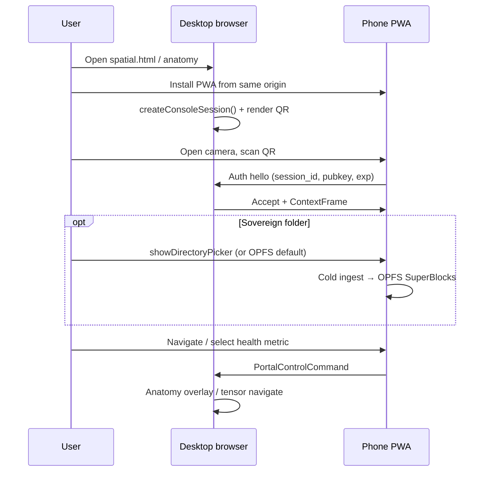
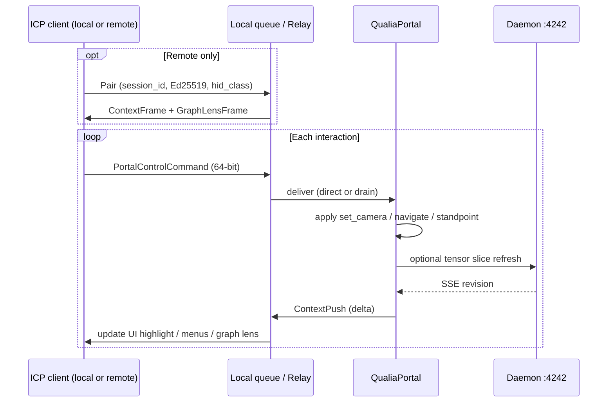

# Interface Control Plane — Interactivity Loop Plan

_Also: **Phone Console** (primary remote client). Filename retained for searchability._

**Date:** 2026-06-17  
**Branch:** `0.0.17-dev`  
**Status:** `IN PROGRESS` — **PR-I1–I5 shipped** (2026-06-17); health ingest + voice (I6–I8) next
**Companion:** [`wasm-viewport-migration-plan.md`](wasm-viewport-migration-plan.md) Track I, [`qualia-wasm-portal.md`](../manuals/qualia-wasm-portal.md), [`AUDIO_PROJECT_STATUS.md`](AUDIO_PROJECT_STATUS.md)

---

## Executive summary

The **Interface Control Plane (ICP)** is the normalized input layer for QualiaPortal: every human interface device emits the **same fixed-size command envelopes**, which the viewport applies through one dispatch path (`set_camera`, `navigate_to_node`, `set_standpoint`, …).

The **phone console** is the flagship **remote** ICP client — a sovereign companion PWA, not a second “everything app.” It runs the same WASM artifact in an input-heavy, render-light role while a **primary portal** owns T2 phenomenal rendering.

| ICP client | Typical HID | Transport to viewport |
|------------|---------------|------------------------|
| **Primary viewport** (co-located) | Mouse, keyboard, trackpad, desktop touch | In-process — `spatial-demo.js` pointer handlers today |
| **Phone companion** (remote) | Touch, gyro, mic, camera (QR) | Relay / WebRTC → `PortalControlCommand` |
| **Tablet / touch laptop** | Touch, stylus, optional keyboard | Local or remote — same shells as phone when paired |
| **Ordinary HID host** | Mouse + keyboard only | Local ICP — Deck replaced by pointer + hotkeys |

| Role | Control plane (any client) | Viewport (primary) |
|------|----------------------------|-------------------|
| **Navigation** | Deltas → `SET_CAMERA_*` / `TILT_FRAME` | `set_camera`, GPU pick |
| **Selection** | Menus, Graph Lens, list tap | `navigate_to_node`, `collapse_node_q` |
| **Sensing** | Mic → Sonic Tokens (phone); keys → shortcuts (desktop) | U3 worklet, phenomenal render |
| **Personal data** | OPFS vault (phone/tablet) | Daemon slice when co-located |

**Hard rule:** JavaScript is glue only. ICP semantics compile to **fixed-size envelopes** (64-bit `PortalControlCommand` or 48-byte `NQuin`), not ad-hoc JSON scene graphs. No Three.js, no Oxigraph-in-browser, no Ollama/llama.cpp HTTP sidecar.

---

## Field observations (2026-06-17)

Empirical testing on a physical phone shows **Qualia WASM can run faster than the same build on a desktop machine that is plugged into power**. Do not architect the phone as a permanently degraded **T0-only** client.

| Hypothesis (investigate, not asserted) | Why it might matter |
|----------------------------------------|---------------------|
| Mobile GPU + unified memory | Lower PCIe/driver overhead than discrete desktop GPUs |
| Browser compositor load | Desktop may run heavier tabs, extensions, thermal throttling despite AC |
| Tier probe variance | `QualiaPortal::new()` may select **T2 WebGPU** on modern Android Chrome while desktop falls back on driver quirks |
| Battery policy | Phone may still throttle under sustained load — measure, don’t assume |

**Plan implication:** Phone console UI should **probe and display tier** (`portal.tier()`), not hard-code “remote control only.” A phone may legitimately run local phenomenal preview, personal graph queries, or Anatomy overlays when vault data is on-device.

---

## Primary user journey (v0.1 — locked intent)

Single origin entry; no app-store distribution for now.

```
1. User opens Qualia site on desktop (e.g. spatial.html, anatomy playground)
2. User taps **Install mobile companion** → PWA manifest → phone-console.html added to home screen
3. Desktop shows **Link phone** — renders QR (session + auth material) on screen
4. Phone PWA opens camera → scans QR → completes Ed25519 / session handshake
5. Linked: phone = remote + secondary lists; desktop = primary phenomenal viewport
6. (Optional) Phone: **Choose local folder** → sovereign personal vault root
7. (Optional) Phone: import Samsung Health export (CSV/JSON) → cold ingest → personal graph
8. Desktop Anatomy (or spatial) view reflects ingested health observations when user navigates there
```



### Desktop: QR payload (normative sketch)

```json
{
  "v": 1,
  "origin": "https://example.github.io/qualiaDB",
  "relay": "https://<lan-host>:4242",
  "session_id": "hex",
  "desktop_pubkey": "hex",
  "exp_unix": 1718650000,
  "capabilities": ["remote", "context_push", "vault_sync"]
}
```

Phone stores pairing in `sessionStorage` + durable OPFS record (`qualia-pairing.v1`). Re-scan invalidates prior session.

### Phone: install surface

| Element | Location | Notes |
|---------|----------|-------|
| **Install mobile companion** button | `spatial.html`, `docs/playground/anatomy.html` | `beforeinstallprompt` or iOS “Add to Home Screen” coach mark |
| PWA manifest | `docs/phone-console.webmanifest` (new) | `start_url: /phone-console.html`, `display: standalone` |
| Camera scan | `qualia-phone.js` | `html5-qrcode` or `BarcodeDetector` where available; scaffold in `qualia-mobile-harness` |
| Link status badge | Phone header | `Unlinked` → `Scanning` → `Linked` → `Vault ready` |

---

## Personal vault & local folder (optional sovereign path)

User may decline cloud/daemon and keep data on the phone only.

| Storage API | Platform | Role |
|-------------|----------|------|
| **OPFS** (default) | Chrome/Android, Safari 17+ | `wasm_storage.rs` — 40 960 B SuperBlocks, same as ontology demo |
| **`showDirectoryPicker`** | Chromium (optional UX) | User picks Downloads / Samsung Health export folder; handle persisted in IndexedDB (`qualia-mobile-harness` prototype) |
| **IndexedDB** | All | Directory handle + pairing secrets + ingest manifest |

**Standpoint promotion:** Folder or OPFS vault unlocks identifier (`class 2`) then vault (`class 3`) standpoint on **phone-local** graph slices — no full SOA leaves the device unless user explicitly links desktop with consent (Prolog Sentinel / deontic lane).

**Personal graph:** Cold path only on phone — N3/CSV → `NQuin` bake → OPFS blocks → bounded `visit_*_into` queries in WASM. Desktop receives **hashes + observation summaries** via `ContextFrame`, not raw export files.

---

## Health ingest trail — Samsung Health → Anatomy

Samsung Health “export data” produces CSV (and sometimes JSON) under `com.samsung.health.*` / `com.samsung.shealth.*` prefixes. Qualia already parses several of these in **`wellfare-core`**:

| Export file (typical) | Parser | RDF output |
|----------------------|--------|------------|
| Weight / body composition | `parse_weight_csv` | FHIR `Observation` + `health:bodyFatPercentage` Turtle |
| Sleep | `parse_sleep_csv` | Sleep episode observations |
| Heart rate | `parse_heart_rate_csv` | Vitals series |
| Steps | `parse_steps_csv` | Activity observations |

All carry `prov:wasDerivedFrom <urn:health:source:samsung-health-export>` in `wellfare-core/src/rdf.rs`.

### Display path (Anatomy QApp)

```
Phone folder pick or file input
    → wellfare-core parser (cold, heap OK once)
    → Turtle / NQuin compile (SHACL: bundled/qapps/Anatomy/Knowledge/shapes/radlex-anatomy.shacl.ttl)
    → OPFS resident graph on phone
    → ContextPush summaries to desktop (metric ids, date ranges, organ system hashes)
    → docs/playground/anatomy.html + bundled/qapps/Anatomy overlay
         (dicom-overlay.js, knowledge-parser.js, anatomy_context.rs on native)
```

**UX on phone:** After vault init, **Import health export** walks selected folder for `*.csv`, shows parse preview (row counts, date span), user confirms ingest.

**UX on desktop:** Anatomy view highlights systems with fresh observations (e.g. cardiovascular ← heart rate, musculoskeletal ← weight). Full 3D holograph stays on desktop; phone shows tabular/list **companion** view.

This is **Phase I7** (below) — depends on I5 vault, not on daemon.

---

## What Qualia already has (do not re-invent)

### Primary portal (desktop / large screen)

| Piece | Location | Role |
|-------|----------|------|
| `QualiaPortal` | `crates/qualia-core-db/src/portal.rs` | Single WASM constructor — viewport + acoustic |
| Navigation | `select_node_at`, `poll_selected_node`, `navigate_to_node`, `collapse_node_q` | GPU pick + fly-to + epistemic collapse |
| Observer | `set_standpoint(class, q, t_slice, t_window, did)` | Human-Centric standpoint (decoupled from camera) |
| Live neighborhood | `qualia-shell.js` → `connectPortalToDaemon` | `GET /tensor/slice` + SSE `/tensor/events` |
| Auth gate | Ed25519 over `{nonce\|class\|t_slice\|t_window}` | Identifier/vault slices (`daemon_tensor.rs`) |
| Demo shell | `docs/spatial.html`, `spatial-demo.js` | Pointer pick → navigate + collapse loop |
| U3 audio | `mountAcousticPlane`, `Q3AS` SAB, worklet | Symbolic sonification (Track B5 ✅) |

### Storage (phone-local personal data)

| Piece | Location | Role |
|-------|----------|------|
| OPFS vault | `wasm_storage.rs` | `write_opfs_block` / `read_opfs_block` — 40 960 B SuperBlocks |
| Quota probe | `storage_quota_bytes()` | Browser persistence budget |
| Playground parity | `docs/ontology.html` | OPFS `.q42` cache narrative (user-facing) |

### Daemon graph engine (optional co-located host)

Port **4242** is the **semantic graph daemon**, not an LLM server:

| Endpoint | Use for phone console |
|----------|----------------------|
| `GET /tensor/slice` | Signed tensor SOA for vault/identifier standpoints |
| `GET /tensor/events` | Lamport SSE → debounced slice refresh |
| `POST /chat/publish` / `GET /chat/pull` | **Session-scoped control + context sync** (preferred Phase 1 transport) |
| `GET /health` | Pairing liveness |

LLM inference stays **in-process** on native hosts via `LocalLlmAgent` / Phase 8 bifurcated compute. WASM on Pages does **not** load GGUF; phone companion must not assume on-device LLM unless a future **tiny** portal feature gate is explicitly added.

---

## Architecture correction (vs. generic “multi-WASM agent” drafts)

```
┌──────────────────── PRIMARY (T1–T2) ────────────────────┐
│  spatial.html / webizen-browser / Flutter WebView        │
│  QualiaPortal: WebGPU projector + ambient + bloom        │
│  Daemon :4242 (optional): tensor slice + chat relay        │
│  Native host (optional): full GGUF + Sentinel thread     │
└────────────────────────▲──────────────────────────────────┘
                         │  PortalRemoteFrame (fixed-size)
                         │  + optional ContextPush (bounded)
┌────────────────────────┴──────────────────────────────────┐
│  PHONE CONSOLE PWA (tier-probed — T1/T2 observed in field)   │
│  Same qualia_bg.wasm — lists, menus, sensors, local vault    │
│  OPFS: personal SuperBlocks + last context cache          │
│  U3: MessagePort path (no SAB required on iOS)              │
│  Input: DeviceOrientation, touch, mic → Sonic Tokens        │
└─────────────────────────────────────────────────────────────┘
```

| Wrong assumption (discard) | Qualia reality |
|----------------------------|----------------|
| Separate phone repo with Leptos/Three.js | One `qualia-core-db` portal build; phone is a **second HTML shell** |
| `llama.cpp WASM` on phone | Native GGUF via `gguf_bridge`; WASM mock path on Pages |
| WebSocket echo prototype server | Extend **daemon chat relay** or LAN WebRTC with same binary contract |
| Oxigraph SPARQL in browser | `qualia-core-db` evaluators + daemon `/query` when online |
| Cloud signaling required | QR + local network; sovereign pairing tokens |

---

## Interface Control Plane (ICP) — architecture

One **dispatch core** in `qualia-core-db`; multiple **HID adapters** in JS shells. Remote clients use the same opcodes as local ones — only the **ingress path** differs.

```
┌─────────────────────────────────────────────────────────────────┐
│                     VIEWPORT (QualiaPortal)                      │
│  drain_control_commands() → apply → render → push_context()     │
└────────────▲───────────────────────────────────────▲────────────┘
             │ local queue (SPSC)                    │ remote queue
┌────────────┴────────────┐              ┌───────────┴──────────────┐
│  Local ICP adapters     │              │  Remote ICP transport     │
│  · pointer (mouse/touch)│              │  · daemon chat relay      │
│  · keyboard hotkeys     │              │  · WebRTC DataChannel     │
│  · wheel / trackpad     │              │  · native IPC (C10)       │
└────────────▲────────────┘              └───────────▲──────────────┘
             │                                        │
   ┌─────────┴─────────┬──────────────┬────────────────┴────────┐
   │ Desktop HID       │ Touch screen │ Phone / tablet companion │
   │ mouse, keyboard   │ on primary   │ gyro, mic, Graph Lens    │
   └───────────────────┴──────────────┴──────────────────────────┘
```

### HID capability matrix

| Capability | Mouse / KB | Touch (primary) | Phone / tablet remote |
|------------|------------|-----------------|------------------------|
| Orbit / pan | Drag + wheel | 1-finger drag | Deck swipe pad |
| Pick node | `select_node_at` click | tap | Graph Lens tap → `NAVIGATE_INDEX` |
| Fly-to | dbl-click (today) | dbl-tap | Graph double-tap |
| Facet / menu | Hotkeys `1–9`, menus | Control Surface | Control Surface |
| Temporal scrub | `[` `]` keys + sliders | sliders | Control Surface |
| Gyro orbit | — | device tilt if available | Tilt toggle |
| Voice / TTS | optional desktop STT | — | Companion Voice |
| Sonify | hotkey | tap | Deck **Sonify** |

**Capability negotiation:** Each client registers `{ client_id, hid_class, caps[] }` at connect. Viewport enables UI affordances in `ContextFrame` accordingly (e.g. omit `TILT_FRAME` hints for mouse-only clients).

### Local vs remote ingress

| Path | When | Module (planned) |
|------|------|------------------|
| **Local** | Input on same page as canvas | `qualia-icp-local.js` — wraps existing `spatial-demo.js` pointer path |
| **Remote** | Phone/tablet paired | `qualia-icp-relay.js` — publish/pull or DataChannel |

Both call `portal.push_control_command(raw_u64)` (local) or transport equivalent (remote). Viewport **`drain_control_commands()`** runs once per `tick` — zero heap, fixed ring (same pattern as Sonic Token SPSC).

### Keyboard / mouse on primary (ordinary HID)

No phone required. Primary viewport mounts **local ICP** by default:

| Input | Binding (default) | `PortalControlCommand` |
|-------|-------------------|------------------------|
| Mouse drag | Orbit | `SET_CAMERA_DELTA` |
| Wheel | Zoom | `SET_CAMERA_DELTA` Δzoom |
| Click | GPU pick queue | `select_node_at` (direct API, not queued) |
| Dbl-click | Navigate + collapse | `NAVIGATE_INDEX` + `COLLAPSE_Q` |
| `Arrow keys` | Pan | `SET_CAMERA_DELTA` |
| `+` / `-` | Zoom | `SET_CAMERA_DELTA` |
| `1–9` | Menu facet | `MENU_ACTION` |
| `[` / `]` | `t_slice` ± | `SET_STANDPOINT_SCALAR` |
| `H` | Home camera | `MENU_ACTION` home |

Touch-screen **on the primary device** reuses the same bindings as phone **Deck** and **Graph Lens** shells when responsive rules select touch chrome — one codebase (`qualia-phone-deck.js` shared as `qualia-icp-touch.js`).

---

## App rules — device fallbacks & responsive design

ICP shells MUST **probe capabilities**, **pick sensible defaults** for the device class, and **degrade gracefully** — never show controls that cannot work, never require a phone when mouse/keyboard suffice.

### Principles (normative)

1. **Feature detection, not user-agent sniffing** — use `matchMedia`, `PointerEvent`, `DeviceOrientationEvent`, `getCapabilities()`-style probes; UA only as last-resort hint.
2. **Basic expectations per device** — each class gets the interaction model users already expect (see table below); Qualia adds Deck/Graph/Control only when width or pairing warrants it.
3. **Responsive layout** — one HTML shell; CSS grid/flex reflow; canvas remains primary on large screens; chrome expands on narrow screens.
4. **Explicit override** — user can force interface mode in Settings (e.g. “Desktop layout on tablet”, “Pointer mode on touch laptop”); stored in `localStorage` / OPFS prefs.
5. **Fail open to local ICP** — if relay pairing fails, primary viewport still fully usable with mouse/keyboard/touch defaults.

### Device profile (`IcpDeviceProfile`)

Computed at boot by `qualia-icp-profile.js`; recomputed on `resize`, `orientationchange`, and `matchMedia` updates.

```javascript
// Illustrative — not shipped API
{
  form_factor: 'desktop' | 'tablet' | 'phone',      // from breakpoints + UA hints
  pointer_primary: 'fine' | 'coarse' | 'none',      // (pointer: fine), (pointer: coarse)
  hover_available: boolean,                         // (hover: hover)
  keyboard_available: boolean,                      // heuristic: focusable + no virtual keyboard-only
  orientation_sensor: boolean,                      // permission + DeviceOrientationEvent
  motion_sensor: boolean,
  voice_capable: boolean,                           // speechSynthesis / mic permission path
  paired_remote: boolean,                           // active ICP relay session
  wasm_tier: 0 | 1 | 2,                             // portal.tier()
  prefers_reduced_motion: boolean,                  // (prefers-reduced-motion: reduce)
}
```

### Responsive breakpoints (layout)

| Token | Width | Layout rule |
|-------|-------|-------------|
| `lg` | ≥ 1024px | **Viewport-first** — canvas ≥ 70% width; sidebar collapsible; **local pointer ICP** default; show “Link phone” CTA only |
| `md` | 768–1023px | **Split** — canvas + bottom or right **touch chrome** strip if `pointer: coarse`; else pointer ICP |
| `sm` | &lt; 768px | **Chrome-first** — full-width interface bar (Deck / Control / Graph); canvas stacked above or below; 44px min touch targets |
| `standalone` | `display-mode: standalone` | PWA phone console — default **Linked · Deck** after pair; no desktop canvas unless `paired_remote` false (standalone vault mode) |

**CSS contract:** shells use `clamp()` typography, `dvh` for viewport height, `env(safe-area-inset-*)` on notched phones. No horizontal scroll on control surfaces; graph lens scales with `aspect-ratio: 1`.

### Default interface by profile

| Profile | Default ICP UI | Fallback if feature missing |
|---------|----------------|----------------------------|
| Desktop + fine pointer + keyboard | Canvas + sidebar; mouse drag orbit; hotkeys | No Deck overlay; menus in sidebar Control panel |
| Desktop + coarse touch (touch laptop) | Canvas + compact **touch strip** (swipe pad) | Hide gyro; show Graph Lens tab |
| Tablet local (no pair) | **Touch mode** — Deck + Graph + Control bar | Pointer events emulate mouse; no tilt unless sensor |
| Tablet / phone **remote paired** | Phone: **Deck**; desktop: pointer ICP unchanged | Phone without gyro → swipe-only Deck |
| Phone standalone (vault / install) | Control + Vault; Graph when graph cached | No relay commands until linked |
| Keyboard-only / a11y | Focus order through Control Surface; all actions hotkey-reachable | Skip swipe pad; `aria-keyshortcuts` on actions |

### Capability fallback ladder

When a sensor or API is unavailable, fall back to the **next simpler** control — never block the loop.

| Desired control | Try (order) | Ultimate fallback |
|-----------------|-------------|-------------------|
| Orbit | gyro `TILT_FRAME` → swipe pad → mouse drag → arrow keys | On-screen ◀ ▶ buttons (Deck rail) |
| Zoom | pinch → wheel → `+`/`-` keys | Zoom slider in Control Surface |
| Pick / fly-to | Graph Lens tap → canvas `select_node_at` → node List row | Menu `MENU_ACTION` numeric index |
| Temporal scrub | Control sliders → `[` `]` keys | Discrete step buttons (− / +) |
| Voice confirm | ONNX TTS → Web Speech → none | Visual toast only |
| Voice command | tiny STT → none | Menu tap only |
| Remote link | relay → WebRTC → manual session code entry | Local-only mode banner |
| Pairing scan | camera QR → paste JSON → type session id | — |
| Personal folder | `showDirectoryPicker` → OPFS default vault → file `<input>` | Import disabled with explanation |

### UI visibility rules (`shouldShow`)

Shell components consult profile + caps — **do not render** disabled affordances (saves layout noise and avoids false expectations).

| Component | Show when |
|-----------|-----------|
| Swipe pad (Deck) | `pointer: coarse` OR `form_factor === 'phone'` OR user override `touch_mode` |
| Tilt toggle | `orientation_sensor && paired_remote` (or local tablet with permission) |
| Voice toggle | `voice_capable && (paired_remote || standalone phone)` |
| Graph Lens tab | `form_factor !== 'desktop'` OR `width < lg` OR graph frame non-empty |
| Keyboard shortcut help overlay | `keyboard_available && hover_available` |
| “Install mobile companion” | `lg` viewport + not `standalone` + `beforeinstallprompt` or iOS coach |
| Hotkey-driven sidebar Control | `lg` + fine pointer — duplicate of touch Control, not replacement |

### `ContextFrame` hints (viewport → client)

Desktop pushes **recommended** UI mode so remote phone does not fight local layout:

```json
{
  "icp_hints": {
    "default_interface": "deck",
    "show_graph_lens": true,
    "show_tilt": false,
    "focus_index": 7,
    "reduce_motion": false
  }
}
```

Honour `prefers-reduced-motion` on both sides — disable fly-to animation smoothing; use step transitions.

### Implementation modules (Track I)

| Module | Responsibility |
|--------|----------------|
| `qualia-icp-profile.js` | Boot probe + `resize` listener → `IcpDeviceProfile` |
| `qualia-icp-rules.js` | `shouldShow()`, fallback ladder, default interface picker |
| `qualia-icp-layout.css` | Breakpoints, safe-area, touch target tokens (`--icp-touch-min: 44px`) |
| `qualia-icp-local.js` | Pointer/keyboard adapters gated by profile |
| `qualia-icp-touch.js` | Shared Deck/Graph/Control (phone + narrow primary) |

**PR-I1g:** device profile + responsive rules + `icp_hints` in `ContextFrame`; tests in `phone-console-verify.mjs` (synthetic profiles via query `?icp_profile=tablet`).

### Acceptance checks

- [ ] Desktop 1920×1080: canvas orbit via mouse; no swipe pad unless touch override.
- [ ] Narrow 390×844: interface bar visible; 44px buttons; canvas usable but not required for navigate.
- [ ] Phone remote without gyro: Deck works swipe-only; tilt toggle hidden.
- [ ] Keyboard-only: Tab through Control menus; fly-to via Enter on list row.
- [ ] `prefers-reduced-motion`: no inertial camera smoothing.
- [ ] Pairing failed: banner + full local pointer ICP on primary.

---

## The interactivity loop (normative)

Closed loop any ICP client completes with the viewport:



### Viewport dispatch (map 1:1 to existing APIs)

| Control intent | `QualiaPortal` call | Typical HID source |
|----------------|---------------------|-------------------|
| Orbit view | `set_camera(yaw, pitch, zoom)` | Mouse drag, swipe pad, gyro |
| GPU pick | `select_node_at(x,y,w,h)` | Mouse click (local only — pixel coords) |
| Fly-to node | `navigate_to_node(i)` | Graph tap, list row, dbl-click |
| Collapse q | `collapse_node_q(i)` | Dbl-tap / dbl-click |
| Standpoint | `set_standpoint(...)` | Control sliders, vault on phone |
| Temporal scrub | `set_standpoint(..., t_slice, t_window)` | Sliders, `[` `]` keys |
| Sonify | `push_sonic_token_raw` / acoustic | Sonify button, hotkey |
| Mute | `set_acoustic_enabled` | Any client |

### Context outputs (bounded, all clients)

| Payload | Max size | Consumers |
|---------|----------|-----------|
| `PortalControlCommand` | 8 B | Viewport drain (local + remote) |
| `ContextFrame` | ≤ 4 KiB | Control menus, List, Deck strip |
| `GraphLensFrame` | ≤ 8 KiB | Graph Lens (touch clients) |
| `ContextPush` | ≤ 1 KiB | All — revision, focus, badge |

No unbounded graph serializations. Full `Tensor10D` SOA stays on viewport host or daemon; remote clients receive **indices and hashes** only.

**Rename note:** `PortalRemoteCommand` in earlier drafts → **`PortalControlCommand`** (same layout; `REMOTE_MAGIC` bit means “arrived via relay” for provenance logging only).

---

## Linked mode — multi-interface controller

When paired, the phone is a **control surface family** — several interchangeable UIs that all emit the same `PortalControlCommand` envelopes. The desktop stays the sole phenomenal viewport (T2 WebGPU); the phone never tries to mirror it pixel-for-pixel.

```
┌─────────────────────────────────────────────────────────────┐
│  Linked · Interface bar:  [ Deck ] [ Control ] [ Graph ]    │
├─────────────────────────────────────────────────────────────┤
│                                                             │
│   (one of three surfaces — see below)                       │
│                                                             │
└─────────────────────────────────────────────────────────────┘
```

| Interface | Best for | Desktop response on press |
|-----------|----------|---------------------------|
| **Remote Deck** | Continuous orbit, swipes, tilt | `set_camera`, coarse `MENU_ACTION` |
| **Control Surface** | Menus, facets, temporal sliders | `set_standpoint`, `set_display_mode`, `MENU_ACTION` |
| **Graph Lens** | Neighborhood preview, tap-to-fly | `navigate_to_node`, `collapse_node_q`, camera fly-to |

User can switch interfaces anytime; last choice persisted in OPFS. **Voice** and **Tilt** toggles apply across interfaces where relevant.

### App states

| State | Screen | Entry |
|-------|--------|-------|
| `Unlinked` | Scan QR / manual code | Fresh install |
| `Linked · Deck` | Remote Deck (default) | After successful pair |
| `Linked · Control` | Menus + sliders + facet rails | Interface bar **Control** |
| `Linked · Graph` | Touchable graph lens | Interface bar **Graph** |
| `Linked · List` | Scrollable node index (fallback) | Control **Browse** or Deck **List** |
| `Linked · Vault` | Folder ingest + health import | Control **Vault** or Deck **Vault** |
| `Reserve` | All outbound commands disabled | Desktop or phone Eco/Reserve |

---

## Interface 1 — Remote Deck

Single-purpose motion controller. Large touch targets, minimal chrome, haptics where available.

### Remote Deck layout (wireframe)

```
┌─────────────────────────────────────┐
│  ● Linked   sleep · cardiovascular  │  ← Context strip (from ContextPush)
├─────────────────────────────────────┤
│                                     │
│         SWIPE PAD (primary)         │  ← 2D drag + flick gestures
│    swipe → pan / orbit desktop      │
│                                     │
├──────────┬──────────┬───────────────┤
│  ◀ Back  │  ⊕ Select│  ▶ Next       │  ← Button rail (3–6 actions)
├──────────┴──────────┴───────────────┤
│  ⌖ Home  │  ♫ Sonify │  ≡ List      │
├─────────────────────────────────────┤
│  [ Tilt ● ]  [ Voice ○ ]            │  ← Mode toggles (gyro / TTS feedback)
└─────────────────────────────────────┘
```

**Design rules**

- **One dominant gesture surface** — the swipe pad occupies ≥50% vertical space; thumbs can flick without precision aiming.
- **Buttons send commands, not URLs** — each maps to a `PortalControlCommand` opcode (see table below).
- **Context strip** is read-only text from desktop (`ContextPush`); long labels truncated; tap opens **List** view.
- **No live video mirror** of the desktop — bandwidth + sovereignty; user looks at the big screen.

### Input → desktop action map

| Phone input | Deck behavior | `PortalControlCommand` | Desktop effect |
|-------------|---------------|----------------------|----------------|
| Swipe left/right | Pan yaw | `SET_CAMERA_DELTA` Δyaw | `set_camera` |
| Swipe up/down | Pitch or zoom | `SET_CAMERA_DELTA` Δpitch / Δzoom | `set_camera` |
| Two-finger pinch | Zoom | `SET_CAMERA_DELTA` Δzoom | `set_camera` |
| Flick (high velocity) | Page facet | `MENU_ACTION` next/prev facet | Standpoint or display mode |
| **Tilt mode on** | Hold phone like steering wheel | `TILT_FRAME` (fused quaternion) | Continuous `set_camera` |
| **⊕ Select** | Confirm pick | `NAVIGATE_INDEX` + `COLLAPSE_Q` | Same as `spatial-demo` dbl-click |
| **◀ Back / ▶ Next** | Walk node ring | `NAVIGATE_INDEX` ±1 | `navigate_to_node` |
| **⌖ Home** | Reset lens | `MENU_ACTION` home | Default camera + spectator standpoint |
| **♫ Sonify** | Toggle sonify selection | `SONIC_TOKEN_FORWARD` or acoustic flag | Desktop U3 + optional phone local earcon |
| **≡ List** | Switch to List view | (local UI only) | — |

**Tilt fusion:** `DeviceOrientationEvent` + `DeviceMotionEvent` → complementary filter in WASM (stack buffers, no heap). Emit at ≤30 Hz when tilt mode active; desktop applies exponential smoothing to avoid jitter.

**Swipe pad implementation:** Pointer events on a single `<canvas>` or `<div>`; velocity at `pointerup` classifies flick vs drag; dead zone in center for accidental touches.

---

## Interface 2 — Control Surface

Structured **menus and control rails** for discrete jumps — when the user knows *what* they want (a facet, time window, anatomy system) rather than *where* to steer the camera.

### Layout (wireframe)

```
┌─────────────────────────────────────┐
│  ● Linked          [ Deck Graph ]   │
├─────────────────────────────────────┤
│  ▼ Explore                          │
│     Biometrics · Civics · Graph     │  ← top-level menu (from ContextFrame)
│  ▼ Health vault                     │
│     Sleep · Heart · Weight          │
├─────────────────────────────────────┤
│  t_slice  ═══════●══════  0.62      │  ← scrubbers → SET_STANDPOINT_SCALAR
│  t_window ═══●══════════  0.15      │
│  epistemic_q ═════●══════  0.80     │
├─────────────────────────────────────┤
│  Display: [ Manifold ▾ ] [ σ color ]│
│  [ Browse nodes… ]  [ Vault… ]      │
└─────────────────────────────────────┘
```

### Menu → desktop mapping

Menus are **not** free-form HTML navigation. Desktop pushes a bounded tree in `ContextFrame`:

```json
{
  "menus": [
    { "id": 1, "label_hash": "0x…", "label": "Health vault", "parent": 0 },
    { "id": 2, "label_hash": "0x…", "label": "Sleep", "parent": 1, "action": "facet:sleep" }
  ]
}
```

| User action | Command | Desktop effect |
|-------------|---------|------------------|
| Tap menu leaf | `MENU_ACTION` + `menu_id` | Load facet projection, refresh tensor slice filter, update Anatomy overlay |
| Tap top-level section | `MENU_ACTION` + expand only | Desktop pushes child menu + new `GraphLensFrame` |
| Drag `t_slice` / `t_window` | `SET_STANDPOINT_SCALAR` | Temporal discard on GPU (`ObserverStandpoint`) |
| Drag `epistemic_q` | `SET_STANDPOINT_SCALAR` | PGA spin dampening / q-collapse aperture |
| Display mode dropdown | `MENU_ACTION` display enum | `set_display_mode` |
| **Browse nodes** | Local UI → `Linked · List` | — |

**Anatomy / health context:** Menu leaves like `Sleep` or `Cardiovascular` carry `action` tokens that desktop maps to Wellfair graph filters + Anatomy QApp organ highlight (`anatomy_context.rs` on native; JS bridge on playground).

---

## Interface 3 — Graph Lens

A **touchable projection** of the desktop’s current neighborhood — nodes as pointers, edges as faint links. Press a node → desktop **flies** to it and pivots the phenomenal view.

### What the phone renders (bounded cold payload)

Desktop pushes `GraphLensFrame` (≤ 8 KiB) alongside `ContextFrame`:

```json
{
  "revision": 42,
  "proj_dims": ["x", "y"],
  "nodes": [
    { "index": 3, "x": 0.12, "y": -0.44, "sigma": 0.71, "q": 0.9, "selected": false },
    { "index": 7, "x": 0.55, "y": 0.22, "sigma": 0.33, "q": 1.0, "selected": true }
  ],
  "edges": [
    { "a": 3, "b": 7 }
  ],
  "focus_index": 7
}
```

- Positions are **normalized 2D** (desktop chooses projection: PCA pair, `(x,y)` slice, or manual dimension picker exposed in Control Surface).
- Max **64 nodes**, **96 edges** per frame — enough for local neighborhood, not full graph export.
- Labels optional: `label_hash` only; phone resolves short strings from last `ContextFrame` lexicon slice.

### Graph Lens layout (wireframe)

```
┌─────────────────────────────────────┐
│  ● Linked   rev 42    [ Deck Ctrl ] │
├─────────────────────────────────────┤
│      ○───○                          │
│       \ │                           │
│        ○●7  ← selected (larger)     │
│           \                         │
│            ○                        │
│   pinch: zoom lens (local only)     │
│   tap node: fly desktop to index    │
├─────────────────────────────────────┤
│  Proj: x×y  [ Change ▾ ]            │
└─────────────────────────────────────┘
```

### Pointer press → desktop pivot

| Gesture | Command | Desktop effect |
|---------|---------|------------------|
| **Tap node** | `NAVIGATE_INDEX` + index | `navigate_to_node(i)` — camera fly-to `(x,y,z)` via `CameraFlyTo` (`portal_navigation.rs`) |
| **Double-tap node** | `NAVIGATE_INDEX` + `COLLAPSE_Q` | Fly-to + epistemic collapse (same as `spatial-demo` pick) |
| **Long-press node** | `MENU_ACTION` node_context | Desktop pushes radial actions (sonify, inspect, anatomy map) |
| **Tap empty** | `SET_CAMERA_DELTA` | Desktop clears selection highlight |
| **Change projection** | `MENU_ACTION` proj pair | Desktop recomputes `GraphLensFrame` with new dim pair |

Phone graph draw path: **canvas2d** or lightweight WebGPU point sprites — cold JS only, no second `QualiaPortal` phenomenal loop required. Optional: reuse portal **CPU pick** projection math from `cpu_pick_node_at` for consistency.

**Highlight sync:** After desktop processes navigation, next `ContextPush` marks `selected: true` on the active index so phone lens stays aligned.

---

## Context payloads (summary)

| Frame | Max size | Phone interfaces consuming it |
|-------|----------|-------------------------------|
| `ContextFrame` | 4 KiB | Control menus, List rows, Deck context strip |
| `GraphLensFrame` | 8 KiB | Graph Lens pointers + edges |
| `ContextPush` | 1 KiB | All — revision, focus index, badge |

---

## Companion Voice — phone-local TTS (and optional STT)

Reads aloud **context from the phone** (selection confirm, list row, health import summary). Synthesis runs **on the phone**; audio plays on the **phone speaker/earpiece** only.

### Separation from U3 AcousticPlane

| Layer | What it is | PCM? |
|-------|------------|------|
| **U3** (`AcousticPlane`) | Symbolic Sonic Tokens + parametric DSP + σ parity with desktop phenomenal view | Grains from STFT/CQT sidecars — **not neural TTS** |
| **Companion Voice** | Phone UX accessibility + hands-free confirm | Small neural TTS (cold path) — **does not feed U0/U3 hot path** |

U0 still never emits conversational PCM into the graph. Companion Voice is a **PWA shell service** (like notification sounds), gated by user toggle **Voice** on the Deck.

### Model strategy (small audio LM on phone)

Field testing shows phone WASM/WebGPU can be **faster than desktop** — a compact on-device voice stack is plausible when tier ≥ T1 and storage quota allows.

| Phase | Engine | Model class | Size budget | Role |
|-------|--------|-------------|-------------|------|
| **I8a (MVP)** | `speechSynthesis` (Web Speech API) | OS voices | 0 MB | Ship first; offline quality varies |
| **I8b (target)** | ONNX Runtime Web (+ WebGPU EP when available) | Piper / VITS-tiny / equivalent | 15–40 MB cached in OPFS | Sovereign, consistent TTS |
| **I8c (optional)** | Same runtime | Whisper-tiny / Moonshine-tiny | +20–80 MB | Mic → text → `MENU_ACTION` voice commands |

**Cold load once:** model bytes in OPFS (`companion-voice/` prefix); `ThermalGovernor` / phone battery API downgrades to Web Speech or disables under low power.

**What gets spoken:** Short strings from `ContextPush` — e.g. “Linked to desktop”, “Showing cardiovascular”, “Imported 142 sleep rows”. Never speak full vault contents without explicit user tap on a list row.

**What does *not* happen:** TTS PCM is **not** streamed to the desktop over the relay. Desktop phenomenal audio remains U3. If desktop must speak, that is a separate native/host feature — out of scope for phone Companion Voice.

### Voice toggle on Remote Deck

```
[ Tilt ● ]  [ Voice ● ]
```

With **Voice** on:

1. Each successful command → brief confirm earcon (optional parametric blip via Web Audio, not U3).
2. Context strip changes → TTS speaks truncated label.
3. Long-press **⊕ Select** → speak full list row detail.

Mic + STT (I8c) reuses the same **Voice** permission gate; recognized phrase → `MENU_ACTION` hash (e.g. `q_hash("show sleep")`) → desktop navigates.

---

## `PortalControlCommand` sketch (zero-heap)

Reuse the **Sonic Token bit discipline** (`sonic_token.rs`) with a distinct magic flag range. Implemented in `portal_control.rs` (planned; was `portal_remote.rs` in early drafts):

```
Bits [0..7]   opcode
              0x60 = SET_CAMERA_DELTA
              0x61 = NAVIGATE_INDEX
              0x62 = COLLAPSE_Q
              0x63 = SET_STANDPOINT_SCALAR
              0x64 = MENU_ACTION
              0x65 = SONIC_TOKEN_FORWARD (raw token in bits 16..63)
              0x66 = SWIPE_GESTURE (dir: L/R/U/D, velocity tier)
              0x67 = BUTTON_ACTION (deck button id)
              0x68 = TILT_FRAME (yaw/pitch packed as i16)
Bits [8..15]  channel / session lane
Bits [16..31] tensor_index or menu_id (16-bit)
Bits [32..47] param A (e.g. yaw × 1000 as i16)
Bits [48..55] param B
Bits [56..62] reserved
Bit  [63]     ICP_MAGIC (0x1) — control plane (not Sonic Token 0x53); set when ingress is relayed
```

Implement in `portal_control.rs`, validate in `portal_phenomenal_contract.rs`:

- `push_control_command(raw: u64)` — local + remote ingress
- `drain_control_commands(max: u32)` — viewport `tick` drain
- Relay adapter copies bytes unchanged — **no opcode translation**

---

## Transport phases

### Phase I1 — Daemon chat relay (LAN / localhost)

**Why first:** Already shipped (`/chat/publish`, `/chat/pull`); Lamport ordering matches CRDT story; no new server binary.

| Step | Work |
|------|------|
| I1a | Define `PortalControlCommand` + `ContextFrame` + `GraphLensFrame` codec in `qualia-core-db` |
| I1f | `qualia-icp-local.js` — keyboard/mouse/touch-on-primary → `push_control_command` |
| I1b | `qualia-shell.js`: `createConsoleSession()` → session_id in QR |
| I1c | Phone shell `phone-console.html` + `qualia-phone.js`: poll relay, push commands |
| I1d | Desktop `spatial-demo.js`: subscribe relay → drain → apply portal APIs |
| I1e | CI: `phone-console-verify.mjs` — codec round-trip + API presence |

**Pairing UX:** Desktop shows QR encoding `{v:1, relay:"http://<host>:4242", session_id, pubkey, exp}`. Phone scans → stores session in `sessionStorage` + OPFS pairing record.

### Phase I2 — WebRTC DataChannel (offline LAN, no daemon)

For Pages-only or field scenarios without daemon:

- Use browser `RTCPeerConnection` + manual QR offer/answer (out-of-band paste or QR chunk).
- Same binary frames as I1 — **only transport changes**.
- Signaling: optional tiny **same-origin** `/pair` static page, not a cloud service.

### Phase I3 — Native host bridge (PR-C10 alignment)

`webizen-browser` / Flutter embed forwards relay or IPC to in-process daemon. Phone talks to desktop native listener; desktop portal receives commands via `postMessage` from host shell.

---

## Phone PWA feature matrix

| Feature | Module | Mobile notes |
|---------|--------|--------------|
| Installable shell | `docs/phone-console.html` (new) | `manifest.webmanifest`, icons |
| WASM mount | `qualia-phone.js` (new) | `loadQualiaPortal` — display **actual** `tier()` badge |
| QR scan | `qualia-phone.js` | Camera → parse QR → relay/WebRTC handshake |
| Install CTA | `spatial.html` etc. | Link to `phone-console.html` + manifest |
| Interface bar | `qualia-phone-shell.js` | Deck / Control / Graph switcher |
| **Remote Deck** | `qualia-phone-deck.js` (new) | Swipe pad + button rail + tilt/voice toggles |
| **Control Surface** | `qualia-phone-control.js` (new) | Hierarchical menus + standpoint scrubbers |
| **Graph Lens** | `qualia-phone-graph.js` (new) | `GraphLensFrame` canvas; tap → `navigate_to_node` on desktop |
| Folder vault | `requestDirectoryAccess()` pattern | From `qualia-mobile-harness`; persist handle in IDB |
| Health import | `wellfare-core` parsers via WASM | Cold ingest only; Samsung CSV prefixes |
| Menus | `ContextFrame.menus` | Control Surface; tap leaf → `MENU_ACTION` |
| Node list | Virtual scroll, max 128 rows | Tap → `NAVIGATE_INDEX` (Graph fallback) |
| Gyro nav | `TILT_FRAME` when tilt toggle on | Fused orientation ≤30 Hz |
| Swipe pad | Pointer velocity + direction | Maps to `SET_CAMERA_DELTA` / `MENU_ACTION` |
| Mic → tokens | `SONIC_TOKEN_FORWARD` | Desktop U3 worklet (phenomenal sonify) |
| **Companion Voice** | `qualia-phone-voice.js` (new) | TTS on phone speaker; ONNX cold path (I8b) |
| Personal vault | `write_opfs_block` | Identifier standpoint class 2→3 promotion on device |
| COI / SAB | `qualia-coi.js` | Prefer **MessagePort** audio path on iOS |
| Sanctuary | Respect `Reserve` mode — mute outbound context push | Align with deontic lane metadata |

---

## LLM and compute (scoped honestly)

| Capability | Phone | Desktop native | Desktop WASM |
|------------|-------|----------------|--------------|
| GGUF inference | ❌ not in portal WASM | ✅ `LocalLlmAgent` | ❌ mock ring |
| Local phenomenal render | ✅ **observed fast** on phone WebGPU | varies | varies |
| Text LLM | ❌ not portal scope | ✅ `LocalLlmAgent` GGUF | ❌ mock ring |
| **Companion TTS** | ✅ I8 — Web Speech → ONNX tiny | native optional | N/A |
| Voice commands (STT) | ⬜ I8c — tiny STT → `MENU_ACTION` | ✅ full orchestrator | ❌ |
| Graph query | Phone-local OPFS + optional daemon relay | ✅ in-process | Partial /query proxy |
| Sentinel gating | Consent before vault sync to desktop | ✅ Phase 8 thread | Inline checks on WASM path |

Full GGUF text LLM on phone remains out of scope for Track I. **Small audio models** (TTS/STT) are in scope as Companion Voice — separate from U3, cold-loaded, OPFS-cached, thermal-gated.

---

## Security & sovereignty

| Concern | Mitigation |
|---------|------------|
| Pairing hijack | Short-lived session token; Ed25519 mutual hello; LAN-only default |
| Vault exfil | Context push whitelist; standpoint class 3 never ships full SOA to phone |
| Replay | Lamport `since_lamport` on relay pull; monotonic command seq in frame |
| Sanctuary / duress | Desktop can reject pushes; phone shows stale cached context only |
| Prolog Sentinel | Pre-flight on desktop before executing `NAVIGATE` into bilateral graphs |

---

## PR stack (Track I)

| PR | Scope | Exit criteria |
|----|-------|---------------|
| **PR-I1** | `portal_control.rs` — ICP codec + `push_control_command` / `drain_control_commands` | Unit tests; phenomenal contract oracles |
| **PR-I1f** | Local ICP — mouse, keyboard, primary touch → same opcodes as phone | `spatial-demo.js` refactor; hotkey table |
| **PR-I1g** | `qualia-icp-profile.js` + responsive rules + `ContextFrame.icp_hints` | Device fallbacks; `shouldShow` gates; breakpoint CSS |
| **PR-I2** | Daemon relay message type for `PortalControlCommand` | Round-trip via `/chat/publish` + `/chat/pull` |
| **PR-I3** | `phone-console.html` + `qualia-phone.js` skeleton | Pair QR → one `SET_CAMERA_DELTA` applied on desktop |
| **PR-I3b** | **Remote Deck** UI — swipe pad + button rail + tilt toggle | Swipe/flick/tilt → desktop `set_camera` / navigate |
| **PR-I4** | `ContextFrame` + `GraphLensFrame` push | Control menus + Graph tap → desktop fly-to / pivot |
| **PR-I4b** | Control Surface + Graph Lens shells | Three-interface bar; projection dim picker |
| **PR-I5** | OPFS pairing cache + vault standpoint on phone | Offline last context; identifier class 2 sign |
| **PR-I6** | Mic/gesture → Sonic Token forward + CI | `phone-console-verify.mjs` in Pages workflow |
| **PR-I7** | Samsung Health CSV cold ingest → OPFS graph → Anatomy context push | `wellfare-core` parsers; anatomy overlay handoff |
| **PR-I8** | **Companion Voice** — Web Speech MVP → ONNX Piper-class TTS in OPFS; optional tiny STT | Speaks `ContextPush` on phone; no PCM to desktop |

**Dependency:** PR-C10 (desktop host parity) for native embed path — not blocking I1–I4 on browser-only. **I7** requires I5 vault + Anatomy QApp. **I3b** depends on I3 link. **I8** parallel after I4 (needs context strings to speak).

### Suggested implementation order

```
I1 → I2 → I3 (pair) → I3b (Deck) → I4 (Context + GraphLens) → I4b (Control + Graph UI)
     → I8a (Web Speech) → I5 (vault) → I7 (health) → I8b (ONNX TTS) → I6 → I8c (STT)
```

---

## Verification

```powershell
cargo test -p qualia-core-db portal_control --lib
cargo test -p qualia-core-db phenomenal_contract --lib
node docs/tests/phone-console-verify.mjs   # after PR-I1
```

Manual matrix:

| Environment | Primary | Phone | Transport |
|-------------|---------|-------|-----------|
| Dev | `spatial.html` + daemon | `phone-console.html` | localhost relay |
| Pages | `spatial.html` (static) | same origin phone page | WebRTC I2 |
| Native | webizen-browser | PWA | IPC bridge I3 |

---

## Out of scope (this track)

- iOS / Android store apps (PWA only)
- Full graph editor on phone
- Cloud pairing or account system
- Neural PCM generation on phone
- Screen mirroring / remote desktop

---

## Progress log

| Date | Update |
|------|--------|
| 2026-06-17 | Plan rewritten — aligned to QualiaPortal, daemon relay, OPFS, Sonic Tokens; retired generic Grok draft |
| 2026-06-17 | Field note: phone WASM faster than AC-powered desktop; v0.1 journey (install → QR link → optional folder vault); Samsung Health → Anatomy trail (PR-I7) |
| 2026-06-17 | Linked **Remote Deck** UI (swipe pad, button rail, tilt mode); **Companion Voice** TTS on phone (I8 — separate from U3; ONNX tiny LM path) |
| 2026-06-17 | **Control Surface** (menus, temporal sliders) + **Graph Lens** (touchable pointers → desktop fly-to / pivot); `GraphLensFrame` payload |
| 2026-06-17 | **Interface Control Plane (ICP)** — unified dispatch for phone, touch-screen, mouse/keyboard; local + remote ingress; `PortalControlCommand` |
| 2026-06-17 | **App rules** — `IcpDeviceProfile`, responsive breakpoints, capability fallback ladder, `shouldShow` UI gates, `icp_hints` (PR-I1g) |
| 2026-06-17 | **Implemented** — `portal_control.rs`, `push_control_command`/`drain` in `tick`, `qualia-icp-*` JS, `phone-console.html`, WASM rebuild, `phone-console-verify.mjs` |
| 2026-06-17 | **PR-I2–I4** — `/chat` relay nest, `qualia-icp-relay/session/host/phone/context`, LAN `defaultRelayBase`, QR/paste pair, Control menus/sliders + Graph Lens tap → desktop fly-to |
| 2026-06-17 | **PR-I5** — `qualia-icp-vault.js` OPFS pairing cache + vault manifest, IndexedDB folder handle, phone identifier/vault `set_standpoint` promotion |

---

## References

- [`docs/manuals/qualia-wasm-portal.md`](../manuals/qualia-wasm-portal.md) — portal API
- [`docs/manuals/adr/0007-u3-acoustic-plane-symbolic-audio.md`](../manuals/adr/0007-u3-acoustic-plane-symbolic-audio.md) — U3 on phone
- [`crates/qualia-core-db/src/daemon_tensor.rs`](../../crates/qualia-core-db/src/daemon_tensor.rs) — standpoint signing
- [`docs/js/qualia-shell.js`](../js/qualia-shell.js) — daemon link + badge
- [`AI_INSTRUCTIONS.md`](../../AI_INSTRUCTIONS.md) — port 4242 surface
- [`crates/wellfare-core/src/parser.rs`](../../crates/wellfare-core/src/parser.rs) — Samsung Health CSV parsers
- [`crates/qualia-mobile-harness/`](../../crates/qualia-mobile-harness/) — QR scan + `showDirectoryPicker` scaffold
- [`bundled/qapps/Anatomy/`](../../bundled/qapps/Anatomy/) — anatomy overlay + SHACL shapes
- [`docs/playground/anatomy.html`](../playground/anatomy.html) — browser anatomy demo