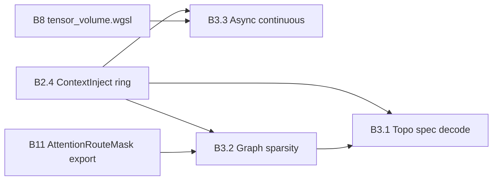

# Qualia WASM Portal — Migration Plan

**Status:** `IN PROGRESS` — Qualia WASM portal T2 phenomenal path live on Pages; PGA Phases 1–3 + Kawase bloom + `VramLedger` eco particle gating wired  
**Created:** 2026-06-17  
**Last updated:** 2026-06-17 (Track C — Phase 2b/2c/3 PGA, PR-C8 Kawase bloom, eco-tier draw throttle)
**Branch target:** `0.0.17-dev` (qualiaDB)  
**Companion docs:** `C:\Projects\webizen-browser\AUDIO_PROJECT_STATUS.md`, `10D_INTEGRATION_PLAN.md`, `10D_INTEGRATION_SUMMARY.md`

---

## Architectural decision (locked 2026-06-17)

**Unify all libraries into the Qualia WASM project in qualiaDB** — a complete replacement for JavaScript semantic work (V8 graph logic, Three.js scene graphs, canvas2d particle engines, per-frame `Vec` mesh rebuilds).

| Retired (hot path) | Replaced by |
|--------------------|-------------|
| V8 / JS graph traversal, Quin encode, spectral math | `qualia-core-db` WASM evaluators + `wasm_simd` |
| Three.js / WebGL scene graphs | `shaders/viewport/` (migrated from `webizen-render`) + wgpu pipelines |
| canvas2d ambient engines (`ambient-viz.js`) | `ambient.wgsl` inside `qualia_bg.wasm` (T0− is temporary only) |
| Separate `qualia_core_db.wasm` + portal WASM | **One** `qualia_bg.wasm` |
| `webizen-web` as semantic owner | **Deprecated** — qualiaDB builds and owns the portal crate |

**JavaScript role:** glue only — `import init`, `new QualiaPortal(canvas)`, `resize`, `requestAnimationFrame(tick)`. No geometry, no particles, no ontology evaluation in JS.

**webizen-browser** remains the desktop **host** (Tauri, Dioxus, QApp studio) but links the qualiaDB-built WASM artifact; it does not ship a parallel semantic/render stack.

**Heap strategy:** fixed **pipelines** with explicit cold/hot boundaries — not “avoid alloc where possible” ad hoc:

```
BAKE (cold, heap OK once)  →  RESIDENT (mmap/GPU pin)  →  HOT (zero-heap)
     NQuin ingest                  Tensor10D SOA              visit_*_into
     SHACL compile                 VramLedger pins            tensor_volume.wgsl
     shader asset embed            particle buffer upload     ambient/projector WGSL
                                                              SPSC rings U0↔U1↔U2
```

Display never rebuilds a scene graph — it reads the **same resident buffer** uploaded at bake/mount time and animates via ≤48 B telemetry uniforms per frame.

---

## Executive summary

QualiaDB’s GitHub Pages demos (`docs/`) are migrating off **V8 + Three.js + canvas2d** scaffolding to a **single WASM artifact built from qualiaDB**:

1. **Qualia WASM** (`qualia.js` / `qualia_bg.wasm`) — **Semantic Subjectivity Bifurcation Portal**: engine + viewport + compute universes in one `cdylib` (`qualia-core-db`, `wasm32`)
2. **All WGSL** — compute (`fused_*`, `tensor_volume`) + viewport (`ambient`, `projector`, `epistemic`, `screen`) live under `crates/qualia-core-db/src/shaders/`
3. **All WASM exports** — `wasm_bridge.rs`, `spatial_wasm.rs`, `portal_render.rs` (viewport), scientific modalities
4. **HTML shell** — thin JS glue only

JavaScript must not own geometry, particle animation, spectral math, or Quin encoding in the hot path.

---

## Product naming — Qualia WASM

The browser/desktop WASM package is **Qualia**, not “webizen-web” in user-facing docs, filenames, or imports.

| Public (ship) | Internal (repo) | Meaning |
|---------------|-----------------|---------|
| `qualia.js` | `qualia-core-db/pkg/` or `crates/qualia-portal/` build output | wasm-bindgen glue |
| `qualia_bg.wasm` | `qualia_core_db_bg.wasm` | Single unified module (engine + viewport + compute) |
| `QualiaPortal` | `Viewport` / `WebEngine` (rename in Phase 3) | Main JS constructor |
| **Semantic Subjectivity Bifurcation Portal** | — | Full product name (docs, about pages) |
| **Qualia portal** | — | Short name |

**Why “portal”:** The WASM boundary is where *subjective* presentation (viewport, ambient field, epistemic q-states, temporal slices) bifurcates from *objective* semantic truth (`NQuin`, baked `Tensor10D`, zero-heap evaluators). Same engine runs in-process on desktop; the portal is the embeddable edge — browser, QApp, GitHub Pages — without a second semantic stack.

**Why not a separate “webizen WASM”:** Webizen remains the **render manifold host** (wgpu, shaders, Dioxus shell, Tauri). Qualia remains the **epistemic engine**. End users load **one** module named Qualia; Webizen is an implementation layer inside it, not a competing brand at the WASM edge.

**Tagline options (pick one for docs):**

- *Qualia — semantic subjectivity bifurcation portal*
- *Qualia — where meaning meets the manifold*
- *Qualia WASM — one engine, one portal, zero heap in the hot path*

**Phase 3 rename tasks:**

- [x] **N-1** `wasm-pack` out-dir publishes as `docs/pkg/qualia/` (not `webizen_web/`)
- [x] **N-2** Rust `#[wasm_bindgen(js_name = QualiaPortal)]` (crate `qualia-wasm`)
- [x] **N-3** `docs/js/qualia-shell.js` replaces `viewport-shell.js`
- [ ] **N-4** Pages badge: `Qualia WASM` + tier (`T2 · Live`, etc.)
- [ ] **N-5** API catalog entries under `qualia.*` namespace
- [x] **N-6** Build portal from qualiaDB (`cargo` + `package-qualia-wasm.ps1` → `docs/pkg/qualia/`); retire `webizen-web` semantic ownership *(desktop host still links interim paths)*

**Phenomenal** (definition for this plan) = live 10D tensor volume drives **both** query and viewport on a **shared GPU buffer**, with ambient telemetry tied to real subsystem vitals, σ spectral coloring, epistemic q-state visuals, and zero heap in hot paths. Not a PNG slideshow, not Three.js, not mock Qualia data.

---

## Pipeline architecture (zero-heap by design)

The unified Qualia WASM project replaces heap-heavy JS patterns with **named pipelines** — each stage has a fixed contract; hot stages never allocate.

### Pipeline 1 — Bake (cold path only)

| Step | Module | Output |
|------|--------|--------|
| Ingest / N3 / SHACL | `ingest.rs`, `shacl_compiler.rs` | `NQuin` slice |
| 10D bake | `tensor/bake_pipeline.rs` | `Tensor10D` SOA (`tensors.bin`) |
| Spectral sidecars | `tensor/spectral.rs` | mmap SPD/STFT |
| Viewport assets | `shaders/viewport/` embedded via `include_str!` | WGSL in WASM binary |

Heap (`Vec`, `String`) permitted here only. Runs once per `.q42` mount or ingest.

### Pipeline 2 — Resident (mmap / VRAM pin)

| Asset | Pin | Ledger slot |
|-------|-----|-------------|
| Tensor SOA | `resident_substrate.rs` / GPU upload | `VramLedgerSlot::Tensor10D` |
| Particle instances | static `wgpu::Buffer` upload once | `VramLedgerSlot::Viewport` |
| LLM weights + KV | `gguf_bridge.rs` | `LlmKvCache`, `LlmWeightStaging` |

No per-frame realloc. `VramLedger` pre-flight rejects mounts that would thrash.

### Pipeline 3 — Query (hot, zero-heap)

| API | Mechanism |
|-----|-----------|
| kNN / radius | `visit_tensor_search_into`, `tensor_volume.wgsl` |
| Deontic / SHACL | `evaluate_deontic_contract`, `validate_shacl_constraint_wasm` |
| SIMD eval | `webizen_bytecode.rs` (`wasm_simd` feature) |
| U0↔U1 inject | `ContextInjectRing`, `AttentionRouteMask` (SPSC) |

Caller supplies `&mut [T]` out-buffers. No `tensor_search() → Vec` in evaluators.

### Pipeline 4 — Display (hot, zero-heap)

| Tier | Path |
|------|------|
| T2 | `projector.wgsl` + `ambient.wgsl` + `bloom.wgsl` (Full only) — instanced tensor buffer, telemetry uniform, ledger-gated draw count |
| T1 | `screen.wgsl` + reduced particle count |
| T0− | **Temporary:** `ambient-viz.js` until T1 wgpu runs on all Pages targets; then delete |

Per frame: ≤48 B `SystemTelemetry` + 128 B `CameraUniform` + 128 B `ObserverStandpoint` upload. **No** JS vertex loops, **no** Three.js `BufferGeometry` rebuild.

### Pipeline 5 — Inference (hot, zero-heap)

U0 LLM matmul ∥ U1 tensor producer (B3.3) ∥ U2 viewport present — orchestrated by `ComputeUniverse` + `VramLedger`, not synchronous host callbacks.

**Rule:** If a code path reintroduces dynamic graph traversal (`HashMap`, `VecDeque`, Three.js, canvas2d semantic work), it violates the unified WASM decision — acceptable only as a **badge-labelled temporary fallback** (see below).

---

## Fallback policy — yes, but tiered and honest

**Answer: yes, we need fallbacks** — but only as **explicit hardware tiers**, not silent heap regressions.

### What must always run (no fallback to JS semantics)

These stay **Qualia WASM / native Rust** on every tier:

- `NQuin` logic, modalities, N3/SHACL, GeoSPARQL
- `spatial_encode`, tensor export, zero-heap `visit_*_into` query APIs
- Telemetry *sampling* (may return zeros on edge, but contract stays 48 B)

### What degrades by tier (display + query throughput only)

| Tier | Hardware | Query execution | Viewport | Ambient viz | LLM |
|------|----------|-----------------|----------|-------------|-----|
| **T3** | QPU escrow | Classical first; async GSR patch | N/A (headless) | Off | Paused |
| **T2** | Discrete GPU, VRAM ≥ 1 GB | **GPU tensor compute** + SIMD | **Phenomenal** wgpu: 3D projector, bloom, 50k particles, σ spectral | Live telemetry | Full (ledger budgeted) |
| **T1** | iGPU / 8–16 GB RAM | SIMD `visit_tensor_search_into` | wgpu simplified: 3D nodes, 8k particles, no bloom | Live telemetry | Hybrid/throttled |
| **T0** | Edge / no WebGPU | SIMD scan, smaller buffers | **Display fallback only:** static PNG snapshot or canvas2d ambient stub; badge shown | Sliders / last known | Off or remote |
| **T0−** | WASM, `navigator.gpu` null | Same SIMD WASM | `ambient-viz.js` canvas2d + 2D node overlay; **no Three.js** | Simulated pulses OK | N/A on Pages |

### Fallback rules (non-negotiable)

1. **Never fake phenomenal** — Tier-0 UI shows a badge: `Viewport: CPU fallback` or `WebGPU unavailable`.
2. **Display ≠ engine** — canvas2d may draw particles; it must not re-implement Quin encode or graph traversal.
3. **No Three.js in any tier** — removed entirely after Phase 4; not a fallback option.
4. **Eco / Reserve modes** (desktop + portal) — under VRAM pressure, **instant** step-down: bloom off → ambient `instance_count` capped (50k Full / 8k Eco / 0 Reserve) → frame rate → diffusion **before** dropping tensor query correctness. No buffer realloc; static SSBO, dynamic draw count.
5. **LLM wins scheduling** — render drops frames; inference is never silently run on a JS fallback.
6. **Pages vs desktop** — Pages targets T1–T2 in Chrome/Edge; T0 canvas2d is acceptable for GitHub Pages reach. Desktop targets T2 phenomenal as default.
7. **One WASM on Pages** — fallback does not load a second module; **`qualia_bg.wasm`** (Qualia portal) handles all tiers. Legacy `qualia_core_db.wasm` retired from spatial/playground pages after merge.

### When *not* to fallback

- Do not fall back to heap `tensor_search()` → `Vec` in evaluator hot paths (cold-path `Vec` APIs remain test/migration only).
- Do not fall back to `mock_qualia_projection()` when daemon `:4242` is reachable.
- Do not create a new wgpu device per frame when shared `GpuContext` exists.

---

## Phenomenal acceptance criteria (full checklist)

All boxes required for **PHENOMENAL** status:

### A. Data plane (Qualia / 10D)

- [ ] **P-A1** Ingest pipeline bakes `NQuin` → `Tensor10D` with real q/v/w (not hash placeholders)
- [ ] **P-A2** `Q42TensorVolume` resident as struct-of-arrays (40 B × N, mmap or GPU upload)
- [ ] **P-A3** Hot-path queries use only `visit_*_into` / GPU compute — no `Vec` in evaluator loops
- [ ] **P-A4** High-density spectral sheets (SPD / STFT) linked from σ with mmap sidecars
- [ ] **P-A5** Gravitational/thermodynamic baking stage refines x,y,z (spec §2.4) at ingest
- [x] **P-A6** `Tensor10D::from_nquin()` reads baked metadata, not object-hash xyz proxy *(geo vertex packed coords via `bake_pipeline`)*

### B. GPU back-plane

- [x] **P-B1** Single `GpuContext` per process (LLM + tensor + render + diffusion) *(shared wgpu device; render path pending)*
- [x] **P-B1b** `ComputeUniverse` orchestrator — U0/U1/U2 pinned ledger partitions on one device (Track B2)
- [ ] **P-B1c** `ComputeUniverse::AcousticPlane` (U3) — ledger pin + SPSC consumer; deferred until QApp distribution verified (see `AUDIO_PROJECT_STATUS.md`)
- [x] **P-B2** `VramLedger` pre-flight before load/render; `memory_pressure` reflects reality
- [ ] **P-B3** Real `ThermalGovernor` gates render and non-critical inference
- [ ] **P-B4** Persistent `WgpuRenderer` (no per-frame `new_offscreen`)
- [x] **P-B5** `QTensorEngine` reuses shared device; no per-chat GPU init
- [x] **P-B6** `tensor_volume.wgsl` — GPU mirror of `visit_tensor_search` for Tier 2 *(CPU SIMD fallback when GPU unavailable)*

- [x] **P-B8** Graph-guided attention sparsity — U1 kNN → `AttentionRouteMask` constrains `fused_attention.wgsl` KV reads
- [x] **P-B7** Topological speculative decoding — U1 drafts via kNN; U0 `verify_topology_draft_batch` accepts prefix + Sentinel gate (`sentinel_allows_topology_draft`)
- [x] **P-B9** Async continuous context — U1 producer thread injects during U0 matmul; zero stop-and-RAG stalls in decode loop

### C. Viewport (Qualia portal — `portal_gpu.rs` + `shaders/viewport/`)

- [x] **P-C1** `projector.wgsl` pipeline live — depth buffer, CPU `view_projection`, instanced tensor SOA *(PGA motor stack — see §C.1)*
- [x] **P-C1b** Full PGA null-vector sandwich `P' = Ω P Ω̃` with `motor_mul` / `sandwich_point` — `d=0` regresses Phase 1 (`portal_pga.rs` oracle + WGSL) *(Phase 2b)*
- [x] **P-C1c** Bilateral `T_pull` via `motor_translate` `d` channel — gated on `deontic_lane == 2` + `standpoint_class >= 2` *(Phase 2c)*
- [x] **P-C1d** `v`-band topology motors — `[0,1)` Euclidean · `[1,2)` cyclic · `[2,3)` hyperbolic · `≥3` boundary clique anchor via `motor_v_band` + lattice centroid *(Phase 3)*
- [x] **P-C2** Epistemic q visuals — collapsed (`q≈0`) vs sandbox (`q>0`) in `projector.wgsl` fragment *(standalone `epistemic.wgsl` pipeline still unwired)*
- [x] **P-C3** σ → CIE XYZ → linear sRGB in shader (`spectral.wgsl` Gaussian CMF; HDR path ungamma'd; `portal_spectral.rs` CPU oracle)
- [x] **P-C4** Binary tensor SOA → `wgpu::Buffer` upload once (`PortalGpu::upload_tensor_buffer`, 32 B header offset)
- [x] **P-C5** `ambient.wgsl` live in single pass (projector → ambient, depth early-Z)
- [x] **P-C5b** T2 Kawase dual-filter bloom (`bloom.wgsl`) — HDR scene pass with additive `(One, One)` blend; `v ≥ 3` boundary cliques push past threshold organically
- [x] **P-C5c** `VramLedger` viewport load-shedding — bloom gated `Full` only; ambient draw throttle 50k / 8k / 0 via `ambient_draw_instances()` (instant step-down, zero realloc)
- [x] **P-C6** Live Qualia neighborhood — `GET /tensor/slice` binary SOA + portal `connectPortalToDaemon` *(identifier signature vault filter → PR-C9.3)*
- [x] **P-C7** Camera IPC (`set_camera`) + temporal `t_slice`/`t_window` discard + Human-Centric `ObserverStandpoint` uniform (`set_standpoint`)
- [x] **P-C8** Navigation: GPU `R32Uint` picking + `select_node_at` / `navigate_to_node` / `collapse_node_q`
- [ ] **P-C9** Desktop: direct wgpu surface OR 30 FPS PNG with persistent renderer (not both re-initing GPU)

#### C.1 Human-Centric observer contract (qualiaDB portal — 2026-06-17)

Decouples the **camera lens** (spatial orbit) from the **observer standpoint** (semantic right to perceive). No hardware fingerprinting — ephemeral session nonce + optional verified **identifier** (DID IRI).

| Milestone | Module | Status |
|-----------|--------|--------|
| **C.1a** | `ObserverStandpoint` 128 B uniform (`portal_telemetry.rs`) | ✅ |
| **C.1b** | `portal_standpoint.rs` — spectator / ephemeral / identifier / vault factories | ✅ |
| **C.1c** | `QualiaPortal::set_standpoint(class, epistemic_q, t_slice, t_window, identifier_did)` | ✅ |
| **C.1d** | GPU bindings: projector `@binding(1)`, ambient `@binding(4)` | ✅ |
| **C.1e** | Temporal vertex discard: `\|tensor.t - t_slice\| > t_window` | ✅ |
| **C.1f** | `spatial.html` standpoint selector + epistemic aperture slider (identifier class) | ✅ |
| **C.1g** | Vault data plane crypto seal (identifier unlocks local `.qualia` vault) | ❌ Phase 2+ |

**PGA motor phases (projector.wgsl + `portal_pga.rs` CPU oracle):**

| Phase | Motor | Status |
|-------|-------|--------|
| **1** | `R_w(w)` manifold fan-out + `R_q(q,σ,time)` sandbox spin; `T_pull=0`; quaternion sandwich on `(x,y,z)` | ✅ |
| **2a** | `standpoint_class` gates: Vault → freeze `R_q`; Identifier → `θ_q × epistemic_q` | ✅ |
| **2b** | Dual-quaternion `motor_mul` + `sandwich_point`; `d=0` matches Phase 1 regression (`\|Δ\| < 10^{-5}`) | ✅ |
| **2c** | `Ω = T_pull · (R_w · R_q)` — `motor_translate` toward camera eye; bilateral lane + identifier standpoint gate | ✅ |
| **3** | `R_v = motor_v_band(v)` — cyclic / hyperbolic / boundary anchor; composition `R_w · R_q · R_v` | ✅ |

**Terminology:** use **Human-Centric** and **identifier** (not “identity” / legacy storage-path labels) for standpoint and DID binding. Identifier opt-in may unlock a sealed QualiaDB vault — data plane security is a separate gate (**C.1g**).

#### C.2 `VramLedger` viewport load-shedding (2026-06-17)

Human-Centric resilience policy for U2 — protects U0 inference the millisecond VRAM pressure spikes.

| Policy | Module | Behaviour |
|--------|--------|-----------|
| **Bloom shunt** | `portal_gpu.rs` + `bloom.wgsl` | Kawase chain allocated only when `universe_orchestrator().bloom_enabled(Viewport, ledger.mode())`; Eco/Reserve bypass bloom passes entirely |
| **Particle throttle** | `gpu_context.rs` | Static 50k `ParticleInstance` SSBO; `ambient_draw_instances(resident)` caps `draw` `instance_count` — **instant** step-down (no temporal decay) |
| **Mode caps** | `OperationalMode::max_particles()` | Full 50_000 · Eco 8_000 · Reserve 0 |
| **HDR luminance** | `projector.wgsl` / `ambient.wgsl` | σ-driven `hdr_gain` + 45% boost for `v ≥ 3`; additive HDR scene blend lets boundary cliques bloom natively |
| **2D fallback parity** | `portal.rs` | Canvas2d ambient uses same `ambient_draw_instances()` hook |

**Design choice (locked):** instant step-down on mode switch — matches bloom shunt latency. Asymmetric ramp-up on recovery (slow fade to 50k) is optional polish, not required for load-shedding correctness.

### D. Telemetry / living system

- [x] **P-D1** `gguf_bridge` token loop → `llm_heat`
- [x] **P-D2** Encode/bake → `baking_crystallization`; query resolve → `logic_flashes`
- [ ] **P-D3** VRAM ledger → `memory_pressure`; mesh I/O → `network_ripple`
- [x] **P-D4** UI shows tier badge + operational mode (Full / Eco / Reserve)

### E. WASM / Pages parity

- [x] **P-E1** Single **Qualia WASM** (`qualia_bg.wasm`); no Three.js; thin `qualia-shell.js`
- [x] **P-E2** `spatial.html` encode → tensor buffer → GPU upload end-to-end *(buffer upload + σ projection in portal)*
- [x] **P-E3** Tier-0 canvas2d fallback with honest badge when WebGPU missing
- [x] **P-E4** Viewport WGSL in qualiaDB `shaders/viewport/` (`ambient`, `projector`, `bloom`); portal slim build ~272 KB gzip (`--features portal`, `wasm-size-check.mjs`); bloom + eco particle gating live

### F. Audio / multi-modal (phenomenal+)

- [ ] **P-F1** AudioWorklet spectral synthesis from STFT sheets (σ band)
- [ ] **P-F2** Visual + auditory share `[α, μ, σ]` truth layer per spec

**PHENOMENAL declared when:** all of **A, B, C, D, E** complete. **F** is phenomenal+ (may trail).

---

## Architectural boundary (non-negotiable)

| Layer | Owns | Zero-heap? |
|-------|------|------------|
| **Qualia** | `NQuin`, SPARQL/GeoSPARQL, modalities, `Tensor10D` semantics, WASM evaluators, telemetry *sampling* | Yes — hot paths |
| **Webizen** | `RenderScene`, `SystemTelemetry`, wgpu instancing, σ→CIE projection, bloom, audio spectral synthesis | GPU buffers; heap OK in UI |
| **JS shell** | `import init, { QualiaPortal }`, canvas mount, sliders → `Float32Array` | N/A — no semantic work |
| **Qualia WASM portal** | Bundles engine + Webizen render; exposes `QualiaPortal::tick`, tensor upload, telemetry | GPU buffers; portal API only |

**Spectral truth** (`α`, `μ`, `σ` + linked SPD/STFT sheets) lives in Qualia/Q42. **RGB/speaker output** is Webizen last-mile projection inside the Qualia WASM module.

---

## Current state audit

### qualiaDB `docs/` (Pages)

| Asset | Role today | Target |
|-------|------------|--------|
| `spatial.html` + `js/spatial-demo.js` | Qualia WASM portal T2: projector + ambient + bloom + CIE σ + PGA Phases 1–3 | Phenomenal polish (daemon slice, navigation) |
| `js/ambient-viz.js` | canvas2d telemetry prototype (2400 particles) | wgpu ambient shader; JS kept as Tier-0 fallback only |
| `playground/qualia_core_db.wasm` | Logic, N3, SHACL, optional WebGPU LLM | **Merged into** `pkg/qualia/qualia_bg.wasm` (single portal) |
| `playground/anatomy.js` | Three.js anatomy viewer | Phase 4 — same viewport pattern |
| `modalities-showcase.html` | Canvas2d modality visuals | Phase 5 — optional wgpu overlay |
| CDN `three.js/r128` on `spatial.html` | ~~External dep~~ | **Removed** (2026-06-17) |

### webizen-browser

| Crate | State | Gap |
|-------|-------|-----|
| `webizen-render` | Desktop wgpu + `SystemTelemetry` (48 B) + 10D scene contract ✅ | `#[cfg(not(wasm32))]` gates wasm; **active path is 2D** (`screen.wgsl`), not 3D |
| `webizen-web` (→ **Qualia WASM**) | Single-package portal; canvas2d stub; depends on qualia-core-db | Publish as `qualia.js`; add `webizen-render` inside |
| `webizen-desktop` | PNG preview over `webizen://` protocol; render daemon **implemented but unregistered** | **2D GPU compositor**, not phenomenal 3D viewport |
| `BACKGROUND_VISUALISATION.md` | Design doc | `ambient.wgsl` real; telemetry not wired to live render loop |

### webizen-desktop rendering reality (2026-06-17 audit)

**What is real today:**

- wgpu offscreen render → PNG → ``
- `screen.wgsl` — 2D clip-space discs, lines, filled polygons (no depth buffer)
- `ambient.wgsl` — ~50k instanced particles with 3D positions, projected to 2D
- `scene_contract.rs` — `Tensor10DProjection`, epistemic state, spectral helpers

**What is scaffolding (written, not on the live path):**

| Asset | Location | Issue |
|-------|----------|-------|
| `projector.wgsl` | PGA motor 3D vertex shader | **qualiaDB portal:** live (`portal_gpu.rs`). **webizen-desktop:** still unwired |
| `epistemic.wgsl` | LOD / epistemic fragment shader | q LOD inlined in `projector.wgsl` fragment; standalone pipeline not bound |
| `tensor_buffer.rs` | Zero-copy 10D binary views | **qualiaDB portal:** `buffer_export.rs` + GPU upload live. **desktop:** not connected |
| `motor_encoder.rs` | 64-byte PGA `Motor` layout | Superseded in-portal by WGSL `Motor { r, d }` vec4 layout |
| `toggle_render_loop` | 30 FPS Qualia fetch daemon | **Not registered** in Tauri invoke handler |
| `navigate_to_node` / `select_node_at` | Hit-testing + navigation | Commands exist, UI unwired |
| Live Qualia scene | `fetch_local_neighborhood` | Falls back to `mock_qualia_projection()` |
| 10D tensor on nodes | `scene_to_contract.rs` | Always `Tensor10DProjection::default()` |
| Camera orbit/zoom | `WgpuRenderer` CPU math | UI handlers local-only; render uses `Camera::default()` |

**Verdict:** Desktop has **real wgpu**, but it is a **2D preview compositor** with a particle backdrop — not the phenomenal 10D volumetric viewport the specs describe.

### GPU back-plane / concurrency reality (2026-06-17 audit)

**The problem:** LLM, Qualia compute, and display each create **independent GPU contexts** with no arbitration.

| Subsystem | GPU init pattern | Risk |
|-----------|------------------|------|
| `QTensorEngine` (`gguf_bridge.rs`) | New `wgpu::Instance` + device per engine; Windows adds separate `DmlDevice` | Competes with render on same adapter |
| `WgpuRenderer` (`wgpu_renderer.rs`) | **New device per** `render_scene_png*` call (`new_offscreen`) | 30 FPS loop = repeated init/teardown |
| `WgpuDiffusionBackend` (`webizen-runtime`) | Third independent wgpu device | Dead 3D fields (`depth_texture`, etc.) |
| LLM inference thread | `QTensorEngine::new()` per chat turn | No engine pool despite resident mmap |

**What does not exist yet:**

- [ ] Global `GpuContext` / shared `wgpu::Device` across inference + render + diffusion
- [ ] VRAM ledger (unify DXGI probe, KV cache 448 MiB cap, render target sizes)
- [ ] Real `ThermalGovernor` (production uses `NullThermalGovernor` → always `Cool`)
- [ ] Render back-pressure when `ModelLifecycle::Active` or VRAM pressure high
- [ ] `telemetry_hooks` fed from `gguf_bridge` token loop → `render_scene_png_with_time_and_telemetry`
- [ ] Persistent `WgpuRenderer` across frames (not per-PNG re-init)
- [ ] `hardware_tier.rs` GPU detection (stubs return `false` → always Tier 0)

**Design docs ahead of code:** operational modes (Full / Eco / Reserve), `q42-10d-volumetric-tensor-spec.md` §3 telemetry-aware dispatch, `BACKGROUND_VISUALISATION.md` `render_scene_ambient()` — mostly unimplemented.

### qualia-core-db WASM exports (today)

Present: `parse_n3logic_wasm`, `validate_shacl_constraint_wasm`, `forward_chain_wasm`, `initialize_webgpu_engine`, …  
**Spatial demo exports (2026-06-17):** `spatial_encode_wasm`, `geosparql_operation_wasm`, `export_tensor_buffer_wasm`, `sample_browser_telemetry_wasm` — in `qualia_bg.wasm`

**Qualia portal API (2026-06-17, `portal.rs` / `qualia-shell.js`):**

| Method | Purpose |
|--------|---------|
| `QualiaPortal::new(canvas)` | T0–T2 tier detect + paint loop |
| `set_camera(yaw, pitch, zoom)` | Orbit lens IPC → `CameraUniform` |
| `set_standpoint(class, epistemic_q, t_slice, t_window, identifier_did)` | Human-Centric observer contract |
| `set_telemetry(&[f32])` | 48 B `SystemTelemetry` override |
| `upload_tensor_buffer(&[u8])` | SOA pin + GPU rebind |
| `encode_geometry(json)` | `spatial_encode` + tensor upload |

**Scientific engine in single WASM package (2026-06-17):** `wasm_simd` bytecode VM paths, 10D tensor SOA (`export_tensor_buffer_wasm`), SHACL evaluators, deontic logic (`evaluate_deontic_contract`), epistemic/paraconsistent/LTL modalities — all re-exported through the Qualia portal. This unlocks optimization pathways that standard LLM stacks cannot access (see **Track B4**).

### webizen-browser priority sequencing (synced 2026-06-17)

Per `AUDIO_PROJECT_STATUS.md` — **do not reorder without explicit direction:**

| Priority | Block | qualiaDB / portal touchpoints |
|----------|-------|-------------------------------|
| **1 (now)** | Human-Centric QApp distribution — `export_qapp_as_wasm_package`, LAN `0.0.0.0`, QR, ontology→DOM | `webizen-web` `mount_qapp`; portal re-exports; COOP/COEP for SharedArrayBuffer |
| **2 (next)** | U3 `AcousticPlane` — AudioWorklet, Sonic Tokens, binaural DSP | Extend `ComputeUniverse` to U3; SPSC from U0/U1; **Phase 11 / Track B5** |
| **3 (active)** | Phenomenal viewport — PGA motors, bloom, ledger eco gating | Track C PR-C0–C8b ✅; C8c (CIE σ) + C9–C11 next (`portal_gpu.rs`, `shaders/viewport/`) |

Distribution plumbing is **in progress** (`export_qapp_as_wasm_package` hardened; studio QR + real `.q42` volume export + Tauri resource bundling still pending). Scientific inference optimizations (Track B4) can land in `qualia-core-db` in parallel with distribution work; U3 audio waits on priority 1 verification.

---

## Target architecture (phenomenal)

```
┌──────────────── BAKE (cold, heap OK) ────────────────────────┐
│  NQuin graph → embedding → Q42TensorVolume (SOA, mmap)     │
│  + spectral sidecars (SPD/STFT) + physics relaxation stage   │
└──────────────────────────┬───────────────────────────────────┘
                           │ upload once
┌──────────────────────────▼───────────────────────────────────┐
│  GpuContext + VramLedger (single device, shared queues)        │
│  ┌────────────────┬─────────────────┬──────────────────────┐ │
│  │ tensor_buffer  │ LLM KV/weights  │ render targets       │ │
│  │ (10D SOA VRAM) │ (budgeted)      │ (viewport+bloom)     │ │
│  └────────────────┴─────────────────┴──────────────────────┘ │
└──────────────────────────┬───────────────────────────────────┘
                           │
        ┌──────────────────┼──────────────────┐
        ▼                  ▼                  ▼
  tensor_volume.wgsl   gguf_bridge       projector.wgsl
  (parallel query)     (LLM, prio 1)     + ambient.wgsl
        │                  │                  │
        └──────────────────┴──────────────────┘
                           │
┌──────────────────────────▼───────────────────────────────────┐
│  Shell: spatial.html / webizen-desktop (DOM only)              │
│  QualiaPortal::tick() — ≤48 B telemetry + camera uniform       │
└────────────────────────────────────────────────────────────────┘
```

**Per-frame CPU work:** copy ≤48 B telemetry + camera uniform. **No** per-vertex JS updates. **No** new `Vec` per query.

**Tier dispatch:** `HardwareTierDispatcher` selects SIMD (T0–T1) vs GPU VRAM (T2) vs throttled (Eco).

---

## Phase 0 — Plan & CI prerequisites

**Goal:** Repos can build and publish the combined WASM artifact.

- [ ] **0.1** Add this plan to PR template / AGENTS.md handoff pointer (`docs/plans/wasm-viewport-migration-plan.md`)
- [ ] **0.2** Document wasm-pack build command in plan appendix (see below)
- [ ] **0.3** Add `docs/pkg/` gitignore exception or CI step to copy `webizen-web/pkg/*` into `docs/pkg/`
- [ ] **0.4** Verify `qualia-core-db` builds for `wasm32-unknown-unknown` with required features
- [ ] **0.5** Smoke-test Pages locally: `npx serve docs` + WASM MIME types

**Exit criteria:** `wasm-pack build` succeeds in `webizen-web`; qualiaDB `cargo check -p qualia-core-db` passes.

---

## Phase 1 — Shared contracts (both repos)

**Goal:** One byte layout for scene + telemetry across desktop and browser.

**Repo: webizen-browser (`webizen-render`)**

- [ ] **1.1** Confirm `SystemTelemetry` is 48 bytes / `Pod` — document field order in plan appendix ✅ (already in `telemetry.rs`)
- [ ] **1.2** Export `Tensor10DProjection`, `RenderScene`, `SceneNode` as `#[repr(C)]` stable layouts for WASM FFI
- [ ] **1.3** Add `scene_contract::tensor_buffer_header()` — magic, version, node_count, stride for binary uploads
- [ ] **1.4** Add unit test: desktop renderer + WASM deserialize same `RenderScene` bytes

**Repo: qualiaDB (`qualia-core-db`)**

- [ ] **1.5** Add `tensor/mod.rs` → `export_tensor_slice_wasm(out: &mut [u8]) -> usize` (bounded, zero-heap)
- [ ] **1.6** Add `spatial_wasm.rs` module with JSON-in/JSON-out wrappers (cold path only) for:
  - `spatial_encode_wasm`
  - `geosparql_operation_wasm`
  - `spatial_bbox_wasm` / `spatial_convex_hull_wasm` (delegate to existing native ops when available)
- [ ] **1.7** Add `sample_browser_telemetry_wasm() -> JsValue` — maps SlgArena pressure + last op timing → 0–1 floats

**Exit criteria:** Contract structs have stable sizes; round-trip test desktop ↔ bytes ↔ WASM parse.

---

## Phase 2 — webizen-render on wasm32

**Goal:** Same WGSL shaders run in browser WebGPU.

**Repo: webizen-browser**

- [ ] **2.1** Add `webizen-render` feature flag `web` (enables wgpu on `wasm32`)
- [ ] **2.2** Un-gate `WgpuRenderer` surface path for `wasm32` (canvas → `wgpu::Surface`)
- [ ] **2.3** Port ambient particle shader from `BACKGROUND_VISUALISATION.md`:
  - static instanced position buffer (upload once)
  - `SystemTelemetry` uniform @ group(0) binding(1)
  - time uniform
  - optional bloom pass (Tier 1+ browsers)
- [ ] **2.4** Port spectral vertex color: `sigma` → CIE XYZ → sRGB in WGSL (reuse `PROJECTOR_WGSL` / epistemic shader)
- [ ] **2.5** Implement tier dispatch in `Viewport::new()`:
  - WebGPU present + `adapter.limits` OK → Tier 1/2 wgpu path
  - WebGPU missing → `ViewportError::WebGpuUnavailable` → shell loads `ambient-viz.js` (display only)
  - Insufficient VRAM → Tier 1 reduced preset (see Appendix E)
- [ ] **2.6** Bench: 30 FPS cap, ≤48 B telemetry upload per frame, zero `Vec` in `tick()` hot path

**Exit criteria:** `webizen-render` example renders instanced particles in browser via `wgpu` on Chrome/Edge; desktop path unchanged.

---

## Phase 3 — Qualia WASM (single portal package)

**Goal:** One published artifact — **`qualia.js` + `qualia_bg.wasm`** — Semantic Subjectivity Bifurcation Portal.

**Repo: webizen-browser (`webizen-web` crate → publish as Qualia)**

- [ ] **3.1** Add dependency: `webizen-render = { path = "../webizen-render", features = ["web"] }`
- [ ] **3.2** Replace canvas2d stub with `QualiaPortal` (wasm-bindgen name; Rust struct may be `QualiaPortal` or `PortalEngine`):
  ```rust
  #[wasm_bindgen(js_name = QualiaPortal)]
  pub struct QualiaPortal { /* qualia engine handle + wgpu viewport */ }

  #[wasm_bindgen]
  impl QualiaPortal {
      pub fn new(canvas: HtmlCanvasElement) -> Result<QualiaPortal, JsValue>;
      pub fn resize(&mut self, width: u32, height: u32);
      pub fn tick(&mut self, dt_ms: f32);
      pub fn set_telemetry(&mut self, floats: &[f32]); // 48 B SystemTelemetry
      pub fn upload_tensor_buffer(&mut self, bytes: &[u8]);
      pub fn spatial_encode(&self, json: &str) -> JsValue;
      pub fn load_q42(&mut self, bytes: &[u8]) -> JsValue;
      pub fn tier(&self) -> u8; // 0–2 for UI badge
  }
  ```
- [ ] **3.3** Re-export all former `qualia_core_db` WASM symbols from same module (portal = single import)
- [ ] **3.4** `wasm-pack build --target web --out-dir pkg-qualia`; post-step rename to `qualia.js` / `qualia_bg.wasm`
- [ ] **3.5** Copy → `qualiaDB/docs/pkg/qualia/` in CI
- [ ] **3.6** Naming tasks **N-1** through **N-6** (see Product naming)

**Repo: qualiaDB**

- [ ] **3.7** Add `scripts/package-qualia-wasm.ps1` (replaces `package-webizen-wasm.ps1`)
- [ ] **3.8** Add `docs/js/qualia-shell.js` — `import init, { QualiaPortal } from '../pkg/qualia/qualia.js'`
- [ ] **3.9** Retire duplicate `playground/qualia_core_db.js` load on pages that mount the portal

**Exit criteria:** `docs/spatial.html` loads **only** `pkg/qualia/`; badge reads `Qualia WASM · T1`.

---

## Phase 4 — spatial.html migration (flagship demo)

**Goal:** Remove Three.js; spatial demo is WASM-native end-to-end.

**Repo: qualiaDB `docs/`**

- [x] **4.1** Remove `<script three.js>` from `spatial.html`
- [x] **4.2** Replace `spatial-demo.js` Three.js path with `qualia-shell.js` + `QualiaPortal` API
- [ ] **4.3** Wire geometry controls → `spatial_encode_wasm` → `upload_scene` (GPU buffer, not JS mesh)
- [ ] **4.4** Wire GeoSPARQL tab → `geosparql_operation_wasm` (remove JS polygon fallback; WASM required on all tiers)
- [ ] **4.5** Wire Spatial Ops tab → WASM bbox/hull/triangulate
- [x] **4.6** Telemetry sliders → `set_telemetry(Float32Array)`; encode/spatial ops → pulse via WASM
- [x] **4.6b** Standpoint selector + temporal `t` scrub + identifier epistemic aperture (`spatial-demo.js`)
- [ ] **4.7** Mark `ambient-viz.js` deprecated; load only when `QualiaPortal::new` returns WebGpuUnavailable
- [ ] **4.8** Q42 10D tab: live readout of tensor fields from uploaded scene buffer
- [ ] **4.9** Update in-page architecture callout to reflect implemented state (not “future”)

**Exit criteria:** `spatial.html` works on GitHub Pages with no Three.js; hard-refresh shows wgpu particles + encoded geometry.

---

## Phase 5 — Broader docs site updates

**Goal:** Pages consistently describe and use the WASM viewport pattern.

### 5A — Pages to update

| Page | Change | Priority |
|------|--------|----------|
| `spatial.html` | Full migration (Phase 4) | P0 |
| `index.html` | Feature card: **Qualia WASM Portal** (semantic subjectivity bifurcation) | P0 |
| `advanced-features.html` | Add viewport + spectral payload section | P1 |
| `network_webizen.html` | Link Webizen shell vs Qualia engine; ambient viz | P1 |
| `scientific-computing.html` | EM spectrum → `[α,μ,σ]` truth layer | P1 |
| `science-playground.html` | Optional shared `Viewport` embed | P2 |
| `modalities-showcase.html` | Telemetry pulse hooks → WASM when loaded | P2 |
| `playground/index.html` | Note single-package WASM; link spatial demo | P1 |
| `playground/anatomy.js` | Migrate off Three.js (OrbitControls → WASM camera) | P2 |
| `api.html` / `api-explorer/catalog.js` | Document `Viewport` + `spatial_*_wasm` exports | P1 |
| `zero-heap-compliance.html` | “JS shell only” policy for demos | P1 |
| `menu.json` | Optional “Spatial Viewport” nav highlight | P2 |

### 5B — New docs (optional)

- [ ] **5.10** `docs/manuals/qualia-wasm-portal.md` — portal concept, build, deploy, fallback tiers
- [ ] **5.11** `docs/plans/wasm-viewport-migration-plan.md` — this file; update checkboxes per PR

### 5C — Cross-repo doc sync

- [ ] **5.12** Update `webizen-browser/BACKGROUND_VISUALISATION.md` status: “implemented in webizen-render Phase 2”
- [ ] **5.13** Add pointer in `AGENTS.md` §7 session notes when phases complete
- [ ] **5.14** Update `Claude.md` §8 known inaccuracies: spatial demo no longer Three.js

**Exit criteria:** No docs page claims Three.js is the spatial engine; API catalog lists viewport exports.

---

## Phase 6 — Telemetry bridge (live vitals)

**Goal:** Demo telemetry reflects real WASM work, not sliders only.

- [ ] **6.1** Map encode timing → `baking_crystallization`
- [ ] **6.2** Map GeoSPARQL/op queue → `logic_flashes`
- [ ] **6.3** Map WASM memory / mount progress → `memory_pressure`
- [ ] **6.4** (Desktop) Port `telemetry_hooks.rs` mapping to `sample_browser_telemetry_wasm` subset
- [x] **6.5** Lamport revision SSE (`GET /tensor/events`) → debounced tensor slice refresh in `qualia-shell.js` *(telemetry uniform opt-in → future)*

**Exit criteria:** Clicking “Encode to Quins” visibly drives shader without manual slider movement.

---

## Phase 8 — GPU back-plane (LLM + Qualia + display coexistence)

**Goal:** One adapter, one policy — inference, graph compute, and viewport share VRAM and queues without stomping each other.

**Priority:** **P0 for desktop phenomenal path** — should precede or run parallel with Phase 2–3, not after Pages migration.

**Repo: qualiaDB (`qualia-core-db` + `qualia-client-core`)**

- [ ] **8.1** Add `gpu_context.rs` — process-wide `GpuContext { device, queue, adapter_info, vram_ledger }`
- [ ] **8.2** Refactor `QTensorEngine::try_new()` to accept `&GpuContext` (or `Arc<GpuContext>`) instead of creating a new instance
- [ ] **8.3** Implement `VramLedger` — track: GGUF staging, KV cache (448 MiB cap), render targets, diffusion buffers; expose `pressure: f32` for `SystemTelemetry.memory_pressure`
- [ ] **8.4** Wire real `ThermalGovernor` (Windows DXGI / sysinfo thermal stub → trait impl); replace `NullThermalGovernor` in `model_lifecycle.rs`
- [ ] **8.5** `orchestrate_inference()` + render daemon: on `ThermalStatus::Critical`, pause render loop and block non-critical intents
- [ ] **8.6** Persist one `QTensorEngine` per process (or small pool) — stop `QTensorEngine::new()` per chat thread when resident mmap exists
- [ ] **8.7** Export `sample_gpu_telemetry()` for Webizen `telemetry_hooks`

**Repo: webizen-browser**

- [ ] **8.8** `WgpuRenderer` accepts shared `Arc<wgpu::Device>` + `Arc<wgpu::Queue>` from `GpuContext`
- [ ] **8.9** Store persistent offscreen `WgpuRenderer` in `PreviewState` — reuse across 30 FPS loop
- [ ] **8.10** Register `toggle_render_loop` in Tauri invoke handler; gate on `VramLedger` + `ModelLifecycle`
- [ ] **8.11** Render daemon calls `render_scene_png_with_time_and_telemetry()` (not the without-telemetry variant)
- [ ] **8.12** Wire `telemetry_hooks::increment_inference_counter()` from qualia token generation
- [ ] **8.13** `webizen-runtime` diffusion backend shares same `GpuContext` (or separate queue on same device)

**Scheduling policy (to implement in `gpu_scheduler.rs` or `GpuContext`):**

```
Priority queue (same physical device):
  1. LLM token generation (UserInteractive QoS, pre-empts render)
  2. Qualia graph/query bursts (short, bounded)
  3. Viewport present (30 FPS cap, drops frames under pressure)
  4. Ambient particles (always GPU, cheapest — runs in viewport pass)
  5. Diffusion compute (background, Eco mode disables)
```

**Exit criteria:** Single `adapter.request_device()` per process; LLM + 30 FPS preview run concurrently without OOM; telemetry `llm_heat` moves ambient shader during inference.

---

## Phase 9 — Phenomenal viewport (desktop + shared shaders)

**Goal:** True 3D volumetric viewport — same shader core as WASM Pages.

**Depends on:** Phase 8, Phase 10, Phase 1

- [x] **9.1** Wire `projector.wgsl` — depth buffer, 3D clip, PGA Phases 1–3 + bilateral `T_pull`
- [x] **9.1b** Phase 2b dual-quaternion regression + Phase 2c `T_pull` + Phase 3 `v`-band motors (`portal_pga.rs` tests)
- [x] **9.2** q-state LOD — collapsed vs sandbox in `projector.wgsl` fragment *(dedicated `epistemic.wgsl` pass optional)*
- [x] **9.3** Tensor SOA → `wgpu::Buffer` instanced upload (40 B stride, 32 B header skip) — `portal_gpu.rs`
- [ ] **9.4** `scene_to_contract.rs` reads baked volume, not `Tensor10DProjection::default()`
- [ ] **9.5** Live `fetch_local_neighborhood` via daemon `:4242`; mock only when daemon offline (badge)
- [x] **9.6** IPC camera + temporal slice + `ObserverStandpoint` from UI shell → GPU uniforms each frame *(Pages `spatial.html`; Dioxus desktop parity pending)*
- [ ] **9.7** Register `toggle_render_loop`, `navigate_to_node`, `select_node_at`; wire `RenderPreview`
- [x] **9.8** Kawase bloom post-pass (T2 Full only; `VramLedger` auto-disables Eco/Reserve)
- [ ] **9.9** Tauri wgpu child surface (Tier 2 default); PNG protocol Tier 1 fallback with persistent renderer
- [x] **9.10** Operational modes wired in portal render loop: bloom + ambient draw throttle via `gpu_context::OperationalMode` *(UI badge live; desktop Dioxus parity pending)*
- [ ] **9.11** Hit-testing against GPU depth or CPU projected bounds (zero-heap `&mut [u32]` pick buffer)

**Exit criteria:** P-C1 through P-C9 satisfied on desktop T2 hardware.

---

## Phase 10 — 10D bake pipeline + VRAM residency (zero-heap core)

**Goal:** Make the 10D tensor the primary query surface; GPU holds the resident volume.

**Depends on:** Phase 1 contracts; parallel with Phase 8

**Repo: qualiaDB (`qualia-core-db`)**

- [ ] **10.1** `tensor/bake_pipeline.rs` — ingest stages: NQuin scan → embed xyz → assign q,v,w → spectral link → physics relaxation (spec §2.4)
- [ ] **10.2** Replace `from_nquin` hash-proxy xyz with baked coordinates from pipeline output
- [ ] **10.3** Emit mmap-ready SOA: `tensors.bin` + `index.bin` + optional `spectral/` sidecars
- [ ] **10.4** Harden hot path: audit call sites; ban `tensor_search()` → `Vec` from evaluators (grep CI rule)
- [ ] **10.5** `hardware_tier.rs` — real `has_gpu()` (DXGI / wgpu adapter probe); wire `ExecutionStrategy::GPUVRAM`
- [ ] **10.6** `tensor_volume.wgsl` + `tensor_query_dispatch()` — GPU kNN / radius filter / w-manifold mask
- [ ] **10.7** `GpuContext` maps tensor SOA to `wgpu::Buffer` with persist flag; ledger accounts bytes
- [ ] **10.8** Daemon `:4242` endpoint `GET /tensor/slice` or binary WS for viewport upload (zero JSON in hot path)

**Repo: webizen-browser**

- [ ] **10.9** Viewport consumes binary tensor header from Phase 1.3 — no JSON scene round-trip
- [ ] **10.10** Render path reads tensor buffer directly; `RenderScene` becomes a view, not a duplicate copy

**Exit criteria:** P-A1 through P-A6 and P-B6 satisfied; graph kNN query runs on GPU without Rust heap allocation.

---

## Phase 11 — Phenomenal+ (audio, science, docs polish)

**Goal:** Multi-modal spectral fidelity and public docs match implemented reality.

- [ ] **11.1** AudioWorklet + `audio_contract.rs` spectral synthesis (P-F1, P-F2)
- [ ] **11.2** `scientific-computing.html` — live blackbody / σ band demo from tensor sheet
- [ ] **11.3** `docs/manuals/webizen-wasm-viewport.md` — tiers, fallback badges, build guide
- [ ] **11.4** `zero-heap-compliance.html` — bake vs query vs display table
- [ ] **11.5** CI: `phenomenal-checklist.mjs` asserts P-* flags from smoke tests
- [ ] **11.6** Remove `ambient-viz.js` from default bundle (Tier-0 lazy-load only)
- [ ] **11.7** Delete `scene.rs` duplicate contract in webizen-render

**Exit criteria:** PHENOMENAL+; all P-* including F-*; docs never overclaim.

---

## Phase 7 — CI, size budget, and release

- [ ] **7.1** CI job: `wasm-pack build` + assert `webizen_web_bg.wasm` < **8 MB** gzip budget (adjust after first build)
- [ ] **7.2** CI job: `docs/tests/` suite includes viewport boot smoke (headless Playwright or wasm bind test)
- [ ] **7.3** `scripts/package-flutter-windows.ps1` unaffected; separate `scripts/package-docs-wasm.ps1`
- [ ] **7.4** GitHub Pages deploy: ensure `application/wasm` MIME + COOP/COEP headers if needed for threads
- [ ] **7.5** Release note in `docs/RELEASE_NOTES_*.md`

---

## WASM API contract (Qualia portal — Pages shell)

### JavaScript surface (thin)

```javascript
import init, { QualiaPortal, init_panic_hook } from './pkg/qualia/qualia.js';

await init();
init_panic_hook?.();

const canvas = document.getElementById('qualia-portal');
const portal = new QualiaPortal(canvas);

// Resize
new ResizeObserver(() => portal.resize(canvas.clientWidth, canvas.clientHeight)).observe(canvas.parentElement);

// Telemetry (48 bytes = 12 f32)
const telem = new Float32Array(12);
telem[0] = 0.5; // memory_pressure
portal.set_telemetry(telem);

// Tier badge
document.getElementById('wasm-text').textContent = `Qualia WASM · T${portal.tier()}`;

// Loop
function frame() { portal.tick(16.67); requestAnimationFrame(frame); }
requestAnimationFrame(frame);
```

### Rust exports (qualia-core-db, re-exported through Qualia portal module)

| Export | Purpose |
|--------|---------|
| `spatial_encode_wasm(json)` | Geometry → Quin + tensor buffer bytes |
| `geosparql_operation_wasm(json)` | WKT + op → result |
| `spatial_native_op_wasm(json)` | bbox / hull / triangulate |
| `sample_browser_telemetry_wasm()` | Normalized vitals for shader |
| `export_tensor_slice_wasm(max_nodes)` | Binary tensor buffer for GPU upload |

### `QualiaPortal` methods (wasm-bindgen)

| Method | Purpose |
|--------|---------|
| `set_camera(yaw, pitch, zoom)` | Orbit lens → 128 B `CameraUniform` (`_padding[0]` = frame time for PGA spin) |
| `set_standpoint(class, epistemic_q, t_slice, t_window, identifier_did)` | Human-Centric observer contract → 128 B `ObserverStandpoint` |
| `standpoint_class()` / `epistemic_q()` / `t_slice()` / `t_window()` | UI readback |
| `upload_tensor_buffer(bytes)` | Resident SOA + GPU particle/tensor rebind |
| `tier()` | 0 CPU / 1 tensor canvas / 2 WebGPU phenomenal |

---

## Risks and mitigations

| Risk | Mitigation |
|------|------------|
| WebGPU unavailable on older Safari | Tier-0 **display** fallback only (`ambient-viz.js` lazy); WASM semantics unchanged; badge |
| Fallback creep (Three.js, heap graphs) | CI ban: no `three.js` in `docs/`; no `Vec` in tensor hot-path call graph |
| WASM size bloat (Qualia + render) | Feature-gate modalities in `web` build; `wasm-opt -Oz`; split `webizen_web_lite.wasm` if > 8 MB gzip |
| Cross-repo path dependency | `package-webizen-wasm.ps1` |
| `wgpu` on wasm32 immature | Native shader tests first; desktop T2 is reference |
| COOP/COEP on GitHub Pages | Single-threaded wgpu default; threads optional Tier 2 |
| Double WASM load | Only `qualia_bg.wasm` on spatial page |
| LLM + render OOM | `VramLedger` pre-flight; Eco degrades viewport before dropping inference |
| Mock data ships as default | Daemon probe + UI badge `Live` / `Offline` / `CPU fallback` |

---

## Verification checklist (acceptance)

### Minimum ship (Track A — not yet phenomenal)

- [ ] `spatial.html` — zero Three.js CDN requests
- [ ] WebGPU T1: ≥24 FPS ambient on mid-range laptop
- [ ] Encode → WASM → GPU buffer without JS vertex loops
- [ ] GeoSPARQL `"backend": "wasm"` on all tiers
- [ ] Tier-0 badge visible when WebGPU missing

### Phenomenal ship (Tracks B + C — required for PHENOMENAL status)

- [ ] All **P-A** through **P-E** boxes checked (see Phenomenal acceptance criteria)
- [ ] LLM + 30 FPS viewport concurrent without OOM (T2, 6 GB+ VRAM test rig)
- [ ] `llm_heat` animates ambient field during live inference without slider
- [ ] Live daemon neighborhood — zero mock nodes when `:4242` healthy
- [ ] `tensor_volume.wgsl` kNN matches `visit_tensor_search_into` on test fixture (±ε)
- [x] Eco mode: bloom off, particles reduced (8k draw cap), queries still correct *(portal WebGPU path; desktop parity pending)*
- [ ] `cargo test -p qualia-core-db --lib` + `cargo test -p webizen-render` pass

---

## Implementation order (recommended PR stack)

### Track A — Pages WASM viewport (can start now)

```
PR-A1  qualiaDB:  spatial_wasm.rs + tensor export + tests
PR-A2  webizen:   webizen-render `web` feature + wasm32 wgpu surface
PR-A3  webizen:   ambient WGSL + SystemTelemetry uniform (shared with desktop)
PR-A4  webizen:   QualiaPortal API + wasm-pack → docs/pkg/qualia/
PR-A5  qualiaDB:  qualia-shell.js + spatial.html migration + naming N-1..N-5
PR-A6  qualiaDB:  docs site sweep (index, api, features, zero-heap page)
PR-A7  both:      telemetry bridge + CI wasm build
```

### Track B — GPU back-plane + 10D VRAM (blocks phenomenal; lead Track A)

```
PR-B1  qualiaDB:  GpuContext + VramLedger
PR-B2  qualiaDB:  QTensorEngine adopts shared device
PR-B3  qualiaDB:  tensor/bake_pipeline.rs + real from_nquin coords
PR-B4  qualiaDB:  hardware_tier real GPU detect + tensor_volume.wgsl
PR-B5  webizen:   persistent WgpuRenderer + register toggle_render_loop
PR-B6  both:      telemetry_hooks ↔ gguf_bridge ↔ ambient shader
```

### Track B2 — Compute universes (Qualia-native, not generic GPU)

**Objective:** Eliminate VRAM thrashing and pipeline stalls by transitioning the single `wgpu::Device` from temporal time-slicing to persistent, logically partitioned **Compute Universes**. U0 (LLM), U1 (QualiaDB/Tensor10D), and U2 (Viewport) operate as concurrent, isolated execution planes on one adapter.

**Architecture constraints:**

- **Single physical adapter** — all universes share `shared_gpu().device`; no multiple `GPUDevice` instantiation.
- **Pinned residency** — universes bind to pre-allocated `VramLedger` slots; SOA tensor blob stays resident and is never evicted to serve another universe.
- **Queue-level concurrency** — dispatch to separate logical queue lanes (`LlmCompute` / `TensorCompute` / `ViewportRender`) for driver scheduling overlap.
- **Zero-copy state** — cross-universe communication via shared buffer visibility + lock-free SPSC rings (Phase-8 bifurcation).

**Milestones:**

| ID | Deliverable | Status |
|----|-------------|--------|
| **B2.1** | `ComputeUniverse` enums tag queue submissions and memory requests (`gpu_context.rs`) | ✅ |
| **B2.2** | `VramLedger` + `UniverseOrchestrator::from_total_budget(total, mode)` — consecutive `VramByteRange` pins per Full / Eco / Reserve | ✅ |
| **B2.3** | Dispatch routes LLM / `tensor_volume.wgsl` / viewport render through `queue_for_lane()` | 🟡 logical lanes wired; multi-queue when adapter exposes |
| **B2.4** | U1 `visit_tensor_search_into` → `ContextInjectRing` → U0 decode (`push_tensor_search_hits`) | ✅ |

**Concept:** One physical `wgpu::Device` (`shared_gpu()`), three **parallel universes** as pinned VRAM domains + queue lanes — not multiple `requestDevice()` calls. This is **not** a portable GPU abstraction; it maps directly to QualiaDB primitives:

| Qualia primitive | Universe | Mechanism |
|------------------|----------|-----------|
| **Graph–tensor duality** (`NQuin` ↔ `Tensor10D` SOA) | U1 (+ U2 read, U0 read) | `GraphTensorSubstrate` — one resident blob; kNN updates index into same VRAM pin |
| **Phase-8 bifurcation** (SPSC rings) | U0 ↔ Sentinel ↔ U1 | `Phase8Channel`: LogitUpstream, ControlDownstream, **ContextInject** (U1→U0) |
| **Sentinel governance** | U0 + U1 boundary | `DenyRollback` on control ring before next matmul; deontic match vs U1 topology |
| **VramLedger pins** | U0 / U1 / U2 | `can_allocate_in_universe()`; Reserve caps U2, U0 KV stays Full |

**Code:** `compute_universe.rs` (`UniverseFabric`, `ContextInjectRing`, `AttentionRouteMask`) + `gpu_context.rs` (ledger slots).

| Universe | Role | Ledger slots | Queue lane |
|----------|------|--------------|------------|
| **U0** `LlmInference` | KV + matmul + weight staging | `LlmKvCache`, `LlmWeightStaging` | `LlmCompute` |
| **U1** `Tensor10D` | Baked SOA volume, kNN, attention bitmask | `Tensor10D` | `TensorCompute` |
| **U2** `Viewport` | Projector, ambient, bloom | `Viewport` | `ViewportRender` |
| **U3** `AcousticPlane` | AudioWorklet DSP, binaural, Sonic Tokens | `AcousticPlane` (planned) | `AudioRealtime` (planned) |

**Implemented (2026-06-17):** `gpu_context.rs` — `ComputeUniverse`, `VramLedgerSlot`, `VramByteRange`, `QueueLane`, `UniversePartition`, `UniverseOrchestrator` (mode-aware), `can_allocate_in_universe()`, `SharedGpuContext::queue_for_universe()`, per-universe `effective_mode()` (U0 wins under Reserve). `gguf_bridge::ensure_kv_cache` pre-flights U0 pin.

**Budget splits (mode-aware):**

| Mode | U0 | U1 | U2 |
|------|----|----|-----|
| **Full** | 55% | 25% | 15% |
| **Eco** | 60% of remainder after U2=25% | remainder | 25% |
| **Reserve** | 50% of remainder after U2=10% | remainder | 10% (viewport off) |

```
PR-B7  qualiaDB:  wire gguf_bridge pre-flight → can_allocate_in_universe(U0)
PR-B8  qualiaDB:  tensor_volume.wgsl dispatch on QueueLane::TensorCompute
PR-B9  webizen:   WgpuRenderer on QueueLane::ViewportRender (same device)
PR-B10 qualiaDB:  Phase-8 continuous RAG — U1 kNN → NQuin ring → Sentinel (no stop-and-fetch)
PR-B11 qualiaDB:  10D attention bitmask export for fused attention kernel (U1 → U0)
PR-B12 qualiaDB:  TopologyDraftRing + TopologyDraftBatch (B3.1a)
PR-B13 qualiaDB:  U1 extrapolate_topology_draft — 10D trajectory → concept hashes (B3.1b)
PR-B14 qualiaDB:  gguf_bridge verify_topology_draft_batch + Sentinel accept (B3.1d)
PR-B15 qualiaDB:  build_attention_route_mask — kNN → mask per decode step (B3.2a) ✅
PR-B16 qualiaDB:  fused_attention.wgsl masked KV + AttentionGpuParams (B3.2c) ✅
PR-B12 qualiaDB:  TopologyDraftRing + TopologyDraftBatch (B3.1a) ✅
PR-B13 qualiaDB:  TopologyDraftMapper + extrapolate_topology_draft_mapped (B3.1b/c) ✅
PR-B14 qualiaDB:  verify_topology_draft_batch + llm_agent accept loop (B3.1d) ✅
PR-B8  qualiaDB:  tensor_volume.wgsl + volume_gpu.rs GPU kNN (B8) ✅
PR-B17 qualiaDB:  start_tensor_search_producer background thread (B3.3a) ✅
PR-B18 qualiaDB:  KvInjectRing for pre-baked daemon slices (B3.3c, optional)
```

**Tier degradation (same logical orchestration):**

| Tier | U0 | U1 | U2 |
|------|----|----|-----|
| T2 | GPU queues + pinned VRAM | GPU tensor compute | wgpu phenomenal |
| T1 | Shared device, throttled | SIMD `visit_*_into` | simplified wgpu |
| T0 | WASM CPU / remote | SIMD WASM | canvas2d portal |

**Exit criteria:** Viewport rotation never exceeds U2 cap; KV cache (U0) never evicted by U2; continuous RAG injects via SPSC ring without blocking decode.

### Track B3 — U1→U0 inference acceleration (research-aligned, Qualia-native)

**Thesis:** Standard 2025/2026 LLM acceleration (speculative decoding, structured sparsity, continuous batching) assumes a **second draft model**, **dense attention**, or **blocking RAG fetches**. QualiaDB already has the substrate to bypass all three — **Compute Universes + Graph–Tensor duality + Phase-8 SPSC rings** — without loading extra weights or heap-backed retrieval.

| SOTA pattern (2025/2026) | Qualia-native replacement | Existing hook |
|--------------------------|---------------------------|---------------|
| Draft model (Cassandra, PicoSpec) | **10D topology as drafter** — U1 predicts `NQuin` trajectory, maps to token ids | `ContextInjectRing`, `GgufTokenizer` |
| Hessian / graph pruning (June 2026) | **kNN bitmask** — attention only over topological neighborhood | `AttentionRouteMask`, `visit_tensor_search_into` |
| Continuous batching + RAG bubbles | **Phase-8 async inject** — U1 fills ring while U0 matmuls | `Phase8Channel::ContextInject`, `pop_tensor_context` |

**Hard constraints (same as Track B2):** zero heap in decode hot path; fixed-capacity rings; Sentinel `DenyRollback` before accepting draft tokens or sparse KV slots; all URIs via `q_hash` / lexicon at cold-path mapping only.

---

#### B3.1 — Topological speculative decoding (draft model = 10D space)

**Research gap addressed:** Draft-model speculative decoding pays a severe VRAM penalty (second weight set) and suffers mutual-waiting between draft and target on edge devices.

**Mechanism:**

1. **U1 drafter** — While U0 decodes token *t*, U1 extrapolates a semantic trajectory in `Tensor10D` (current `manifold_w`, velocity from last kNN hits, optional temporal `t` slice). Trajectory yields γ concept hashes (`subject_hash` per step), not logits.
2. **Cold-path vocab bridge** — `TopologyDraftMapper` (load-time only): `subject_hash` → nearest tokenizer id via resident `GgufTokenizer` + lexicon label lookup. Output: fixed `[u32; MAX_DRAFT_LEN]` stack buffer.
3. **U0 verifier** — Single batched forward pass over γ draft positions (extends existing prefill chunk path in `gguf_bridge`). Compare draft ids to target argmax chain; accept longest matching prefix (standard speculative acceptance).
4. **SPSC transport** — New ring `TopologyDraftRing` (producer U1, consumer U0) alongside `ContextInjectRing`; carries `{ draft_ids: [u32; γ], concept_hashes: [u64; γ], draft_len: u8 }`.
5. **Sentinel gate** — Before accepting drafts, Sentinel checks deontic/epistemic constraints on the proposed `NQuin` path (same Phase-8 control ring as anomaly rollback).

**Expected speedup model** (acceptance rate α, draft length γ, verify cost ratio *c* ≈ cost(verify γ) / cost(1 token)):

$$\text{Speedup} \approx \frac{1 - \alpha^{\gamma+1}}{(1-\alpha)\,(1 + c\,\gamma)}$$

When α → 1 (10D topology aligns with LLM semantics), speedup → γ. Measure α empirically per ontology domain; tune γ ∈ {2, 4, 8} under U0 VRAM pin.

| Milestone | Deliverable | Depends on |
|-----------|-------------|------------|
| **B3.1a** | `TopologyDraftRing` + `TopologyDraftBatch` (`compute_universe.rs`, fixed γ≤8) | B2.4 |
| **B3.1b** | `extrapolate_topology_draft()` — U1 SIMD/GPU kNN trajectory → concept hashes | B8, bake pipeline |
| **B3.1c** | `TopologyDraftMapper` — hash→token id (cold path, `GgufTokenizer`) | resident GGUF |
| **B3.1d** | `verify_topology_draft_batch()` in `gguf_bridge` — parallel γ verify + prefix accept | fused prefill |
| **B3.1e** | Telemetry: `draft_accept_rate`, `draft_len`, `speculative_speedup` atomics | P-D |

**PR stack:** `PR-B12` rings + types → `PR-B13` U1 trajectory → `PR-B14` U0 verify loop + Sentinel hook.

**Exit criteria:** On Gemma-class fixture, measured tokens/sec ≥ 1.5× autoregressive baseline at α ≥ 0.6, γ = 4, with **zero** additional weight staging bytes in `VramLedger`.

---

#### B3.2 — Graph-guided attention sparsity (dynamic KV mask)

**Research gap addressed:** Dense attention is memory-bandwidth bound at long context; graph-pruning literature shows LLMs waste compute on overlapping, irrelevant context.

**Mechanism:**

1. **U1 mask builder** — Each decode step: kNN on current query tensor (from last accepted `ContextInjectToken` or decode position embedding projected into 10D). `tensor_search_into` → indices → `AttentionRouteMask::set_index` for each hit (cap `ATTENTION_MASK_WORDS × 64` bits).
2. **KV slot mapping** — Cold-path table maps `tensor_index` → KV cache slot (prompt token positions with provenance `NQuin`). Hot path passes only `u64` mask words to GPU.
3. **Kernel contract** — Extend `AttentionGpuParams` + `fused_attention.wgsl` with `mask_words` buffer binding; softmax skips masked-out KV positions (structured block-sparse, not unstructured).
4. **Fallback** — If mask empty or U1 behind, dense attention (current path); never block decode.

| Milestone | Deliverable | Depends on |
|-----------|-------------|------------|
| **B3.2a** | `build_attention_route_mask()` — kNN → `AttentionRouteMask` (zero-heap) | B2.4 |
| **B3.2b** | `KvProvenanceMap` — tensor index ↔ prompt KV slot (cold bake) | ingest |
| **B3.2c** | `fused_attention.wgsl` masked softmax + WGSL tests | B11 |
| **B3.2d** | Benchmark: 1024 ctx, mask density 5–20%, bandwidth ↓ ≥ 40% | T2 rig |

**PR stack:** `PR-B11` (already planned) → `PR-B15` mask builder → `PR-B16` shader + params.

**Exit criteria:** Identical token stream vs dense baseline on masked fixture test; wall-clock attention pass ↓ proportional to active_bits / context_len.

---

#### B3.3 — Async continuous context via SPSC (no stop-and-RAG)

**Research gap addressed:** Continuous batching still stalls when retrieval blocks the forward pass.

**Mechanism:**

1. **U1 producer thread** — Bound to `platform_scheduler::bind_background_thread()`; loop: read decode position hint (atomic from U0), run `visit_tensor_search_into`, push `ContextInjectToken` + refresh `AttentionRouteMask` snapshot.
2. **U0 consumer** — Existing decode loop drains ring non-blocking (`pop_tensor_context`); never `await`s graph/daemon.
3. **KV inject (phase 2)** — Optional `KvInjectRing` for pre-baked prompt segments (daemon `:4242` slice uploaded once to U0 pin); distinct from per-step context tokens.
4. **Universe isolation** — Producer only writes U1 ledger + rings; U0 reads shared SOA substrate by reference (`GraphTensorSubstrate`); no cross-universe buffer realloc.

| Milestone | Deliverable | Depends on |
|-----------|-------------|------------|
| **B3.3a** | `start_tensor_search_producer()` — background U1 loop | ✅ (native); B8 GPU mirror pending |
| **B3.3b** | Decode position atomic + producer query tensor refresh | llm_agent |
| **B3.3c** | Daemon slice → resident SOA mmap (no per-token fetch) | C2 |
| **B3.3d** | SM utilization / stall counters in telemetry | P-D |

**PR stack:** `PR-B10` (continuous RAG) → `PR-B17` producer thread → `PR-B18` KV inject ring (optional).

**Exit criteria:** Decode loop contains **no** `block_on` graph/SPARQL calls; p99 inter-token latency variance ↓ vs synchronous kNN; ring overflow drops tokens (lossy) rather than stalling U0.

---

#### Track B3 dependency graph



**Recommended implementation order:** Complete **B2.4** → **B3.3** (unblocks latency) → **B3.2** (unblocks bandwidth) → **B3.1** (multiplier on top). B3.1 has highest upside but needs accurate α from real ontology trajectories.

**Research citations (planning only, not legal deps):** Cassandra / PicoSpec (speculative decoding tradeoffs); *Beyond FLOPs: Benchmarking Real Inference Acceleration of LLM Pruning* (June 2026); AutoPrunedRetriever / minimal reasoning graphs (graph-guided context pruning).

---

### Track B4 — Scientific engine optimizations (Qualia-native, WASM-first)

**Thesis:** Standard LLMs are statistical proximity engines — constraints applied post-hoc waste compute and invite rollbacks. The unified Qualia WASM package already embeds `wasm_simd`, 10D tensors, SHACL, and deontic logic inside the Phase-8 bifurcation loop. These functions can **physically constrain** U0 generation instead of filtering output after the fact.

**Mapping to existing work:**

| Proposed pathway | SOTA analogue (mid-2026) | Plan hook | Status |
|------------------|--------------------------|-----------|--------|
| **B4.1 Epistemic temperature** — bind sampling temperature to tensor `q` (low `q` → τ≈0; high `q` → exploratory τ) | Adaptive decoding / uncertainty-aware sampling | U1 reads current `NQuin`/`Tensor10D` q; U0 `sample_next_token` consumes atomic τ | ❌ Not started |
| **B4.2 SIMD deontic logit mask** — U1 evaluates deontic ontology → vocab bitmask; `wasm_simd` bitwise `AND` on logit vector pre-softmax | Grammar / constraint masking at hardware width | `evaluate_deontic_contract` + lexicon→token-id cold map; `gguf_bridge` softmax hook | ❌ Not started |
| **B4.3 SHACL-aware KV eviction** — spatial radius + SHACL relevance evict stale KV slots | Hierarchical Adaptive Eviction (HAE) | Extends **B3.2** — pin low-`q` structural nodes; prune high-`q` generative tail by 10D distance | 🟡 Partial via `AttentionRouteMask`; full eviction commands pending |
| Async speculative-speculative decoding | SSD (draft pre-predicts verify) | **B3.1** topology draft tree + prefix accept | 🟡 Scaffold + Sentinel gate ✅ |
| Zero-idle continuous batching | Async continuous batching (HF 2026) | **B3.3** U1 producer while U0 matmuls | 🟡 Producer thread ✅ |

**Recommended next extension for Qualia WASM (`qualia-core-db` → `docs/pkg/qualia`):** **B4.1 Epistemic temperature (q-driven τ scaling).**

**Implementation repo:** `qualiaDB` only. Webizen (`webizen-web`) is the optional portal shell that re-exports `qualia-core-db`; all B4 logic lives in `crates/qualia-core-db/src/`.

Rationale for portal-first ordering:

1. **No new GPU kernel** — works on WASM SIMD + CPU decode paths (T0–T1 reach) before phenomenal viewport ships.
2. **Uses data already in the portal** — `Tensor10D` q-field, epistemic shader contract (`epistemic.wgsl`), and `SystemTelemetry.epistemic_density` are the same truth layer.
3. **Composes with B3.3** — async U1 producer already refreshes manifold position; τ becomes a side-effect of the same ring drain, zero extra blocking.
4. **Human-Centric agency** — rigid output on verified facts (legal/SHACL bounds) without post-generation rollback; aligns with Sentinel philosophy.

**Second:** **B4.2 SIMD deontic logit mask** — highest governance value, but requires vocab-sized mask buffer budgeting in `VramLedger` (U0 pin) and `wasm_simd` softmax integration; prioritize once local WASM LLM (`initialize_webgpu_engine`) is the default export path.

**Third:** **B4.3 SHACL-aware KV eviction** — depends on bake pipeline (P-A1..A6), `KvProvenanceMap` (B3.2b), and resident SOA mmap; highest VRAM win on edge but blocked on cold-path infrastructure.

#### B4.1 — Epistemic routing (q → temperature)

| Milestone | Deliverable | Depends on |
|-----------|-------------|------------|
| **B4.1a** | `epistemic_temperature_from_q(q: f32) -> f32` — monotonic map, clamped [τ_min, τ_max] | tensor SOA |
| **B4.1b** | Atomic `EPISTEMIC_TEMP_MILLI` published by U1 producer each decode step | B3.3a |
| **B4.1c** | `gguf_bridge` / `llm_agent` read atomic before `sample_next_token` | B4.1b |
| **B4.1d** | Portal HUD: τ + q readout alongside `llm_heat` | P-D |

**Exit criteria:** Fixed prompt on low-`q` fixture → greedy/near-greedy tokens; same prompt in high-`q` sandbox region → measurably higher entropy (χ² on token distribution); zero heap in hot path.

#### B4.2 — WASM SIMD deontic logit masking

| Milestone | Deliverable | Depends on |
|-----------|-------------|------------|
| **B4.2a** | `DeonticVocabMask` — fixed bitset (`[u64; MASK_WORDS]`, cap from `GgufTokenizer` vocab) | cold-path lexicon |
| **B4.2b** | U1 compiles forbidden token set from `evaluate_deontic_contract` + active trajectory `NQuin` | deontic.rs |
| **B4.2c** | `apply_logit_mask_simd(logits: &mut [f32], mask: &DeonticVocabMask)` — `v128` AND/-inf | `wasm_simd` feature |
| **B4.2d** | Sentinel fast-path: mask applied *before* softmax; `DenyRollback` only on mask bypass attempts | Phase-8 control ring |

**Exit criteria:** Deontic-forbidden token never appears in argmax/top-k on governed fixture; mask apply &lt; 0.5 ms for 32k vocab on WASM SIMD bench.

#### B4.3 — SHACL-aware hierarchical KV eviction

| Milestone | Deliverable | Depends on |
|-----------|-------------|------------|
| **B4.3a** | `KvRetentionClass` — `Structural` (pin), `Conversational` (evictable), `GenerativeTail` (aggressive) from SHACL + q | ingest / bake |
| **B4.3b** | Per-step 10D distance from active position → eviction candidates | B3.2, tensor SOA |
| **B4.3c** | `issue_kv_evict(slot_mask)` — U1 command, U0 executes without decode stall | `VramLedger` U0 |
| **B4.3d** | Benchmark: 8k ctx, structural deontic nodes retained after 50% generative prune | T2 rig |

**Exit criteria:** Token stream identical on structural fixture when generative tail evicted; VRAM U0 pin drops ≥ 30% vs LRU baseline at equal perceived context.

**PR stack (qualiaDB `0.0.17-dev`):** `PR-B19` B4.1 epistemic τ → `PR-B20` B4.2 SIMD mask → `PR-B21` B4.3 KV eviction (after B3.2b bake).

**qualiaDB file map (B4):**

| Pathway | Primary modules | WASM export surface |
|---------|-----------------|---------------------|
| B4.1 epistemic τ | `compute_universe.rs`, `llm_agent.rs`, `tensor/resident_substrate.rs` | `sample_browser_telemetry_wasm` (τ field), optional `epistemic_temperature_wasm()` |
| B4.2 SIMD mask | `modalities/logic/deontic.rs`, `gguf_bridge.rs`, `webizen_bytecode.rs` (`wasm_simd`) | pre-softmax hook inside WASM decode path |
| B4.3 KV eviction | `compute_universe.rs`, `kv_provenance.rs`, `gpu_context.rs` | `VramLedger` telemetry via `spatial_wasm.rs` |

**Recommended implementation order (qualia WASM + inference):** B3.3 (done scaffold) → **B4.1** → B4.2 → B3.2d bench → B4.3 → B3.1 α tuning.

---

### Track B5 — U3 AcousticPlane (webizen-browser; after QApp distribution)

**Deferred** until Human-Centric export + LAN QR loop is verified (`AUDIO_PROJECT_STATUS.md` priority 1).

| Universe | Role | Transport |
|----------|------|-----------|
| **U3** `AcousticPlane` | WASM AudioWorklet, 64-bit Sonic Tokens, binaural HRTF, parametric DSP | SPSC from U0 (tokens) + U1 (10D coords via `VramLedger` SOA pointer) |

Milestones mirror `AUDIO_PROJECT_STATUS.md` § Pending Implementation. Portal requirement: exported QApp loaders need COOP/COEP headers (Phase 7.4) before SharedArrayBuffer + AudioWorklet path is reliable.

---

### Track C — Phenomenal viewport (qualiaDB portal — IN PROGRESS)

**qualiaDB portal PR stack (shipped / next):**

```
PR-C0  qualiaDB:  portal slim WASM (~272 KB gzip) + feature gates          ✅
PR-C1  qualiaDB:  portal_gpu — depth, projector→ambient pass, tensor SOA  ✅
PR-C2  qualiaDB:  CameraUniform + orbit IPC                             ✅
PR-C3  qualiaDB:  ObserverStandpoint + temporal t discard               ✅
PR-C4  qualiaDB:  PGA Phase 1 (R_w·R_q) + time bridge                   ✅
PR-C5  qualiaDB:  PGA Phase 2a — vault freeze + identifier epistemic_q    ✅
PR-C6  qualiaDB:  PGA Phase 2b — dual-quaternion null-vector regression ✅
PR-C7  qualiaDB:  PGA Phase 2c — bilateral T_pull (d channel)           ✅
PR-C7b qualiaDB:  PGA Phase 3 — v-band motors (cyclic/hyperbolic/anchor) ✅
PR-C8a qualiaDB:  Kawase bloom + HDR additive pass + ledger bloom gate  ✅
PR-C8b qualiaDB:  Eco-tier particle draw throttle (instant step-down)     ✅
PR-C8c qualiaDB:  σ → CIE XYZ → linear sRGB (`spectral.wgsl` + CPU oracle)  ✅
PR-C9a qualiaDB:  `GET /tensor/slice` binary SOA + standpoint headers     ✅
PR-C9b qualiaDB:  `qualia-shell.js` probe + ripple + badge state machine  ✅
PR-C9c.1 qualiaDB: Lamport revision SSE (`GET /tensor/events`) + debounced shell sync  ✅
PR-C9c.2 qualiaDB: Daemon Ed25519 verify on slice (`KeyVault`) + vault/commons routing  ✅
PR-C9c.3 qualiaDB: `crypto.subtle` client sign + Auth Failed fallback + dev pairing     ✅
PR-C12 qualiaDB: Asymmetric compute routing (daemon Live → U0/U1 offload)               ⬜
PR-C10 webizen:   desktop Dioxus parity (shared shaders)                ⬜
PR-C11 qualiaDB:  GPU R32Uint picking + `select_node_at` / `navigate_to_node` / collapse  ✅
PR-C11b both:     phenomenal-checklist CI                               ⬜
```

**webizen-desktop (still pending):** PNG 2D compositor path; projector/epistemic/bloom pipelines not wired to shared `GpuContext`.

**Recommended order:** (B4.1 parallel) → C9 (daemon neighborhood) → C10 → C11. Desktop phenomenal can trail Pages portal by one sprint if shader contracts stay shared.

**Throughput priority fork:** If inference tokens/sec is the bottleneck before phenomenal viewport, interleave **B2.4 → B10 → B17 → B15 → B16** ahead of Track C.

---

## Progress log

| Date | Phase | Update | Author |
|------|-------|--------|--------|
| 2026-06-17 | — | Plan created; scaffolding audit complete (Three.js on spatial, canvas2d ambient) | Agent |
| 2026-06-17 | 8–9 | Desktop audit: 2D wgpu PNG path; projector/epistemic shaders unwired; 3 independent GPU contexts; Phase 8–9 added | Agent |
| 2026-06-17 | 10–11 | Full phenomenal criteria (P-A..P-F); 10D bake+VRAM phase; tiered fallback policy; Track C PR stack | Agent |
| 2026-06-17 | 3, N | Product name: **Qualia WASM** — Semantic Subjectivity Bifurcation Portal; `QualiaPortal` API | Agent |
| 2026-06-17 | B2 | `ComputeUniverse` + `UniverseOrchestrator` in `gpu_context.rs`; Track B2 PR stack B7–B11 | Agent |
| 2026-06-17 | B2 | `compute_universe.rs` — Qualia fabric: SOA substrate, ContextInject ring, AttentionRouteMask | Agent |
| 2026-06-17 | B3 | Track B3 plan: topological spec decode, graph-guided attention sparsity, async SPSC continuous context; PR-B12–B18 | Agent |
| 2026-06-17 | B3.3 | `resident_substrate.rs`, U1 producer thread, decode hints, `build_attention_route_mask`, llm_agent + spatial_wasm wired | Agent |
| 2026-06-17 | B3.2/B3.1a | `attention_kv_mask_u32` → `fused_attention.wgsl` binding 5; `TopologyDraftRing` + `extrapolate_topology_draft` scaffold | Agent |
| 2026-06-17 | B3.1/B8 | `topology_draft.rs`, `verify_topology_draft_batch`, `kv_provenance.rs`, `tensor_volume.wgsl` | Agent |
| 2026-06-17 | B3 polish | `sentinel_allows_topology_draft`, shared `try_accept_topology_draft`, WASM decode parity, branch `0.0.17-dev` | Agent |
| 2026-06-17 | B4 | Scientific engine optimizations: epistemic τ, SIMD deontic mask, SHACL KV eviction; mapped to mid-2026 SOTA; portal-first recommendation B4.1 | Agent |
| 2026-06-17 | sync | webizen `AUDIO_PROJECT_STATUS.md` priority sequencing; U3 AcousticPlane → Track B5; distribution block status | Agent |
| 2026-06-17 | decision | **Unified Qualia WASM in qualiaDB** — full JS/Three.js replacement; pipeline architecture; viewport WGSL migrate from webizen-render; webizen-web deprecated as semantic owner | Agent |
| 2026-06-17 | C0–C1 | Portal slim build (`--features portal`); `portal_gpu.rs` depth + projector→ambient; binary tensor SOA GPU upload; `CameraUniform` orbit IPC | Agent |
| 2026-06-17 | C3 | `ObserverStandpoint` 128 B uniform; `set_standpoint`; temporal `t_slice`/`t_window` vertex discard; `ViewportLocal` vs `FabricShared` fabric gate field | Agent |
| 2026-06-17 | C4–C5 | PGA Phase 1: `Motor{r,d}`, `R_w·R_q`, quaternion sandwich, `camera._padding[0]` time; demo `w`/`q` encoding | Agent |
| 2026-06-17 | C5 | PGA Phase 2a: vault `R_q` freeze; identifier `epistemic_q` spin dampening; `spatial.html` standpoint controls; Human-Centric terminology lock | Agent |
| 2026-06-17 | C6–C7 | PGA Phase 2b: `motor_mul`/`sandwich_point` CPU oracle + WGSL; `d=0` regression tests | Agent |
| 2026-06-17 | C7 | PGA Phase 2c: bilateral `T_pull` via `motor_translate`; eye position in `CameraUniform`; demo `mu=2` bilateral lane | Agent |
| 2026-06-17 | C7b | PGA Phase 3: `motor_v_band` — cyclic/hyperbolic/boundary anchor; lattice centroid from `fract(sigma)×8` | Agent |
| 2026-06-17 | C8a | Kawase dual-filter bloom (`bloom.wgsl`); HDR `Rgba16Float` scene; additive blend; `VramLedger` bloom gate | Agent |
| 2026-06-17 | C8b | Eco-tier particle gating: static 50k SSBO, `ambient_draw_instances()` throttle 50k/8k/0; instant step-down; native test `ambient_draw_instant_step_by_mode` | Agent |
| 2026-06-17 | C8c | σ → CIE 1931 Gaussian CMF → linear sRGB (`spectral.wgsl`); projector + ambient HDR; `portal_spectral.rs` canvas2d oracle | Agent |
| 2026-06-17 | C9a–b | `GET /tensor/slice` (`daemon_tensor.rs`); `connectPortalToDaemon` + badge (`Offline` / `Slice unavailable` / `Live`) | Agent |
| 2026-06-17 | C9c.1 | `graph_revision` atomic + broadcast; `GET /tensor/events` SSE; `EventSource` + 250ms debounced `refreshTensorSliceFromDaemon` | Agent |
| 2026-06-17 | C9c.2–3 | Canonical `{nonce\|class\|t_slice\|t_window}` Ed25519 gate; commons vs vault lane filter; `crypto.subtle` sign; 403 → Auth Failed → Spectator reset | Agent |
| 2026-06-17 | C12 design | Asymmetric U0/U1/U2 delegation matrix; AVX-2/512 CPU + headless native `wgpu`; binary RPC + standpoint gate; sub-phase breakdown | Agent |
| 2026-06-17 | C11 | `picking_fragment_main` R32Uint pass; async 1×1 readback; `CameraFlyTo`; wavefunction `collapse_node_q`; `spatial-demo` pointer bind | Agent |
| | | | |

*Update this table and checkboxes when each item completes.*

---

## PR-C12 — Asymmetric compute routing (design; post-C9c)

**Prerequisite:** PR-C9c network bridge + Ed25519 standpoint gate (✅). C12 does **not** block PR-C10/C11.

Crossing `:4242` breaks out of the browser sandbox onto bare metal. The portal becomes a **high-performance terminal**; the native daemon becomes the **compute backplane**.

### Compute delegation matrix

| Universe | Domain | `Local Edge Only` | `Daemon Live` |
|----------|--------|-------------------|---------------|
| **U0** | LLM inference (GGUF, KV) | WebGPU compute (throttled, browser buffer caps) | **100% offload** — native `fused_attention.wgsl`, AVX-capable host staging |
| **U1** | Tensor / semantic (kNN, SHACL, deontic) | `wasm_simd` (`v128`, 4× `f32`) | **Asymmetric split** — deep traversals + heavy kNN → native; shallow culling + hit-test stays WASM for UI latency |
| **U2** | Viewport (PGA, bloom, temporal scrub) | Local WebGPU | **Always local WebGPU** — 60 FPS orbit/scrub cannot tolerate RPC round-trip |

Orchestrator hook: extend `UniverseOrchestrator` / `ComputeUniverse` (`gpu_context.rs`) with `ComputeLocation::{LocalEdge, RemoteDaemon}`; flip on `qualia-shell.js` `DaemonLinkState.LIVE`.

### Native CPU backplane (AVX-2 / AVX-512)

| WASM (`wasm_simd`) | Native `x86_64` |
|--------------------|-----------------|
| 128-bit `v128` — 4× `f32` / step | AVX-2: 256-bit — 8× `f32`; AVX-512: 512-bit — 16× `f32` |

**Task routing to CPU thread pool** (branch-heavy, poor GPU fit):

- Heavy kNN over mmap'd `Tensor10D` SOA — cosine / Euclidean blitz (`daemon_swarm.rs` already probes `avx2`; extend to tensor SOA scans)
- `DeonticVocabMask` compile, SHACL constraint evaluation, paraconsistent routing

Existing SIMD anchors: `geometric_algebra/simd_kernel.rs`, `modalities/calculus/mod.rs` (AVX2/AVX-512 tiers), `daemon_swarm.rs` worker cells.

### Native headless `wgpu` pipeline

Daemon shares WGSL contracts with the portal but **no `wgpu::Surface`** — headless `Device` on Vulkan / Metal / DX12.

| Browser WebGPU | Native `wgpu` |
|----------------|---------------|
| Storage buffer caps (~128–256 MB) | Full discrete VRAM — GGUF weights + global tensor SOA |
| Safety / validation overhead | Direct queue dispatch |

**Task routing to GPU compute queues:**

- U0: `fused_attention.wgsl`, GGUF shard load (`gguf_bridge.rs`, `resident_model.rs`)
- U1: `tensor_volume.wgsl`, topology draft / attention masks (`compute_universe.rs`)

### Binary RPC contract (zero JSON hot path)

1. **Trap:** WASM evaluator sees `ComputeLocation::RemoteDaemon` → defer execution.
2. **Payload:** Fixed `[u8; 64]` parameter block (target `q`, `v` bands, spatial radius, query opcode).
3. **Shell bridge:** `qualia-shell.js` → `POST /compute/{knn|shacl|…}` with `application/octet-stream` body.
4. **Subjectivity gate:** Reuse PR-C9c headers — `X-Qualia-Standpoint-Class`, `X-Qualia-T-Slice`, `X-Qualia-T-Window`, `X-Qualia-Identifier-Did`, `X-Qualia-Session-Nonce`, `X-Qualia-Signature`. Daemon applies `t_slice` filter + vault auth **before** executing against `.qualia` graph (fail closed — no commons fallback).
5. **Return:** `application/octet-stream` — baked `Tensor10D` SOA subset or token-id stream.
6. **Re-sync:** `upload_tensor_buffer` / SSE revision (`GET /tensor/events`) — viewport ripples without page refresh.

### End-to-end flow (swarm mode)

```
Portal U2 (60 FPS) ──binary RPC + standpoint headers──► :4242 daemon
                              │
              ┌───────────────┴───────────────┐
              ▼                               ▼
      AVX-2/512 thread pool            Headless wgpu queues
      (SHACL, deontic, kNN CPU)        (U0 LLM, U1 tensor_volume)
              │                               │
              └───────────────┬───────────────┘
                              ▼
              octet-stream result ──SSE revision──► debounced slice refresh
```

### PR-C12 sub-phases (qualiaDB `0.0.17-dev`)

| ID | Deliverable | Primary modules |
|----|-------------|-----------------|
| **C12.1** | `ComputeLocation` + orchestrator flip on `DaemonLinkState.LIVE` | `gpu_context.rs`, `qualia-shell.js` |
| **C12.2** | `POST /compute/knn` binary RPC + AVX-2 SOA distance kernel | `webizen_server.rs`, `daemon_swarm.rs`, `tensor/` |
| **C12.3** | Headless `GpuContext` for daemon U0/U1 (no surface) | `gpu_context.rs`, `gguf_bridge.rs` |
| **C12.4** | Standpoint-gated compute auth (reuse `daemon_tensor` canonical sign) | `daemon_tensor.rs`, `webizen_server.rs` |
| **C12.5** | WASM trap + shell bridge (`[u8;64]` ABI export) | `portal_wasm.rs`, `qualia-shell.js` |

**Recommended sequencing:** C10 (desktop WGSL parity) → C11 (CI checklist) in parallel with **C12.1–C12.2** as first Track B4 offload gate. Full U0 LLM stream offload = **B3/B4** dependency chain.

---

## Appendix A — Build commands

```powershell
# qualiaDB engine tests
cargo test -p qualia-core-db --lib

# Qualia WASM portal — slim Pages build (hot path only)
cargo build --release --target wasm32-unknown-unknown --no-default-features --features portal -p qualia-core-db
.\scripts\package-qualia-wasm.ps1
node docs\tests\wasm-size-check.mjs    # enforces ~272 KB gzip budget

# Full playground build (logic + scientific modalities)
cargo build --release --target wasm32-unknown-unknown --no-default-features --features wasm-full -p qualia-core-db

# Local Pages preview (COOP/COEP for SharedArrayBuffer / AudioWorklet)
npx --yes serve C:\Projects\qualiaDB\docs -p 4173
```

---

## Appendix B — SystemTelemetry field map (48 bytes)

| Index | Field | Visual behavior |
|-------|-------|-----------------|
| 0 | `memory_pressure` | Nebula compression toward core |
| 1 | `network_ripple` | Holographic X/Z ripples |
| 2 | `baking_crystallization` | Chaos → lattice morph |
| 3 | `logic_flashes` | Arc strikes / collapse flashes |
| 4 | `llm_heat` | Localized high-freq jitter + warm hue |
| 5 | `quantum_activity` | Phase tunneling flicker |
| 6 | `spectral_shift` | Global hue drift (σ band) |
| 7 | `temporal_pulse` | Radial provenance waves |
| 8 | `epistemic_density` | Clustering strength |
| 9 | `manifold_pressure` | Radial breathing |
| 10–11 | `_padding` | WGSL alignment |

Source: `crates/qualia-core-db/src/portal_telemetry.rs` (portal); legacy mirror in `webizen-render/src/telemetry.rs`

### Appendix B.1 — Viewport uniform blocks (qualiaDB portal)

| Struct | Size | Bindings | Notes |
|--------|------|----------|-------|
| `SystemTelemetry` | 48 B | ambient `@binding(1)` | §Appendix B field map |
| `CameraUniform` | 128 B | ambient `@binding(3)`, projector `@binding(0)` | `_padding[0]` = frame time (seconds) for PGA `R_q`; `_padding[1..4]` = eye xyz for `T_pull` |
| `ObserverStandpoint` | 128 B | ambient `@binding(4)`, projector `@binding(1)` | Human-Centric standpoint; see §C.1 |
| `AmbientUniforms` | 16 B | ambient `@binding(0)` | `time`, viewport width/height |

**Eco gating API (`gpu_context.rs`):** `viewport_operational_mode()` · `ambient_draw_instances(resident)` · `ambient_draw_instances_for_mode(resident, mode)` — no buffer resize; instant `instance_count` cap per §C.2.

**`ObserverStandpoint` fields:** `standpoint_hash`, `session_nonce`, `epistemic_q`, `t_slice`, `t_window`, `deontic_lane`, `standpoint_class`, `fabric_gate` (`ViewportLocal` = 0, `FabricShared` = 1).

**Standpoint classes:** `0` spectator · `1` ephemeral · `2` verified identifier · `3` vault (spin collapsed in Phase 2a).

---

## Appendix C — Ready-to-implement gates

### Gate A — Pages WASM viewport (minimum ship)

**Status:** Ready for **PR-A1** after **PR-B1** scaffold recommended.

- [x] Problem, boundary, fallback policy documented
- [ ] `GpuContext` not required for Pages-only preview, but shaders should target shared contracts

**First session:** PR-B1 (GpuContext skeleton) then PR-A1 + PR-A2.

### Gate B — GPU back-plane + 10D VRAM

**Status:** **Required before PHENOMENAL** — start here.

- [ ] `GpuContext` + `VramLedger`
- [ ] `tensor/bake_pipeline.rs`
- [ ] `tensor_volume.wgsl`
- [ ] Real `hardware_tier` GPU detection

**First session:** PR-B1 → PR-B3 → PR-B4.

### Gate C — PHENOMENAL declared

**Status:** Not ready — P-C6 (daemon), P-C8 (navigation), full bake (P-A), and desktop parity remain open. **Pages T2 portal path is validating** (tensor upload, standpoint, PGA Phases 1–3, Kawase bloom, ledger eco gating).

**Next sessions:** PR-C9 (daemon neighborhood) → PR-C10 (desktop parity) → PR-C11 (navigation + CI).

### Strategic recommendation

1. **Fallback: yes** — tiered display degradation only; semantics always WASM.
2. **Lead with Track B** — without VRAM residency, Pages migration just moves Three.js to a smaller JS lie.
3. **One shader codebase** — `ambient.wgsl`, `projector.wgsl`, `tensor_volume.wgsl` shared native + wasm32.
4. **PHENOMENAL is not Phase 4** — Phase 4 is minimum Pages ship; phenomenal is Phase 8+9+10+Gate C.

---

## Appendix D — Tier fallback matrix (implementation spec)

| Capability | T2 Full | T1 Eco | T0 Edge | T0− no WebGPU |
|------------|---------|--------|---------|----------------|
| Tensor query | GPU `tensor_volume.wgsl` | SIMD `visit_*_into` | SIMD, smaller buffers | Same WASM SIMD |
| Node render | `projector.wgsl` 3D + depth | 3D, no bloom | 2D snapshot / static PNG | canvas2d nodes |
| Particles | 50 000 (static SSBO) | 8 000 (`instance_count` cap) | off (Reserve 0) | 2 400 canvas2d (ledger-throttled) |
| Bloom | on | off | off | off |
| LLM local | on (ledger) | throttled | off | N/A |
| Telemetry | live | live | partial | simulated OK |
| UI badge | `Tier 2 · Live` | `Tier 1 · Eco` | `Tier 0 · SIMD` | `Display fallback` |
| Mock Qualia | forbidden if daemon up | forbidden | allowed + badge | allowed + badge |

Implement `Viewport::tier()` returning enum; shell reads it for badge + control visibility.

---

## Appendix E — File ownership map (phenomenal)

| Concern | qualiaDB | webizen-browser |
|---------|----------|-----------------|
| `Tensor10D`, bake, query | `crates/qualia-core-db/src/tensor/` | — |
| Human-Centric portal (wasm32) | `portal.rs`, `portal_gpu.rs`, `portal_pga.rs`, `portal_telemetry.rs`, `portal_standpoint.rs`, `portal_camera.rs`, `spatial_wasm.rs` | — |
| `GpuContext`, `VramLedger`, compute universes | `gpu_context.rs`, `compute_universe.rs` | consume via FFI/Tauri |
| U1→U0 rings, attention mask, topo drafts | `compute_universe.rs` | — |
| **Compute** WGSL (U0/U1) | `shaders/fused_*.wgsl`, `tensor_volume.wgsl` | — |
| **Viewport** WGSL (U2) | `shaders/viewport/*.wgsl` *(migrate from webizen-render)* | source of truth until copied |
| Qualia WASM portal | `portal_render.rs` + WASM exports | thin `webizen-web` shell optional |
| Desktop shell | daemon `:4242` tensor slice | `webizen-desktop/`, `webizen-studio/` |
| Tier fallback UI badge | `docs/js/qualia-shell.js` | `render_preview.rsx` |
| Fallback canvas2d | `docs/js/ambient-viz.js` (lazy) | — |

### Appendix E.1 — WGSL migration from `webizen-render/src/shaders`

**Source:** `C:\Projects\webizen-browser\webizen-render\src\shaders\`  
**Target:** `C:\Projects\qualiaDB\crates\qualia-core-db\src\shaders\viewport\`  
**Goal:** Qualia WASM portal in qualiaDB owns the full shader set (compute + render) inside one `qualia_bg.wasm`; webizen-render becomes optional for desktop Dioxus/Tauri only.

| Source file | Lines / role | Migration action | qualiaDB integration |
|-------------|--------------|------------------|----------------------|
| `ambient.wgsl` | Combined vertex+fragment; 50k instanced particles; telemetry-driven animation | **✅ Migrated + upgraded** | Full 48 B telemetry; `CameraUniform` @3; `ObserverStandpoint` @4; tensor-mode 3D projection |
| `ambient_vertex.wgsl` + `ambient_fragment.wgsl` | Split variant of above | **Skip** — unified `ambient.wgsl` in qualiaDB | — |
| `spectral.wgsl` | σ → CIE 1931 Gaussian CMF → linear sRGB | **✅ New in qualiaDB** | Prepended to projector + ambient; HDR linear (no gamma in scene pass) |
| `projector.wgsl` | PGA motor 3D vertex shader; depth-capable | **✅ Migrated + extended** | Phases 1–3 PGA + bilateral `T_pull`; `sigma_to_linear_rgb` vertex color |
| `bloom.wgsl` | Kawase dual-filter extract + ping-pong + composite | **✅ New in qualiaDB** | T2 Full only; threshold 1.0; Reinhard composite; ledger-gated |
| `epistemic.wgsl` | q/certainty LOD fragment shader | **Deferred** — logic inlined in `projector.wgsl` fragment | Standalone pass optional for bloom composite; tie to **B4.1** τ |
| `screen.wgsl` | 2D clip-space immediate mode | **Copy as-is** | T1 simplified viewport; Tier-0 badge when 3D path unavailable |
| `mod.rs` | `include_str!` constants | **Mirror** in `shaders/viewport/mod.rs` | `AMBIENT_WGSL`, `PROJECTOR_WGSL`, `BLOOM_WGSL`, `EPISTEMIC_WGSL`, `SCREEN_WGSL` |

**Already in qualiaDB `shaders/` (do not duplicate — keep separate):**

| File | Universe | Purpose |
|------|----------|---------|
| `tensor_volume.wgsl` | U1 | GPU kNN / radius filter |
| `fused_attention.wgsl` | U0 | Masked KV softmax (**B3.2**, **B4.2** hook) |
| `fused_transformer.wgsl`, `quantized_embedding.wgsl`, `fused_tensor_contraction.wgsl` | U0 | LLM matmul |
| `diffusion.wgsl`, `calculus.wgsl`, `sieve.wgsl`, etc. | modalities | Scientific compute — not viewport |

**Migration PR stack (qualiaDB):**

```
PR-V1  Copy viewport WGSL → shaders/viewport/ + mod.rs                    ✅
PR-V2  portal_gpu.rs — wgpu pipeline on wasm32 (T2 phenomenal)            ✅
PR-V3  QualiaPortal::tick wires telemetry + camera + observer uniforms    ✅
PR-V4  projector + ambient pipelines (depth, tensor SOA, PGA Phase 1/2a)  ✅
PR-V5  webizen-render re-exports qualiaDB shaders (desktop parity)      ⬜
PR-V6  PGA Phase 2b/2c/3 + Kawase bloom + eco particle gating             ✅
PR-V7  σ → CIE XYZ shader mapping (P-C3 / PR-C8c)                         ✅
```

**Telemetry alignment (required on copy):**

`gpu_context::sample_ambient_telemetry()` already emits 11 floats matching `spatial_wasm::BrowserTelemetry`. The webizen `ambient.wgsl` `Telemetry` struct is **stale** (5 fields only). On migration, use the full layout from Appendix B (indices 0–9 + padding) so `llm_heat`, `epistemic_density`, and future **B4.1 τ** slot share one uniform block.

**B4.1 portal hook:** add `epistemic_temperature` to `BrowserTelemetry` + shader uniform when B4.1 lands; `epistemic.wgsl` drives visual LOD from the same `q` that sets τ.

---

## Appendix F — Track B3 benchmarks & speculative speedup calculator

Use this to validate **B3.1** before shipping topological speculative decoding. Variables are measured at runtime via atomics (no heap); the calculator is for planning and CI regression targets.

### Variables

| Symbol | Meaning | How to measure |
|--------|---------|----------------|
| **α** | Draft acceptance rate (per-token match probability) | `accepted_draft_tokens / total_draft_tokens` over 1k decode steps |
| **γ** | Draft length (concepts pushed per U1 cycle) | `TopologyDraftBatch.draft_len` (2–8, capped by ring) |
| **c** | Verify cost ratio | `wall_time(verify γ)` / `wall_time(1 autoregressive step)` on T2 rig |

### Speedup formula (prefix acceptance, parallel verify)

$$\text{Speedup}(\alpha, \gamma, c) \approx \frac{1 - \alpha^{\gamma+1}}{(1-\alpha)\,(1 + c\,\gamma)}$$

**Planning examples** (assume *c* = 0.15, i.e. verifying 4 drafts costs ~60% of one serial step):

| α | γ | Predicted speedup |
|---|---|-------------------|
| 0.4 | 4 | ~1.3× |
| 0.6 | 4 | ~2.0× |
| 0.8 | 4 | ~3.2× |
| 0.6 | 8 | ~2.8× |

α is ontology-dependent: guardianship/legal graphs with tight 10D manifolds should score higher than open-domain chat.

### CI / bench harness (add to `benchmarks/qualia/`)

1. **Baseline** — autoregressive decode only, fixed prompt fixture, report tokens/sec.
2. **B3.3** — same fixture with U1 producer on; report p50/p99 inter-token latency (stall regression guard).
3. **B3.2** — 1024-token context, 10% mask density; report attention pass time vs dense.
4. **B3.1** — enable `TopologyDraftRing`; sweep γ ∈ {2,4,8}; report measured speedup vs formula residual &lt; 15%.

### Telemetry atomics (P-D extension, `gpu_context.rs`)

| Atomic | Maps to |
|--------|---------|
| `DRAFT_ACCEPT_MILLI` | α × 1000 (EMA) |
| `DRAFT_LEN_CUR` | current γ |
| `SPEC_SPEEDUP_MILLI` | measured speedup × 1000 |

Portal HUD can expose these alongside `llm_heat` once B3.1e lands.

---

*Maintainers: check boxes in this file as PRs land; bump **Last updated** and **Progress log** on each merge.*