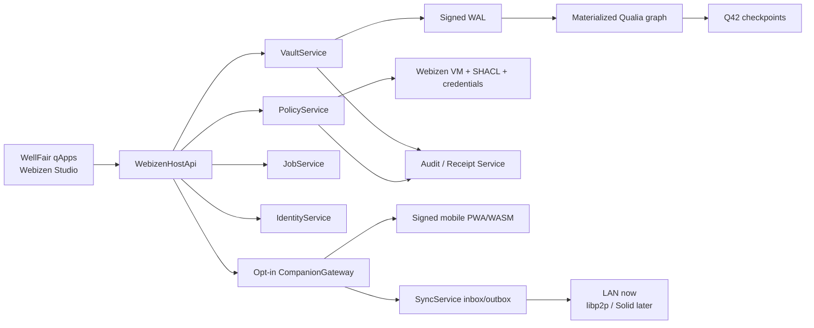

# WellFair on Webizen Desktop — Master Implementation Plan

**Status:** Proposed implementation baseline  
**Prepared:** 2026-07-01  
**Source audit:** `C:\Users\Admin\Documents\GitHub\wellfair\FUNCTIONALITY_AUDIT.md`  
**Primary target:** Webizen Desktop on the QualiaDB engine  
**Secondary target:** installable, desktop-linked mobile PWA/WASM companion  
**Future target:** native mobile peer using the same contracts

## 1. Purpose

This plan translates the complete WellFair functionality audit into a desktop-first
implementation on the current Webizen and QualiaDB repository.

The product is not treated as a single health dashboard. It is a natural-person-controlled
personal agency environment combining:

1. personal health, wellbeing, welfare, and life context;
2. a separately protected Sanctuary and duress domain;
3. relationships, delegation, guardianship, consent, and selective disclosure;
4. verified communication and live, scoped sharing;
5. local reasoning, provenance, evidence, and agent governance;
6. cooperative work, contributions, obligations, governance, credentials, and finance.

No historical implementation is the source of truth. The implementation must combine:

- v0.0.3 domain breadth and human context;
- v0.0.6 vault, privacy, safety, consent, and communication behaviour;
- the QualiaDB successor's project, finance, credential, policy, and sync experiments;
- the present repository's real QualiaDB, Webizen, qApp, desktop, and WASM capabilities.

## 2. Product decisions

These decisions should be accepted before feature work begins.

1. **Desktop is the first authoritative node.** It owns the durable vault, policy decisions,
   keys, jobs, local inference, imports, exports, and opt-in network gateways.
2. **QualiaDB is the canonical store.** qApps do not own separate IndexedDB, JSON, Oxigraph,
   session-state, or in-memory authorities.
3. **qApps are bounded projections and command surfaces.** They use one host API and cannot
   bypass policy, provenance, Sanctuary, or transaction services.
4. **`wellfare-core` evolves into the shared WellFair domain adapter.** Its parsers and health
   mappings are retained; its in-memory `QualiaStore` and miniature policy VM are not retained
   as authorities.
5. **The mobile deliverable is initially a linked companion PWA.** It is useful with the
   desktop and has an encrypted offline cache/outbox, but the desktop remains authoritative.
6. **The future native app is a peer, not a rewrite.** It reuses the versioned record, command,
   event, pairing, package, and sync contracts established here.
7. **Production desktop does not compile arbitrary Rust.** CI produces signed, reproducible
   WASM runtimes. Webizen Desktop assembles verified runtimes and qApp assets into a signed
   installable package.
8. **Every network feature has its own disclosure contract.** “Local-first” never means that
   undeclared external calls are acceptable.
9. **Assurance labels are typed.** Integrity, authorship, ordering, receipt, timestamp,
   credential verification, and legal attestation are not collapsed into “verified.”
10. **Desktop usability precedes network breadth.** The first release remains useful with all
    external adapters disabled.

## 3. Repository reality

### 3.1 Components to reuse

| Area | Current component | Intended use |
|---|---|---|
| Desktop host | `crates/webizen-desktop` | Tauri host, native capabilities, lifecycle, installer, opt-in companion gateway |
| Desktop UI | `crates/webizen-studio` | Dioxus/WebAssembly UI inside the Tauri WebView |
| qApp contracts | `crates/qualia-client-core/src/qapp_registry.rs`, `qapp_manifest.rs`, `qapp_api.rs` | package manifest, compiled capabilities, scoped query enforcement |
| Domain bridge | `crates/wellfare-core` | Samsung import, typed domain conversion, validation, WellFair vocabulary adapters |
| Graph engine | `crates/qualia-core-db` | NQuin storage/query, Webizen VM, SHACL, modalities, provenance |
| Durable volume | `q42/q42_volume.rs`, `storage.rs`, `storage_driver.rs` | canonical `.q42` volume and block storage |
| Durable mutation log | `wal.rs` | signed mutation journal, recovery, DAG checkpoint |
| Browser blocks | `wasm_storage.rs` | OPFS SuperBlock access for the future PWA cache |
| Local API | `services/daemon.rs`, `services/webizen_server.rs` | desktop graph/query service after authorization and binding hardening |
| Identity/crypto | `identity/key_vault.rs`, `identity/credentials/`, `crypto/sanctuary_crypto.rs` | cryptographic primitives behind a redesigned key lifecycle |
| Governance | `deontic_logic.rs`, `governance/webizen.rs`, `identity/profiles.rs` | policy evaluation and agreement structures |
| Guardianship | `foundation/crdt.rs`, `qualia-client-core/src/guardianship.rs` | bounded suspended M:N approval flow |
| Sync substrate | `p2p/`, `sync.rs` | transport and diff primitives after a versioned operation protocol is added |
| Browser WASM | canonical `qualia-core-db` WASM profiles | bounded engine capabilities; not a second semantic stack |
| QApp asset serving | `qualia-client-core/src/qapps_protocol.rs` | loopback desktop launch after installer/registry reconciliation |

### 3.2 Current paths that must not be represented as complete

- `webizen_server.rs` binds the supposed loopback service to all interfaces. Mobile access
  must use a separate, opt-in gateway.
- `/mobile/stream` and `/generate_pane` are mocks.
- `qualia-mobile-harness` simulates QR scanning and uses hard-coded challenge strings.
- `scripts/package_android_pwa.ps1` does not execute the mobile build or copy a complete
  distribution.
- `export_qapp_as_wasm_package` copies a missing/stale `webizen-web/pkg`, imports a filename
  inconsistent with the current crate output, exposes an unauthenticated HTTP server, and
  emits no signed package, web manifest, icons, service worker, CSP, or install contract.
- LAN `http://<address>` is not a dependable secure context for camera, service workers,
  storage privileges, or PWA installation.
- qApp verification/registration and `{storage}/Qapps` installation/launch currently use
  different persistence paths.
- the daemon graph, WAL, `.q42` checkpoint, and sync outbox are not yet one atomic mutation
  pipeline.
- the WASM WAL is a no-op; OPFS block support is not a transactional journal.
- `wellfare-core::QualiaStore` is an in-memory vector and is not QualiaDB persistence.
- `wellfare-core::webizen` duplicates policy logic and fails open for unknown constraints.
- multiple identity, relay, delegation, query-token, and handshake paths are prototype or
  fail-open. They must be hardened before remote access is enabled.
- current Solid support is local export/prototype infrastructure, not production Pod sync.
- `docs/release-targets.md` contains intent and stale status claims; executable code and tests
  are the acceptance evidence.

## 4. Target architecture

### 4.1 Trust boundaries

| Boundary | Trust rule |
|---|---|
| qApp → host | qApp is untrusted until package, session, method, scope, and purpose checks pass |
| host → graph | only `VaultService` commits canonical mutations |
| graph → agent | agent receives a policy-approved bounded projection, never raw vault access |
| main → Sanctuary | no implicit traversal, query, render, inference, telemetry, backup, or sync |
| desktop → mobile | explicit device relationship and short-lived capability grant |
| local → external | explicit feature disclosure, consent, recipient, purpose, fallback, and receipt |
| transport → inbox | authenticated, bounded, replay-checked, quarantined, validated, then merged |

### 4.2 Service boundaries

#### `wellfare-core`

Responsibilities:

- typed domain records and validation;
- Samsung and document parsers;
- normalization and deterministic record identifiers;
- semantic compilation to caller-provided NQuin buffers;
- projection into UI DTOs and standards exports;
- no filesystem, network, UI, durable store, or independent policy engine.

The existing crate name is retained initially to avoid an unrelated rename migration. The
product and semantic namespace remain **WellFair**. A later ADR may rename the crate.

#### `VaultService`

Commands:

- `CreateRecord`
- `AmendRecord`
- `DisputeRecord`
- `TombstoneRecord`
- `ImportPackage`
- `QueryProjection`
- `CreateShare`
- `RevokeGrant`
- `ExportPackage`

Mutation order:

1. validate syntax and domain shape;
2. resolve actor, acting-on-behalf-of, session, and qApp capability;
3. evaluate policy and sensitivity;
4. compile record and provenance Quins;
5. append a signed WAL event;
6. update the materialized graph and revision;
7. enqueue asynchronous `.q42` checkpoint and permitted sync work.

A success response is not emitted before the WAL append is durable.

#### `PolicyService`

One policy decision point mediates:

- create, read, query, amend, and delete/tombstone;
- render and qApp projection;
- inference and background jobs;
- export and live sharing;
- sync, Solid, and external APIs;
- device and filesystem access.

Decision input includes principal, actor, relationship, authority, credential, role, purpose,
operation, record scope, sensitivity, session, time, device, and requested fields.

Decision output is structured:

- `Permit { projection, obligations, expires_at }`
- `Deny { reasons }`
- `Prompt { requested_consent }`
- `Suspend { required_approvals }`

The result includes policy/norm hashes and creates a receipt. UI access profiles are templates
for requests; they are not authority by themselves.

#### `IdentityService`

Responsibilities:

- OS-backed root key and unlock lifecycle;
- owner and pairwise relationship identities;
- contacts, relationships, roles, delegations, consents, and guardianship as distinct objects;
- credential trust/status cache;
- qApp and device session tokens;
- pairing, revocation, recovery, and key rotation.

Existing cryptographic primitives can be reused, but raw keys, time-derived key generation,
fail-open invitations, unverified delegation, and mock certificate generation are release
blockers.

#### `AuditReceiptService`

Records imports, decisions, access, mutations, agent runs, shares, revocations, exports, sync
operations, acknowledgements, and conflicts.

Evidence types are explicit:

| Type | Guarantee |
|---|---|
| Content hash | byte integrity |
| Author signature | control of the signing key |
| Hash/DAG parent | ordering relationship |
| Local receipt | local observation of an action |
| Recipient acknowledgement | recipient accepted a particular operation |
| External timestamp proof | existence no later than an externally witnessed time |
| Credential verification | proof, schema, issuer/status checks performed under a named policy |
| Legal attestation | external legal conclusion; never inferred from a hash alone |

#### `SyncService`

Maintains a durable signed outbox and quarantined inbox. It is transport-neutral.

Each operation carries:

- protocol and schema versions;
- operation ID and content hash;
- vault, record, actor, and key identifiers;
- Lamport clock and parent/checkpoint reference;
- purpose, consent ID, expiry, and allowed operation;
- sensitivity/routing lane;
- encrypted payload or approved projection reference;
- signature and acknowledgement state.

The UI exposes `queued`, `sent`, `acknowledged`, `conflicted`, `rejected`, and `revoked`.

Domain merge rules are explicit:

- project metadata: LWW only after clock semantics are unified;
- ledger entries: add-wins by stable signed entry ID;
- obligations: derive from unique signed contributions; never raw sum-merge;
- consent/revocation: fail closed and monotonic for future disclosure;
- Sanctuary: excluded before an operation can enter the ordinary outbox;
- sovereign personal records: remote changes require explicit acceptance where appropriate.

#### `CompanionGateway`

This is separate from the loopback daemon and disabled by default. It provides:

- one-time pairing;
- capability negotiation;
- authenticated HTTPS/WSS or WebRTC transport;
- projection queries, consent prompts, receipts, and sync;
- per-device rate, size, method, scope, and expiry limits;
- immediate device revocation.

It does not expose the full desktop daemon or raw graph.

### 4.3 Proposed implementation locations

Final filenames may be adjusted during the contract ADRs, but ownership should remain clear.

| Responsibility | Proposed location |
|---|---|
| Domain records, parsers, semantic compilers | `crates/wellfare-core/src/` |
| Vault, policy, receipt, and host APIs | `crates/qualia-client-core/src/wellfair/` |
| Engine-only shared helpers/evaluators | narrowly scoped modules in `crates/qualia-core-db/src/` |
| Desktop Tauri adapters | `crates/webizen-desktop/src/commands/` |
| Opt-in LAN companion service | `crates/webizen-desktop/src/companion_gateway/` |
| WellFair workspace/qApp UI | `crates/webizen-studio/src/components/wellfair/` and signed qApp packages |
| Linked companion | `crates/qualia-mobile-harness/` |
| Shared conformance fixtures | `tests/fixtures/wellfair/` or an agreed workspace fixture directory |
| Build/package automation | `scripts/` and `.github/workflows/` |

## 5. Canonical record model

Every domain record is represented by a stable logical envelope compiled into Quins. At
minimum it carries:

- stable record ID and record type;
- natural-person owner;
- author and optional acting-on-behalf-of;
- graph/context and sensitivity class;
- epistemic status;
- evidence/source references;
- asserted time and valid-time interval;
- revision and predecessor;
- lifecycle state: draft, active, amended, disputed, rejected, revoked, or tombstoned;
- policy/consent references;
- payload or content-addressed blob reference;
- provenance activity;
- integrity/signature state.

Large documents, images, DICOM, receipts, audio, and video remain content-addressed blobs.
Their identifiers, metadata, policy, provenance, and integrity records are Quins.

All context and metadata packing uses shared helpers. No qApp invents bit layouts. All URI
identifiers use `q_hash()`/Q42 lexicon rules. Evaluator and query hot paths remain bounded,
zero-allocation, non-recursive, and within the 42 MB Sentinel limit. Parsing, UI, packaging,
and file I/O are cold paths and may use bounded heap allocations where appropriate.

### 5.1 Epistemic status

The canonical vocabulary distinguishes at least:

- self report;
- device observation;
- imported source statement;
- extracted claim;
- hypothesis;
- professional assertion;
- verified source under a named verification policy;
- disputed;
- refuted;
- superseded.

An LLM or parser never silently upgrades an extracted claim into a diagnosis or verified fact.

### 5.2 Graph and key domains

| Domain | Behaviour |
|---|---|
| Personal sovereign | default owner records, local and durable |
| Sanctuary | independently encrypted, separately unlocked, no ordinary agent/network/sync |
| Decoy | plausible independent data domain; never aliases Sanctuary data |
| Session/share | minimum projections with TTL and recipient binding |
| Project | cooperative records, isolated by project and consent |
| Provenance/audit | append-oriented records without sensitive plaintext |
| Package/cache | content-addressed optional assets, independently purgeable |

## 6. Sanctuary and duress

Sanctuary is a complete boundary, not a UI flag.

Proposed state machine:

1. `Unconfigured`
2. `Locked`
3. `Unlocked`
4. `DuressDecoy`
5. `RecoveryPending`

Required rules:

- independent key material and encrypted storage;
- explicit transition receipts without sensitive plaintext;
- no normal search results, qApp projection, inference, telemetry, sync, Solid, package export,
  crash report, or background job;
- no emergency crossing until a separately reviewed emergency-access ADR exists;
- duress unlock opens only the decoy domain;
- alerts are best-effort operations with visible delivery/failure policy outside a duress
  interaction;
- no destructive “nuke PIN” in the initial implementation;
- revocation and concealment semantics are distinct from deletion;
- evidence export states exactly which guarantees it supplies.

## 7. qApp decomposition

All qApps use the shared record, policy, identity, provenance, clock, package, and network
contracts.

| qApp | Responsibilities | First phase |
|---|---|---|
| WellFair Shell | onboarding, owner status, navigation, offline/network/security state | 2 |
| Personal Core | profile, accessibility, emergency contacts, conditions/allergies, disputed claims, housing/safety | 2 |
| Health Observations | Samsung ingest, vitals, sleep, pathology, imaging metadata, semantic export | 2 |
| Medication & Nutrition | catalogue, schedule, administrations, substances, diet, nutrition context | 2 |
| Social Book | actors, contacts, relationships, roles, qualifications, proxies, guardians | 2 |
| Consent & Policy | request templates, delegations, approvals, sessions, revocation, receipts | 2 |
| Mental Wellbeing | observations, therapy, formulation, licensed assessments, sensitive hypotheses | 3 |
| Life & Welfare | life events, cases, tasks, assistance, letters, recovery, calendar, boundary gate | 3 |
| Sanctuary | setup, lock, decoy, sensitive records, tripwires, evidence, check-ins | 3 |
| Credentials | import, inspect, verification state, presentation, QR, guardian policy | 3 |
| Communications | pairing, caller gate, usage agreement, live share, events, transcripts, packages | 4 |
| Cooperative Projects | projects, contributions, obligations, shares, governance, audit | 5 |
| Personal Finance | ledger, receipts, tax context, exports, project links | 5 |
| Studies & Rules | papers, hypotheses, signed packages, ruleset sandbox | 7 |
| Anatomy | 3D body/organ projection and optional network annotations | 7 |
| Semantic Workbench | import/mapping/query/validation diagnostics; primarily tooling | 1/7 |

## 8. Desktop user journeys

### 8.1 First usable release

1. Install and open Webizen Desktop.
2. Create/unlock the owner vault using OS-backed key protection.
3. Create a profile and accessibility settings.
4. Import Samsung health files from a selected folder.
5. Review normalized records, sleep calculations, source provenance, and freshness.
6. Add medication, schedule, administration, and diet entries.
7. Create a contact/relationship and a scoped, expiring sharing request.
8. Preview the minimum projection and approve or deny it.
9. Export a signed, standards-readable package and inspect its typed evidence receipt.
10. Restart offline and verify all records, history, jobs, and receipts remain available.

### 8.2 Sensitive record release

Adds life/welfare/case and mental-health records, Sanctuary/decoy, guardianship, and credentials.
Every assessment is enabled instrument-by-instrument after version, licensing, scoring,
interpretation, repeatability, provenance, and disclaimer review.

### 8.3 Collaboration release

Adds authenticated pairing, live section requests, transcript revisions, projects,
contributions, obligations, governance, finance, and replay-safe synchronization.

## 9. Mobile PWA/WASM and future native link

### 9.1 Deployment profiles

| Profile | Authority | Local capability |
|---|---|---|
| Desktop | authoritative for this project | full native QualiaDB, policy, jobs, storage, inference |
| Linked PWA | companion | UI, device identity, package verification, encrypted cache/outbox, receipt verification, bounded logic |
| Future sovereign PWA | optional future | OPFS graph/journal subset and offline domain commands |
| Future native mobile | peer | native secure storage, local QualiaDB profile, same command/event/sync protocol |

### 9.2 Installable artifact

Webizen Desktop exports a deterministic signed bundle containing:

- `qapp.json`;
- `package-manifest.cbor` and JSON diagnostic projection;
- package ID, version, signer, content hashes, schema/ABI versions, and update channel;
- immutable HTML/CSS/JS assets;
- canonical prebuilt WellFair/Qualia WASM profile;
- `manifest.webmanifest`, complete icons, and offline fallback;
- content-hashed service worker and cache migration policy;
- CSP, Permissions-Policy, COOP/COEP settings appropriate to the profile;
- required shapes/ontologies and optional `.q42` seed data;
- explicit requested capabilities and network endpoints;
- migration, rollback, and revocation metadata.

The bundle is emitted as:

1. a signed archive for transfer and inspection;
2. a verified local served directory;
3. a QR link to the secure install/pairing origin.

The desktop assembles prebuilt verified WASM; it does not generate different Rust code for each
declarative qApp.

### 9.3 Secure-origin decision

Before implementation, choose and record one of:

- trusted HTTPS bootstrap shell plus authenticated WSS/WebRTC to the desktop; or
- local HTTPS with a deliberate device certificate-onboarding flow.

Plain LAN HTTP is not an accepted release path.

### 9.4 Pairing envelope

The QR contains no durable secret or personal data. It contains:

- protocol version;
- one-time session ID and nonce;
- desktop relationship/public key and certificate fingerprint;
- endpoint candidates;
- expiry;
- requested companion capabilities;
- human-verifiable short code.

Pairing requires:

1. mobile generates or unlocks its device key;
2. both sides prove possession through challenge-response;
3. desktop user verifies the device and approves capabilities;
4. desktop issues a short-lived, method-scoped, audience-bound token;
5. both sides persist a revocable relationship record and receipt.

### 9.5 Link protocol

Versioned messages include:

- `Hello` / `Capabilities`
- `PairRequest` / `PairApprove` / `PairReject`
- `QueryProjection`
- `CommandRequest`
- `ConsentPrompt` / `ConsentDecision`
- `EventSubscribe` / `Event`
- `SyncOffer` / `SyncDelta` / `SyncAck`
- `Receipt`
- `RevokeDevice`

All messages are length-capped, authenticated, replay-protected, and schema-versioned. Untrusted
wire bytes are decoded into a dedicated DTO and converted into canonical NQuins only after
validation.

## 10. Network and external-service policy

Every adapter declares:

- data sent and minimum projection;
- recipient and endpoint;
- purpose and legal/relationship basis;
- consent trigger and expiry;
- authentication;
- retention expectation;
- offline behaviour;
- retry, queue, timeout, and cancellation;
- fallback;
- provenance/receipt;
- Sanctuary prohibition;
- revocation limits.

Initial adapters:

| Adapter | Initial disposition |
|---|---|
| Local filesystem | Phase 2, explicit file/folder grant |
| Desktop companion LAN | Phase 4/6, opt-in authenticated gateway |
| Samsung import | Phase 2, fully local |
| Medication/food lookup | Phase 3+, optional and disclosed |
| Notifications | Phase 2, local OS capability |
| WebRTC media | Phase 4 after pairing/security tests |
| Public timestamp | optional; label pending/confirmed/failure accurately |
| WebTorrent | packages/large public assets only until policy integration |
| libp2p | Phase 5 after operation protocol and hostile-peer tests |
| Solid | local export first; authenticated Pod sync later |
| Remote LLM | deferred; never Sanctuary; explicit per-run disclosure |
| Nym/Lightning/private payments | dependency-gated, not desktop MVP |

## 11. Implementation phases

Durations are planning ranges, not commitments. Work may run in parallel only after the named
contracts are frozen.

### Phase 0 — Decisions, threat model, and safety hardening (2–3 weeks)

Deliver:

- ADRs listed in section 16;
- canonical record envelope and vocabulary;
- `WebizenHostApi` v1 command/event/error contract;
- policy-decision and package-manifest contracts;
- loopback-only daemon default and separate disabled companion listener;
- frame/body size caps and exact authorization;
- removal or quarantine of fail-open identity/query/relay paths from the WellFair route;
- fixture corpus and audit traceability baseline.

Exit:

- no WellFair qApp can reach a raw daemon, filesystem, or network capability;
- security review approves the boundaries for local feature development.

### Phase 1 — Platform foundation (4–6 weeks)

Deliver:

- canonical WellFair domain compilation in `wellfare-core`;
- transactional VaultService: WAL → graph → checkpoint;
- replay/recovery and migrations;
- unified PolicyService and receipts;
- OS-backed key lifecycle;
- qApp atomic install/update/uninstall and package verification;
- durable jobs and network disclosure registry;
- host adapters for Tauri and tests.

Exit:

- create/amend/query/restart/export passes without UI-specific storage;
- qApp A cannot query qApp B's ungranted domains;
- crashes at each commit boundary recover deterministically.

### Phase 2 — Desktop personal MVP (6–8 weeks)

Deliver:

- WellFair shell/onboarding/accessibility;
- Personal Core and Social Book;
- Consent & Policy request/preview/revoke;
- Samsung import for weight, heart rate, steps, and sleep;
- sleep dashboard with transparent non-diagnostic calculations;
- medication, administrations, reminders, diet, and nutrition context;
- local semantic query, validation, standards export, and audit/status views.

Exit:

- the first usable journey in section 8.1 passes offline and after restart;
- source, normalization, decision, and export provenance is inspectable.

### Phase 3 — Sensitive and contextual records (6–8 weeks)

Deliver:

- life events, cases, tasks, welfare, letters, recovery, and personal-priority calendar;
- mental wellbeing records and only approved assessment instruments;
- Sanctuary/decoy state machine and isolated storage;
- guardianship workflows;
- credential intake and verification-state UI;
- pathology/document workflows and content-addressed attachments.

Exit:

- automated policy-bypass tests find no Sanctuary projection;
- duress and evidence claims pass threat-modelled acceptance tests;
- no clinical or credential assurance is overstated.

### Phase 4 — Verified communication and linked companion (6–8 weeks)

Deliver:

- CompanionGateway and real pairing;
- signed installable PWA bundle;
- mobile linked shell, encrypted cache/outbox, and device revocation;
- caller gate, usage agreement, call profiles;
- live section request and desktop approval;
- signed events, sharing receipts, transcript revisions, and content packages;
- media only after the data channel and consent path are proven.

Exit:

- secure-origin install works on supported Android and iOS browser matrices;
- pairing, expiry, replay, revocation, offline, resume, and forbidden-data tests pass.

### Phase 5 — Projects, finance, and replay-safe sync (6–10 weeks)

Deliver:

- projects, contributions, author chains, derived obligations, shares, governance;
- personal-boundary conflict gate;
- ledger, receipts, project finance, tax context, CSV/OFX/semantic export;
- durable sync operation protocol and LAN/libp2p adapter;
- consent-gated project projections and deterministic conflict handling.

Exit:

- duplicate/reordered/replayed operations do not duplicate obligations or money;
- two nodes partition, edit, reconnect, and converge under domain rules;
- revocation stops future disclosure.

### Phase 6 — Packaging and release hardening (runs throughout; final 3–4 weeks)

Deliver:

- reproducible Studio, desktop, WASM, and PWA builds;
- desktop installers and signed updates;
- package provenance/SBOM;
- backup, restore, migration, rollback, and corrupt-volume recovery;
- accessibility and permission matrix;
- performance and 42 MB Sentinel checks;
- privacy-safe diagnostics and support bundle.

### Phase 7 — Optional and dependency-gated capabilities

- 3D anatomy and validated health overlays;
- research/rules discovery and expert signing;
- authenticated Solid Pod sync;
- local model-assisted extraction with source-linked claims;
- production wallet/private transport;
- distributed analytics and privacy budgets;
- native mobile peer;
- cross-project obligation propagation.

These do not block the desktop product.

## 12. Audit capability traceability

| Audit range | Disposition | Target |
|---|---|---|
| ENV-01..09 | preserve local/offline/accessibility; demo personas tooling; rebuild package/install | Phases 1–2/4 |
| PRO-01..08 | canonical Personal Core with disputed claims and housing/safety context | Phase 2 |
| HLT-01..11 | retain tested Samsung import and semantic paths; add canonical persistence/UI | Phase 2 |
| SLP-01..10 | retain analytics with transparent formula and non-diagnostic boundary | Phase 2/3 |
| MED-01..13 | merge daily schedule with rich substance/nutrition context | Phase 2/3 |
| CLI-01..13 | pathology/documents/claims first; validated parsers later | Phase 3 |
| MHT-01..16 | records first; instruments enabled only after license/scoring review | Phase 3 |
| LIF-01..17 | life/welfare/cases/calendar and boundary overrides with receipts | Phase 3 |
| RES-01..11 | local study/rule tooling later; distributed research deferred | Phase 7 |
| ANA-01..08 | reuse renderer; health overlays require semantic/clinical validation | Phase 7 |
| ACT-01..13 | unify semantics without collapsing identity/relationship/authority | Phases 1–3 |
| ACS-01..18 | one policy service across every operation | Phases 0–4 |
| SAF-01..20 | unified Sanctuary; redesign alerts/destructive controls/evidence claims | Phases 0–3 |
| COM-01..24 | pairing/share/events before media and adverse-network claims | Phase 4 |
| AGT-01..15 | policy and provenance first; biometric/clinical inference redesigned | Phases 1/7 |
| COP-01..19 | signed contribution-derived accounting and boundary gate | Phase 5 |
| SYN-01..13 | durable states, consent, replay, domain-specific merge | Phase 5 |
| FIN-01..17 | ledger/receipts/exports first; payment rails deferred | Phase 5/7 |
| CRE-01..09 | protected intake/presentation; real trust/status policy required | Phase 3/7 |
| SEM-01..17 | QualiaDB becomes authority; retain standards-readable projections | Phases 1–2 |
| OPS-01..15 | durable jobs/packages/status; destructive tooling scoped | Phases 1–6 |

### 12.1 Functional disposition

**Preserve as first-class:** owner authority, local use, contextual/disputed claims, health
ingestion, non-diagnostic sleep, medication/diet, life/cases/welfare, granular authority,
revocable consent, Sanctuary, provenance/receipts, verified live sharing, local policy,
personal boundaries, cooperation, credentials, finance/receipts, and semantic portability.

**Reconcile before porting:** profile schemas; identity/relationship/authority; access profiles
versus delegations; Sanctuary states; evidence terms; medication/nutrition context;
calendar/life/project boundaries; benefits/payments/finance/obligations; rule-result categories;
and graph/blob/package identifiers.

**Redesign before release:** duress alerts, destructive PIN concepts, biometric emotion/rPPG,
clinical recommendation language, credential trust, anonymous-payment claims, replay-safe
sync, legal evidence claims, geolocation defaults, remote model disclosure, emergency access,
and assessment licensing/scoring.

**Defer behind dependencies:** production Nym/private payment paths, distributed research,
cross-project obligation propagation, expert marketplaces, advanced remote inference, and the
native mobile peer.

**Keep as tooling:** demo/synthetic data, asset downloaders, package builders, developer test
panels, ontology mapping editors, and raw cache administration.

## 13. Verification strategy

### 13.1 Unit and property tests

- canonical ID stability and semantic round-trip;
- field/privacy/epistemic/provenance invariants;
- WAL recovery and checkpoint equivalence;
- policy deny-by-default, expiry, revocation, guardian suspension;
- Sanctuary never appears in ordinary projections;
- package hash/signature/ABI/schema validation;
- bounded wire decoding and malformed input rejection;
- duplicate operation idempotency and deterministic convergence;
- parser fuzzing for CSV, RDF, CBOR-LD, packages, and sync frames;
- existing WellFair parser/RDF/shape regression tests.

### 13.2 Integration tests

- crash matrix at every mutation boundary;
- daemon restart and materialized graph replay;
- qApp cross-domain denial;
- token expiry, audience, method, device, and revocation;
- offline job queue and reconnect;
- pair/re-pair/revoke;
- OPFS partial write and quota failure;
- two-node partition/rejoin;
- malicious oversized, reordered, replayed, and invalidly signed frames;
- Solid mock server only when that adapter is implemented.

### 13.3 End-to-end release scenario

Import Samsung data → review sleep → add medication/diet → create a sensitive record →
pair companion → request emergency minimum projection → approve → receive signed receipt →
revoke → verify later requests fail → export a standards-readable package → restart offline →
verify complete history and no Sanctuary leakage.

### 13.4 Non-functional gates

- WCAG-oriented keyboard, screen reader, contrast, scale, reduced-motion, and touch checks;
- Windows/macOS/Linux desktop build;
- supported Android/iOS PWA install matrix;
- 42 MB Sentinel and zero-allocation hot-path checks;
- storage quota, disk-full, corrupt block, and rollback recovery;
- privacy review of logs, telemetry, crash data, package contents, and network captures;
- explicit clinical, legal, finance, credential, and assessment wording review.

## 14. Migration strategy

Migration is import, not direct adoption of legacy storage.

1. freeze representative fixtures from each WellFair generation;
2. inventory source type, identifiers, timestamps, privacy, evidence, and attachments;
3. transform into canonical records with source-system provenance;
4. quarantine malformed or ambiguous data instead of guessing;
5. produce an import report: accepted, transformed, duplicated, rejected, unresolved;
6. validate semantic and human-readable projections;
7. retain source package hashes for audit;
8. never import a historical “verified” label without mapping its actual guarantee;
9. require explicit owner selection before importing Sanctuary-like records;
10. support deterministic re-run without duplicate records.

## 15. Parallel delivery model

The detailed workstreams are:

- [Platform, data, policy, and storage](01-platform-data-policy.md)
- [Desktop shell and domain qApps](02-desktop-qapps.md)
- [WASM packaging, companion gateway, and future mobile link](03-wasm-mobile-link.md)
- [Assurance, migration, testing, and release](04-assurance-migration-release.md)

Rules for parallel work:

1. Phase 0 contracts merge first.
2. Each workstream owns its listed files; shared contracts have a designated owner.
3. Domain teams use fixtures and generated clients; they do not add temporary bypass APIs.
4. Cross-cutting changes are proposed against the contract owner before implementation.
5. Every PR states audit IDs covered, storage/policy implications, network disclosure, tests,
   and whether it changes a hot path.
6. Feature claims use `Verified`, `Implemented`, `Prototype`, `Scaffold`, or `Planned`.

## 16. Required ADRs

1. canonical WellFair record envelope and qApp ownership;
2. claim/observation/diagnosis/hypothesis/assessment/narrative taxonomy;
3. lifecycle semantics: amendment, dispute, concealment, revocation, tombstone, deletion;
4. Sanctuary threat model and emergency crossing;
5. identity, relationship, authority, role, consent, and presentation-profile separation;
6. one PolicyDecision API and enforcement points;
7. WAL/graph/Q42/outbox transaction and recovery model;
8. Lamport bit layout and versioned wire DTO;
9. domain-specific CRDT/merge rules;
10. evidence and assurance vocabulary;
11. qApp package format, signing, update, rollback, and revocation;
12. mobile secure-origin and pairing trust model;
13. linked PWA authority and offline-write limits;
14. per-adapter network disclosure contract;
15. credential trust/status and offline verification;
16. assessment licensing/scoring and clinical language;
17. filesystem/blob encryption, backup, recovery, and secure disposal;
18. future native-mobile peer promotion protocol.

## 17. Principal risks

| Risk | Mitigation |
|---|---|
| UI becomes a second authority | host API only; no qApp durable domain store |
| policy enforced only in UI | middleware and exact scoped execution at every operation |
| Sanctuary data leaks via logs/sync/agents | boundary tests, separate keys/store, projection before execution |
| desktop daemon exposed unintentionally | loopback default; separate opt-in authenticated gateway |
| PWA install fails on LAN HTTP | decide trusted HTTPS origin before implementation |
| duplicate sync creates money/obligations | signed unique operations, dedup, derived balances |
| incompatible NQuin/wire clocks | versioned wire DTO and one authoritative clock helper |
| overclaimed legal/clinical assurance | typed evidence, review gates, explicit disclaimers |
| WASM bundle grows without bounds | named profile, size budget, deterministic manifest, CI gate |
| future native app requires rewrite | transport-neutral contracts and conformance suite now |
| active repair work conflicts with feature work | isolate plans; begin code only after repair baseline is stable |

## 18. Definition of desktop MVP done

The MVP is done when:

- the desktop installer creates and unlocks a durable owner-controlled vault;
- records use canonical QualiaDB persistence and survive crash/restart;
- Personal Core, Social Book, consent, health/sleep, medication, and nutrition journeys work;
- every qApp operation is capability- and policy-mediated;
- imports, changes, decisions, shares, revocations, and exports have inspectable receipts;
- no external network is required for core use;
- no Sanctuary data can be reached through ordinary qApps, queries, agents, exports, or logs;
- the audit's first useful journeys are covered by automated end-to-end tests;
- documentation accurately distinguishes verified functionality from prototypes.

The linked PWA is a separate release gate. The future native mobile app is explicitly outside
this desktop implementation, but its compatibility contracts are part of the foundation.
